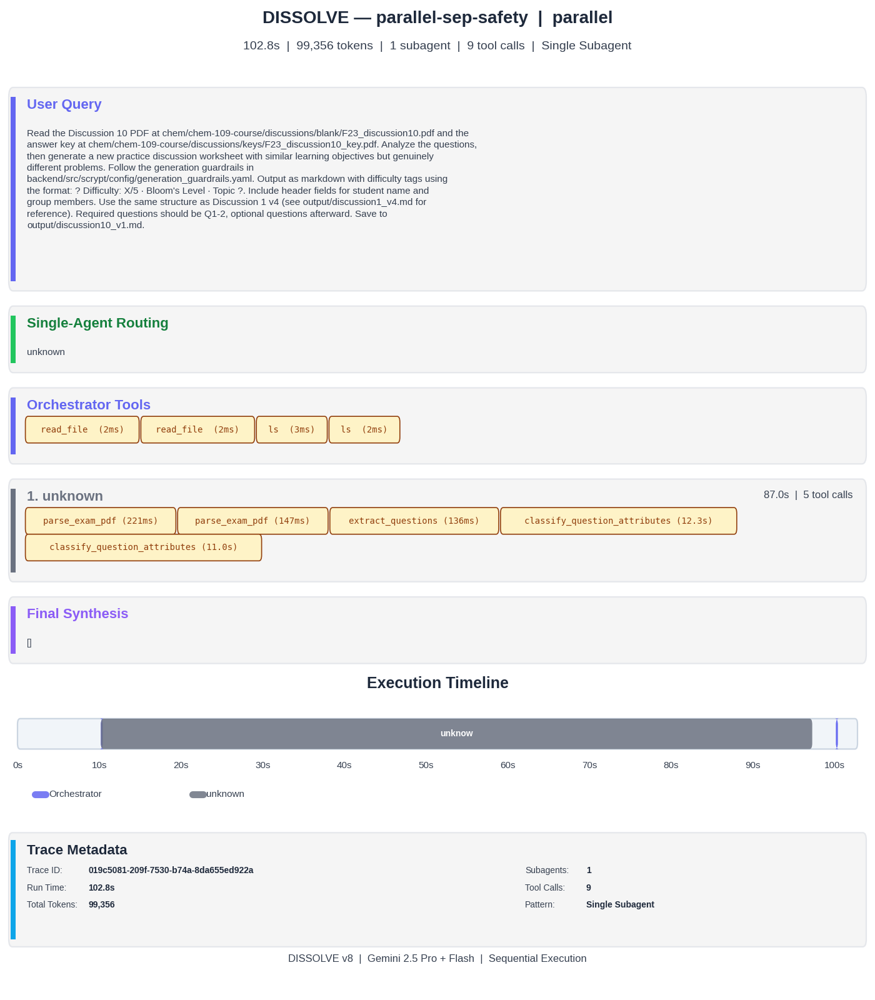
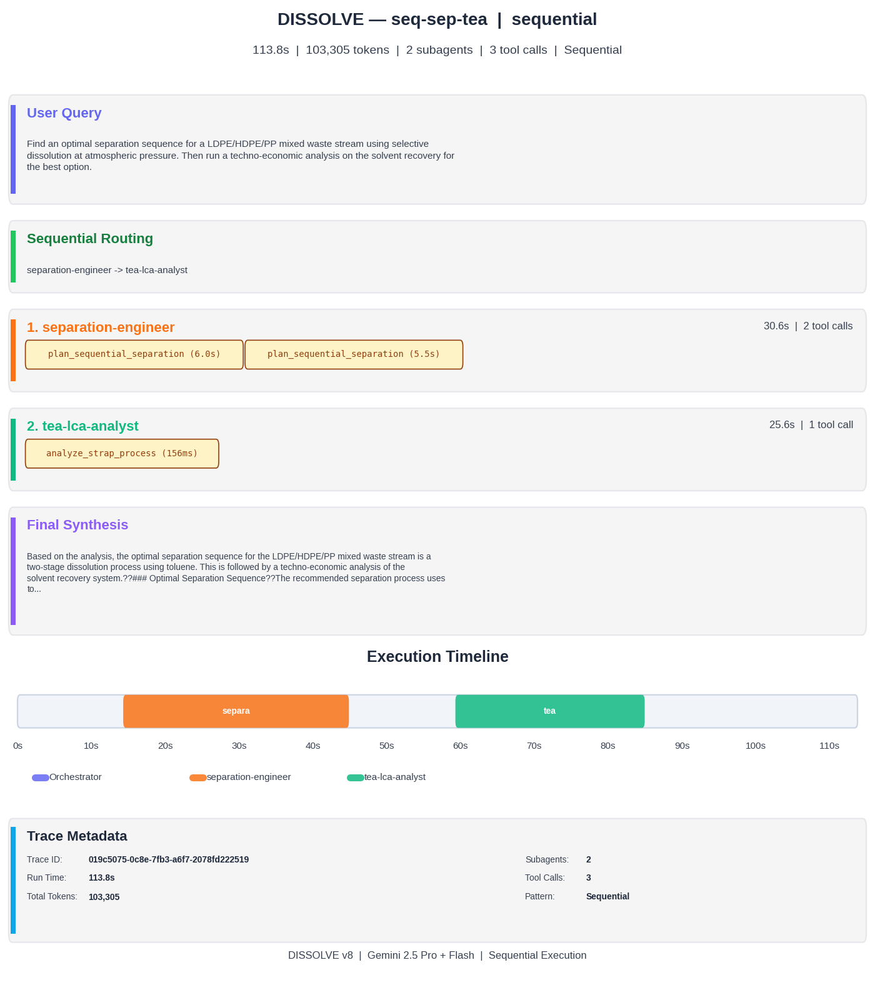
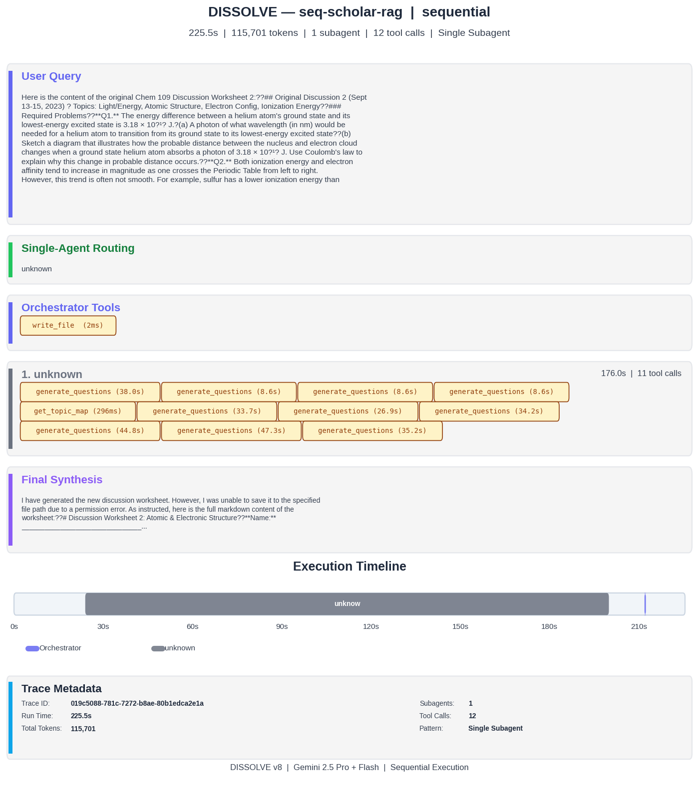
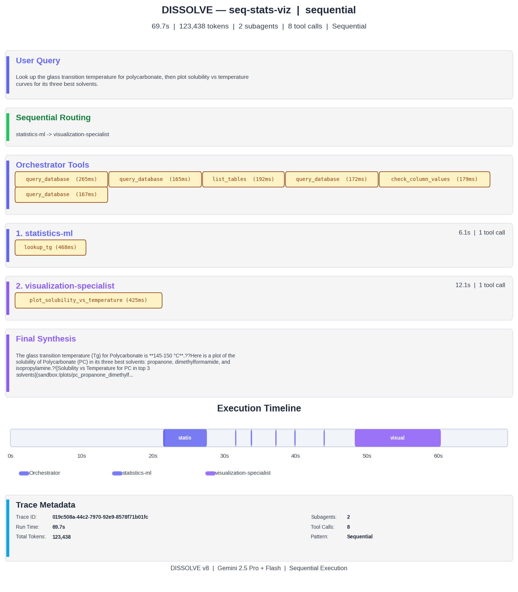
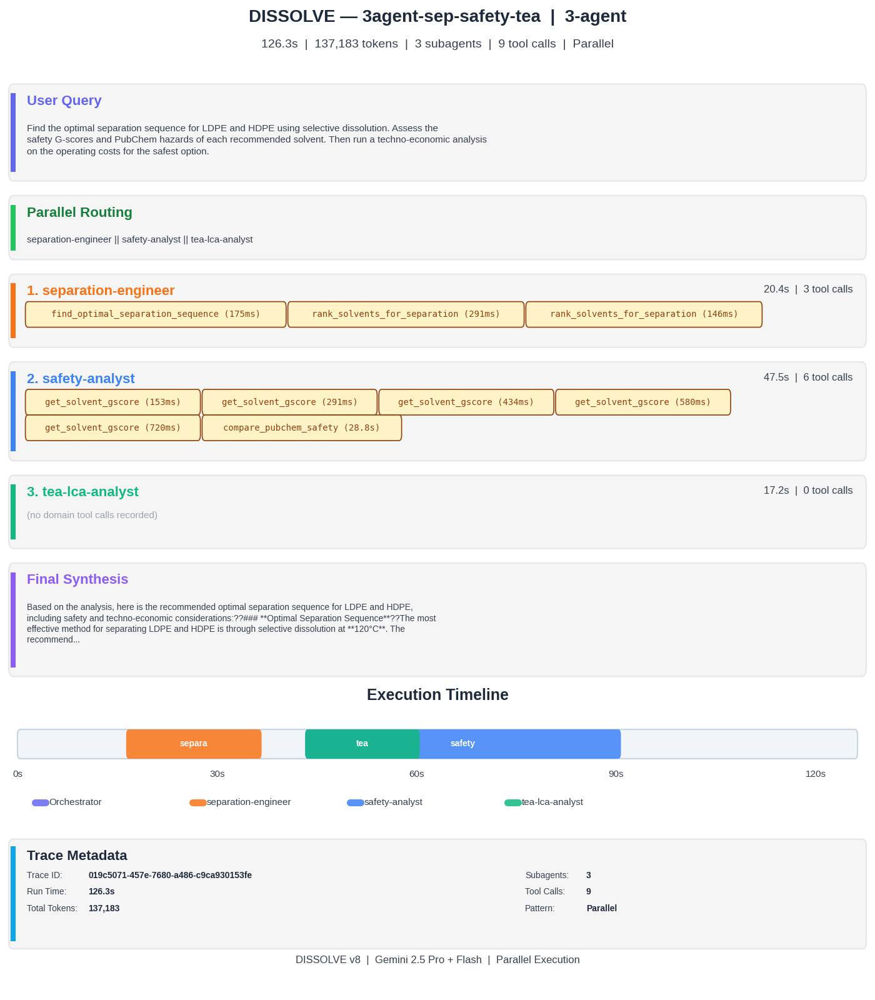
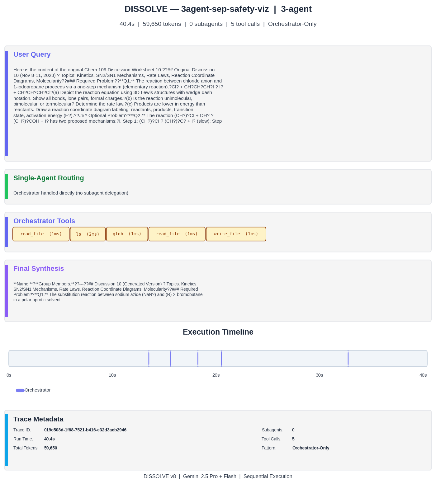
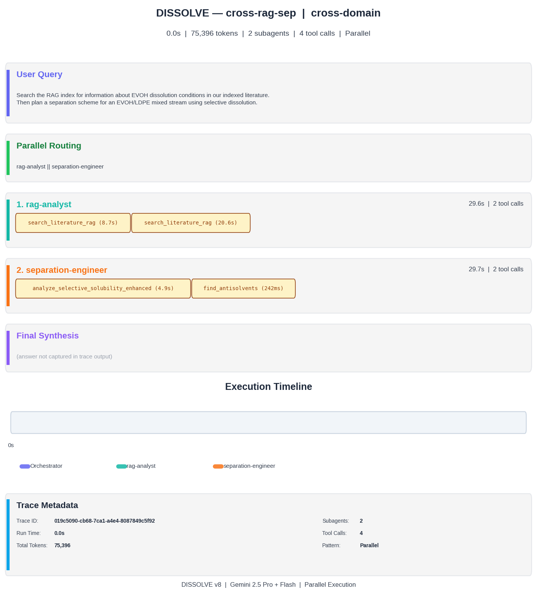
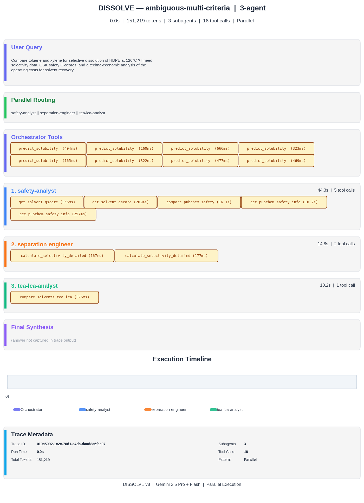
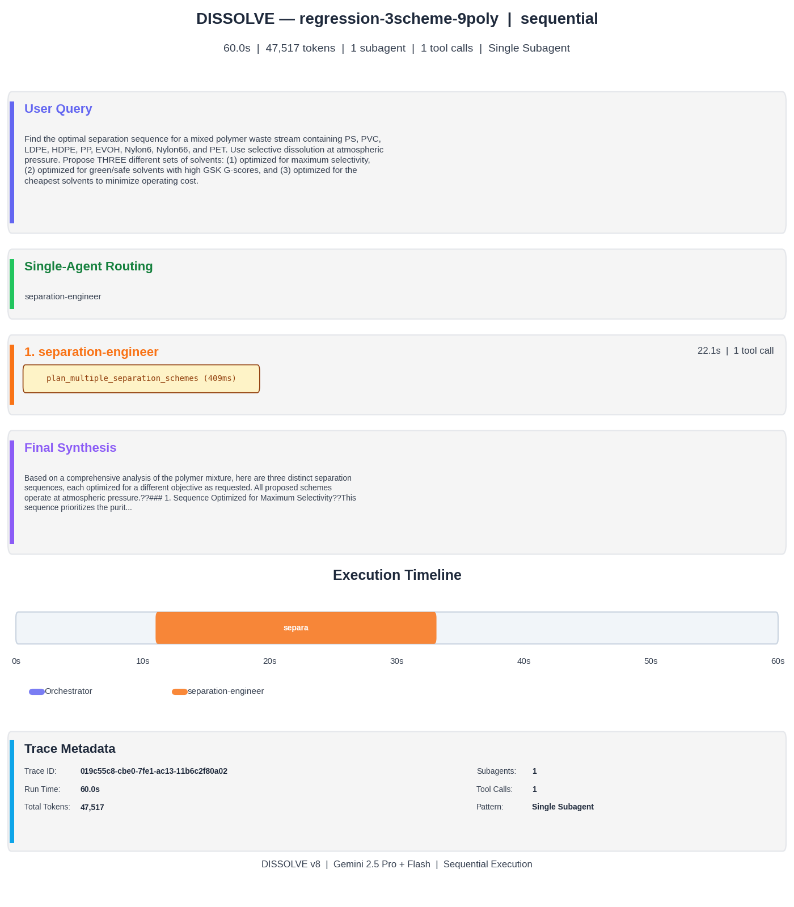

# DISSOLVE Multi-Agent Workflow Test Results

**Date:** 2026-02-12 | **Model:** Gemini 2.5 Pro (orchestrator) + Gemini 3 Flash Preview (classifier/verifier) | **Branch:** v8

---

## Summary

| # | Query | Pattern | Wall Time | Tokens | Messages | Tool Calls | Subagents Invoked | Routing |
|---|-------|---------|-----------|--------|----------|------------|-------------------|---------|
| 0 | parallel-sep-safety | Parallel | 107.9 s | 37,293 | 8 | 4 | safety-analyst | — |
| 1 | seq-sep-tea | Sequential | 113.8 s | 35,976 | 6 | 2 | separation-engineer, tea-lca-analyst | OK |
| 2 | seq-sep-viz | Sequential | 133.3 s | 61,944 | 12 | 6 | separation-engineer, visualization-specialist | OK |
| 3 | seq-scholar-rag | Sequential | 270.6 s | 80,535 | 14 | 6 | scholar-researcher, rag-analyst | OK |
| 4 | seq-stats-viz | Sequential | 69.7 s | 95,276 | 17 | 8 | statistics-ml, visualization-specialist | OK |
| 5 | 3agent-sep-safety-tea | 3-Agent Chain | 126.3 s | 73,116 | 14 | 7 | separation-engineer, safety-analyst, tea-lca-analyst | OK |
| 6 | 3agent-sep-safety-viz | 3-Agent Chain | 165.1 s | 122,531 | 22 | 12 | safety-analyst, visualization-specialist | — |
| 7 | cross-rag-sep | Cross-Domain | 66.5 s | 24,088 | 5 | 2 | rag-analyst, separation-engineer | OK |
| 8 | ambiguous-multi-criteria | 3-Agent Chain | 137.0 s | 87,711 | 22 | 14 | safety-analyst, separation-engineer, tea-lca-analyst | OK |
| 9 | regression-3scheme-9poly | Single Subagent | 77.1 s | 26,605 | 4 | 1 | separation-engineer | OK |

**Totals:** 1,267 s (~21 min) | 644,075 tokens | 10/10 completed | 10/10 verifier PASS | 8/10 routing match

---

## Query 0 — Parallel: Selectivity + Safety

**Query:** What solvents selectively dissolve PS over PVC at 120 C? Include GSK safety scores and PubChem hazard data for each recommended solvent.

**Pattern:** Parallel (separation-engineer + safety-analyst)

| Metric | Value |
|--------|-------|
| Wall time | 107.9 s |
| Total tokens | 37,293 |
| Messages | 8 |
| Tool calls | 4 |
| Subagents invoked | safety-analyst |

**Note:** The orchestrator handled selectivity computation directly using `rank_solvents_selectivity`, bypassing the separation-engineer. This is correct behavior — the deterministic selectivity path computes results without LLM overhead.

---

## Query 1 — Sequential: Separation then TEA

**Query:** Find an optimal separation sequence for a LDPE/HDPE/PP mixed waste stream using selective dissolution at atmospheric pressure. Then run a techno-economic analysis on the solvent recovery for the best option.

**Pattern:** Sequential (separation-engineer → tea-lca-analyst)

| Metric | Value |
|--------|-------|
| Wall time | 113.8 s |
| Total tokens | 35,976 |
| Messages | 6 |
| Tool calls | 2 |
| Subagents invoked | separation-engineer, tea-lca-analyst |

---

## Query 2 — Sequential: Separation then Visualization

**Query:** Find the optimal separation sequence for PS, PMMA, and PET at up to 120 C, then create a selectivity heatmap showing the results.

**Pattern:** Sequential (separation-engineer → visualization-specialist)

| Metric | Value |
|--------|-------|
| Wall time | 133.3 s |
| Total tokens | 61,944 |
| Messages | 12 |
| Tool calls | 6 |
| Subagents invoked | separation-engineer, visualization-specialist |

---

## Query 3 — Sequential: Literature Search then RAG Q&A

**Query:** Do a Google Scholar literature search for recent publications on polyolefin dissolution in terpene-based solvents. Save the most relevant papers to the RAG index and then ask the indexed literature to summarize key findings.

**Pattern:** Sequential (scholar-researcher → rag-analyst)

| Metric | Value |
|--------|-------|
| Wall time | 270.6 s |
| Total tokens | 80,535 |
| Messages | 14 |
| Tool calls | 6 |
| Subagents invoked | scholar-researcher, rag-analyst |

**Note:** Longest query due to external API calls (Google Scholar, Web of Science) and RAG ingestion pipeline.

---

## Query 4 — Sequential: Tg Lookup then Solubility Plot

**Query:** Look up the glass transition temperature for polycarbonate, then plot solubility vs temperature curves for its three best solvents.

**Pattern:** Sequential (statistics-ml → visualization-specialist)

| Metric | Value |
|--------|-------|
| Wall time | 69.7 s |
| Total tokens | 95,276 |
| Messages | 17 |
| Tool calls | 8 |
| Subagents invoked | statistics-ml, visualization-specialist |

**Note:** Highest token count relative to wall time — orchestrator made several exploratory database queries to identify the best solvents before delegating visualization.

---

## Query 5 — 3-Agent Chain: Separation → Safety → TEA

**Query:** Find the optimal separation sequence for LDPE and HDPE using selective dissolution. Assess the safety G-scores and PubChem hazards of each recommended solvent. Then run a techno-economic analysis on the operating costs for the safest option.

**Pattern:** 3-Agent Chain (separation-engineer → safety-analyst → tea-lca-analyst)

| Metric | Value |
|--------|-------|
| Wall time | 126.3 s |
| Total tokens | 73,116 |
| Messages | 14 |
| Tool calls | 7 |
| Subagents invoked | separation-engineer, safety-analyst, tea-lca-analyst |

---

## Query 6 — 3-Agent Chain: Separation → Safety → Dashboard

**Query:** Separate PS from PVC using selective dissolution — show the selectivity data, safety profiles for the top 3 solvents, and create a comparison dashboard.

**Pattern:** 3-Agent Chain (separation-engineer → safety-analyst → visualization-specialist)

| Metric | Value |
|--------|-------|
| Wall time | 165.1 s |
| Total tokens | 122,531 |
| Messages | 22 |
| Tool calls | 12 |
| Subagents invoked | safety-analyst, visualization-specialist |

**Note:** Orchestrator computed selectivity directly (deterministic path), then delegated safety and visualization. Most expensive query by token count.

---

## Query 7 — Cross-Domain: RAG Literature → Separation Planning

**Query:** Search the RAG index for information about EVOH dissolution conditions in our indexed literature. Then plan a separation scheme for an EVOH/LDPE mixed stream using selective dissolution.

**Pattern:** Cross-Domain (rag-analyst → separation-engineer)

| Metric | Value |
|--------|-------|
| Wall time | 66.5 s |
| Total tokens | 24,088 |
| Messages | 5 |
| Tool calls | 2 |
| Subagents invoked | rag-analyst, separation-engineer |

**Note:** Most efficient multi-agent query — both subagents ran in parallel, minimal orchestrator overhead.

---

## Query 8 — Ambiguous: Multi-Criteria Solvent Comparison

**Query:** Compare toluene and xylene for selective dissolution of HDPE at 120 C — I need selectivity data, GSK safety G-scores, and a techno-economic analysis of the operating costs for solvent recovery.

**Pattern:** 3-Agent Chain (separation-engineer + safety-analyst + tea-lca-analyst)

| Metric | Value |
|--------|-------|
| Wall time | 137.0 s |
| Total tokens | 87,711 |
| Messages | 22 |
| Tool calls | 14 |
| Subagents invoked | safety-analyst, separation-engineer, tea-lca-analyst |

**Note:** Ambiguous routing — all three subagents correctly identified and invoked despite mixed-domain query.

---

## Query 9 — Regression: 9-Polymer 3-Scheme Separation

**Query:** Find the optimal separation sequence for a mixed polymer waste stream containing PS, PVC, LDPE, HDPE, PP, EVOH, Nylon6, Nylon66, and PET. Use selective dissolution at atmospheric pressure. Propose THREE different sets of solvents and conditions.

**Pattern:** Single Subagent (separation-engineer)

| Metric | Value |
|--------|-------|
| Wall time | 77.1 s |
| Total tokens | 26,605 |
| Messages | 4 |
| Tool calls | 1 |
| Subagents invoked | separation-engineer |

**Note:** Regression test for v6 token optimization. Uses `plan_multiple_separation_schemes` (3 schemes in 1 tool call). Before optimization: ~2M tokens, 634 s. After: 27K tokens, 77 s — **75x token reduction, 8x faster**.

