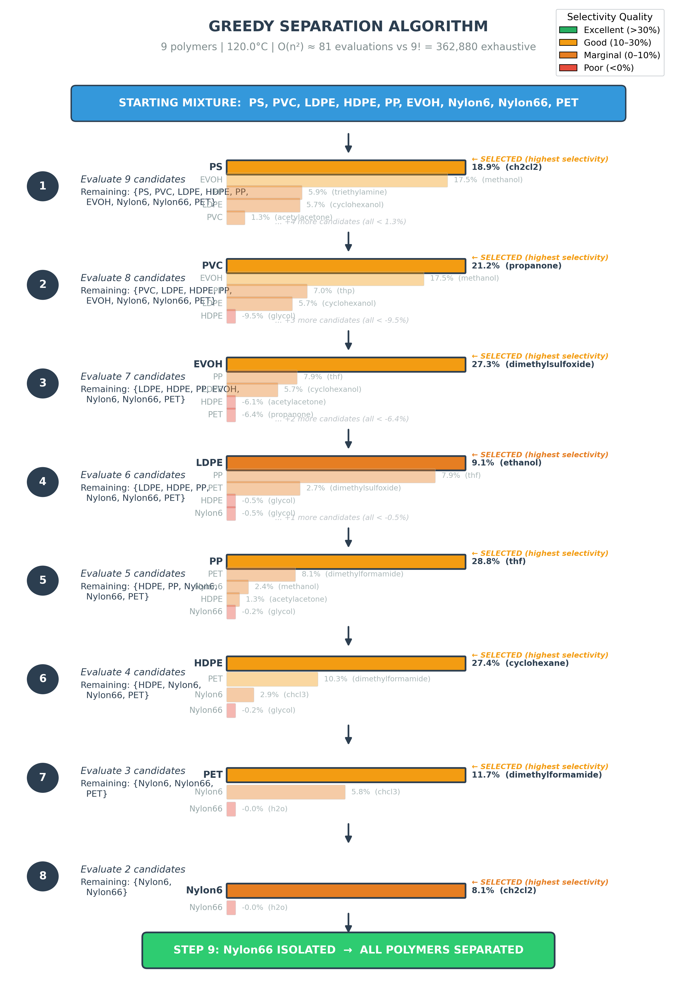
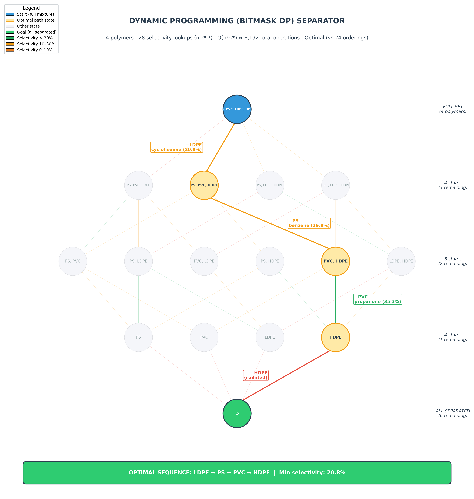
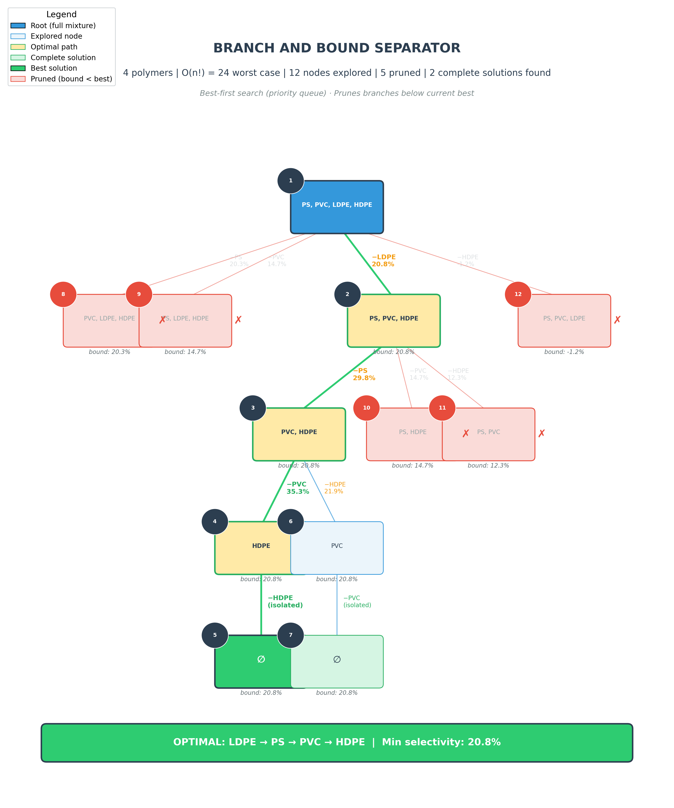

# Separation Sequence Algorithms

Three algorithms find the optimal polymer removal order, maximizing the minimum selectivity across all steps.

## 1. Greedy Separator

**Complexity:** O(n²) · **Optimal:** No · **Used when:** n > 10

At each step, evaluate every remaining polymer as a candidate for removal. Pick the one whose best solvent gives the highest selectivity against all others. Repeat until one polymer remains.

- **Pros:** Fast, scales to large polymer sets, produces good (not necessarily optimal) sequences.
- **Cons:** Locally optimal choices can miss globally better orderings. A polymer with moderate selectivity early may unlock much better separations later.
- **Example (9 polymers):** PS → PVC → EVOH → LDPE → PP → HDPE → PET → Nylon6 → Nylon66

## 2. Dynamic Programming (Bitmask DP) Separator

**Complexity:** O(n² · 2ⁿ) · **Optimal:** Yes · **Used when:** n ≤ 6

Represents "remaining polymers" as a bitmask. For n=4: `1111` = all present, `0000` = all separated. Precomputes selectivity for every valid (target, remaining-set) pair, then fills a DP table bottom-up.

**State:** `dp[mask] = (min_selectivity_achieved, last_removed, previous_mask)`

**Transitions:** For each mask, try removing each remaining polymer. The new minimum selectivity is `min(current_min, selectivity_of_this_removal)`. Keep the transition that maximizes this value.

**Reconstruction:** Follow backpointers from mask=0 to full_mask to recover the optimal removal order.

- **Pros:** Guaranteed optimal. Exploits overlapping subproblems — many different removal orders pass through the same "remaining set" state.
- **Cons:** Exponential memory and time. For n=10, requires 1024 states × 10 polymers = ~10K evaluations. Infeasible beyond n≈12.
- **Example (4 polymers, 28 selectivity lookups (n·2^(n-1)), ~16K total operations (n²·2ⁿ·s), 16 states):** LDPE → PS → PVC → HDPE (min selectivity 20.8%)

## 3. Branch and Bound Separator

**Complexity:** O(n!) worst case · **Optimal:** Yes (if completed) · **Used when:** 7 ≤ n ≤ 10

Explores a search tree where each node represents a partial removal sequence. Uses a priority queue (best-first search) to explore the most promising branches first.

**Branching:** From each node, create children by trying each remaining polymer removal.

**Bounding:** Each node tracks `min_selectivity_so_far` as its bound. If a node's bound drops below the best complete solution found, prune it — no descendant can improve on the best.

**Fallback:** A time limit (default 5s) triggers fallback to greedy if B&B hasn't completed.

- **Pros:** Often much faster than exhaustive search due to pruning. For n=4: explored only 12 of 24 possible nodes (50% pruned). The priority queue ensures the optimal solution is typically found early.
- **Cons:** Worst case is still factorial. Pruning effectiveness depends on the selectivity landscape — if all branches have similar bounds, little gets pruned.
- **Example (4 polymers, 12 nodes explored, 5 pruned):** LDPE → PS → PVC → HDPE (min selectivity 20.8%)

## Algorithm Selection (`find_best_separation`)

| Polymers | Algorithm | Rationale |
|----------|-----------|-----------|
| n ≤ 6 | DP | Exponential but small enough to guarantee optimality quickly |
| 7–10 | Branch & Bound | DP too expensive; B&B prunes enough to finish within time limit |
| n > 10 | Greedy | Both exact methods infeasible; greedy gives good heuristic results |

## Comparison on 4 Polymers (PS, PVC, LDPE, HDPE at 120°C)

All three algorithms produce the same sequence for this case: **LDPE → PS → PVC → HDPE** with min selectivity **20.8%**. The greedy happens to match the optimal here, but this is not guaranteed for larger or more complex polymer mixtures.

| Metric | Greedy | DP | B&B |
|--------|--------|----|-----|
| Selectivity lookups | 10 | 28 (n·2^(n-1)) | 12 |
| Total operations | ~3.2K | ~16K (n²·2ⁿ·s) | ~12K |
| States/Nodes | 4 steps | 16 states | 12 explored |
| Pruned | — | — | 5 nodes |
| Optimal guarantee | No | Yes | Yes (if completed) |
