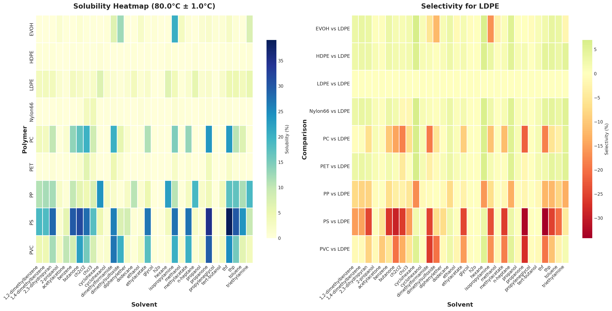
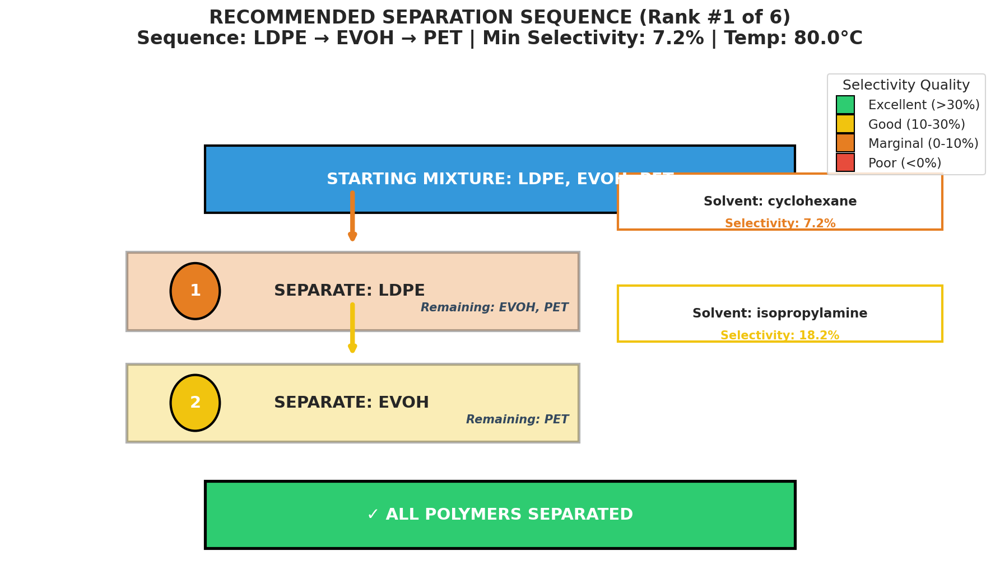
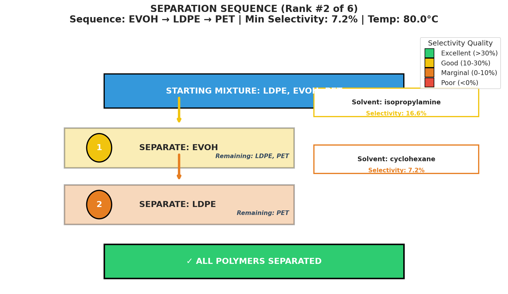
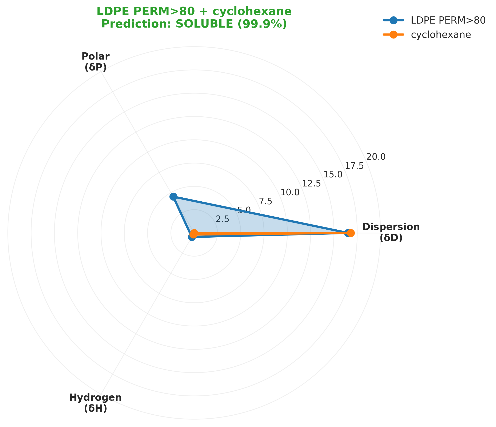
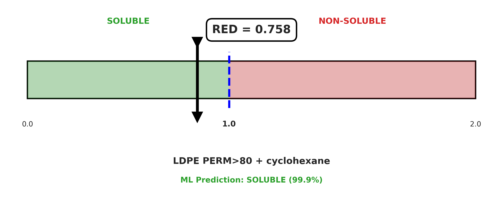
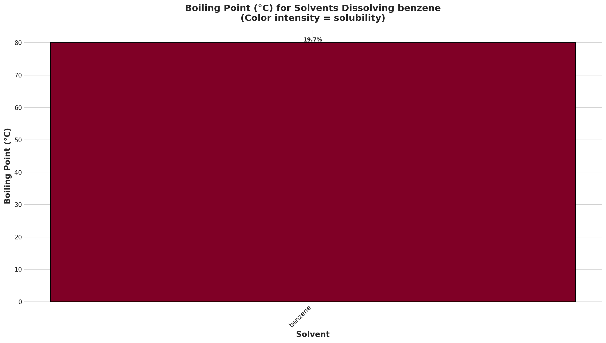
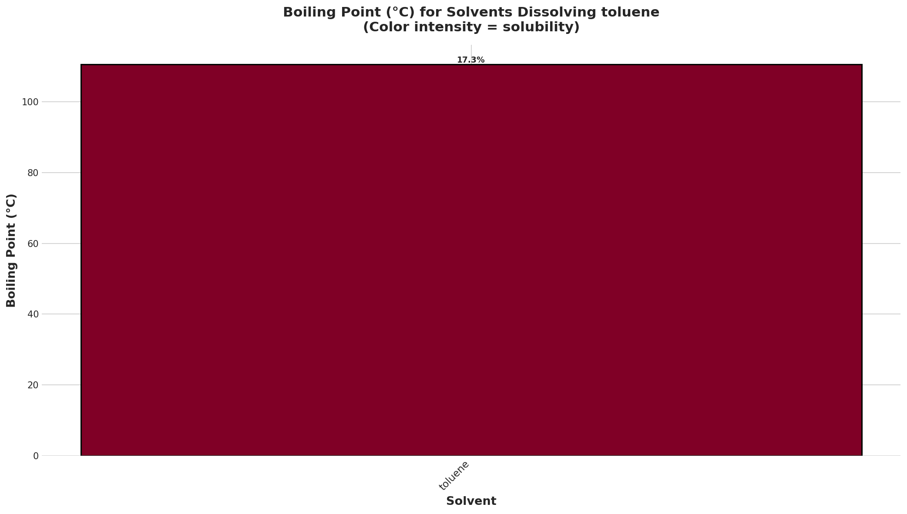
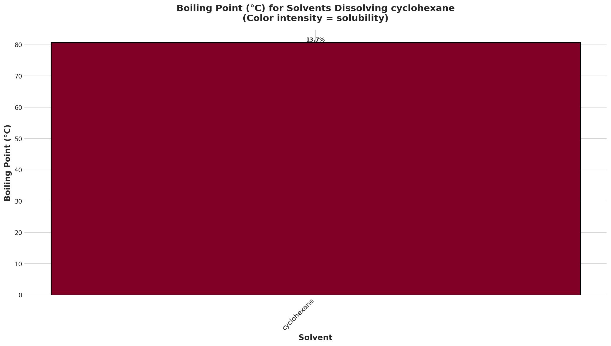
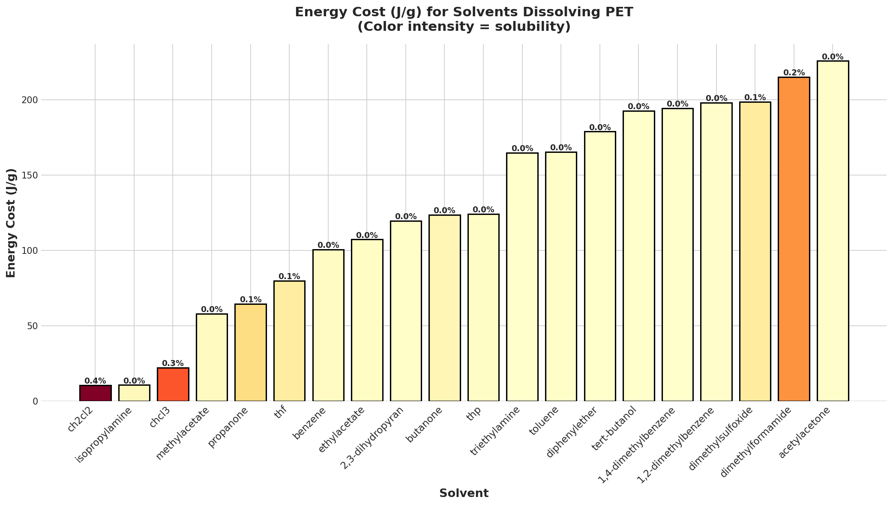

# Multilayer Film Separation - Comprehensive Case Study

## Executive Summary

This case study analyzes the dissolution and separation of a three-layer polymer film composed of **LDPE (80%)**, **EVOH (8%)**, and **PET (12%)** at **80°C**.

The analysis integrates:
- Database exploration and polymer overview
- Solvent selectivity analysis and heatmap visualization
- Sequential separation strategy optimization
- Detailed solubility data for each polymer
- Machine learning validation using Hansen Solubility Parameters
- Solvent property analysis (boiling point, energy cost)
- Safety assessment (G-scores and LogP)
- Multi-factor integrated decision making

**Analysis Date:** 2026-01-02 11:26:50

---

## Table of Contents

1. [1. Dataset Overview](#1-dataset-overview)
2. [2. Solvent Selection at 80°C](#2-solvent-selection-at-80°c)
3. [3. Multilayer Film Analysis](#3-multilayer-film-analysis)
5. [4. Detailed Solubility Analysis](#4-detailed-solubility-analysis)
8. [5. ML Validation - LDPE](#5-ml-validation---ldpe)
9. [6. ML Validation - EVOH](#6-ml-validation---evoh)
10. [7. ML Validation - PET](#7-ml-validation---pet)
11. [8. Solvent Properties Analysis](#8-solvent-properties-analysis)
14. [9. Safety Analysis](#9-safety-analysis)
16. [10. Integrated Decision Making](#10-integrated-decision-making)
17. [11. Temperature Sensitivity](#11-temperature-sensitivity)

---

## 1. Dataset Overview

### Available Polymers

**Description:** Overview of all polymers available for analysis

**Results:**

Processing complete.

*Analysis completed in 1.3s*

---

## 2. Solvent Selection at 80°C

### Selectivity Heatmap

**Description:** Visual overview of solvent selectivity patterns

**Results:**

Processing complete.

**Visualizations:**



*Analysis completed in 2.8s*

---

## 3. Multilayer Film Analysis

### Sequential Separation Strategy

**Description:** Optimal dissolution sequence for the three-layer film

**Results:**

Processing complete.

**Visualizations:**



*Analysis completed in 2.4s*

---

### Alternative Separation Strategy

**Description:** Backup separation strategy

**Results:**

Processing complete.

**Visualizations:**



*Analysis completed in 2.9s*

---

## 4. Detailed Solubility Analysis

### LDPE Solubility at 80°C

**Description:** LDPE dissolution options

**Results:**

Processing complete.

*Analysis completed in 1.7s*

---

### EVOH Solubility at 80°C

**Description:** EVOH dissolution options

**Results:**

Processing complete.

*Analysis completed in 1.6s*

---

### PET Solubility at 80°C

**Description:** PET dissolution options

**Results:**

Processing complete.

*Analysis completed in 3.8s*

---

## 5. ML Validation - LDPE

### ML Prediction: LDPE in Recommended Solvent

**Description:** ML validation for primary LDPE solvent (will be updated based on recommendation)

**Results:**

<tr>
<td>
<ul>
<li>
<strong>Polymer:</strong> LDPE PERM&gt;80
</li>
<li>
<strong>Solvent:</strong> cyclohexane
</li>
<li>
<strong>Temperature:</strong> 25.0°C
</li>
</ul>
</td>
<td>
<ul>
<li>
<strong>Prediction:</strong> ✅ SOLUBLE
</li>
<li>
<strong>Probability:</strong> 99.9%
</li>
<li>
<strong>Confidence:</strong> 99.9%
</li>
<li>
<strong>RED Value:</strong> 0.758 (Hansen distance/R0)
</li>
<li>
<strong>Ra (Hansen distance):</strong> 4.550
</li>
<li>
<strong>R0 (Interaction radius):</strong> 6.000
</li>
</ul>
<p>
<strong>Interpretation:</strong>
</p>
<ul>
<li>
RED &lt; 1.0: Polymer and solvent are compatible (likely to dissolve)
</li>
</ul>
<p>
<strong>Interactive 3D Visualization:</strong>
<a href="/plots/LDPE_PERM>80_cyclohexane/red_sphere_3d.html" target="_blank">
Click to open Hansen Sphere 🌐
</a>
</p>
</td>
</tr>
<tr>
<td>
<ul>
<li>
<strong>HSP Parameters</strong>
</li>
</ul>
<table>
<thead>
<tr>
<td>
Parameter
</td>
<td>
Value
</td>
</tr>
</thead>
<tbody>
<tr>
<td>
Dispersion (δD)
</td>
<td>
16.5
</td>
</tr>
<tr>
<td>
Polar (δP)
</td>
<td>
0.7
</td>
</tr>
<tr>
<td>
Hydrogen Bonding (δH)
</td>
<td>
0.2
</td>
</tr>
</tbody>
</table>
</td>
<td>
<ul>
<li>
<strong>HSP Parameters</strong>
</li>
</ul>
<table>
<thead>
<tr>
<td>
Parameter
</td>
<td>
Value
</td>
</tr>
</thead>
<tbody>
<tr>
<td>
Dispersion (δD)
</td>
<td>
16.0
</td>
</tr>
<tr>
<td>
Polar (δP)
</td>
<td>
0.4
</td>
</tr>
<tr>
<td>
Hydrogen Bonding (δH)
</td>
<td>
0.2
</td>
</tr>
</tbody>
</table>
</td>
</tr>
</tbody>
</table>
</td>
</tr>
</tbody>
</table>
</td>
</tr>
</tbody>
</table>
</td>
</tr>
</tbody>
</table>
</td>
</tr>
</tbody>
</table>
</td>
</tr>
</tbody>
</table>
</td>
</tr>
</tbody>
</table>
</td>
</tr>
</tbody>
</table>
</td>
</tr>
</tbody>
</table>
</td>
</tr>
</tbody>
</table>
</td>
</tr>
</tbody>
</table>
</td>
</tr>
</tbody>
</table>
</td>
</tr>
</tbody>
</table>
</td>
</tr>
</tbody>
</table>
</td>
</tr>
</tbody>
</table>
</td>
</tr>
</tbody>
</table>
</td>
</tr>
</tbody>
</table>
</td>
</tr>
</tbody>
</table>
</td>
</tr>
</tbody>
</table>
</td>
</tr>
</tbody>
</table>
</td>
</tr>
</tbody>
</table>
</td>
</tr>
</tbody>
</table>
</td>
</tr>
</tbody>
</table>
</td>
</tr>
</tbody>
</table>
</td>
</tr>
</tbody>
</table>
</td>
</tr>
</tbody>
</table>
</td>
</tr>
</tbody>
</table>
</td>
</tr>
</tbody>
</table>
</td>
</tr>
</tbody>
</table>
</td>
</tr>
</tbody>
</table>
</td>
</tr>
</tbody>
</table>
</td>
</tr>
</tbody>
</table>
</td>
</tr>
</tbody>
</table>
</td>
</tr>
</tbody>
</table>
</td>
</tr>
</tbody>
</table>
</td>
</tr>
</tbody>
</table>
</td>
</tr>
</tbody>
</table>
</td>
</tr>
</tbody>
</table>
</td>
</tr>
</tbody>
</table>
</td>
</tr>
</tbody>
</table>
</td>
</tr>
</tbody>
</table>
</td>
</tr>
</tbody>
</table>
</td>
</tr>
</tbody>
</table>
</td>
</tr>
</tbody>
</table>
</td>
</tr>
</tbody>
</table>
</td>
</tr>
</tbody>
</table>
</td>
</tr>
</tbody>
</table>
</td>
</tr>
</tbody>
</table>
</td>
</tr>
</tbody>
</table>
</td>
</tr>
</tbody>
</table>
</td>
</tr>
</tbody>
</table>
</td>
</tr>
</tbody>
</table>
</td>
</tr>
</tbody>
</table>
</td>
</tr>
</tbody>
</table>
</td>
</tr>
</tbody>
</table>
</td>
</tr>
</tbody>
</table>
</td>
</tr>
</tbody>
</table>
</td>
</tr>
</tbody>
</table>
</td>
</tr>
</tbody>
</table>
</td>
</tr>
</tbody>
</table>
</td>
</tr>
</tbody>
</table>
</td>
</tr>
</tbody>
</table>
</td>
</tr>
</tbody>
</table>
</td>
</tr>
</tbody>
</table>
</td>
</tr>
</tbody>
</table>
</td>
</tr>
</tbody>
</table>
</td>
</tr>
</tbody>
</table>
</td>
</tr>
</tbody>
</table>
</td>
</tr>
</tbody>
</table>
</td>
</tr>
</tbody>
</table>
</td>
</tr>
</tbody>
</table>
</td>
</tr>
</tbody>
</table>
</td>
</tr>
</tbody>
</table>
</td>
</tr>
</tbody>
</table>
</td>
</tr>
</tbody>
</table>
</td>
</tr>
</tbody>
</table>
</td>
</tr>
</tbody>
</table>
</td>
</tr>
</tbody>
</table>
</td>
</tr>
</tbody>
</table>
</td>
</tr>
</tbody>
</table>
</td>
</tr>
</tbody>
</table>
</td>
</tr>
</tbody>
</table>
</td>
</tr>
</tbody>
</table>
</td>
</tr>
</tbody>
</table>
</td>
</tr>
</tbody>
</table>
</td>
</tr>
</tbody>
</table>
</td>
</tr>
</tbody>
</table>
</td>
</tr>
</tbody>
</table>
</td>
</tr>
</tbody>
</table>
</td>
</tr>
</tbody>
</table>
</td>
</tr>
</tbody>
</table>
</td>
</tr>
</tbody>
</table>
</td>
</tr>
</tbody>
</table>
</td>
</tr>
</tbody>
</table>
</td>
</tr>
</tbody>
</table>
</td>
</tr>
</tbody>
</table>
</td>
</tr>
</tbody>
</table>
</td>
</tr>
</tbody>
</table>
</td>
</tr>
</tbody>
</table>
</td>
</tr>
</tbody>
</table>
</td>
</tr>
</tbody>
</table>
</td>
</tr>
</tbody>
</table>
</td>
</tr>
</tbody>
</table>
</td>
</tr>
</tbody>
</table>
</td>
</tr>
</tbody>
</table>
</td>
</tr>
</tbody>
</table>
</td>
</tr>
</tbody>
</table>
</td>
</tr>
</tbody>
</table>
</td>
</tr>
</tbody>
</table>
</td>
</tr>
</tbody>
</table>
</td>
</tr>
</tbody>
</table>
</td>
</tr>
</tbody>
</table>
</td>
</tr>
</tbody>
</table>
</td>
</tr>
</tbody>
</table>
</td>
</tr>
</tbody>
</table>
</td>
</tr>
</tbody>
</table>
</td>
</tr>
</tbody>
</table>
</td>
</tr>
</tbody>
</table>
</td>
</tr>
</tbody>
</table>
</td>
</tr>
</tbody>
</table>
</td>
</tr>
</tbody>
</table>
</td>
</tr>
</tbody>
</table>
</td>
</tr>
</tbody>
</table>
</td>
</tr>
</tbody>
</table>
</td>
</tr>
</tbody>
</table>
</td>
</tr>
</tbody>
</table>
</td>
</tr>
</tbody>
</table>
</td>
</tr>
</tbody>
</table>
</td>
</tr>
</tbody>
</table>
</td>
</tr>
</tbody>
</table>
</td>
</tr>
</tbody>
</table>
</td>
</tr>
</tbody>
</table>
</td>
</tr>
</tbody>
</table>
</td>
</tr>
</tbody>
</table>
</td>
</tr>
</tbody>
</table>
</td>
</tr>
</tbody>
</table>
</td>
</tr>
</tbody>
</table>
</td>
</tr>
</tbody>
</table>
</td>
</tr>
</tbody>
</table>
</td>
</tr>
</tbody>
</table>
</td>
</tr>
</tbody>
</table>
</td>
</tr>
</tbody>
</table>
</td>
</tr>
</tbody>
</table>
</td>
</tr>
</tbody>
</table>
</td>
</tr>
</tbody>
</table>
</td>
</tr>
</tbody>
</table>
</td>
</tr>
</tbody>
</table>
</td>
</tr>
</tbody>
</table>
</td>
</tr>
</tbody>
</table>
</td>
</tr>
</tbody>
</table>
</td>
</tr>
</tbody>
</table>
</td>
</tr>
</tbody>
</table>
</td>
</tr>
</tbody>
</table>
</td>
</tr>
</tbody>
</table>
</td>
</tr>
</tbody>
</table>
</td>
</tr>
</tbody>
</table>
</td>
</tr>
</tbody>
</table>
</td>
</tr>
</tbody>
</table>
</td>
</tr>
</tbody>
</table>
</td>
</tr>
</tbody>
</table>
</td>
</tr>
</tbody>
</table>
</td>
</tr>
</tbody>
</table>
</td>
</tr>
</tbody>
</table>
</td>
</tr>
</tbody>
</table>
</td>
</tr>
</tbody>
</table>
</td>
</tr>
</tbody>
</table>
</td>
</tr>
</tbody>
</table>
</td>
</tr>
</tbody>
</table>
</td>
</tr>
</tbody>
</table>
</td>
</tr>
</tbody>
</table>
</td>
</tr>
</tbody>
</table>
</td>
</tr>
</tbody>
</table>
</td>
</tr>
</tbody>
</table>
</td>
</tr>
</tbody>
</table>
</td>
</tr>
</tbody>
</table>
</td>
</tr>
</tbody>
</table>
</td>
</tr>
</tbody>
</table>
</td>
</tr>
</tbody>
</table>
</td>
</tr>
</tbody>
</table>
</td>
</tr>
</tbody>
</table>
</td>
</tr>
</tbody>
</table>
</td>
</tr>
</tbody>
</table>
</td>
</tr>
</tbody>
</table>
</td>
</tr>
</tbody>
</table>
</td>
</tr>
</tbody>
</table>
</td>
</tr>
</tbody>
</table>
</td>
</tr>
</tbody>
</table>
</td>
</tr>
</tbody>
</table>
</td>
</tr>
</tbody>
</table>
</td>
</tr>
</tbody>
</table>
</td>
</tr>
</tbody>
</table>
</td>
</tr>
</tbody>
</table>
</td>
</tr>
</tbody>
</table>
</td>
</tr>
</tbody>
</table>
</td>
</tr>
</tbody>
</table>
</td>
</tr>
</tbody>
</table>
</td>
</tr>
</tbody>
</table>
</td>
</tr>
</tbody>
</table>
</td>
</tr>
</tbody>
</table>
</td>
</tr>
</tbody>
</table>
</td>
</tr>
</tbody>
</table>
</td>
</tr>
</tbody>
</table>
</td>
</tr>
</tbody>
</table>
</td>
</tr>
</tbody>
</table>
</td>
</tr>
</tbody>
</table>
</td>
</tr>
</tbody>
</table>
</td>
</tr>
</tbody>
</table>
</td>
</tr>
</tbody>
</table>
</td>
</tr>
</tbody>
</table>
</td>
</tr>
</tbody>
</table>
</td>
</tr>
</tbody>
</table>
</td>
</tr>
</tbody>
</table>
</td>
</tr>
</tbody>
</table>
</td>
</tr>
</tbody>
</table>
</td>
</tr>
</tbody>
</table>
</td>
</tr>
</tbody>
</table>
</td>
</tr>
</tbody>
</table>
</td>
</tr>
</tbody>
</table>
</td>
</tr>
</tbody>
</table>
</td>
</tr>
</tbody>
</table>
</td>
</tr>
</tbody>
</table>
</td>
</tr>
</tbody>
</table>
</td>
</tr>
</tbody>
</table>
</td>
</tr>
</tbody>
</table>
</td>
</tr>
</tbody>
</table>
</td>
</tr>
</tbody>
</table>
</td>
</tr>
</tbody>
</table>
</td>
</tr>
</tbody>
</table>
</td>
</tr>
</tbody>
</table>
</td>
</tr>
</tbody>
</table>
</td>
</tr>
</tbody>
</table>
</td>
</tr>
</tbody>
</table>
</td>
</tr>
</tbody>
</table>
</td>
</tr>
</tbody>
</table>
</td>
</tr>
</tbody>
</table>
</td>
</tr>
</tbody>
</table>
</td>
</tr>
</tbody>
</table>
</td>
</tr>
</tbody>
</table>
</td>
</tr>
</tbody>
</table>
</td>
</tr>
</tbody>
</table>
</td>
</tr>
</tbody>
</table>
</td>
</tr>
</tbody>
</table>
</td>
</tr>
</tbody>
</table>
</td>
</tr>
</tbody>
</table>
</td>
</tr>
</tbody>
</table>
</td>
</tr>
</tbody>
</table>
</td>
</tr>
</tbody>
</table>
</td>
</tr>
</tbody>
</table>
</td>
</tr>
</tbody>
</table>
</td>
</tr>
</tbody>
</table>
</td>
</tr>
</tbody>
</table>
</td>
</tr>
</tbody>
</table>
</td>
</tr>
</tbody>
</table>
</td>
</tr>
</tbody>
</table>
</td>
</tr>
</tbody>
</table>
</td>
</tr>
</tbody>
</table>
</td>
</tr>
</tbody>
</table>
</td>
</tr>
</tbody>
</table>
</td>
</tr>
</tbody>
</table>
</td>
</tr>
</tbody>
</table>
</td>
</tr>
</tbody>
</table>
</td>
</tr>
</tbody>
</table>
</td>
</tr>
</tbody>
</table>
</td>
</tr>
</tbody>
</table>
</td>
</tr>
</tbody>
</table>
</td>
</tr>
</tbody>
</table>
</td>
</tr>
</tbody>
</table>
</td>
</tr>
</tbody>
</table>
</td>
</tr>
</tbody>
</table>
</td>
</tr>
</tbody>
</table>
</td>
</tr>
</tbody>
</table>
</td>
</tr>
</tbody>
</table>
</td>
</tr>
</tbody>
</table>
</td>
</tr>
</tbody>
</table>
</td>
</tr>
</tbody>
</table>
</td>
</tr>
</tbody>
</table>
</td>
</tr>
</tbody>
</table>
</td>
</tr>
</tbody>
</table>
</td>
</tr>
</tbody>
</table>
</td>
</tr>
</tbody>
</table>
</td>
</tr>
</tbody>
</table>
</td>
</tr>
</tbody>
</table>
</td>
</tr>
</tbody>
</table>
</td>
</tr>
</tbody>
</table>
</td>
</tr>
</tbody>
</table>
</td>
</tr>
</tbody>
</table>
</td>
</tr>
</tbody>
</table>
</td>
</tr>
</tbody>
</table>
</td>
</tr>
</tbody>
</table>
</td>
</tr>
</tbody>
</table>
</td>
</tr>
</tbody>
</table>
</td>
</tr>
</tbody>
</table>
</td>
</tr>
</tbody>
</table>
</td>
</tr>
</tbody>
</table>
</td>
</tr>
</tbody>
</table>
</td>
</tr>
</tbody>
</table>
</td>
</tr>
</tbody>
</table>
</td>
</tr>
</tbody>
</table>
</td>
</tr>
</tbody>
</table>
</td>
</tr>
</tbody>
</table>
</td>
</tr>
</tbody>
</table>
</td>
</tr>
</tbody>
</table>
</td>
</tr>
</tbody>
</table>
</td>
</tr>
</tbody>
</table>
</td>
</tr>
</tbody>
</table>
</td>
</tr>
</tbody>
</table>
</td>
</tr>
</tbody>
</table>
</td>
</tr>
</tbody>
</table>
</td>
</tr>
</tbody>
</table>
</td>
</tr>
</tbody>
</table>
</td>
</tr>
</tbody>
</table>
</td>
</tr>
</tbody>
</table>
</td>
</tr>
</tbody>
</table>
</td>
</tr>
</tbody>
</table>
</td>
</tr>
</tbody>
</table>
</td>
</tr>
</tbody>
</table>
</td>
</tr>
</tbody>
</table>
</td>
</tr>
</tbody>
</table>
</td>
</tr>
</tbody>
</table>
</td>
</tr>
</tbody>
</table>
</td>
</tr>
</tbody>
</table>
</td>
</tr>
</tbody>
</table>
</td>
</tr>
</tbody>
</table>
</td>
</tr>
</tbody>
</table>
</td>
</tr>
</tbody>
</table>
</td>
</tr>
</tbody>
</table>
</td>
</tr>
</tbody>
</table>
</td>
</tr>
</tbody>
</table>
</td>
</tr>
</tbody>
</table>
</td>
</tr>
</tbody>
</table>
</td>
</tr>
</tbody>
</table>
</td>
</tr>
</tbody>
</table>
</td>
</tr>
</tbody>
</table>
</td>
</tr>
</tbody>
</table>
</td>
</tr>
</tbody>
</table>
</td>
</tr>
</tbody>
</table>
</td>
</tr>
</tbody>
</table>
</td>
</tr>
</tbody>
</table>
</td>
</tr>
</tbody>
</table>
</td>
</tr>
</tbody>
</table>
</td>
</tr>
</tbody>
</table>
</td>
</tr>
</tbody>
</table>
</td>
</tr>
</tbody>
</table>
</td>
</tr>
</tbody>
</table>
</td>
</tr>
</tbody>
</table>
</td>
</tr>
</tbody>
</table>
</td>
</tr>
</tbody>
</table>
</td>
</tr>
</tbody>
</table>
</td>
</tr>
</tbody>
</table>
</td>
</tr>
</tbody>
</table>
</td>
</tr>
</tbody>
</table>
</td>
</tr>
</tbody>
</table>
</td>
</tr>
</tbody>
</table>
</td>
</tr>
</tbody>
</table>
</td>
</tr>
</tbody>
</table>
</td>
</tr>
</tbody>
</table>
</td>
</tr>
</tbody>
</table>
</td>
</tr>
</tbody>
</table>
</td>
</tr>
</tbody>
</table>
</td>
</tr>
</tbody>
</table>
</td>
</tr>
</tbody>
</table>
</td>
</tr>
</tbody>
</table>
</td>
</tr>
</tbody>
</table>
</td>
</tr>
</tbody>
</table>
</td>
</tr>
</tbody>
</table>
</td>
</tr>
</tbody>
</table>
</td>
</tr>
</tbody>
</table>
</td>
</tr>
</tbody>
</table>
</td>
</tr>
</tbody>
</table>
</td>
</tr>
</tbody>
</table>
</td>
</tr>
</tbody>
</table>
</td>
</tr>
</tbody>
</table>
</td>
</tr>
</tbody>
</table>
</td>
</tr>
</tbody>
</table>
</td>
</tr>
</tbody>
</table>
</td>
</tr>
</tbody>
</table>
</td>
</tr>
</tbody>
</table>
</td>
</tr>
</tbody>
</table>
</td>
</tr>
</tbody>
</table>
</td>
</tr>
</tbody>
</table>
</td>
</tr>
</tbody>
</table>
</td>
</tr>
</tbody>
</table>
</td>
</tr>
</tbody>
</table>
</td>
</tr>
</tbody>
</table>
</td>
</tr>
</tbody>
</table>
</td>
</tr>
</tbody>
</table>
</td>
</tr>
</tbody>
</table>
</td>
</tr>
</tbody>
</table>
</td>
</tr>
</tbody>
</table>
</td>
</tr>
</tbody>
</table>
</td>
</tr>
</tbody>
</table>
</td>
</tr>
</tbody>
</table>
</td>
</tr>
</tbody>
</table>
</td>
</tr>
</tbody>
</table>
</td>
</tr>
</tbody>
</table>
</td>
</tr>
</tbody>
</table>
</td>
</tr>
</tbody>
</table>
</td>
</tr>
</tbody>
</table>
</td>
</tr>
</tbody>
</table>
</td>
</tr>
</tbody>
</table>
</td>
</tr>
</tbody>
</table>
</td>
</tr>
</tbody>
</table>
</td>
</tr>
</tbody>
</table>
</td>
</tr>
</tbody>
</table>
</td>
</tr>
</tbody>
</table>
</td>
</tr>
</tbody>
</table>
</td>
</tr>
</tbody>
</table>
</td>
</tr>
</tbody>
</table>
</td>
</tr>
</tbody>
</table>
</td>
</tr>
</tbody>
</table>
</td>
</tr>
</tbody>
</table>
</td>
</tr>
</tbody>
</table>
</td>
</tr>
</tbody>
</table>
</td>
</tr>
</tbody>
</table>
</td>
</tr>
</tbody>
</table>
</td>
</tr>
</tbody>
</table>
</td>
</tr>
</tbody>
</table>
</td>
</tr>
</tbody>
</table>
</td>
</tr>
</tbody>
</table>
</td>
</tr>
</tbody>
</table>
</td>
</tr>
</tbody>
</table>
</td>
</tr>
</tbody>
</table>
</td>
</tr>
</tbody>
</table>
</td>
</tr>
</tbody>
</table>
</td>
</tr>
</tbody>
</table>
</td>
</tr>
</tbody>
</table>
</td>
</tr>
</tbody>
</table>
</td>
</tr>
</tbody>
</table>
</td>
</tr>
</tbody>
</table>
</td>
</tr>
</tbody>
</table>
</td>
</tr>
</tbody>
</table>
</td>
</tr>
</tbody>
</table>
</td>
</tr>
</tbody>
</table>
</td>
</tr>
</tbody>
</table>
</td>
</tr>
</tbody>
</table>
</td>
</tr>
</tbody>
</table>
</td>
</tr>
</tbody>
</table>
</td>
</tr>
</tbody>
</table>
</td>
</tr>
</tbody>
</table>
</td>
</tr>
</tbody>
</table>
</td>
</tr>
</tbody>
</table>
</td>
</tr>
</tbody>
</table>
</td>
</tr>
</tbody>
</table>
</td>
</tr>
</tbody>
</table>
</td>
</tr>
</tbody>
</table>
</td>
</tr>
</tbody>
</table>
</td>
</tr>
</tbody>
</table>
</td>
</tr>
</tbody>
</table>
</td>
</tr>
</tbody>
</table>
</td>
</tr>
</tbody>
</table>
</td>
</tr>
</tbody>
</table>
</td>
</tr>
</tbody>
</table>
</td>
</tr>
</tbody>
</table>
</td>
</tr>
</tbody>
</table>
</td>
</tr>
</tbody>
</table>
</td>
</tr>
</tbody>
</table>
</td>
</tr>
</tbody>
</table>
</td>
</tr>
</tbody>
</table>
</td>
</tr>
</tbody>
</table>
</td>
</tr>
</tbody>
</table>
</td>
</tr>
</tbody>
</table>
</td>
</tr>
</tbody>
</table>
</td>
</tr>
</tbody>
</table>
</td>
</tr>
</tbody>
</table>
</td>
</tr>
</tbody>
</table>
</td>
</tr>
</tbody>
</table>
</td>
</tr>
</tbody>
</table>
</td>
</tr>
</tbody>
</table>
</td>
</tr>
</tbody>
</table>
</td>
</tr>
</tbody>
</table>
</td>
</tr>
</tbody>
</table>
</td>
</tr>
</tbody>
</table>
</td>
</tr>
</tbody>
</table>
</td>
</tr>
</tbody>
</table>
</td>
</tr>
</tbody>
</table>
</td>
</tr>
</tbody>
</table>
</td>
</tr>
</tbody>
</table>
</td>
</tr>
</tbody>
</table>
</td>
</tr>
</tbody>
</table>
</td>
</tr>
</tbody>
</table>
</td>
</tr>
</tbody>
</table>
</td>
</tr>
</tbody>
</table>
</td>
</tr>
</tbody>
</table>
</td>
</tr>
</tbody>
</table>
</td>
</tr>
</tbody>
</table>
</td>
</tr>
</tbody>
</table>
</td>
</tr>
</tbody>
</table>
</td>
</tr>
</tbody>
</table>
</td>
</tr>
</tbody>
</table>
</td>
</tr>
</tbody>
</table>
</td>
</tr>
</tbody>
</table>
</td>
</tr>
</tbody>
</table>
</td>
</tr>
</tbody>
</table>
</td>
</tr>
</tbody>
</table>
</td>
</tr>
</tbody>
</table>
</td>
</tr>
</tbody>
</table>
</td>
</tr>
</tbody>
</table>
</td>
</tr>
</tbody>
</table>
</td>
</tr>
</tbody>
</table>
</td>
</tr>
</tbody>
</table>
</td>
</tr>
</tbody>
</table>
</td>
</tr>
</tbody>
</table>
</td>
</tr>
</tbody>
</table>
</td>
</tr>
</tbody>
</table>
</td>
</tr>
</tbody>
</table>
</td>
</tr>
</tbody>
</table>
</td>
</tr>
</tbody>
</table>
</td>
</tr>
</tbody>
</table>
</td>
</tr>
</tbody>
</table>
</td>
</tr>
</tbody>
</table>
</td>
</tr>
</tbody>
</table>
</td>
</tr>
</tbody>
</table>
</td>
</tr>
</tbody>
</table>
</td>
</tr>
</tbody>
</table>
</td>
</tr>
</tbody>
</table>
</td>
</tr>
</tbody>
</table>
</td>
</tr>
</tbody>
</table>
</td>
</tr>
</tbody>
</table>
</td>
</tr>
</tbody>
</table>
</td>
</tr>
</tbody>
</table>
</td>
</tr>
</tbody>
</table>
</td>
</tr>
</tbody>
</table>
</td>
</tr>
</tbody>
</table>
</td>
</tr>
</tbody>
</table>
</td>
</tr>
</tbody>
</table>
</td>
</tr>
</tbody>
</table>
</td>
</tr>
</tbody>
</table>
</td>
</tr>
</tbody>
</table>
</td>
</tr>
</tbody>
</table>
</td>
</tr>
</tbody>
</table>
</td>
</tr>
</tbody>
</table>
</td>
</tr>
</tbody>
</table>
</td>
</tr>
</tbody>
</table>
</td>
</tr>
</tbody>
</table>
</td>
</tr>
</tbody>
</table>
</td>
</tr>
</tbody>
</table>
</td>
</tr>
</tbody>
</table>
</td>
</tr>
</tbody>
</table>
</td>
</tr>
</tbody>
</table>
</td>
</tr>
</tbody>
</table>
</td>
</tr>
</tbody>
</table>
</td>
</tr>
</tbody>
</table>
</td>
</tr>
</tbody>
</table>
</td>
</tr>
</tbody>
</table>
</td>
</tr>
</tbody>
</table>
</td>
</tr>
</tbody>
</table>
</td>
</tr>
</tbody>
</table>
</td>
</tr>
</tbody>
</table>
</td>
</tr>
</tbody>
</table>
</td>
</tr>
</tbody>
</table>
</td>
</tr>
</tbody>
</table>
</td>
</tr>
</tbody>
</table>
</td>
</tr>
</tbody>
</table>
</td>
</tr>
</tbody>
</table>
</td>
</tr>
</tbody>
</table>
</td>
</tr>
</tbody>
</table>
</td>
</tr>
</tbody>
</table>
</td>
</tr>
</tbody>
</table>
</td>
</tr>
</tbody>
</table>
</td>
</tr>
</tbody>
</table>
</td>
</tr>
</tbody>
</table>
</td>
</tr>
</tbody>
</table>
</td>
</tr>
</tbody>
</table>
</td>
</tr>
</tbody>
</table>
</td>
</tr>
</tbody>
</table>
</td>
</tr>
</tbody>
</table>
</td>
</tr>
</tbody>
</table>
</td>
</tr>
</tbody>
</table>
</td>
</tr>
</tbody>
</table>
</td>
</tr>
</tbody>
</table>
</td>
</tr>
</tbody>
</table>
</td>
</tr>
</tbody>
</table>
</td>
</tr>
</tbody>
</table>
</td>
</tr>
</tbody>
</table>
</td>
</tr>
</tbody>
</table>
</td>
</tr>
</tbody>
</table>
</td>
</tr>
</tbody>
</table>
</td>
</tr>
</tbody>
</table>
</td>
</tr>
</tbody>
</table>
</td>
</tr>
</tbody>
</table>
</td>
</tr>
</tbody>
</table>
</td>
</tr>
</tbody>
</table>
</td>
</tr>
</tbody>
</table>
</td>
</tr>
</tbody>
</table>
</td>
</tr>
</tbody>
</table>
</td>
</tr>
</tbody>
</table>
</td>
</tr>
</tbody>
</table>
</td>
</tr>
</tbody>
</table>
</td>
</tr>
</tbody>
</table>
</td>
</tr>
</tbody>
</table>
</td>
</tr>
</tbody>
</table>
</td>
</tr>
</tbody>
</table>
</td>
</tr>
</tbody>
</table>
</td>
</tr>
</tbody>
</table>
</td>
</tr>
</tbody>
</table>
</td>
</tr>
</tbody>
</table>
</td>
</tr>
</tbody>
</table>
</td>
</tr>
</tbody>
</table>
</td>
</tr>
</tbody>
</table>
</td>
</tr>
</tbody>
</table>
</td>
</tr>
</tbody>
</table>
</td>
</tr>
</tbody>
</table>
</td>
</tr>
</tbody>
</table>
</td>
</tr>
</tbody>
</table>
</td>
</tr>
</tbody>
</table>
</td>
</tr>
</tbody>
</table>
</td>
</tr>
</tbody>
</table>
</td>
</tr>
</tbody>
</table>
</td>
</tr>
</tbody>
</table>
</td>
</tr>
</tbody>
</table>
</td>
</tr>
</tbody>
</table>
</td>
</tr>
</tbody>
</table>
</td>
</tr>
</tbody>
</table>
</td>
</tr>
</tbody>
</table>
</td>
</tr>
</tbody>
</table>
</td>
</tr>
</tbody>
</table>
</td>
</tr>
</tbody>
</table>
</td>
</tr>
</tbody>
</table>
</td>
</tr>
</tbody>
</table>
</td>
</tr>
</tbody>
</table>
</td>
</tr>
</tbody>
</table>
</td>
</tr>
</tbody>
</table>
</td>
</tr>
</tbody>
</table>
</td>
</tr>
</tbody>
</table>
</td>
</tr>
</tbody>
</table>
</td>
</tr>
</tbody>
</table>
</td>
</tr>
</tbody>
</table>
</td>
</tr>
</tbody>
</table>
</td>
</tr>
</tbody>
</table>
</td>
</tr>
</tbody>
</table>
</td>
</tr>
</tbody>
</table>
</td>
</tr>
</tbody>
</table>
</td>
</tr>
</tbody>
</table>
</td>
</tr>
</tbody>
</table>
</td>
</tr>
</tbody>
</table>
</td>
</tr>
</tbody>
</table>
</td>
</tr>
</tbody>
</table>
</td>
</tr>
</tbody>
</table>
</td>
</tr>
</tbody>
</table>
</td>
</tr>
</tbody>
</table>
</td>
</tr>
</tbody>
</table>
</td>
</tr>
</tbody>
</table>
</td>
</tr>
</tbody>
</table>
</td>
</tr>
</tbody>
</table>
</td>
</tr>
</tbody>
</table>
</td>
</tr>
</tbody>
</table>
</td>
</tr>
</tbody>
</table>
</td>
</tr>
</tbody>
</table>
</td>
</tr>
</tbody>
</table>
</td>
</tr>
</tbody>
</table>
</td>
</tr>
</tbody>
</table>
</td>
</tr>
</tbody>
</table>
</td>
</tr>
</tbody>
</table>
</td>
</tr>
</tbody>
</table>
</td>
</tr>
</tbody>
</table>
</td>
</tr>
</tbody>
</table>
</td>
</tr>
</tbody>
</table>
</td>
</tr>
</tbody>
</table>
</td>
</tr>
</tbody>
</table>
</td>
</tr>
</tbody>
</table>
</td>
</tr>
</tbody>
</table>
</td>
</tr>
</tbody>
</table>
</td>
</tr>
</tbody>
</table>
</td>
</tr>
</tbody>
</table>
</td>
</tr>
</tbody>
</table>
</td>
</tr>
</tbody>
</table>
</td>
</tr>
</tbody>
</table>
</td>
</tr>
</tbody>
</table>
</td>
</tr>
</tbody>
</table>
</td>
</tr>
</tbody>
</table>
</td>
</tr>
</tbody>
</table>
</td>
</tr>
</tbody>
</table>
</td>
</tr>
</tbody>
</table>
</td>
</tr>
</tbody>
</table>
</td>
</tr>
</tbody>
</table>
</td>
</tr>
</tbody>
</table>
</td>
</tr>
</tbody>
</table>
</td>
</tr>
</tbody>
</table>
</td>
</tr>
</tbody>
</table>
</td>
</tr>
</tbody>
</table>
</td>
</tr>
</tbody>
</table>
</td>
</tr>
</tbody>
</table>
</td>
</tr>
</tbody>
</table>
</td>
</tr>
</tbody>
</table>
</td>
</tr>
</tbody>
</table>
</td>
</tr>
</tbody>
</table>
</td>
</tr>
</tbody>
</table>
</td>
</tr>
</tbody>
</table>
</td>
</tr>
</tbody>
</table>
</td>
</tr>
</tbody>
</table>
</td>
</tr>
</tbody>
</table>
</td>
</tr>
</tbody>
</table>
</td>
</tr>
</tbody>
</table>
</td>
</tr>
</tbody>
</table>
</td>
</tr>
</tbody>
</table>
</td>
</tr>
</tbody>
</table>
</td>
</tr>
</tbody>
</table>
</td>
</tr>
</tbody>
</table>
</td>
</tr>
</tbody>
</table>
</td>
</tr>
</tbody>
</table>
</td>
</tr>
</tbody>
</table>
</td>
</tr>
</tbody>
</table>
</td>
</tr>
</tbody>
</table>
</td>
</tr>
</tbody>
</table>
</td>
</tr>
</tbody>
</table>
</td>
</tr>
</tbody>
</table>
</td>
</tr>
</tbody>
</table>
</td>
</tr>
</tbody>
</table>
</td>
</tr>
</tbody>
</table>
</td>
</tr>
</tbody>
</table>
</td>
</tr>
</tbody>
</table>
</td>
</tr>
</tbody>
</table>
</td>
</tr>
</tbody>
</table>
</td>
</tr>
</tbody>
</table>
</td>
</tr>
</tbody>
</table>
</td>
</tr>
</tbody>
</table>
</td>
</tr>
</tbody>
</table>
</td>
</tr>
</tbody>
</table>
</td>
</tr>
</tbody>
</table>
</td>
</tr>
</tbody>
</table>
</td>
</tr>
</tbody>
</table>
</td>
</tr>
</tbody>
</table>
</td>
</tr>
</tbody>
</table>
</td>
</tr>
</tbody>
</table>
</td>
</tr>
</tbody>
</table>
</td>
</tr>
</tbody>
</table>
</td>
</tr>
</tbody>
</table>
</td>
</tr>
</tbody>
</table>
</td>
</tr>
</tbody>
</table>
</td>
</tr>
</tbody>
</table>
</td>
</tr>
</tbody>
</table>
</td>
</tr>
</tbody>
</table>
</td>
</tr>
</tbody>
</table>
</td>
</tr>
</tbody>
</table>
</td>
</tr>
</tbody>
</table>
</td>
</tr>
</tbody>
</table>
</td>
</tr>
</tbody>
</table>
</td>
</tr>
</tbody>
</table>
</td>
</tr>
</tbody>
</table>
</td>
</tr>
</tbody>
</table>
</td>
</tr>
</tbody>
</table>
</td>
</tr>
</tbody>
</table>
</td>
</tr>
</tbody>
</table>
</td>
</tr>
</tbody>
</table>
</td>
</tr>
</tbody>
</table>
</td>
</tr>
</tbody>
</table>
</td>
</tr>
</tbody>
</table>
</td>
</tr>
</tbody>
</table>
</td>
</tr>
</tbody>
</table>
</td>
</tr>
</tbody>
</table>
</td>
</tr>
</tbody>
</table>
</td>
</tr>
</tbody>
</table>
</td>
</tr>
</tbody>
</table>
</td>
</tr>
</tbody>
</table>
</td>
</tr>
</tbody>
</table>
</td>
</tr>
</tbody>
</table>
</td>
</tr>
</tbody>
</table>
</td>
</tr>
</tbody>
</table>
</td>
</tr>
</tbody>
</table>
</td>
</tr>
</tbody>
</table>
</td>
</tr>
</tbody>
</table>
</td>
</tr>
</tbody>
</table>
</td>
</tr>
</tbody>
</table>
</td>
</tr>
</tbody>
</table>
</td>
</tr>
</tbody>
</table>
</td>
</tr>
</tbody>
</table>
</td>
</tr>
</tbody>
</table>
</td>
</tr>
</tbody>
</table>
</td>
</tr>
</tbody>
</table>
</td>
</tr>
</tbody>
</table>
</td>
</tr>
</tbody>
</table>
</td>
</tr>
</tbody>
</table>
</td>
</tr>
</tbody>
</table>
</td>
</tr>
</tbody>
</table>
</td>
</tr>
</tbody>
</table>
</td>
</tr>
</tbody>
</table>
</td>
</tr>
</tbody>
</table>
</td>
</tr>
</tbody>
</table>
</td>
</tr>
</tbody>
</table>
</td>
</tr>
</tbody>
</table>
</td>
</tr>
</tbody>
</table>
</td>
</tr>
</tbody>
</table>
</td>
</tr>
</tbody>
</table>
</td>
</tr>
</tbody>
</table>
</td>
</tr>
</tbody>
</table>
</td>
</tr>
</tbody>
</table>
</td>
</tr>
</tbody>
</table>
</td>
</tr>
</tbody>
</table>
</td>
</tr>
</tbody>
</table>
</td>
</tr>
</tbody>
</table>
</td>
</tr>
</tbody>
</table>
</td>
</tr>
</tbody>
</table>
</td>
</tr>
</tbody>
</table>
</td>
</tr>
</tbody>
</table>
</td>
</tr>
</tbody>
</table>
</td>
</tr>
</tbody>
</table>
</td>
</tr>
</tbody>
</table>
</td>
</tr>
</tbody>
</table>
</td>
</tr>
</tbody>
</table>
</td>
</tr>
</tbody>
</table>
</td>
</tr>
</tbody>
</table>
</td>
</tr>
</tbody>
</table>
</td>
</tr>
</tbody>
</table>
</td>
</tr>
</tbody>
</table>
</td>
</tr>
</tbody>
</table>
</td>
</tr>
</tbody>
</table>
</td>
</tr>
</tbody>
</table>
</td>
</tr>
</tbody>
</table>
</td>
</tr>
</tbody>
</table>
</td>
</tr>
</tbody>
</table>
</td>
</tr>
</tbody>
</table>
</td>
</tr>
</tbody>
</table>
</td>
</tr>
</tbody>
</table>
</td>
</tr>
</tbody>
</table>
</td>
</tr>
</tbody>
</table>
</td>
</tr>
</tbody>
</table>
</td>
</tr>
</tbody>
</table>
</td>
</tr>
</tbody>
</table>
</td>
</tr>
</tbody>
</table>
</td>
</tr>
</tbody>
</table>
</td>
</tr>
</tbody>
</table>
</td>
</tr>
</tbody>
</table>
</td>
</tr>
</tbody>
</table>
</td>
</tr>
</tbody>
</table>
</td>
</tr>
</tbody>
</table>
</td>
</tr>
</tbody>
</table>
</td>
</tr>
</tbody>
</table>
</td>
</tr>
</tbody>
</table>
</td>
</tr>
</tbody>
</table>
</td>
</tr>
</tbody>
</table>
</td>
</tr>
</tbody>
</table>
</td>
</tr>
</tbody>
</table>
</td>
</tr>
</tbody>
</table>
</td>
</tr>
</tbody>
</table>
</td>
</tr>
</tbody>
</table>
</td>
</tr>
</tbody>
</table>
</td>
</tr>
</tbody>
</table>
</td>
</tr>
</tbody>
</table>
</td>
</tr>
</tbody>
</table>
</td>
</tr>
</tbody>
</table>
</td>
</tr>
</tbody>
</table>
</td>
</tr>
</tbody>
</table>
</td>
</tr>
</tbody>
</table>
</td>
</tr>
</tbody>
</table>
</td>
</tr>
</tbody>
</table>
</td>
</tr>
</tbody>
</table>
</td>
</tr>
</tbody>
</table>
</td>
</tr>
</tbody>
</table>
</td>
</tr>
</tbody>
</table>
</td>
</tr>
</tbody>
</table>
</td>
</tr>
</tbody>
</table>
</td>
</tr>
</tbody>
</table>
</td>
</tr>
</tbody>
</table>
</td>
</tr>
</tbody>
</table>
</td>
</tr>
</tbody>
</table>
</td>
</tr>
</tbody>
</table>
</td>
</tr>
</tbody>
</table>
</td>
</tr>
</tbody>
</table>
</td>
</tr>
</tbody>
</table>
</td>
</tr>
</tbody>
</table>
</td>
</tr>
</tbody>
</table>
</td>
</tr>
</tbody>
</table>
</td>
</tr>
</tbody>
</table>
</td>
</tr>
</tbody>
</table>
</td>
</tr>
</tbody>
</table>
</td>
</tr>
</tbody>
</table>
</td>
</tr>
</tbody>
</table>
</td>
</tr>
</tbody>
</table>
</td>
</tr>
</tbody>
</table>
</td>
</tr>
</tbody>
</table>
</td>
</tr>
</tbody>
</table>
</td>
</tr>
</tbody>
</table>
</td>
</tr>
</tbody>
</table>
</td>
</tr>
</tbody>
</table>
</td>
</tr>
</tbody>
</table>
</td>
</tr>
</tbody>
</table>
</td>
</tr>
</tbody>
</table>
</td>
</tr>
</tbody>
</table>
</td>
</tr>
</tbody>
</table>
</td>
</tr>
</tbody>
</table>
</td>
</tr>
</tbody>
</table>
</td>
</tr>
</tbody>
</table>
</td>
</tr>
</tbody>
</table>
</td>
</tr>
</tbody>
</table>
</td>
</tr>
</tbody>
</table>
</td>
</tr>
</tbody>
</table>
</td>
</tr>
</tbody>
</table>
</td>
</tr>
</tbody>
</table>
</td>
</tr>
</tbody>
</table>
</td>
</tr>
</tbody>
</table>
</td>
</tr>
</tbody>
</table>
</td>
</tr>
</tbody>
</table>
</td>
</tr>
</tbody>
</table>
</td>
</tr>
</tbody>
</table>
</td>
</tr>
</tbody>
</table>
</td>
</tr>
</tbody>
</table>
</td>
</tr>
</tbody>
</table>
</td>
</tr>
</tbody>
</table>
</td>
</tr>
</tbody>
</table>
</td>
</tr>
</tbody>
</table>
</td>
</tr>
</tbody>
</table>
</td>
</tr>
</tbody>
</table>
</td>
</tr>
</tbody>
</table>
</td>
</tr>
</tbody>
</table>
</td>
</tr>
</tbody>
</table>
</td>
</tr>
</tbody>
</table>
</td>
</tr>
</tbody>
</table>
</td>
</tr>
</tbody>
</table>
</td>
</tr>
</tbody>
</table>
</td>
</tr>
</tbody>
</table>
</td>
</tr>
</tbody>
</table>
</td>
</tr>
</tbody>
</table>
</td>
</tr>
</tbody>
</table>
</td>
</tr>
</tbody>
</table>
</td>
</tr>
</tbody>
</table>
</td>
</tr>
</tbody>
</table>
</td>
</tr>
</tbody>
</table>
</td>
</tr>
</tbody>
</table>
</td>
</tr>
</tbody>
</table>
</td>
</tr>
</tbody>
</table>
</td>
</tr>
</tbody>
</table>
</td>
</tr>
</tbody>
</table>
</td>
</tr>
</tbody>
</table>
</td>
</tr>
</tbody>
</table>
</td>
</tr>
</tbody>
</table>
</td>
</tr>
</tbody>
</table>
</td>
</tr>
</tbody>
</table>
</td>
</tr>
</tbody>
</table>
</td>
</tr>
</tbody>
</table>
</td>
</tr>
</tbody>
</table>
</td>
</tr>
</tbody>
</table>
</td>
</tr>
</tbody>
</table>
</td>
</tr>
</tbody>
</table>
</td>
</tr>
</tbody>
</table>
</td>
</tr>
</tbody>
</table>
</td>
</tr>
</tbody>
</table>
</td>
</tr>
</tbody>
</table>
</td>
</tr>
</tbody>
</table>
</td>
</tr>
</tbody>
</table>
</td>
</tr>
</tbody>
</table>
</td>
</tr>
</tbody>
</table>
</td>
</tr>
</tbody>
</table>
</td>
</tr>
</tbody>
</table>
</td>
</tr>
</tbody>
</table>
</td>
</tr>
</tbody>
</table>
</td>
</tr>
</tbody>
</table>
</td>
</tr>
</tbody>
</table>
</td>
</tr>
</tbody>
</table>
</td>
</tr>
</tbody>
</table>
</td>
</tr>
</tbody>
</table>
</td>
</tr>
</tbody>
</table>
</td>
</tr>
</tbody>
</table>
</td>
</tr>
</tbody>
</table>
</td>
</tr>
</tbody>
</table>
</td>
</tr>
</tbody>
</table>
</td>
</tr>
</tbody>
</table>
</td>
</tr>
</tbody>
</table>
</td>
</tr>
</tbody>
</table>
</td>
</tr>
</tbody>
</table>
</td>
</tr>
</tbody>
</table>
</td>
</tr>
</tbody>
</table>
</td>
</tr>
</tbody>
</table>
</td>
</tr>
</tbody>
</table>
</td>
</tr>
</tbody>
</table>
</td>
</tr>
</tbody>
</table>
</td>
</tr>
</tbody>
</table>
</td>
</tr>
</tbody>
</table>
</td>
</tr>
</tbody>
</table>
</td>
</tr>
</tbody>
</table>
</td>
</tr>
</tbody>
</table>
</td>
</tr>
</tbody>
</table>
</td>
</tr>
</tbody>
</table>
</td>
</tr>
</tbody>
</table>
</td>
</tr>
</tbody>
</table>
</td>
</tr>
</tbody>
</table>
</td>
</tr>
</tbody>
</table>
</td>
</tr>
</tbody>
</table>
</td>
</tr>
</tbody>
</table>
</td>
</tr>
</tbody>
</table>
</td>
</tr>
</tbody>
</table>
</td>
</tr>
</tbody>
</table>
</td>
</tr>
</tbody>
</table>
</td>
</tr>
</tbody>
</table>
</td>
</tr>
</tbody>
</table>
</td>
</tr>
</tbody>
</table>
</td>
</tr>
</tbody>
</table>
</td>
</tr>
</tbody>
</table>
</td>
</tr>
</tbody>
</table>
</td>
</tr>
</tbody>
</table>
</td>
</tr>
</tbody>
</table>
</td>
</tr>
</tbody>
</table>
</td>
</tr>
</tbody>
</table>
</td>
</tr>
</tbody>
</table>
</td>
</tr>
</tbody>
</table>
</td>
</tr>
</tbody>
</table>
</td>
</tr>
</tbody>
</table>
</td>
</tr>
</tbody>
</table>
</td>
</tr>
</tbody>
</table>
</td>
</tr>
</tbody>
</table>
</td>
</tr>
</tbody>
</table>
</td>
</tr>
</tbody>
</table>
</td>
</tr>
</tbody>
</table>
</td>
</tr>
</tbody>
</table>
</td>
</tr>
</tbody>
</table>
</td>
</tr>
</tbody>
</table>
</td>
</tr>
</tbody>
</table>
</td>
</tr>
</tbody>
</table>
</td>
</tr>
</tbody>
</table>
</td>
</tr>
</tbody>
</table>
</td>
</tr>
</tbody>
</table>
</td>
</tr>
</tbody>
</table>
</td>
</tr>
</tbody>
</table>
</td>
</tr>
</tbody>
</table>
</td>
</tr>
</tbody>
</table>
</td>
</tr>
</tbody>
</table>
</td>
</tr>
</tbody>
</table>
</td>
</tr>
</tbody>
</table>
</td>
</tr>
</tbody>
</table>
</td>
</tr>
</tbody>
</table>
</td>
</tr>
</tbody>
</table>
</td>
</tr>
</tbody>
</table>
</td>
</tr>
</tbody>
</table>
</td>
</tr>
</tbody>
</table>
</td>
</tr>
</tbody>
</table>
</td>
</tr>
</tbody>
</table>
</td>
</tr>
</tbody>
</table>
</td>
</tr>
</tbody>
</table>
</td>
</tr>
</tbody>
</table>
</td>
</tr>
</tbody>
</table>
</td>
</tr>
</tbody>
</table>
</td>
</tr>
</tbody>
</table>
</td>
</tr>
</tbody>
</table>
</td>
</tr>
</tbody>
</table>
</td>
</tr>
</tbody>
</table>
</td>
</tr>
</tbody>
</table>
</td>
</tr>
</tbody>
</table>
</td>
</tr>
</tbody>
</table>
</td>
</tr>
</tbody>
</table>
</td>
</tr>
</tbody>
</table>
</td>
</tr>
</tbody>
</table>
</td>
</tr>
</tbody>
</table>
</td>
</tr>
</tbody>
</table>
</td>
</tr>
</tbody>
</table>
</td>
</tr>
</tbody>
</table>
</td>
</tr>
</tbody>
</table>
</td>
</tr>
</tbody>
</table>
</td>
</tr>
</tbody>
</table>
</td>
</tr>
</tbody>
</table>
</td>
</tr>
</tbody>
</table>
</td>
</tr>
</tbody>
</table>
</td>
</tr>
</tbody>
</table>
</td>
</tr>
</tbody>
</table>
</td>
</tr>
</tbody>
</table>
</td>
</tr>
</tbody>
</table>
</td>
</tr>
</tbody>
</table>
</td>
</tr>
</tbody>
</table>
</td>
</tr>
</tbody>
</table>
</td>
</tr>
</tbody>
</table>
</td>
</tr>
</tbody>
</table>
</td>
</tr>
</tbody>
</table>
</td>
</tr>
</tbody>
</table>
</td>
</tr>
</tbody>
</table>
</td>
</tr>
</tbody>
</table>
</td>
</tr>
</tbody>
</table>
</td>
</tr>
</tbody>
</table>
</td>
</tr>
</tbody>
</table>
</td>
</tr>
</tbody>
</table>
</td>
</tr>
</tbody>
</table>
</td>
</tr>
</tbody>
</table>
</td>
</tr>
</tbody>
</table>
</td>
</tr>
</tbody>
</table>
</td>
</tr>
</tbody>
</table>
</td>
</tr>
</tbody>
</table>
</td>
</tr>
</tbody>
</table>
</td>
</tr>
</tbody>
</table>
</td>
</tr>
</tbody>
</table>
</td>
</tr>
</tbody>
</table>
</td>
</tr>
</tbody>
</table>
</td>
</tr>
</tbody>
</table>
</td>
</tr>
</tbody>
</table>
</td>
</tr>
</tbody>
</table>
</td>
</tr>
</tbody>
</table>
</td>
</tr>
</tbody>
</table>
</td>
</tr>
</tbody>
</table>
</td>
</tr>
</tbody>
</table>
</td>
</tr>
</tbody>
</table>
</td>
</tr>
</tbody>
</table>
</td>
</tr>
</tbody>
</table>
</td>
</tr>
</tbody>
</table>
</td>
</tr>
</tbody>
</table>
</td>
</tr>
</tbody>
</table>
</td>
</tr>
</tbody>
</table>
</td>
</tr>
</tbody>
</table>
</td>
</tr>
</tbody>
</table>
</td>
</tr>
</tbody>
</table>
</td>
</tr>
</tbody>
</table>
</td>
</tr>
</tbody>
</table>
</td>
</tr>
</tbody>
</table>
</td>
</tr>
</tbody>
</table>
</td>
</tr>
</tbody>
</table>
</td>
</tr>
</tbody>
</table>
</td>
</tr>
</tbody>
</table>
</td>
</tr>
</tbody>
</table>
</td>
</tr>
</tbody>
</table>
</td>
</tr>
</tbody>
</table>
</td>
</tr>
</tbody>
</table>
</td>
</tr>
</tbody>
</table>
</td>
</tr>
</tbody>
</table>
</td>
</tr>
</tbody>
</table>
</td>
</tr>
</tbody>
</table>
</td>
</tr>
</tbody>
</table>
</td>
</tr>
</tbody>
</table>
</td>
</tr>
</tbody>
</table>
</td>
</tr>
</tbody>
</table>
</td>
</tr>
</tbody>
</table>
</td>
</tr>
</tbody>
</table>
</td>
</tr>
</tbody>
</table>
</td>
</tr>
</tbody>
</table>
</td>
</tr>
</tbody>
</table>
</td>
</tr>
</tbody>
</table>
</td>
</tr>
</tbody>
</table>
</td>
</tr>
</tbody>
</table>
</td>
</tr>
</tbody>
</table>
</td>
</tr>
</tbody>
</table>
</td>
</tr>
</tbody>
</table>
</td>
</tr>
</tbody>
</table>
</td>
</tr>
</tbody>
</table>
</td>
</tr>
</tbody>
</table>
</td>
</tr>
</tbody>
</table>
</td>
</tr>
</tbody>
</table>
</td>
</tr>
</tbody>
</table>
</td>
</tr>
</tbody>
</table>
</td>
</tr>
</tbody>
</table>
</td>
</tr>
</tbody>
</table>
</td>
</tr>
</tbody>
</table>
</td>
</tr>
</tbody>
</table>
</td>
</tr>
</tbody>
</table>
</td>
</tr>
</tbody>
</table>
</td>
</tr>
</tbody>
</table>
</td>
</tr>
</tbody>
</table>
</td>
</tr>
</tbody>
</table>
</td>
</tr>
</tbody>
</table>
</td>
</tr>
</tbody>
</table>
</td>
</tr>
</tbody>
</table>
</td>
</tr>
</tbody>
</table>
</td>
</tr>
</tbody>
</table>
</td>
</tr>
</tbody>
</table>
</td>
</tr>
</tbody>
</table>
</td>
</tr>
</tbody>
</table>
</td>
</tr>
</tbody>
</table>
</td>
</tr>
</tbody>
</table>
</td>
</tr>
</tbody>
</table>
</td>
</tr>
</tbody>
</table>
</td>
</tr>
</tbody>
</table>
</td>
</tr>
</tbody>
</table>
</td>
</tr>
</tbody>
</table>
</td>
</tr>
</tbody>
</table>
</td>
</tr>
</tbody>
</table>
</td>
</tr>
</tbody>
</table>
</td>
</tr>
</tbody>
</table>
</td>
</tr>
</tbody>
</table>
</td>
</tr>
</tbody>
</table>
</td>
</tr>
</tbody>
</table>
</td>
</tr>
</tbody>
</table>
</td>
</tr>
</tbody>
</table>
</td>
</tr>
</tbody>
</table>
</td>
</tr>
</tbody>
</table>
</td>
</tr>
</tbody>
</table>
</td>
</tr>
</tbody>
</table>
</td>
</tr>
</tbody>
</table>
</td>
</tr>
</tbody>
</table>
</td>
</tr>
</tbody>
</table>
</td>
</tr>
</tbody>
</table>
</td>
</tr>
</tbody>
</table>
</td>
</tr>
</tbody>
</table>
</td>
</tr>
</tbody>
</table>
</td>
</tr>
</tbody>
</table>
</td>
</tr>
</tbody>
</table>
</td>
</tr>
</tbody>
</table>
</td>
</tr>
</tbody>
</table>
</td>
</tr>
</tbody>
</table>
</td>
</tr>
</tbody>
</table>
</td>
</tr>
</tbody>
</table>
</td>
</tr>
</tbody>
</table>
</td>
</tr>
</tbody>
</table>
</td>
</tr>
</tbody>
</table>
</td>
</tr>
</tbody>
</table>
</td>
</tr>
</tbody>
</table>
</td>
</tr>
</tbody>
</table>
</td>
</tr>
</tbody>
</table>
</td>
</tr>
</tbody>
</table>
</td>
</tr>
</tbody>
</table>
</td>
</tr>
</tbody>
</table>
</td>
</tr>
</tbody>
</table>
</td>
</tr>
</tbody>
</table>
</td>
</tr>
</tbody>
</table>
</td>
</tr>
</tbody>
</table>
</td>
</tr>
</tbody>
</table>
</td>
</tr>
</tbody>
</table>
</td>
</tr>
</tbody>
</table>
</td>
</tr>
</tbody>
</table>
</td>
</tr>
</tbody>
</table>
</td>
</tr>
</tbody>
</table>
</td>
</tr>
</tbody>
</table>
</td>
</tr>
</tbody>
</table>
</td>
</tr>
</tbody>
</table>
</td>
</tr>
</tbody>
</table>
</td>
</tr>
</tbody>
</table>
</td>
</tr>
</tbody>
</table>
</td>
</tr>
</tbody>
</table>
</td>
</tr>
</tbody>
</table>
</td>
</tr>
</tbody>
</table>
</td>
</tr>
</tbody>
</table>
</td>
</tr>
</tbody>
</table>
</td>
</tr>
</tbody>
</table>
</td>
</tr>
</tbody>
</table>
</td>
</tr>
</tbody>
</table>
</td>
</tr>
</tbody>
</table>
</td>
</tr>
</tbody>
</table>
</td>
</tr>
</tbody>
</table>
</td>
</tr>
</tbody>
</table>
</td>
</tr>
</tbody>
</table>
</td>
</tr>
</tbody>
</table>
</td>
</tr>
</tbody>
</table>
</td>
</tr>
</tbody>
</table>
</td>
</tr>
</tbody>
</table>
</td>
</tr>
</tbody>
</table>
</td>
</tr>
</tbody>
</table>
</td>
</tr>
</tbody>
</table>
</td>
</tr>
</tbody>
</table>
</td>
</tr>
</tbody>
</table>
</td>
</tr>
</tbody>
</table>
</td>
</tr>
</tbody>
</table>
</td>
</tr>
</tbody>
</table>
</td>
</tr>
</tbody>
</table>
</td>
</tr>
</tbody>
</table>
</td>
</tr>
</tbody>
</table>
</td>
</tr>
</tbody>
</table>
</td>
</tr>
</tbody>
</table>
</td>
</tr>
</tbody>
</table>
</td>
</tr>
</tbody>
</table>
</td>
</tr>
</tbody>
</table>
</td>
</tr>
</tbody>
</table>
</td>
</tr>
</tbody>
</table>
</td>
</tr>
</tbody>
</table>
</td>
</tr>
</tbody>
</table>
</td>
</tr>
</tbody>
</table>
</td>
</tr>
</tbody>
</table>
</td>
</tr>
</tbody>
</table>
</td>
</tr>
</tbody>
</table>
</td>
</tr>
</tbody>
</table>
</td>
</tr>
</tbody>
</table>
</td>
</tr>
</tbody>
</table>
</td>
</tr>
</tbody>
</table>
</td>
</tr>
</tbody>
</table>
</td>
</tr>
</tbody>
</table>
</td>
</tr>
</tbody>
</table>
</td>
</tr>
</tbody>
</table>
</td>
</tr>
</tbody>
</table>
</td>
</tr>
</tbody>
</table>
</td>
</tr>
</tbody>
</table>
</td>
</tr>
</tbody>
</table>
</td>
</tr>
</tbody>
</table>
</td>
</tr>
</tbody>
</table>
</td>
</tr>
</tbody>
</table>
</td>
</tr>
</tbody>
</table>
</td>
</tr>
</tbody>
</table>
</td>
</tr>
</tbody>
</table>
</td>
</tr>
</tbody>
</table>
</td>
</tr>
</tbody>
</table>
</td>
</tr>
</tbody>
</table>
</td>
</tr>
</tbody>
</table>
</td>
</tr>
</tbody>
</table>
</td>
</tr>
</tbody>
</table>
</td>
</tr>
</tbody>
</table>
</td>
</tr>
</tbody>
</table>
</td>
</tr>
</tbody>
</table>
</td>
</tr>
</tbody>
</table>
</td>
</tr>
</tbody>
</table>
</td>
</tr>
</tbody>
</table>
</td>
</tr>
</tbody>
</table>
</td>
</tr>
</tbody>
</table>
</td>
</tr>
</tbody>
</table>
</td>
</tr>
</tbody>
</table>
</td>
</tr>
</tbody>
</table>
</td>
</tr>
</tbody>
</table>
</td>
</tr>
</tbody>
</table>
</td>
</tr>
</tbody>
</table>
</td>
</tr>
</tbody>
</table>
</td>
</tr>
</tbody>
</table>
</td>
</tr>
</tbody>
</table>
</td>
</tr>
</tbody>
</table>
</td>
</tr>
</tbody>
</table>
</td>
</tr>
</tbody>
</table>
</td>
</tr>
</tbody>
</table>
</td>
</tr>
</tbody>
</table>
</td>
</tr>
</tbody>
</table>
</td>
</tr>
</tbody>
</table>
</td>
</tr>
</tbody>
</table>
</td>
</tr>
</tbody>
</table>
</td>
</tr>
</tbody>
</table>
</td>
</tr>
</tbody>
</table>
</td>
</tr>
</tbody>
</table>
</td>
</tr>
</tbody>
</table>
</td>
</tr>
</tbody>
</table>
</td>
</tr>
</tbody>
</table>
</td>
</tr>
</tbody>
</table>
</td>
</tr>
</tbody>
</table>
</td>
</tr>
</tbody>
</table>
</td>
</tr>
</tbody>
</table>
</td>
</tr>
</tbody>
</table>
</td>
</tr>
</tbody>
</table>
</td>
</tr>
</tbody>
</table>
</td>
</tr>
</tbody>
</table>
</td>
</tr>
</tbody>
</table>
</td>
</tr>
</tbody>
</table>
</td>
</tr>
</tbody>
</table>
</td>
</tr>
</tbody>
</table>
</td>
</tr>
</tbody>
</table>
</td>
</tr>
</tbody>
</table>
</td>
</tr>
</tbody>
</table>
</td>
</tr>
</tbody>
</table>
</td>
</tr>
</tbody>
</table>
</td>
</tr>
</tbody>
</table>
</td>
</tr>
</tbody>
</table>
</td>
</tr>
</tbody>
</table>
</td>
</tr>
</tbody>
</table>
</td>
</tr>
</tbody>
</table>
</td>
</tr>
</tbody>
</table>
</td>
</tr>
</tbody>
</table>
</td>
</tr>
</tbody>
</table>
</td>
</tr>
</tbody>
</table>
</td>
</tr>
</tbody>
</table>
</td>
</tr>
</tbody>
</table>
</td>
</tr>
</tbody>
</table>
</td>
</tr>
</tbody>
</table>
</td>
</tr>
</tbody>
</table>
</td>
</tr>
</tbody>
</table>
</td>
</tr>
</tbody>
</table>
</td>
</tr>
</tbody>
</table>
</td>
</tr>
</tbody>
</table>
</td>
</tr>
</tbody>
</table>
</td>
</tr>
</tbody>
</table>
</td>
</tr>
</tbody>
</table>
</td>
</tr>
</tbody>
</table>
</td>
</tr>
</tbody>
</table>
</td>
</tr>
</tbody>
</table>
</td>
</tr>
</tbody>
</table>
</td>
</tr>
</tbody>
</table>
</td>
</tr>
</tbody>
</table>
</td>
</tr>
</tbody>
</table>
</td>
</tr>
</tbody>
</table>
</td>
</tr>
</tbody>
</table>
</td>
</tr>
</tbody>
</table>
</td>
</tr>
</tbody>
</table>
</td>
</tr>
</tbody>
</table>
</td>
</tr>
</tbody>
</table>
</td>
</tr>
</tbody>
</table>
</td>
</tr>
</tbody>
</table>
</td>
</tr>
</tbody>
</table>
</td>
</tr>
</tbody>
</table>
</td>
</tr>
</tbody>
</table>
</td>
</tr>
</tbody>
</table>
</td>
</tr>
</tbody>
</table>
</td>
</tr>
</tbody>
</table>
</td>
</tr>
</tbody>
</table>
</td>
</tr>
</tbody>
</table>
</td>
</tr>
</tbody>
</table>
</td>
</tr>
</tbody>
</table>
</td>
</tr>
</tbody>
</table>
</td>
</tr>
</tbody>
</table>
</td>
</tr>
</tbody>
</table>
</td>
</tr>
</tbody>
</table>
</td>
</tr>
</tbody>
</table>
</td>
</tr>
</tbody>
</table>
</td>
</tr>
</tbody>
</table>
</td>
</tr>
</tbody>
</table>
</td>
</tr>
</tbody>
</table>
</td>
</tr>
</tbody>
</table>
</td>
</tr>
</tbody>
</table>
</td>
</tr>
</tbody>
</table>
</td>
</tr>
</tbody>
</table>
</td>
</tr>
</tbody>
</table>
</td>
</tr>
</tbody>
</table>
</td>
</tr>
</tbody>
</table>
</td>
</tr>
</tbody>
</table>
</td>
</tr>
</tbody>
</table>
</td>
</tr>
</tbody>
</table>
</td>
</tr>
</tbody>
</table>
</td>
</tr>
</tbody>
</table>
</td>
</tr>
</tbody>
</table>
</td>
</tr>
</tbody>
</table>
</td>
</tr>
</tbody>
</table>
</td>
</tr>
</tbody>
</table>
</td>
</tr>
</tbody>
</table>
</td>
</tr>
</tbody>
</table>
</td>
</tr>
</tbody>
</table>
</td>
</tr>
</tbody>
</table>
</td>
</tr>
</tbody>
</table>
</td>
</tr>
</tbody>
</table>
</td>
</tr>
</tbody>
</table>
</td>
</tr>
</tbody>
</table>
</td>
</tr>
</tbody>
</table>
</td>
</tr>
</tbody>
</table>
</td>
</tr>
</tbody>
</table>
</td>
</tr>
</tbody>
</table>
</td>
</tr>
</tbody>
</table>
</td>
</tr>
</tbody>
</table>
</td>
</tr>
</tbody>
</table>
</td>
</tr>
</tbody>
</table>
</td>
</tr>
</tbody>
</table>
</td>
</tr>
</tbody>
</table>
</td>
</tr>
</tbody>
</table>
</td>
</tr>
</tbody>
</table>
</td>
</tr>
</tbody>
</table>
</td>
</tr>
</tbody>
</table>
</td>
</tr>
</tbody>
</table>
</td>
</tr>
</tbody>
</table>
</td>
</tr>
</tbody>
</table>
</td>
</tr>
</tbody>
</table>
</td>
</tr>
</tbody>
</table>
</td>
</tr>
</tbody>
</table>
</td>
</tr>
</tbody>
</table>
</td>
</tr>
</tbody>
</table>
</td>
</tr>
</tbody>
</table>
</td>
</tr>
</tbody>
</table>
</td>
</tr>
</tbody>
</table>
</td>
</tr>
</tbody>
</table>
</td>
</tr>
</tbody>
</table>
</td>
</tr>
</tbody>
</table>
</td>
</tr>
</tbody>
</table>
</td>
</tr>
</tbody>
</table>
</td>
</tr>
</tbody>
</table>
</td>
</tr>
</tbody>
</table>
</td>
</tr>
</tbody>
</table>
</td>
</tr>
</tbody>
</table>
</td>
</tr>
</tbody>
</table>
</td>
</tr>
</tbody>
</table>
</td>
</tr>
</tbody>
</table>
</td>
</tr>
</tbody>
</table>
</td>
</tr>
</tbody>
</table>
</td>
</tr>
</tbody>
</table>
</td>
</tr>
</tbody>
</table>
</td>
</tr>
</tbody>
</table>
</td>
</tr>
</tbody>
</table>
</td>
</tr>
</tbody>
</table>
</td>
</tr>
</tbody>
</table>
</td>
</tr>
</tbody>
</table>
</td>
</tr>
</tbody>
</table>
</td>
</tr>
</tbody>
</table>
</td>
</tr>
</tbody>
</table>
</td>
</tr>
</tbody>
</table>
</td>
</tr>
</tbody>
</table>
</td>
</tr>
</tbody>
</table>
</td>
</tr>
</tbody>
</table>
</td>
</tr>
</tbody>
</table>
</td>
</tr>
</tbody>
</table>
</td>
</tr>
</tbody>
</table>
</td>
</tr>
</tbody>
</table>
</td>
</tr>
</tbody>
</table>
</td>
</tr>
</tbody>
</table>
</td>
</tr>
</tbody>
</table>
</td>
</tr>
</tbody>
</table>
</td>
</tr>
</tbody>
</table>
</td>
</tr>
</tbody>
</table>
</td>
</tr>
</tbody>
</table>
</td>
</tr>
</tbody>
</table>
</td>
</tr>
</tbody>
</table>
</td>
</tr>
</tbody>
</table>
</td>
</tr>
</tbody>
</table>
</td>
</tr>
</tbody>
</table>
</td>
</tr>
</tbody>
</table>
</td>
</tr>
</tbody>
</table>
</td>
</tr>
</tbody>
</table>
</td>
</tr>
</tbody>
</table>
</td>
</tr>
</tbody>
</table>
</td>
</tr>
</tbody>
</table>
</td>
</tr>
</tbody>
</table>
</td>
</tr>
</tbody>
</table>
</td>
</tr>
</tbody>
</table>
</td>
</tr>
</tbody>
</table>
</td>
</tr>
</tbody>
</table>
</td>
</tr>
</tbody>
</table>
</td>
</tr>
</tbody>
</table>
</td>
</tr>
</tbody>
</table>
</td>
</tr>
</tbody>
</table>
</td>
</tr>
</tbody>
</table>
</td>
</tr>
</tbody>
</table>
</td>
</tr>
</tbody>
</table>
</td>
</tr>
</tbody>
</table>
</td>
</tr>
</tbody>
</table>
</td>
</tr>
</tbody>
</table>
</td>
</tr>
</tbody>
</table>
</td>
</tr>
</tbody>
</table>
</td>
</tr>
</tbody>
</table>
</td>
</tr>
</tbody>
</table>
</td>
</tr>
</tbody>
</table>
</td>
</tr>
</tbody>
</table>
</td>
</tr>
</tbody>
</table>
</td>
</tr>
</tbody>
</table>
</td>
</tr>
</tbody>
</table>
</td>
</tr>
</tbody>
</table>
</td>
</tr>
</tbody>
</table>
</td>
</tr>
</tbody>
</table>
</td>
</tr>
</tbody>
</table>
</td>
</tr>
</tbody>
</table>
</td>
</tr>
</tbody>
</table>
</td>
</tr>
</tbody>
</table>
</td>
</tr>
</tbody>
</table>
</td>
</tr>
</tbody>
</table>
</td>
</tr>
</tbody>
</table>
</td>
</tr>
</tbody>
</table>
</td>
</tr>
</tbody>
</table>
</td>
</tr>
</tbody>
</table>
</td>
</tr>
</tbody>
</table>
</td>
</tr>
</tbody>
</table>
</td>
</tr>
</tbody>
</table>
</td>
</tr>
</tbody>
</table>
</td>
</tr>
</tbody>
</table>
</td>
</tr>
</tbody>
</table>
</td>
</tr>
</tbody>
</table>
</td>
</tr>
</tbody>
</table>
</td>
</tr>
</tbody>
</table>
</td>
</tr>
</tbody>
</table>
</td>
</tr>
</tbody>
</table>
</td>
</tr>
</tbody>
</table>
</td>
</tr>
</tbody>
</table>
</td>
</tr>
</tbody>
</table>
</td>
</tr>
</tbody>
</table>
</td>
</tr>
</tbody>
</table>
</td>
</tr>
</tbody>
</table>
</td>
</tr>
</tbody>
</table>
</td>
</tr>
</tbody>
</table>
</td>
</tr>
</tbody>
</table>
</td>
</tr>
</tbody>
</table>
</td>
</tr>
</tbody>
</table>
</td>
</tr>
</tbody>
</table>
</td>
</tr>
</tbody>
</table>
</td>
</tr>
</tbody>
</table>
</td>
</tr>
</tbody>
</table>
</td>
</tr>
</tbody>
</table>
</td>
</tr>
</tbody>
</table>
</td>
</tr>
</tbody>
</table>
</td>
</tr>
</tbody>
</table>
</td>
</tr>
</tbody>
</table>
</td>
</tr>
</tbody>
</table>
</td>
</tr>
</tbody>
</table>
</td>
</tr>
</tbody>
</table>
</td>
</tr>
</tbody>
</table>
</td>
</tr>
</tbody>
</table>
</td>
</tr>
</tbody>
</table>
</td>
</tr>
</tbody>
</table>
</td>
</tr>
</tbody>
</table>
</td>
</tr>
</tbody>
</table>
</td>
</tr>
</tbody>
</table>
</td>
</tr>
</tbody>
</table>
</td>
</tr>
</tbody>
</table>
</td>
</tr>
</tbody>
</table>
</td>
</tr>
</tbody>
</table>
</td>
</tr>
</tbody>
</table>
</td>
</tr>
</tbody>
</table>
</td>
</tr>
</tbody>
</table>
</td>
</tr>
</tbody>
</table>
</td>
</tr>
</tbody>
</table>
</td>
</tr>
</tbody>
</table>
</td>
</tr>
</tbody>
</table>
</td>
</tr>
</tbody>
</table>
</td>
</tr>
</tbody>
</table>
</td>
</tr>
</tbody>
</table>
</td>
</tr>
</tbody>
</table>
</td>
</tr>
</tbody>
</table>
</td>
</tr>
</tbody>
</table>
</td>
</tr>
</tbody>
</table>
</td>
</tr>
</tbody>
</table>
</td>
</tr>
</tbody>
</table>
</td>
</tr>
</tbody>
</table>
</td>
</tr>
</tbody>
</table>
</td>
</tr>
</tbody>
</table>
</td>
</tr>
</tbody>
</table>
</td>
</tr>
</tbody>
</table>
</td>
</tr>
</tbody>
</table>
</td>
</tr>
</tbody>
</table>
</td>
</tr>
</tbody>
</table>
</td>
</tr>
</tbody>
</table>
</td>
</tr>
</tbody>
</table>
</td>
</tr>
</tbody>
</table>
</td>
</tr>
</tbody>
</table>
</td>
</tr>
</tbody>
</table>
</td>
</tr>
</tbody>
</table>
</td>
</tr>
</tbody>
</table>
</td>
</tr>
</tbody>
</table>
</td>
</tr>
</tbody>
</table>
</td>
</tr>
</tbody>
</table>
</td>
</tr>
</tbody>
</table>
</td>
</tr>
</tbody>
</table>
</td>
</tr>
</tbody>
</table>
</td>
</tr>
</tbody>
</table>
</td>
</tr>
</tbody>
</table>
</td>
</tr>
</tbody>
</table>
</td>
</tr>
</tbody>
</table>
</td>
</tr>
</tbody>
</table>
</td>
</tr>
</tbody>
</table>
</td>
</tr>
</tbody>
</table>
</td>
</tr>
</tbody>
</table>
</td>
</tr>
</tbody>
</table>
</td>
</tr>
</tbody>
</table>
</td>
</tr>
</tbody>
</table>
</td>
</tr>
</tbody>
</table>
</td>
</tr>
</tbody>
</table>
</td>
</tr>
</tbody>
</table>
</td>
</tr>
</tbody>
</table>
</td>
</tr>
</tbody>
</table>
</td>
</tr>
</tbody>
</table>
</td>
</tr>
</tbody>
</table>
</td>
</tr>
</tbody>
</table>
</td>
</tr>
</tbody>
</table>
</td>
</tr>
</tbody>
</table>
</td>
</tr>
</tbody>
</table>
</td>
</tr>
</tbody>
</table>
</td>
</tr>
</tbody>
</table>
</td>
</tr>
</tbody>
</table>
</td>
</tr>
</tbody>
</table>
</td>
</tr>
</tbody>
</table>
</td>
</tr>
</tbody>
</table>
</td>
</tr>
</tbody>
</table>
</td>
</tr>
</tbody>
</table>
</td>
</tr>
</tbody>
</table>
</td>
</tr>
</tbody>
</table>
</td>
</tr>
</tbody>
</table>
</td>
</tr>
</tbody>
</table>
</td>
</tr>
</tbody>
</table>
</td>
</tr>
</tbody>
</table>
</td>
</tr>
</tbody>
</table>
</td>
</tr>
</tbody>
</table>
</td>
</tr>
</tbody>
</table>
</td>
</tr>
</tbody>
</table>
</td>
</tr>
</tbody>
</table>
</td>
</tr>
</tbody>
</table>
</td>
</tr>
</tbody>
</table>
</td>
</tr>
</tbody>
</table>
</td>
</tr>
</tbody>
</table>
</td>
</tr>
</tbody>
</table>
</td>
</tr>
</tbody>
</table>
</td>
</tr>
</tbody>
</table>
</td>
</tr>
</tbody>
</table>
</td>
</tr>
</tbody>
</table>
</td>
</tr>
</tbody>
</table>
</td>
</tr>
</tbody>
</table>
</td>
</tr>
</tbody>
</table>
</td>
</tr>
</tbody>
</table>
</td>
</tr>
</tbody>
</table>
</td>
</tr>
</tbody>
</table>
</td>
</tr>
</tbody>
</table>
</td>
</tr>
</tbody>
</table>
</td>
</tr>
</tbody>
</table>
</td>
</tr>
</tbody>
</table>
</td>
</tr>
</tbody>
</table>
</td>
</tr>
</tbody>
</table>
</td>
</tr>
</tbody>
</table>
</td>
</tr>
</tbody>
</table>
</td>
</tr>
</tbody>
</table>
</td>
</tr>
</tbody>
</table>
</td>
</tr>
</tbody>
</table>
</td>
</tr>
</tbody>
</table>
</td>
</tr>
</tbody>
</table>
</td>
</tr>
</tbody>
</table>
</td>
</tr>
</tbody>
</table>
</td>
</tr>
</tbody>
</table>
</td>
</tr>
</tbody>
</table>
</td>
</tr>
</tbody>
</table>
</td>
</tr>
</tbody>
</table>
</td>
</tr>
</tbody>
</table>
</td>
</tr>
</tbody>
</table>
</td>
</tr>
</tbody>
</table>
</td>
</tr>
</tbody>
</table>
</td>
</tr>
</tbody>
</table>
</td>
</tr>
</tbody>
</table>
</td>
</tr>
</tbody>
</table>
</td>
</tr>
</tbody>
</table>
</td>
</tr>
</tbody>
</table>
</td>
</tr>
</tbody>
</table>
</td>
</tr>
</tbody>
</table>
</td>
</tr>
</tbody>
</table>
</td>
</tr>
</tbody>
</table>
</td>
</tr>
</tbody>
</table>
</td>
</tr>
</tbody>
</table>
</td>
</tr>
</tbody>
</table>
</td>
</tr>
</tbody>
</table>
</td>
</tr>
</tbody>
</table>
</td>
</tr>
</tbody>
</table>
</td>
</tr>
</tbody>
</table>
</td>
</tr>
</tbody>
</table>
</td>
</tr>
</tbody>
</table>
</td>
</tr>
</tbody>
</table>
</td>
</tr>
</tbody>
</table>
</td>
</tr>
</tbody>
</table>
</td>
</tr>
</tbody>
</table>
</td>
</tr>
</tbody>
</table>
</td>
</tr>
</tbody>
</table>
</td>
</tr>
</tbody>
</table>
</td>
</tr>
</tbody>
</table>
</td>
</tr>
</tbody>
</table>
</td>
</tr>
</tbody>
</table>
</td>
</tr>
</tbody>
</table>
</td>
</tr>
</tbody>
</table>
</td>
</tr>
</tbody>
</table>
</td>
</tr>
</tbody>
</table>
</td>
</tr>
</tbody>
</table>
</td>
</tr>
</tbody>
</table>
</td>
</tr>
</tbody>
</table>
</td>
</tr>
</tbody>
</table>
</td>
</tr>
</tbody>
</table>
</td>
</tr>
</tbody>
</table>
</td>
</tr>
</tbody>
</table>
</td>
</tr>
</tbody>
</table>
</td>
</tr>
</tbody>
</table>
</td>
</tr>
</tbody>
</table>
</td>
</tr>
</tbody>
</table>
</td>
</tr>
</tbody>
</table>
</td>
</tr>
</tbody>
</table>
</td>
</tr>
</tbody>
</table>
</td>
</tr>
</tbody>
</table>
</td>
</tr>
</tbody>
</table>
</td>
</tr>
</tbody>
</table>
</td>
</tr>
</tbody>
</table>
</td>
</tr>
</tbody>
</table>
</td>
</tr>
</tbody>
</table>
</td>
</tr>
</tbody>
</table>
</td>
</tr>
</tbody>
</table>
</td>
</tr>
</tbody>
</table>
</td>
</tr>
</tbody>
</table>
</td>
</tr>
</tbody>
</table>
</td>
</tr>
</tbody>
</table>
</td>
</tr>
</tbody>
</table>
</td>
</tr>
</tbody>
</table>
</td>
</tr>
</tbody>
</table>
</td>
</tr>
</tbody>
</table>
</td>
</tr>
</tbody>
</table>
</td>
</tr>
</tbody>
</table>
</td>
</tr>
</tbody>
</table>
</td>
</tr>
</tbody>
</table>
</td>
</tr>
</tbody>
</table>
</td>
</tr>
</tbody>
</table>
</td>
</tr>
</tbody>
</table>
</td>
</tr>
</tbody>
</table>
</td>
</tr>
</tbody>
</table>
</td>
</tr>
</tbody>
</table>
</td>
</tr>
</tbody>
</table>
</td>
</tr>
</tbody>
</table>
</td>
</tr>
</tbody>
</table>
</td>
</tr>
</tbody>
</table>
</td>
</tr>
</tbody>
</table>
</td>
</tr>
</tbody>
</table>
</td>
</tr>
</tbody>
</table>
</td>
</tr>
</tbody>
</table>
</td>
</tr>
</tbody>
</table>
</td>
</tr>
</tbody>
</table>
</td>
</tr>
</tbody>
</table>
</td>
</tr>
</tbody>
</table>
</td>
</tr>
</tbody>
</table>
</td>
</tr>
</tbody>
</table>
</td>
</tr>
</tbody>
</table>
</td>
</tr>
</tbody>
</table>
</td>
</tr>
</tbody>
</table>
</td>
</tr>
</tbody>
</table>
</td>
</tr>
</tbody>
</table>
</td>
</tr>
</tbody>
</table>
</td>
</tr>
</tbody>
</table>
</td>
</tr>
</tbody>
</table>
</td>
</tr>
</tbody>
</table>
</td>
</tr>
</tbody>
</table>
</td>
</tr>
</tbody>
</table>
</td>
</tr>
</tbody>
</table>
</td>
</tr>
</tbody>
</table>
</td>
</tr>
</tbody>
</table>
</td>
</tr>
</tbody>
</table>
</td>
</tr>
</tbody>
</table>
</td>
</tr>
</tbody>
</table>
</td>
</tr>
</tbody>
</table>
</td>
</tr>
</tbody>
</table>
</td>
</tr>
</tbody>
</table>
</td>
</tr>
</tbody>
</table>
</td>
</tr>
</tbody>
</table>
</td>
</tr>
</tbody>
</table>
</td>
</tr>
</tbody>
</table>
</td>
</tr>
</tbody>
</table>
</td>
</tr>
</tbody>
</table>
</td>
</tr>
</tbody>
</table>
</td>
</tr>
</tbody>
</table>
</td>
</tr>
</tbody>
</table>
</td>
</tr>
</tbody>
</table>
</td>
</tr>
</tbody>
</table>
</td>
</tr>
</tbody>
</table>
</td>
</tr>
</tbody>
</table>
</td>
</tr>
</tbody>
</table>
</td>
</tr>
</tbody>
</table>
</td>
</tr>
</tbody>
</table>
</td>
</tr>
</tbody>
</table>
</td>
</tr>
</tbody>
</table>
</td>
</tr>
</tbody>
</table>
</td>
</tr>
</tbody>
</table>
</td>
</tr>
</tbody>
</table>
</td>
</tr>
</tbody>
</table>
</td>
</tr>
</tbody>
</table>
</td>
</tr>
</tbody>
</table>
</td>
</tr>
</tbody>
</table>
</td>
</tr>
</tbody>
</table>
</td>
</tr>
</tbody>
</table>
</td>
</tr>
</tbody>
</table>
</td>
</tr>
</tbody>
</table>
</td>
</tr>
</tbody>
</table>
</td>
</tr>
</tbody>
</table>
</td>
</tr>
</tbody>
</table>
</td>
</tr>
</tbody>
</table>
</td>
</tr>
</tbody>
</table>
</td>
</tr>
</tbody>
</table>
</td>
</tr>
</tbody>
</table>
</td>
</tr>
</tbody>
</table>
</td>
</tr>
</tbody>
</table>
</td>
</tr>
</tbody>
</table>
</td>
</tr>
</tbody>
</table>
</td>
</tr>
</tbody>
</table>
</td>
</tr>
</tbody>
</table>
</td>
</tr>
</tbody>
</table>
</td>
</tr>
</tbody>
</table>
</td>
</tr>
</tbody>
</table>
</td>
</tr>
</tbody>
</table>
</td>
</tr>
</tbody>
</table>
</td>
</tr>
</tbody>
</table>
</td>
</tr>
</tbody>
</table>
</td>
</tr>
</tbody>
</table>
</td>
</tr>
</tbody>
</table>
</td>
</tr>
</tbody>
</table>
</td>
</tr>
</tbody>
</table>
</td>
</tr>
</tbody>
</table>
</td>
</tr>
</tbody>
</table>
</td>
</tr>
</tbody>
</table>
</td>
</tr>
</tbody>
</table>
</td>
</tr>
</tbody>
</table>
</td>
</tr>
</tbody>
</table>
</td>
</tr>
</tbody>
</table>
</td>
</tr>
</tbody>
</table>
</td>
</tr>
</tbody>
</table>
</td>
</tr>
</tbody>
</table>
</td>
</tr>
</tbody>
</table>
</td>
</tr>
</tbody>
</table>
</td>
</tr>
</tbody>
</table>
</td>
</tr>
</tbody>
</table>
</td>
</tr>
</tbody>
</table>
</td>
</tr>
</tbody>
</table>
</td>
</tr>
</tbody>
</table>
</td>
</tr>
</tbody>
</table>
</td>
</tr>
</tbody>
</table>
</td>
</tr>
</tbody>
</table>
</td>
</tr>
</tbody>
</table>
</td>
</tr>
</tbody>
</table>
</td>
</tr>
</tbody>
</table>
</td>
</tr>
</tbody>
</table>
</td>
</tr>
</tbody>
</table>
</td>
</tr>
</tbody>
</table>
</td>
</tr>
</tbody>
</table>
</td>
</tr>
</tbody>
</table>
</td>
</tr>
</tbody>
</table>
</td>
</tr>
</tbody>
</table>
</td>
</tr>
</tbody>
</table>
</td>
</tr>
</tbody>
</table>
</td>
</tr>
</tbody>
</table>
</td>
</tr>
</tbody>
</table>
</td>
</tr>
</tbody>
</table>
</td>
</tr>
</tbody>
</table>
</td>
</tr>
</tbody>
</table>
</td>
</tr>
</tbody>
</table>
</td>
</tr>
</tbody>
</table>
</td>
</tr>
</tbody>
</table>
</td>
</tr>
</tbody>
</table>
</td>
</tr>
</tbody>
</table>
</td>
</tr>
</tbody>
</table>
</td>
</tr>
</tbody>
</table>
</td>
</tr>
</tbody>
</table>
</td>
</tr>
</tbody>
</table>
</td>
</tr>
</tbody>
</table>
</td>
</tr>
</tbody>
</table>
</td>
</tr>
</tbody>
</table>
</td>
</tr>
</tbody>
</table>
</td>
</tr>
</tbody>
</table>
</td>
</tr>
</tbody>
</table>
</td>
</tr>
</tbody>
</table>
</td>
</tr>
</tbody>
</table>
</td>
</tr>
</tbody>
</table>
</td>
</tr>
</tbody>
</table>
</td>
</tr>
</tbody>
</table>
</td>
</tr>
</tbody>
</table>
</td>
</tr>
</tbody>
</table>
</td>
</tr>
</tbody>
</table>
</td>
</tr>
</tbody>
</table>
</td>
</tr>
</tbody>
</table>
</td>
</tr>
</tbody>
</table>
</td>
</tr>
</tbody>
</table>
</td>
</tr>
</tbody>
</table>
</td>
</tr>
</tbody>
</table>
</td>
</tr>
</tbody>
</table>
</td>
</tr>
</tbody>
</table>
</td>
</tr>
</tbody>
</table>
</td>
</tr>
</tbody>
</table>
</td>
</tr>
</tbody>
</table>
</td>
</tr>
</tbody>
</table>
</td>
</tr>
</tbody>
</table>
</td>
</tr>
</tbody>
</table>
</td>
</tr>
</tbody>
</table>
</td>
</tr>
</tbody>
</table>
</td>
</tr>
</tbody>
</table>
</td>
</tr>
</tbody>
</table>
</td>
</tr>
</tbody>
</table>
</td>
</tr>
</tbody>
</table>
</td>
</tr>
</tbody>
</table>
</td>
</tr>
</tbody>
</table>
</td>
</tr>
</tbody>
</table>
</td>
</tr>
</tbody>
</table>
</td>
</tr>
</tbody>
</table>
</td>
</tr>
</tbody>
</table>
</td>
</tr>
</tbody>
</table>
</td>
</tr>
</tbody>
</table>
</td>
</tr>
</tbody>
</table>
</td>
</tr>
</tbody>
</table>
</td>
</tr>
</tbody>
</table>
</td>
</tr>
</tbody>
</table>
</td>
</tr>
</tbody>
</table>
</td>
</tr>
</tbody>
</table>
</td>
</tr>
</tbody>
</table>
</td>
</tr>
</tbody>
</table>
</td>
</tr>
</tbody>
</table>
</td>
</tr>
</tbody>
</table>
</td>
</tr>
</tbody>
</table>
</td>
</tr>
</tbody>
</table>
</td>
</tr>
</tbody>
</table>
</td>
</tr>
</tbody>
</table>
</td>
</tr>
</tbody>
</table>
</td>
</tr>
</tbody>
</table>
</td>
</tr>
</tbody>
</table>
</td>
</tr>
</tbody>
</table>
</td>
</tr>
</tbody>
</table>
</td>
</tr>
</tbody>
</table>
</td>
</tr>
</tbody>
</table>
</td>
</tr>
</tbody>
</table>
</td>
</tr>
</tbody>
</table>
</td>
</tr>
</tbody>
</table>
</td>
</tr>
</tbody>
</table>
</td>
</tr>
</tbody>
</table>
</td>
</tr>
</tbody>
</table>
</td>
</tr>
</tbody>
</table>
</td>
</tr>
</tbody>
</table>
</td>
</tr>
</tbody>
</table>
</td>
</tr>
</tbody>
</table>
</td>
</tr>
</tbody>
</table>
</td>
</tr>
</tbody>
</table>
</td>
</tr>
</tbody>
</table>
</td>
</tr>
</tbody>
</table>
</td>
</tr>
</tbody>
</table>
</td>
</tr>
</tbody>
</table>
</td>
</tr>
</tbody>
</table>
</td>
</tr>
</tbody>
</table>
</td>
</tr>
</tbody>
</table>
</td>
</tr>
</tbody>
</table>
</td>
</tr>
</tbody>
</table>
</td>
</tr>
</tbody>
</table>
</td>
</tr>
</tbody>
</table>
</td>
</tr>
</tbody>
</table>
</td>
</tr>
</tbody>
</table>
</td>
</tr>
</tbody>
</table>
</td>
</tr>
</tbody>
</table>
</td>
</tr>
</tbody>
</table>
</td>
</tr>
</tbody>
</table>
</td>
</tr>
</tbody>
</table>
</td>
</tr>
</tbody>
</table>
</td>
</tr>
</tbody>
</table>
</td>
</tr>
</tbody>
</table>
</td>
</tr>
</tbody>
</table>
</td>
</tr>
</tbody>
</table>
</td>
</tr>
</tbody>
</table>
</td>
</tr>
</tbody>
</table>
</td>
</tr>
</tbody>
</table>
</td>
</tr>
</tbody>
</table>
</td>
</tr>
</tbody>
</table>
</td>
</tr>
</tbody>
</table>
</td>
</tr>
</tbody>
</table>
</td>
</tr>
</tbody>
</table>
</td>
</tr>
</tbody>
</table>
</td>
</tr>
</tbody>
</table>
</td>
</tr>
</tbody>
</table>
</td>
</tr>
</tbody>
</table>
</td>
</tr>
</tbody>
</table>
</td>
</tr>
</tbody>
</table>
</td>
</tr>
</tbody>
</table>
</td>
</tr>
</tbody>
</table>
</td>
</tr>
</tbody>
</table>
</td>
</tr>
</tbody>
</table>
</td>
</tr>
</tbody>
</table>
</td>
</tr>
</tbody>
</table>
</td>
</tr>
</tbody>
</table>
</td>
</tr>
</tbody>
</table>
</td>
</tr>
</tbody>
</table>
</td>
</tr>
</tbody>
</table>
</td>
</tr>
</tbody>
</table>
</td>
</tr>
</tbody>
</table>
</td>
</tr>
</tbody>
</table>
</td>
</tr>
</tbody>
</table>
</td>
</tr>
</tbody>
</table>
</td>
</tr>
</tbody>
</table>
</td>
</tr>
</tbody>
</table>
</td>
</tr>
</tbody>
</table>
</td>
</tr>
</tbody>
</table>
</td>
</tr>
</tbody>
</table>
</td>
</tr>
</tbody>
</table>
</td>
</tr>
</tbody>
</table>
</td>
</tr>
</tbody>
</table>
</td>
</tr>
</tbody>
</table>
</td>
</tr>
</tbody>
</table>
</td>
</tr>
</tbody>
</table>
</td>
</tr>
</tbody>
</table>
</td>
</tr>
</tbody>
</table>
</td>
</tr>
</tbody>
</table>
</td>
</tr>
</tbody>
</table>
</td>
</tr>
</tbody>
</table>
</td>
</tr>
</tbody>
</table>
</td>
</tr>
</tbody>
</table>
</td>
</tr>
</tbody>
</table>
</td>
</tr>
</tbody>
</table>
</td>
</tr>
</tbody>
</table>
</td>
</tr>
</tbody>
</table>
</td>
</tr>
</tbody>
</table>
</td>
</tr>
</tbody>
</table>
</td>
</tr>
</tbody>
</table>
</td>
</tr>
</tbody>
</table>
</td>
</tr>
</tbody>
</table>
</td>
</tr>
</tbody>
</table>
</td>
</tr>
</tbody>
</table>
</td>
</tr>
</tbody>
</table>
</td>
</tr>
</tbody>
</table>
</td>
</tr>
</tbody>
</table>
</td>
</tr>
</tbody>
</table>
</td>
</tr>
</tbody>
</table>
</td>
</tr>
</tbody>
</table>
</td>
</tr>
</tbody>
</table>
</td>
</tr>
</tbody>
</table>
</td>
</tr>
</tbody>
</table>
</td>
</tr>
</tbody>
</table>
</td>
</tr>
</tbody>
</table>
</td>
</tr>
</tbody>
</table>
</td>
</tr>
</tbody>
</table>
</td>
</tr>
</tbody>
</table>
</td>
</tr>
</tbody>
</table>
</td>
</tr>
</tbody>
</table>
</td>
</tr>
</tbody>
</table>
</td>
</tr>
</tbody>
</table>
</td>
</tr>
</tbody>
</table>
</td>
</tr>
</tbody>
</table>
</td>
</tr>
</tbody>
</table>
</td>
</tr>
</tbody>
</table>
</td>
</tr>
</tbody>
</table>
</td>
</tr>
</tbody>
</table>
</td>
</tr>
</tbody>
</table>
</td>
</tr>
</tbody>
</table>
</td>
</tr>
</tbody>
</table>
</td>
</tr>
</tbody>
</table>
</td>
</tr>
</tbody>
</table>
</td>
</tr>
</tbody>
</table>
</td>
</tr>
</tbody>
</table>
</td>
</tr>
</tbody>
</table>
</td>
</tr>
</tbody>
</table>
</td>
</tr>
</tbody>
</table>
</td>
</tr>
</tbody>
</table>
</td>
</tr>
</tbody>
</table>
</td>
</tr>
</tbody>
</table>
</td>
</tr>
</tbody>
</table>
</td>
</tr>
</tbody>
</table>
</td>
</tr>
</tbody>
</table>
</td>
</tr>
</tbody>
</table>
</td>
</tr>
</tbody>
</table>
</td>
</tr>
</tbody>
</table>
</td>
</tr>
</tbody>
</table>
</td>
</tr>
</tbody>
</table>
</td>
</tr>
</tbody>
</table>
</td>
</tr>
</tbody>
</table>
</td>
</tr>
</tbody>
</table>
</td>
</tr>
</tbody>
</table>
</td>
</tr>
</tbody>
</table>
</td>
</tr>
</tbody>
</table>
</td>
</tr>
</tbody>
</table>
</td>
</tr>
</tbody>
</table>
</td>
</tr>
</tbody>
</table>
</td>
</tr>
</tbody>
</table>
</td>
</tr>
</tbody>
</table>
</td>
</tr>
</tbody>
</table>
</td>
</tr>
</tbody>
</table>
</td>
</tr>
</tbody>
</table>
</td>
</tr>
</tbody>
</table>
</td>
</tr>
</tbody>
</table>
</td>
</tr>
</tbody>
</table>
</td>
</tr>
</tbody>
</table>
</td>
</tr>
</tbody>
</table>
</td>
</tr>
</tbody>
</table>
</td>
</tr>
</tbody>
</table>
</td>
</tr>
</tbody>
</table>
</td>
</tr>
</tbody>
</table>
</td>
</tr>
</tbody>
</table>
</td>
</tr>
</tbody>
</table>
</td>
</tr>
</tbody>
</table>
</td>
</tr>
</tbody>
</table>
</td>
</tr>
</tbody>
</table>
</td>
</tr>
</tbody>
</table>
</td>
</tr>
</tbody>
</table>
</td>
</tr>
</tbody>
</table>
</td>
</tr>
</tbody>
</table>
</td>
</tr>
</tbody>
</table>
</td>
</tr>
</tbody>
</table>
</td>
</tr>
</tbody>
</table>
</td>
</tr>
</tbody>
</table>
</td>
</tr>
</tbody>
</table>
</td>
</tr>
</tbody>
</table>
</td>
</tr>
</tbody>
</table>
</td>
</tr>
</tbody>
</table>
</td>
</tr>
</tbody>
</table>
</td>
</tr>
</tbody>
</table>
</td>
</tr>
</tbody>
</table>
</td>
</tr>
</tbody>
</table>
</td>
</tr>
</tbody>
</table>
</td>
</tr>
</tbody>
</table>
</td>
</tr>
</tbody>
</table>
</td>
</tr>
</tbody>
</table>
</td>
</tr>
</tbody>
</table>
</td>
</tr>
</tbody>
</table>
</td>
</tr>
</tbody>
</table>
</td>
</tr>
</tbody>
</table>
</td>
</tr>
</tbody>
</table>
</td>
</tr>
</tbody>
</table>
</td>
</tr>
</tbody>
</table>
</td>
</tr>
</tbody>
</table>
</td>
</tr>
</tbody>
</table>
</td>
</tr>
</tbody>
</table>
</td>
</tr>
</tbody>
</table>
</td>
</tr>
</tbody>
</table>
</td>
</tr>
</tbody>
</table>
</td>
</tr>
</tbody>
</table>
</td>
</tr>
</tbody>
</table>
</td>
</tr>
</tbody>
</table>
</td>
</tr>
</tbody>
</table>
</td>
</tr>
</tbody>
</table>
</td>
</tr>
</tbody>
</table>
</td>
</tr>
</tbody>
</table>
</td>
</tr>
</tbody>
</table>
</td>
</tr>
</tbody>
</table>
</td>
</tr>
</tbody>
</table>
</td>
</tr>
</tbody>
</table>
</td>
</tr>
</tbody>
</table>
</td>
</tr>
</tbody>
</table>
</td>
</tr>
</tbody>
</table>
</td>
</tr>
</tbody>
</table>
</td>
</tr>
</tbody>
</table>
</td>
</tr>
</tbody>
</table>
</td>
</tr>
</tbody>
</table>
</td>
</tr>
</tbody>
</table>
</td>
</tr>
</tbody>
</table>
</td>
</tr>
</tbody>
</table>
</td>
</tr>
</tbody>
</table>
</td>
</tr>
</tbody>
</table>
</td>
</tr>
</tbody>
</table>
</td>
</tr>
</tbody>
</table>
</td>
</tr>
</tbody>
</table>
</td>
</tr>
</tbody>
</table>
</td>
</tr>
</tbody>
</table>
</td>
</tr>
</tbody>
</table>
</td>
</tr>
</tbody>
</table>
</td>
</tr>
</tbody>
</table>
</td>
</tr>
</tbody>
</table>
</td>
</tr>
</tbody>
</table>
</td>
</tr>
</tbody>
</table>
</td>
</tr>
</tbody>
</table>
</td>
</tr>
</tbody>
</table>
</td>
</tr>
</tbody>
</table>
</td>
</tr>
</tbody>
</table>
</td>
</tr>
</tbody>
</table>
</td>
</tr>
</tbody>
</table>
</td>
</tr>
</tbody>
</table>
</td>
</tr>
</tbody>
</table>
</td>
</tr>
</tbody>
</table>
</td>
</tr>
</tbody>
</table>
</td>
</tr>
</tbody>
</table>
</td>
</tr>
</tbody>
</table>
</td>
</tr>
</tbody>
</table>
</td>
</tr>
</tbody>
</table>
</td>
</tr>
</tbody>
</table>
</td>
</tr>
</tbody>
</table>
</td>
</tr>
</tbody>
</table>
</td>
</tr>
</tbody>
</table>
</td>
</tr>
</tbody>
</table>
</td>
</tr>
</tbody>
</table>
</td>
</tr>
</tbody>
</table>
</td>
</tr>
</tbody>
</table>
</td>
</tr>
</tbody>
</table>
</td>
</tr>
</tbody>
</table>
</td>
</tr>
</tbody>
</table>
</td>
</tr>
</tbody>
</table>
</td>
</tr>
</tbody>
</table>
</td>
</tr>
</tbody>
</table>
</td>
</tr>
</tbody>
</table>
</td>
</tr>
</tbody>
</table>
</td>
</tr>
</tbody>
</table>
</td>
</tr>
</tbody>
</table>
</td>
</tr>
</tbody>
</table>
</td>
</tr>
</tbody>
</table>
</td>
</tr>
</tbody>
</table>
</td>
</tr>
</tbody>
</table>
</td>
</tr>
</tbody>
</table>
</td>
</tr>
</tbody>
</table>
</td>
</tr>
</tbody>
</table>
</td>
</tr>
</tbody>
</table>
</td>
</tr>
</tbody>
</table>
</td>
</tr>
</tbody>
</table>
</td>
</tr>
</tbody>
</table>
</td>
</tr>
</tbody>
</table>
</td>
</tr>
</tbody>
</table>
</td>
</tr>
</tbody>
</table>
</td>
</tr>
</tbody>
</table>
</td>
</tr>
</tbody>
</table>
</td>
</tr>
</tbody>
</table>
</td>
</tr>
</tbody>
</table>
</td>
</tr>
</tbody>
</table>
</td>
</tr>
</tbody>
</table>
</td>
</tr>
</tbody>
</table>
</td>
</tr>
</tbody>
</table>
</td>
</tr>
</tbody>
</table>
</td>
</tr>
</tbody>
</table>
</td>
</tr>
</tbody>
</table>
</td>
</tr>
</tbody>
</table>
</td>
</tr>
</tbody>
</table>
</td>
</tr>
</tbody>
</table>
</td>
</tr>
</tbody>
</table>
</td>
</tr>
</tbody>
</table>
</td>
</tr>
</tbody>
</table>
</td>
</tr>
</tbody>
</table>
</td>
</tr>
</tbody>
</table>
</td>
</tr>
</tbody>
</table>
</td>
</tr>
</tbody>
</table>
</td>
</tr>
</tbody>
</table>
</td>
</tr>
</tbody>
</table>
</td>
</tr>
</tbody>
</table>
</td>
</tr>
</tbody>
</table>
</td>
</tr>
</tbody>
</table>
</td>
</tr>
</tbody>
</table>
</td>
</tr>
</tbody>
</table>
</td>
</tr>
</tbody>
</table>
</td>
</tr>
</tbody>
</table>
</td>
</tr>
</tbody>
</table>
</td>
</tr>
</tbody>
</table>
</td>
</tr>
</tbody>
</table>
</td>
</tr>
</tbody>
</table>
</td>
</tr>
</tbody>
</table>
</td>
</tr>
</tbody>
</table>
</td>
</tr>
</tbody>
</table>
</td>
</tr>
</tbody>
</table>
</td>
</tr>
</tbody>
</table>
</td>
</tr>
</tbody>
</table>
</td>
</tr>
</tbody>
</table>
</td>
</tr>
</tbody>
</table>
</td>
</tr>
</tbody>
</table>
</td>
</tr>
</tbody>
</table>
</td>
</tr>
</tbody>
</table>
</td>
</tr>
</tbody>
</table>
</td>
</tr>
</tbody>
</table>
</td>
</tr>
</tbody>
</table>
</td>
</tr>
</tbody>
</table>
</td>
</tr>
</tbody>
</table>
</td>
</tr>
</tbody>
</table>
</td>
</tr>
</tbody>
</table>
</td>
</tr>
</tbody>
</table>
</td>
</tr>
</tbody>
</table>
</td>
</tr>
</tbody>
</table>
</td>
</tr>
</tbody>
</table>
</td>
</tr>
</tbody>
</table>
</td>
</tr>
</tbody>
</table>
</td>
</tr>
</tbody>
</table>
</td>
</tr>
</tbody>
</table>
</td>
</tr>
</tbody>
</table>
</td>
</tr>
</tbody>
</table>
</td>
</tr>
</tbody>
</table>
</td>
</tr>
</tbody>
</table>
</td>
</tr>
</tbody>
</table>
</td>
</tr>
</tbody>
</table>
</td>
</tr>
</tbody>
</table>
</td>
</tr>
</tbody>
</table>
</td>
</tr>
</tbody>
</table>
</td>
</tr>
</tbody>
</table>
</td>
</tr>
</tbody>
</table>
</td>
</tr>
</tbody>
</table>
</td>
</tr>
</tbody>
</table>
</td>
</tr>
</tbody>
</table>
</td>
</tr>
</tbody>
</table>
</td>
</tr>
</tbody>
</table>
</td>
</tr>
</tbody>
</table>
</td>
</tr>
</tbody>
</table>
</td>
</tr>
</tbody>
</table>
</td>
</tr>
</tbody>
</table>
</td>
</tr>
</tbody>
</table>
</td>
</tr>
</tbody>
</table>
</td>
</tr>
</tbody>
</table>
</td>
</tr>
</tbody>
</table>
</td>
</tr>
</tbody>
</table>
</td>
</tr>
</tbody>
</table>
</td>
</tr>
</tbody>
</table>
</td>
</tr>
</tbody>
</table>
</td>
</tr>
</tbody>
</table>
</td>
</tr>
</tbody>
</table>
</td>
</tr>
</tbody>
</table>
</td>
</tr>
</tbody>
</table>
</td>
</tr>
</tbody>
</table>
</td>
</tr>
</tbody>
</table>
</td>
</tr>
</tbody>
</table>
</td>
</tr>
</tbody>
</table>
</td>
</tr>
</tbody>
</table>
</td>
</tr>
</tbody>
</table>
</td>
</tr>
</tbody>
</table>
</td>
</tr>
</tbody>
</table>
</td>
</tr>
</tbody>
</table>
</td>
</tr>
</tbody>
</table>
</td>
</tr>
</tbody>
</table>
</td>
</tr>
</tbody>
</table>
</td>
</tr>
</tbody>
</table>
</td>
</tr>
</tbody>
</table>
</td>
</tr>
</tbody>
</table>
</td>
</tr>
</tbody>
</table>
</td>
</tr>
</tbody>
</table>
</td>
</tr>
</tbody>
</table>
</td>
</tr>
</tbody>
</table>
</td>
</tr>
</tbody>
</table>
</td>
</tr>
</tbody>
</table>
</td>
</tr>
</tbody>
</table>
</td>
</tr>
</tbody>
</table>
</td>
</tr>
</tbody>
</table>
</td>
</tr>
</tbody>
</table>
</td>
</tr>
</tbody>
</table>
</td>
</tr>
</tbody>
</table>
</td>
</tr>
</tbody>
</table>
</td>
</tr>
</tbody>
</table>
</td>
</tr>
</tbody>
</table>
</td>
</tr>
</tbody>
</table>
</td>
</tr>
</tbody>
</table>
</td>
</tr>
</tbody>
</table>
</td>
</tr>
</tbody>
</table>
</td>
</tr>
</tbody>
</table>
</td>
</tr>
</tbody>
</table>
</td>
</tr>
</tbody>
</table>
</td>
</tr>
</tbody>
</table>
</td>
</tr>
</tbody>
</table>
</td>
</tr>
</tbody>
</table>
</td>
</tr>
</tbody>
</table>
</td>
</tr>
</tbody>
</table>
</td>
</tr>
</tbody>
</table>
</td>
</tr>
</tbody>
</table>
</td>
</tr>
</tbody>
</table>
</td>
</tr>
</tbody>
</table>
</td>
</tr>
</tbody>
</table>
</td>
</tr>
</tbody>
</table>
</td>
</tr>
</tbody>
</table>
</td>
</tr>
</tbody>
</table>
</td>
</tr>
</tbody>
</table>
</td>
</tr>
</tbody>
</table>
</td>
</tr>
</tbody>
</table>
</td>
</tr>
</tbody>
</table>
</td>
</tr>
</tbody>
</table>
</td>
</tr>
</tbody>
</table>
</td>
</tr>
</tbody>
</table>
</td>
</tr>
</tbody>
</table>
</td>
</tr>
</tbody>
</table>
</td>
</tr>
</tbody>
</table>
</td>
</tr>
</tbody>
</table>
</td>
</tr>
</tbody>
</table>
</td>
</tr>
</tbody>
</table>
</td>
</tr>
</tbody>
</table>
</td>
</tr>
</tbody>
</table>
</td>
</tr>
</tbody>
</table>
</td>
</tr>
</tbody>
</table>
</td>
</tr>
</tbody>
</table>
</td>
</tr>
</tbody>
</table>
</td>
</tr>
</tbody>
</table>
</td>
</tr>
</tbody>
</table>
</td>
</tr>
</tbody>
</table>
</td>
</tr>
</tbody>
</table>
</td>
</tr>
</tbody>
</table>
</td>
</tr>
</tbody>
</table>
</td>
</tr>
</tbody>
</table>
</td>
</tr>
</tbody>
</table>
</td>
</tr>
</tbody>
</table>
</td>
</tr>
</tbody>
</table>
</td>
</tr>
</tbody>
</table>
</td>
</tr>
</tbody>
</table>
</td>
</tr>
</tbody>
</table>
</td>
</tr>
</tbody>
</table>
</td>
</tr>
</tbody>
</table>
</td>
</tr>
</tbody>
</table>
</td>
</tr>
</tbody>
</table>
</td>
</tr>
</tbody>
</table>
</td>
</tr>
</tbody>
</table>
</td>
</tr>
</tbody>
</table>
</td>
</tr>
</tbody>
</table>
</td>
</tr>
</tbody>
</table>
</td>
</tr>
</tbody>
</table>
</td>
</tr>
</tbody>
</table>
</td>
</tr>
</tbody>
</table>
</td>
</tr>
</tbody>
</table>
</td>
</tr>
</tbody>
</table>
</td>
</tr>
</tbody>
</table>
</td>
</tr>
</tbody>
</table>
</td>
</tr>
</tbody>
</table>
</td>
</tr>
</tbody>
</table>
</td>
</tr>
</tbody>
</table>
</td>
</tr>
</tbody>
</table>
</td>
</tr>
</tbody>
</table>
</td>
</tr>
</tbody>
</table>
</td>
</tr>
</tbody>
</table>
</td>
</tr>
</tbody>
</table>
</td>
</tr>
</tbody>
</table>
</td>
</tr>
</tbody>
</table>
</td>
</tr>
</tbody>
</table>
</td>
</tr>
</tbody>
</table>
</td>
</tr>
</tbody>
</table>
</td>
</tr>
</tbody>
</table>
</td>
</tr>
</tbody>
</table>
</td>
</tr>
</tbody>
</table>
</td>
</tr>
</tbody>
</table>
</td>
</tr>
</tbody>
</table>
</td>
</tr>
</tbody>
</table>
</td>
</tr>
</tbody>
</table>
</td>
</tr>
</tbody>
</table>
</td>
</tr>
</tbody>
</table>
</td>
</tr>
</tbody>
</table>
</td>
</tr>
</tbody>
</table>
</td>
</tr>
</tbody>
</table>
</td>
</tr>
</tbody>
</table>
</td>
</tr>
</tbody>
</table>
</td>
</tr>
</tbody>
</table>
</td>
</tr>
</tbody>
</table>
</td>
</tr>
</tbody>
</table>
</td>
</tr>
</tbody>
</table>
</td>
</tr>
</tbody>
</table>
</td>
</tr>
</tbody>
</table>
</td>
</tr>
</tbody>
</table>
</td>
</tr>
</tbody>
</table>
</td>
</tr>
</tbody>
</table>
</td>
</tr>
</tbody>
</table>
</td>
</tr>
</tbody>
</table>
</td>
</tr>
</tbody>
</table>
</td>
</tr>
</tbody>
</table>
</td>
</tr>
</tbody>
</table>
</td>
</tr>
</tbody>
</table>
</td>
</tr>
</tbody>
</table>
</td>
</tr>
</tbody>
</table>
</td>
</tr>
</tbody>
</table>
</td>
</tr>
</tbody>
</table>
</td>
</tr>
</tbody>
</table>
</td>
</tr>
</tbody>
</table>
</td>
</tr>
</tbody>
</table>
</td>
</tr>
</tbody>
</table>
</td>
</tr>
</tbody>
</table>
</td>
</tr>
</tbody>
</table>
</td>
</tr>
</tbody>
</table>
</td>
</tr>
</tbody>
</table>
</td>
</tr>
</tbody>
</table>
</td>
</tr>
</tbody>
</table>
</td>
</tr>
</tbody>
</table>
</td>
</tr>
</tbody>
</table>
</td>
</tr>
</tbody>
</table>
</td>
</tr>
</tbody>
</table>
</td>
</tr>
</tbody>
</table>
</td>
</tr>
</tbody>
</table>
</td>
</tr>
</tbody>
</table>
</td>
</tr>
</tbody>
</table>
</td>
</tr>
</tbody>
</table>
</td>
</tr>
</tbody>
</table>
</td>
</tr>
</tbody>
</table>
</td>
</tr>
</tbody>
</table>
</td>
</tr>
</tbody>
</table>
</td>
</tr>
</tbody>
</table>
</td>
</tr>
</tbody>
</table>
</td>
</tr>
</tbody>
</table>
</td>
</tr>
</tbody>
</table>
</td>
</tr>
</tbody>
</table>
</td>
</tr>
</tbody>
</table>
</td>
</tr>
</tbody>
</table>
</td>
</tr>
</tbody>
</table>
</td>
</tr>
</tbody>
</table>
</td>
</tr>
</tbody>
</table>
</td>
</tr>
</tbody>
</table>
</td>
</tr>
</tbody>
</table>
</td>
</tr>
</tbody>
</table>
</td>
</tr>
</tbody>
</table>
</td>
</tr>
</tbody>
</table>
</td>
</tr>
</tbody>
</table>
</td>
</tr>
</tbody>
</table>
</td>
</tr>
</tbody>
</table>
</td>
</tr>
</tbody>
</table>
</td>
</tr>
</tbody>
</table>
</td>
</tr>
</tbody>
</table>
</td>
</tr>
</tbody>
</table>
</td>
</tr>
</tbody>
</table>
</td>
</tr>
</tbody>
</table>
</td>
</tr>
</tbody>
</table>
</td>
</tr>
</tbody>
</table>
</td>
</tr>
</tbody>
</table>
</td>
</tr>
</tbody>
</table>
</td>
</tr>
</tbody>
</table>
</td>
</tr>
</tbody>
</table>
</td>
</tr>
</tbody>
</table>
</td>
</tr>
</tbody>
</table>
</td>
</tr>
</tbody>
</table>
</td>
</tr>
</tbody>
</table>
</td>
</tr>
</tbody>
</table>
</td>
</tr>
</tbody>
</table>
</td>
</tr>
</tbody>
</table>
</td>
</tr>
</tbody>
</table>
</td>
</tr>
</tbody>
</table>
</td>
</tr>
</tbody>
</table>
</td>
</tr>
</tbody>
</table>
</td>
</tr>
</tbody>
</table>
</td>
</tr>
</tbody>
</table>
</td>
</tr>
</tbody>
</table>
</td>
</tr>
</tbody>
</table>
</td>
</tr>
</tbody>
</table>
</td>
</tr>
</tbody>
</table>
</td>
</tr>
</tbody>
</table>
</td>
</tr>
</tbody>
</table>
</td>
</tr>
</tbody>
</table>
</td>
</tr>
</tbody>
</table>
</td>
</tr>
</tbody>
</table>
</td>
</tr>
</tbody>
</table>
</td>
</tr>
</tbody>
</table>
</td>
</tr>
</tbody>
</table>
</td>
</tr>
</tbody>
</table>
</td>
</tr>
</tbody>
</table>
</td>
</tr>
</tbody>
</table>
</td>
</tr>
</tbody>
</table>
</td>
</tr>
</tbody>
</table>
</td>
</tr>
</tbody>
</table>
</td>
</tr>
</tbody>
</table>
</td>
</tr>
</tbody>
</table>
</td>
</tr>
</tbody>
</table>
</td>
</tr>
</tbody>
</table>
</td>
</tr>
</tbody>
</table>
</td>
</tr>
</tbody>
</table>
</td>
</tr>
</tbody>
</table>
</td>
</tr>
</tbody>
</table>
</td>
</tr>
</tbody>
</table>
</td>
</tr>
</tbody>
</table>
</td>
</tr>
</tbody>
</table>
</td>
</tr>
</tbody>
</table>
</td>
</tr>
</tbody>
</table>
</td>
</tr>
</tbody>
</table>
</td>
</tr>
</tbody>
</table>
</td>
</tr>
</tbody>
</table>
</td>
</tr>
</tbody>
</table>
</td>
</tr>
</tbody>
</table>
</td>
</tr>
</tbody>
</table>
</td>
</tr>
</tbody>
</table>
</td>
</tr>
</tbody>
</table>
</td>
</tr>
</tbody>
</table>
</td>
</tr>
</tbody>
</table>
</td>
</tr>
</tbody>
</table>
</td>
</tr>
</tbody>
</table>
</td>
</tr>
</tbody>
</table>
</td>
</tr>
</tbody>
</table>
</td>
</tr>
</tbody>
</table>
</td>
</tr>
</tbody>
</table>
</td>
</tr>
</tbody>
</table>
</td>
</tr>
</tbody>
</table>
</td>
</tr>
</tbody>
</table>
</td>
</tr>
</tbody>
</table>
</td>
</tr>
</tbody>
</table>
</td>
</tr>
</tbody>
</table>
</td>
</tr>
</tbody>
</table>
</td>
</tr>
</tbody>
</table>
</td>
</tr>
</tbody>
</table>
</td>
</tr>
</tbody>
</table>
</td>
</tr>
</tbody>
</table>
</td>
</tr>
</tbody>
</table>
</td>
</tr>
</tbody>
</table>
</td>
</tr>
</tbody>
</table>
</td>
</tr>
</tbody>
</table>
</td>
</tr>
</tbody>
</table>
</td>
</tr>
</tbody>
</table>
</td>
</tr>
</tbody>
</table>
</td>
</tr>
</tbody>
</table>
</td>
</tr>
</tbody>
</table>
</td>
</tr>
</tbody>
</table>
</td>
</tr>
</tbody>
</table>
</td>
</tr>
</tbody>
</table>
</td>
</tr>
</tbody>
</table>
</td>
</tr>
</tbody>
</table>
</td>
</tr>
</tbody>
</table>
</td>
</tr>
</tbody>
</table>
</td>
</tr>
</tbody>
</table>
</td>
</tr>
</tbody>
</table>
</td>
</tr>
</tbody>
</table>
</td>
</tr>
</tbody>
</table>
</td>
</tr>
</tbody>
</table>
</td>
</tr>
</tbody>
</table>
</td>
</tr>
</tbody>
</table>
</td>
</tr>
</tbody>
</table>
</td>
</tr>
</tbody>
</table>
</td>
</tr>
</tbody>
</table>
</td>
</tr>
</tbody>
</table>
</td>
</tr>
</tbody>
</table>
</td>
</tr>
</tbody>
</table>
</td>
</tr>
</tbody>
</table>
</td>
</tr>
</tbody>
</table>
</td>
</tr>
</tbody>
</table>
</td>
</tr>
</tbody>
</table>
</td>
</tr>
</tbody>
</table>
</td>
</tr>
</tbody>
</table>
</td>
</tr>
</tbody>
</table>
</td>
</tr>
</tbody>
</table>
</td>
</tr>
</tbody>
</table>
</td>
</tr>
</tbody>
</table>
</td>
</tr>
</tbody>
</table>
</td>
</tr>
</tbody>
</table>
</td>
</tr>
</tbody>
</table>
</td>
</tr>
</tbody>
</table>
</td>
</tr>
</tbody>
</table>
</td>
</tr>
</tbody>
</table>
</td>
</tr>
</tbody>
</table>
</td>
</tr>
</tbody>
</table>
</td>
</tr>
</tbody>
</table>
</td>
</tr>
</tbody>
</table>
</td>
</tr>
</tbody>
</table>
</td>
</tr>
</tbody>
</table>
</td>
</tr>
</tbody>
</table>
</td>
</tr>
</tbody>
</table>
</td>
</tr>
</tbody>
</table>
</td>
</tr>
</tbody>
</table>
</td>
</tr>
</tbody>
</table>
</td>
</tr>
</tbody>
</table>
</td>
</tr>
</tbody>
</table>
</td>
</tr>
</tbody>
</table>
</td>
</tr>
</tbody>
</table>
</td>
</tr>
</tbody>
</table>
</td>
</tr>
</tbody>
</table>
</td>
</tr>
</tbody>
</table>
</td>
</tr>
</tbody>
</table>
</td>
</tr>
</tbody>
</table>
</td>
</tr>
</tbody>
</table>
</td>
</tr>
</tbody>
</table>
</td>
</tr>
</tbody>
</table>
</td>
</tr>
</tbody>
</table>
</td>
</tr>
</tbody>
</table>
</td>
</tr>
</tbody>
</table>
</td>
</tr>
</tbody>
</table>
</td>
</tr>
</tbody>
</table>
</td>
</tr>
</tbody>
</table>
</td>
</tr>
</tbody>
</table>
</td>
</tr>
</tbody>
</table>
</td>
</tr>
</tbody>
</table>
</td>
</tr>
</tbody>
</table>
</td>
</tr>
</tbody>
</table>
</td>
</tr>
</tbody>
</table>
</td>
</tr>
</tbody>
</table>
</td>
</tr>
</tbody>
</table>
</td>
</tr>
</tbody>
</table>
</td>
</tr>
</tbody>
</table>
</td>
</tr>
</tbody>
</table>
</td>
</tr>
</tbody>
</table>
</td>
</tr>
</tbody>
</table>
</td>
</tr>
</tbody>
</table>
</td>
</tr>
</tbody>
</table>
</td>
</tr>
</tbody>
</table>
</td>
</tr>
</tbody>
</table>
</td>
</tr>
</tbody>
</table>
</td>
</tr>
</tbody>
</table>
</td>
</tr>
</tbody>
</table>
</td>
</tr>
</tbody>
</table>
</td>
</tr>
</tbody>
</table>
</td>
</tr>
</tbody>
</table>
</td>
</tr>
</tbody>
</table>
</td>
</tr>
</tbody>
</table>
</td>
</tr>
</tbody>
</table>
</td>
</tr>
</tbody>
</table>
</td>
</tr>
</tbody>
</table>
</td>
</tr>
</tbody>
</table>
</td>
</tr>
</tbody>
</table>
</td>
</tr>
</tbody>
</table>
</td>
</tr>
</tbody>
</table>
</td>
</tr>
</tbody>
</table>
</td>
</tr>
</tbody>
</table>
</td>
</tr>
</tbody>
</table>
</td>
</tr>
</tbody>
</table>
</td>
</tr>
</tbody>
</table>
</td>
</tr>
</tbody>
</table>
</td>
</tr>
</tbody>
</table>
</td>
</tr>
</tbody>
</table>
</td>
</tr>
</tbody>
</table>
</td>
</tr>
</tbody>
</table>
</td>
</tr>
</tbody>
</table>
</td>
</tr>
</tbody>
</table>
</td>
</tr>
</tbody>
</table>
</td>
</tr>
</tbody>
</table>
</td>
</tr>
</tbody>
</table>
</td>
</tr>
</tbody>
</table>
</td>
</tr>
</tbody>
</table>
</td>
</tr>
</tbody>
</table>
</td>
</tr>
</tbody>
</table>
</td>
</tr>
</tbody>
</table>
</td>
</tr>
</tbody>
</table>
</td>
</tr>
</tbody>
</table>
</td>
</tr>
</tbody>
</table>
</td>
</tr>
</tbody>
</table>
</td>
</tr>
</tbody>
</table>
</td>
</tr>
</tbody>
</table>
</td>
</tr>
</tbody>
</table>
</td>
</tr>
</tbody>
</table>
</td>
</tr>
</tbody>
</table>
</td>
</tr>
</tbody>
</table>
</td>
</tr>
</tbody>
</table>
</td>
</tr>
</tbody>
</table>
</td>
</tr>
</tbody>
</table>
</td>
</tr>
</tbody>
</table>
</td>
</tr>
</tbody>
</table>
</td>
</tr>
</tbody>
</table>
</td>
</tr>
</tbody>
</table>
</td>
</tr>
</tbody>
</table>
</td>
</tr>
</tbody>
</table>
</td>
</tr>
</tbody>
</table>
</td>
</tr>
</tbody>
</table>
</td>
</tr>
</tbody>
</table>
</td>
</tr>
</tbody>
</table>
</td>
</tr>
</tbody>
</table>
</td>
</tr>
</tbody>
</table>
</td>
</tr>
</tbody>
</table>
</td>
</tr>
</tbody>
</table>
</td>
</tr>
</tbody>
</table>
</td>
</tr>
</tbody>
</table>
</td>
</tr>
</tbody>
</table>
</td>
</tr>
</tbody>
</table>
</td>
</tr>
</tbody>
</table>
</td>
</tr>
</tbody>
</table>
</td>
</tr>
</tbody>
</table>
</td>
</tr>
</tbody>
</table>
</td>
</tr>
</tbody>
</table>
</td>
</tr>
</tbody>
</table>
</td>
</tr>
</tbody>
</table>
</td>
</tr>
</tbody>
</table>
</td>
</tr>
</tbody>
</table>
</td>
</tr>
</tbody>
</table>
</td>
</tr>
</tbody>
</table>
</td>
</tr>
</tbody>
</table>
</td>
</tr>
</tbody>
</table>
</td>
</tr>
</tbody>
</table>
</td>
</tr>
</tbody>
</table>
</td>
</tr>
</tbody>
</table>
</td>
</tr>
</tbody>
</table>
</td>
</tr>
</tbody>
</table>
</td>
</tr>
</tbody>
</table>
</td>
</tr>
</tbody>
</table>
</td>
</tr>
</tbody>
</table>
</td>
</tr>
</tbody>
</table>
</td>
</tr>
</tbody>
</table>
</td>
</tr>
</tbody>
</table>
</td>
</tr>
</tbody>
</table>
</td>
</tr>
</tbody>
</table>
</td>
</tr>
</tbody>
</table>
</td>
</tr>
</tbody>
</table>
</td>
</tr>
</tbody>
</table>
</td>
</tr>
</tbody>
</table>
</td>
</tr>
</tbody>
</table>
</td>
</tr>
</tbody>
</table>
</td>
</tr>
</tbody>
</table>
</td>
</tr>
</tbody>
</table>
</td>
</tr>
</tbody>
</table>
</td>
</tr>
</tbody>
</table>
</td>
</tr>
</tbody>
</table>
</td>
</tr>
</tbody>
</table>
</td>
</tr>
</tbody>
</table>
</td>
</tr>
</tbody>
</table>
</td>
</tr>
</tbody>
</table>
</td>
</tr>
</tbody>
</table>
</td>
</tr>
</tbody>
</table>
</td>
</tr>
</tbody>
</table>
</td>
</tr>
</tbody>
</table>
</td>
</tr>
</tbody>
</table>
</td>
</tr>
</tbody>
</table>
</td>
</tr>
</tbody>
</table>
</td>
</tr>
</tbody>
</table>
</td>
</tr>
</tbody>
</table>
</td>
</tr>
</tbody>
</table>
</td>
</tr>
</tbody>
</table>
</td>
</tr>
</tbody>
</table>
</td>
</tr>
</tbody>
</table>
</td>
</tr>
</tbody>
</table>
</td>
</tr>
</tbody>
</table>
</td>
</tr>
</tbody>
</table>
</td>
</tr>
</tbody>
</table>
</td>
</tr>
</tbody>
</table>
</td>
</tr>
</tbody>
</table>
</td>
</tr>
</tbody>
</table>
</td>
</tr>
</tbody>
</table>
</td>
</tr>
</tbody>
</table>
</td>
</tr>
</tbody>
</table>
</td>
</tr>
</tbody>
</table>
</td>
</tr>
</tbody>
</table>
</td>
</tr>
</tbody>
</table>
</td>
</tr>
</tbody>
</table>
</td>
</tr>
</tbody>
</table>
</td>
</tr>
</tbody>
</table>
</td>
</tr>
</tbody>
</table>
</td>
</tr>
</tbody>
</table>
</td>
</tr>
</tbody>
</table>
</td>
</tr>
</tbody>
</table>
</td>
</tr>
</tbody>
</table>
</td>
</tr>
</tbody>
</table>
</td>
</tr>
</tbody>
</table>
</td>
</tr>
</tbody>
</table>
</td>
</tr>
</tbody>
</table>
</td>
</tr>
</tbody>
</table>
</td>
</tr>
</tbody>
</table>
</td>
</tr>
</tbody>
</table>
</td>
</tr>
</tbody>
</table>
</td>
</tr>
</tbody>
</table>
</td>
</tr>
</tbody>
</table>
</td>
</tr>
</tbody>
</table>
</td>
</tr>
</tbody>
</table>
</td>
</tr>
</tbody>
</table>
</td>
</tr>
</tbody>
</table>
</td>
</tr>
</tbody>
</table>
</td>
</tr>
</tbody>
</table>
</td>
</tr>
</tbody>
</table>
</td>
</tr>
</tbody>
</table>
</td>
</tr>
</tbody>
</table>
</td>
</tr>
</tbody>
</table>
</td>
</tr>
</tbody>
</table>
</td>
</tr>
</tbody>
</table>
</td>
</tr>
</tbody>
</table>
</td>
</tr>
</tbody>
</table>
</td>
</tr>
</tbody>
</table>
</td>
</tr>
</tbody>
</table>
</td>
</tr>
</tbody>
</table>
</td>
</tr>
</tbody>
</table>
</td>
</tr>
</tbody>
</table>
</td>
</tr>
</tbody>
</table>
</td>
</tr>
</tbody>
</table>
</td>
</tr>
</tbody>
</table>
</td>
</tr>
</tbody>
</table>
</td>
</tr>
</tbody>
</table>
</td>
</tr>
</tbody>
</table>
</td>
</tr>
</tbody>
</table>
</td>
</tr>
</tbody>
</table>
</td>
</tr>
</tbody>
</table>
</td>
</tr>
</tbody>
</table>
</td>
</tr>
</tbody>
</table>
</td>
</tr>
</tbody>
</table>
</td>
</tr>
</tbody>
</table>
</td>
</tr>
</tbody>
</table>
</td>
</tr>
</tbody>
</table>
</td>
</tr>
</tbody>
</table>
</td>
</tr>
</tbody>
</table>
</td>
</tr>
</tbody>
</table>
</td>
</tr>
</tbody>
</table>
</td>
</tr>
</tbody>
</table>
</td>
</tr>
</tbody>
</table>
</td>
</tr>
</tbody>
</table>
</td>
</tr>
</tbody>
</table>
</td>
</tr>
</tbody>
</table>
</td>
</tr>
</tbody>
</table>
</td>
</tr>
</tbody>
</table>
</td>
</tr>
</tbody>
</table>
</td>
</tr>
</tbody>
</table>
</td>
</tr>
</tbody>
</table>
</td>
</tr>
</tbody>
</table>
</td>
</tr>
</tbody>
</table>
</td>
</tr>
</tbody>
</table>
</td>
</tr>
</tbody>
</table>
</td>
</tr>
</tbody>
</table>
</td>
</tr>
</tbody>
</table>
</td>
</tr>
</tbody>
</table>
</td>
</tr>
</tbody>
</table>
</td>
</tr>
</tbody>
</table>
</td>
</tr>
</tbody>
</table>
</td>
</tr>
</tbody>
</table>
</td>
</tr>
</tbody>
</table>
</td>
</tr>
</tbody>
</table>
</td>
</tr>
</tbody>
</table>
</td>
</tr>
</tbody>
</table>
</td>
</tr>
</tbody>
</table>
</td>
</tr>
</tbody>
</table>
</td>
</tr>
</tbody>
</table>
</td>
</tr>
</tbody>
</table>
</td>
</tr>
</tbody>
</table>
</td>
</tr>
</tbody>
</table>
</td>
</tr>
</tbody>
</table>
</td>
</tr>
</tbody>
</table>
</td>
</tr>
</tbody>
</table>
</td>
</tr>
</tbody>
</table>
</td>
</tr>
</tbody>
</table>
</td>
</tr>
</tbody>
</table>
</td>
</tr>
</tbody>
</table>
</td>
</tr>
</tbody>
</table>
</td>
</tr>
</tbody>
</table>
</td>
</tr>
</tbody>
</table>
</td>
</tr>
</tbody>
</table>
</td>
</tr>
</tbody>
</table>
</td>
</tr>
</tbody>
</table>
</td>
</tr>
</tbody>
</table>
</td>
</tr>
</tbody>
</table>
</td>
</tr>
</tbody>
</table>
</td>
</tr>
</tbody>
</table>
</td>
</tr>
</tbody>
</table>
</td>
</tr>
</tbody>
</table>
</td>
</tr>
</tbody>
</table>
</td>
</tr>
</tbody>
</table>
</td>
</tr>
</tbody>
</table>
</td>
</tr>
</tbody>
</table>
</td>
</tr>
</tbody>
</table>
</td>
</tr>
</tbody>
</table>
</td>
</tr>
</tbody>
</table>
</td>
</tr>
</tbody>
</table>
</td>
</tr>
</tbody>
</table>
</td>
</tr>
</tbody>
</table>
</td>
</tr>
</tbody>
</table>
</td>
</tr>
</tbody>
</table>
</td>
</tr>
</tbody>
</table>
</td>
</tr>
</tbody>
</table>
</td>
</tr>
</tbody>
</table>
</td>
</tr>
</tbody>
</table>
</td>
</tr>
</tbody>
</table>
</td>
</tr>
</tbody>
</table>
</td>
</tr>
</tbody>
</table>
</td>
</tr>
</tbody>
</table>
</td>
</tr>
</tbody>
</table>
</td>
</tr>
</tbody>
</table>
</td>
</tr>
</tbody>
</table>
</td>
</tr>
</tbody>
</table>
</td>
</tr>
</tbody>
</table>
</td>
</tr>
</tbody>
</table>
</td>
</tr>
</tbody>
</table>
</td>
</tr>
</tbody>
</table>
</td>
</tr>
</tbody>
</table>
</td>
</tr>
</tbody>
</table>
</td>
</tr>
</tbody>
</table>
</td>
</tr>
</tbody>
</table>
</td>
</tr>
</tbody>
</table>
</td>
</tr>
</tbody>
</table>
</td>
</tr>
</tbody>
</table>
</td>
</tr>
</tbody>
</table>
</td>
</tr>
</tbody>
</table>
</td>
</tr>
</tbody>
</table>
</td>
</tr>
</tbody>
</table>
</td>
</tr>
</tbody>
</table>
</td>
</tr>
</tbody>
</table>
</td>
</tr>
</tbody>
</table>
</td>
</tr>
</tbody>
</table>
</td>
</tr>
</tbody>
</table>
</td>
</tr>
</tbody>
</table>
</td>
</tr>
</tbody>
</table>
</td>
</tr>
</tbody>
</table>
</td>
</tr>
</tbody>
</table>
</td>
</tr>
</tbody>
</table>
</td>
</tr>
</tbody>
</table>
</td>
</tr>
</tbody>
</table>
</td>
</tr>
</tbody>
</table>
</td>
</tr>
</tbody>
</table>
</td>
</tr>
</tbody>
</table>
</td>
</tr>
</tbody>
</table>
</td>
</tr>
</tbody>
</table>
</td>
</tr>
</tbody>
</table>
</td>
</tr>
</tbody>
</table>
</td>
</tr>
</tbody>
</table>
</td>
</tr>
</tbody>
</table>
</td>
</tr>
</tbody>
</table>
</td>
</tr>
</tbody>
</table>
</td>
</tr>
</tbody>
</table>
</td>
</tr>
</tbody>
</table>
</td>
</tr>
</tbody>
</table>
</td>
</tr>
</tbody>
</table>
</td>
</tr>
</tbody>
</table>
</td>
</tr>
</tbody>
</table>
</td>
</tr>
</tbody>
</table>
</td>
</tr>
</tbody>
</table>
</td>
</tr>
</tbody>
</table>
</td>
</tr>
</tbody>
</table>
</td>
</tr>
</tbody>
</table>
</td>
</tr>
</tbody>
</table>
</td>
</tr>
</tbody>
</table>
</td>
</tr>
</tbody>
</table>
</td>
</tr>
</tbody>
</table>
</td>
</tr>
</tbody>
</table>
</td>
</tr>
</tbody>
</table>
</td>
</tr>
</tbody>
</table>
</td>
</tr>
</tbody>
</table>
</td>
</tr>
</tbody>
</table>
</td>
</tr>
</tbody>
</table>
</td>
</tr>
</tbody>
</table>
</td>
</tr>
</tbody>
</table>
</td>
</tr>
</tbody>
</table>
</td>
</tr>
</tbody>
</table>
</td>
</tr>
</tbody>
</table>
</td>
</tr>
</tbody>
</table>
</td>
</tr>
</tbody>
</table>
</td>
</tr>
</tbody>
</table>
</td>
</tr>
</tbody>
</table>
</td>
</tr>
</tbody>
</table>
</td>
</tr>
</tbody>
</table>
</td>
</tr>
</tbody>
</table>
</td>
</tr>
</tbody>
</table>
</td>
</tr>
</tbody>
</table>
</td>
</tr>
</tbody>
</table>
</td>
</tr>
</tbody>
</table>
</td>
</tr>
</tbody>
</table>
</td>
</tr>
</tbody>
</table>
</td>
</tr>
</tbody>
</table>
</td>
</tr>
</tbody>
</table>
</td>
</tr>
</tbody>
</table>
</td>
</tr>
</tbody>
</table>
</td>
</tr>
</tbody>
</table>
</td>
</tr>
</tbody>
</table>
</td>
</tr>
</tbody>
</table>
</td>
</tr>
</tbody>
</table>
</td>
</tr>
</tbody>
</table>
</td>
</tr>
</tbody>
</table>
</td>
</tr>
</tbody>
</table>
</td>
</tr>
</tbody>
</table>
</td>
</tr>
</tbody>
</table>
</td>
</tr>
</tbody>
</table>
</td>
</tr>
</tbody>
</table>
</td>
</tr>
</tbody>
</table>
</td>
</tr>
</tbody>
</table>
</td>
</tr>
</tbody>
</table>
</td>
</tr>
</tbody>
</table>
</td>
</tr>
</tbody>
</table>
</td>
</tr>
</tbody>
</table>
</td>
</tr>
</tbody>
</table>
</td>
</tr>
</tbody>
</table>
</td>
</tr>
</tbody>
</table>
</td>
</tr>
</tbody>
</table>
</td>
</tr>
</tbody>
</table>
</td>
</tr>
</tbody>
</table>
</td>
</tr>
</tbody>
</table>
</td>
</tr>
</tbody>
</table>
</td>
</tr>
</tbody>
</table>
</td>
</tr>
</tbody>
</table>
</td>
</tr>
</tbody>
</table>
</td>
</tr>
</tbody>
</table>
</td>
</tr>
</tbody>
</table>
</td>
</tr>
</tbody>
</table>
</td>
</tr>
</tbody>
</table>
</td>
</tr>
</tbody>
</table>
</td>
</tr>
</tbody>
</table>
</td>
</tr>
</tbody>
</table>
</td>
</tr>
</tbody>
</table>
</td>
</tr>
</tbody>
</table>
</td>
</tr>
</tbody>
</table>
</td>
</tr>
</tbody>
</table>
</td>
</tr>
</tbody>
</table>
</td>
</tr>
</tbody>
</table>
</td>
</tr>
</tbody>
</table>
</td>
</tr>
</tbody>
</table>
</td>
</tr>
</tbody>
</table>
</td>
</tr>
</tbody>
</table>
</td>
</tr>
</tbody>
</table>
</td>
</tr>
</tbody>
</table>
</td>
</tr>
</tbody>
</table>
</td>
</tr>
</tbody>
</table>
</td>
</tr>
</tbody>
</table>
</td>
</tr>
</tbody>
</table>
</td>
</tr>
</tbody>
</table>
</td>
</tr>
</tbody>
</table>
</td>
</tr>
</tbody>
</table>
</td>
</tr>
</tbody>
</table>
</td>
</tr>
</tbody>
</table>
</td>
</tr>
</tbody>
</table>
</td>
</tr>
</tbody>
</table>
</td>
</tr>
</tbody>
</table>
</td>
</tr>
</tbody>
</table>
</td>
</tr>
</tbody>
</table>
</td>
</tr>
</tbody>
</table>
</td>
</tr>
</tbody>
</table>
</td>
</tr>
</tbody>
</table>
</td>
</tr>
</tbody>
</table>
</td>
</tr>
</tbody>
</table>
</td>
</tr>
</tbody>
</table>
</td>
</tr>
</tbody>
</table>
</td>
</tr>
</tbody>
</table>
</td>
</tr>
</tbody>
</table>
</td>
</tr>
</tbody>
</table>
</td>
</tr>
</tbody>
</table>
</td>
</tr>
</tbody>
</table>
</td>
</tr>
</tbody>
</table>
</td>
</tr>
</tbody>
</table>
</td>
</tr>
</tbody>
</table>
</td>
</tr>
</tbody>
</table>
</td>
</tr>
</tbody>
</table>
</td>
</tr>
</tbody>
</table>
</td>
</tr>
</tbody>
</table>
</td>
</tr>
</tbody>
</table>
</td>
</tr>
</tbody>
</table>
</td>
</tr>
</tbody>
</table>
</td>
</tr>
</tbody>
</table>
</td>
</tr>
</tbody>
</table>
</td>
</tr>
</tbody>
</table>
</td>
</tr>
</tbody>
</table>
</td>
</tr>
</tbody>
</table>
</td>
</tr>
</tbody>
</table>
</td>
</tr>
</tbody>
</table>
</td>
</tr>
</tbody>
</table>
</td>
</tr>
</tbody>
</table>
</td>
</tr>
</tbody>
</table>
</td>
</tr>
</tbody>
</table>
</td>
</tr>
</tbody>
</table>
</td>
</tr>
</tbody>
</table>
</td>
</tr>
</tbody>
</table>
</td>
</tr>
</tbody>
</table>
</td>
</tr>
</tbody>
</table>
</td>
</tr>
</tbody>
</table>
</td>
</tr>
</tbody>
</table>
</td>
</tr>
</tbody>
</table>
</td>
</tr>
</tbody>
</table>
</td>
</tr>
</tbody>
</table>
</td>
</tr>
</tbody>
</table>
</td>
</tr>
</tbody>
</table>
</td>
</tr>
</tbody>
</table>
</td>
</tr>
</tbody>
</table>
</td>
</tr>
</tbody>
</table>
</td>
</tr>
</tbody>
</table>
</td>
</tr>
</tbody>
</table>
</td>
</tr>
</tbody>
</table>
</td>
</tr>
</tbody>
</table>
</td>
</tr>
</tbody>
</table>
</td>
</tr>
</tbody>
</table>
</td>
</tr>
</tbody>
</table>
</td>
</tr>
</tbody>
</table>
</td>
</tr>
</tbody>
</table>
</td>
</tr>
</tbody>
</table>
</td>
</tr>
</tbody>
</table>
</td>
</tr>
</tbody>
</table>
</td>
</tr>
</tbody>
</table>
</td>
</tr>
</tbody>
</table>
</td>
</tr>
</tbody>
</table>
</td>
</tr>
</tbody>
</table>
</td>
</tr>
</tbody>
</table>
</td>
</tr>
</tbody>
</table>
</td>
</tr>
</tbody>
</table>
</td>
</tr>
</tbody>
</table>
</td>
</tr>
</tbody>
</table>
</td>
</tr>
</tbody>
</table>
</td>
</tr>
</tbody>
</table>
</td>
</tr>
</tbody>
</table>
</td>
</tr>
</tbody>
</table>
</td>
</tr>
</tbody>
</table>
</td>
</tr>
</tbody>
</table>
</td>
</tr>
</tbody>
</table>
</td>
</tr>
</tbody>
</table>
</td>
</tr>
</tbody>
</table>
</td>
</tr>
</tbody>
</table>
</td>
</tr>
</tbody>
</table>
</td>
</tr>
</tbody>
</table>
</td>
</tr>
</tbody>
</table>
</td>
</tr>
</tbody>
</table>
</td>
</tr>
</tbody>
</table>
</td>
</tr>
</tbody>
</table>
</td>
</tr>
</tbody>
</table>
</td>
</tr>
</tbody>
</table>
</td>
</tr>
</tbody>
</table>
</td>
</tr>
</tbody>
</table>
</td>
</tr>
</tbody>
</table>
</td>
</tr>
</tbody>
</table>
</td>
</tr>
</tbody>
</table>
</td>
</tr>
</tbody>
</table>
</td>
</tr>
</tbody>
</table>
</td>
</tr>
</tbody>
</table>
</td>
</tr>
</tbody>
</table>
</td>
</tr>
</tbody>
</table>
</td>
</tr>
</tbody>
</table>
</td>
</tr>
</tbody>
</table>
</td>
</tr>
</tbody>
</table>
</td>
</tr>
</tbody>
</table>
</td>
</tr>
</tbody>
</table>
</td>
</tr>
</tbody>
</table>
</td>
</tr>
</tbody>
</table>
</td>
</tr>
</tbody>
</table>
</td>
</tr>
</tbody>
</table>
</td>
</tr>
</tbody>
</table>
</td>
</tr>
</tbody>
</table>
</td>
</tr>
</tbody>
</table>
</td>
</tr>
</tbody>
</table>
</td>
</tr>
</tbody>
</table>
</td>
</tr>
</tbody>
</table>
</td>
</tr>
</tbody>
</table>
</td>
</tr>
</tbody>
</table>
</td>
</tr>
</tbody>
</table>
</td>
</tr>
</tbody>
</table>
</td>
</tr>
</tbody>
</table>
</td>
</tr>
</tbody>
</table>
</td>
</tr>
</tbody>
</table>
</td>
</tr>
</tbody>
</table>
</td>
</tr>
</tbody>
</table>
</td>
</tr>
</tbody>
</table>
</td>
</tr>
</tbody>
</table>
</td>
</tr>
</tbody>
</table>
</td>
</tr>
</tbody>
</table>
</td>
</tr>
</tbody>
</table>
</td>
</tr>
</tbody>
</table>
</td>
</tr>
</tbody>
</table>
</td>
</tr>
</tbody>
</table>
</td>
</tr>
</tbody>
</table>
</td>
</tr>
</tbody>
</table>
</td>
</tr>
</tbody>
</table>
</td>
</tr>
</tbody>
</table>
</td>
</tr>
</tbody>
</table>
</td>
</tr>
</tbody>
</table>
</td>
</tr>
</tbody>
</table>
</td>
</tr>
</tbody>
</table>
</td>
</tr>
</tbody>
</table>
</td>
</tr>
</tbody>
</table>
</td>
</tr>
</tbody>
</table>
</td>
</tr>
</tbody>
</table>
</td>
</tr>
</tbody>
</table>
</td>
</tr>
</tbody>
</table>
</td>
</tr>
</tbody>
</table>
</td>
</tr>
</tbody>
</table>
</td>
</tr>
</tbody>
</table>
</td>
</tr>
</tbody>
</table>
</td>
</tr>
</tbody>
</table>
</td>
</tr>
</tbody>
</table>
</td>
</tr>
</tbody>
</table>
</td>
</tr>
</tbody>
</table>
</td>
</tr>
</tbody>
</table>
</td>
</tr>
</tbody>
</table>
</td>
</tr>
</tbody>
</table>
</td>
</tr>
</tbody>
</table>
</td>
</tr>
</tbody>
</table>
</td>
</tr>
</tbody>
</table>
</td>
</tr>
</tbody>
</table>
</td>
</tr>
</tbody>
</table>
</td>
</tr>
</tbody>
</table>
</td>
</tr>
</tbody>
</table>
</td>
</tr>
</tbody>
</table>
</td>
</tr>
</tbody>
</table>
</td>
</tr>
</tbody>
</table>
</td>
</tr>
</tbody>
</table>
</td>
</tr>
</tbody>
</table>
</td>
</tr>
</tbody>
</table>
</td>
</tr>
</tbody>
</table>
</td>
</tr>
</tbody>
</table>
</td>
</tr>
</tbody>
</table>
</td>
</tr>
</tbody>
</table>
</td>
</tr>
</tbody>
</table>
</td>
</tr>
</tbody>
</table>
</td>
</tr>
</tbody>
</table>
</td>
</tr>
</tbody>
</table>
</td>
</tr>
</tbody>
</table>
</td>
</tr>
</tbody>
</table>
</td>
</tr>
</tbody>
</table>
</td>
</tr>
</tbody>
</table>
</td>
</tr>
</tbody>
</table>
</td>
</tr>
</tbody>
</table>
</td>
</tr>
</tbody>
</table>
</td>
</tr>
</tbody>
</table>
</td>
</tr>
</tbody>
</table>
</td>
</tr>
</tbody>
</table>
</td>
</tr>
</tbody>
</table>
</td>
</tr>
</tbody>
</table>
</td>
</tr>
</tbody>
</table>
</td>
</tr>
</tbody>
</table>
</td>
</tr>
</tbody>
</table>
</td>
</tr>
</tbody>
</table>
</td>
</tr>
</tbody>
</table>
</td>
</tr>
</tbody>
</table>
</td>
</tr>
</tbody>
</table>
</td>
</tr>
</tbody>
</table>
</td>
</tr>
</tbody>
</table>
</td>
</tr>
</tbody>
</table>
</td>
</tr>
</tbody>
</table>
</td>
</tr>
</tbody>
</table>
</td>
</tr>
</tbody>
</table>
</td>
</tr>
</tbody>
</table>
</td>
</tr>
</tbody>
</table>
</td>
</tr>
</tbody>
</table>
</td>
</tr>
</tbody>
</table>
</td>
</tr>
</tbody>
</table>
</td>
</tr>
</tbody>
</table>
</td>
</tr>
</tbody>
</table>
</td>
</tr>
</tbody>
</table>
</td>
</tr>
</tbody>
</table>
</td>
</tr>
</tbody>
</table>
</td>
</tr>
</tbody>
</table>
</td>
</tr>
</tbody>
</table>
</td>
</tr>
</tbody>
</table>
</td>
</tr>
</tbody>
</table>
</td>
</tr>
</tbody>
</table>
</td>
</tr>
</tbody>
</table>
</td>
</tr>
</tbody>
</table>
</td>
</tr>
</tbody>
</table>
</td>
</tr>
</tbody>
</table>
</td>
</tr>
</tbody>
</table>
</td>
</tr>
</tbody>
</table>
</td>
</tr>
</tbody>
</table>
</td>
</tr>
</tbody>
</table>
</td>
</tr>
</tbody>
</table>
</td>
</tr>
</tbody>
</table>
</td>
</tr>
</tbody>
</table>
</td>
</tr>
</tbody>
</table>
</td>
</tr>
</tbody>
</table>
</td>
</tr>
</tbody>
</table>
</td>
</tr>
</tbody>
</table>
</td>
</tr>
</tbody>
</table>
</td>
</tr>
</tbody>
</table>
</td>
</tr>
</tbody>
</table>
</td>
</tr>
</tbody>
</table>
</td>
</tr>
</tbody>
</table>
</td>
</tr>
</tbody>
</table>
</td>
</tr>
</tbody>
</table>
</td>
</tr>
</tbody>
</table>
</td>
</tr>
</tbody>
</table>
</td>
</tr>
</tbody>
</table>
</td>
</tr>
</tbody>
</table>
</td>
</tr>
</tbody>
</table>
</td>
</tr>
</tbody>
</table>
</td>
</tr>
</tbody>
</table>
</td>
</tr>
</tbody>
</table>
</td>
</tr>
</tbody>
</table>
</td>
</tr>
</tbody>
</table>
</td>
</tr>
</tbody>
</table>
</td>
</tr>
</tbody>
</table>
</td>
</tr>
</tbody>
</table>
</td>
</tr>
</tbody>
</table>
</td>
</tr>
</tbody>
</table>
</td>
</tr>
</tbody>
</table>
</td>
</tr>
</tbody>
</table>
</td>
</tr>
</tbody>
</table>
</td>
</tr>
</tbody>
</table>
</td>
</tr>
</tbody>
</table>
</td>
</tr>
</tbody>
</table>
</td>
</tr>
</tbody>
</table>
</td>
</tr>
</tbody>
</table>
</td>
</tr>
</tbody>
</table>
</td>
</tr>
</tbody>
</table>
</td>
</tr>
</tbody>
</table>
</td>
</tr>
</tbody>
</table>
</td>
</tr>
</tbody>
</table>
</td>
</tr>
</tbody>
</table>
</td>
</tr>
</tbody>
</table>
</td>
</tr>
</tbody>
</table>
</td>
</tr>
</tbody>
</table>
</td>
</tr>
</tbody>
</table>
</td>
</tr>
</tbody>
</table>
</td>
</tr>
</tbody>
</table>
</td>
</tr>
</tbody>
</table>
</td>
</tr>
</tbody>
</table>
</td>
</tr>
</tbody>
</table>
</td>
</tr>
</tbody>
</table>
</td>
</tr>
</tbody>
</table>
</td>
</tr>
</tbody>
</table>
</td>
</tr>
</tbody>
</table>
</td>
</tr>
</tbody>
</table>
</td>
</tr>
</tbody>
</table>
</td>
</tr>
</tbody>
</table>
</td>
</tr>
</tbody>
</table>
</td>
</tr>
</tbody>
</table>
</td>
</tr>
</tbody>
</table>
</td>
</tr>
</tbody>
</table>
</td>
</tr>
</tbody>
</table>
</td>
</tr>
</tbody>
</table>
</td>
</tr>
</tbody>
</table>
</td>
</tr>
</tbody>
</table>
</td>
</tr>
</tbody>
</table>
</td>
</tr>
</tbody>
</table>
</td>
</tr>
</tbody>
</table>
</td>
</tr>
</tbody>
</table>
</td>
</tr>
</tbody>
</table>
</td>
</tr>
</tbody>
</table>
</td>
</tr>
</tbody>
</table>
</td>
</tr>
</tbody>
</table>
</td>
</tr>
</tbody>
</table>
</td>
</tr>
</tbody>
</table>
</td>
</tr>
</tbody>
</table>
</td>
</tr>
</tbody>
</table>
</td>
</tr>
</tbody>
</table>
</td>
</tr>
</tbody>
</table>
</td>
</tr>
</tbody>
</table>
</td>
</tr>
</tbody>
</table>
</td>
</tr>
</tbody>
</table>
</td>
</tr>
</tbody>
</table>
</td>
</tr>
</tbody>
</table>
</td>
</tr>
</tbody>
</table>
</td>
</tr>
</tbody>
</table>
</td>
</tr>
</tbody>
</table>
</td>
</tr>
</tbody>
</table>
</td>
</tr>
</tbody>
</table>
</td>
</tr>
</tbody>
</table>
</td>
</tr>
</tbody>
</table>
</td>
</tr>
</tbody>
</table>
</td>
</tr>
</tbody>
</table>
</td>
</tr>
</tbody>
</table>
</td>
</tr>
</tbody>
</table>
</td>
</tr>
</tbody>
</table>
</td>
</tr>
</tbody>
</table>
</td>
</tr>
</tbody>
</table>
</td>
</tr>
</tbody>
</table>
</td>
</tr>
</tbody>
</table>
</td>
</tr>
</tbody>
</table>
</td>
</tr>
</tbody>
</table>
</td>
</tr>
</tbody>
</table>
</td>
</tr>
</tbody>
</table>
</td>
</tr>
</tbody>
</table>
</td>
</tr>
</tbody>
</table>
</td>
</tr>
</tbody>
</table>
</td>
</tr>
</tbody>
</table>
</td>
</tr>
</tbody>
</table>
</td>
</tr>
</tbody>
</table>
</td>
</tr>
</tbody>
</table>
</td>
</tr>
</tbody>
</table>
</td>
</tr>
</tbody>
</table>
</td>
</tr>
</tbody>
</table>
</td>
</tr>
</tbody>
</table>
</td>
</tr>
</tbody>
</table>
</td>
</tr>
</tbody>
</table>
</td>
</tr>
</tbody>
</table>
</td>
</tr>
</tbody>
</table>
</td>
</tr>
</tbody>
</table>
</td>
</tr>
</tbody>
</table>
</td>
</tr>
</tbody>
</table>
</td>
</tr>
</tbody>
</table>
</td>
</tr>
</tbody>
</table>
</td>
</tr>
</tbody>
</table>
</td>
</tr>
</tbody>
</table>
</td>
</tr>
</tbody>
</table>
</td>
</tr>
</tbody>
</table>
</td>
</tr>
</tbody>
</table>
</td>
</tr>
</tbody>
</table>
</td>
</tr>
</tbody>
</table>
</td>
</tr>
</tbody>
</table>
</td>
</tr>
</tbody>
</table>
</td>
</tr>
</tbody>
</table>
</td>
</tr>
</tbody>
</table>
</td>
</tr>
</tbody>
</table>
</td>
</tr>
</tbody>
</table>
</td>
</tr>
</tbody>
</table>
</td>
</tr>
</tbody>
</table>
</td>
</tr>
</tbody>
</table>
</td>
</tr>
</tbody>
</table>
</td>
</tr>
</tbody>
</table>
</td>
</tr>
</tbody>
</table>
</td>
</tr>
</tbody>
</table>
</td>
</tr>
</tbody>
</table>
</td>
</tr>
</tbody>
</table>
</td>
</tr>
</tbody>
</table>
</td>
</tr>
</tbody>
</table>
</td>
</tr>
</tbody>
</table>
</td>
</tr>
</tbody>
</table>
</td>
</tr>
</tbody>
</table>
</td>
</tr>
</tbody>
</table>
</td>
</tr>
</tbody>
</table>
</td>
</tr>
</tbody>
</table>
</td>
</tr>
</tbody>
</table>
</td>
</tr>
</tbody>
</table>
</td>
</tr>
</tbody>
</table>
</td>
</tr>
</tbody>
</table>
</td>
</tr>
</tbody>
</table>
</td>
</tr>
</tbody>
</table>
</td>
</tr>
</tbody>
</table>
</td>
</tr>
</tbody>
</table>
</td>
</tr>
</tbody>
</table>
</td>
</tr>
</tbody>
</table>
</td>
</tr>
</tbody>
</table>
</td>
</tr>
</tbody>
</table>
</td>
</tr>
</tbody>
</table>
</td>
</tr>
</tbody>
</table>
</td>
</tr>
</tbody>
</table>
</td>
</tr>
</tbody>
</table>
</td>
</tr>
</tbody>
</table>
</td>
</tr>
</tbody>
</table>
</td>
</tr>
</tbody>
</table>
</td>
</tr>
</tbody>
</table>
</td>
</tr>
</tbody>
</table>
</td>
</tr>
</tbody>
</table>
</td>
</tr>
</tbody>
</table>
</td>
</tr>
</tbody>
</table>
</td>
</tr>
</tbody>
</table>
</td>
</tr>
</tbody>
</table>
</td>
</tr>
</tbody>
</table>
</td>
</tr>
</tbody>
</table>
</td>
</tr>
</tbody>
</table>
</td>
</tr>
</tbody>
</table>
</td>
</tr>
</tbody>
</table>
</td>
</tr>
</tbody>
</table>
</td>
</tr>
</tbody>
</table>
</td>
</tr>
</tbody>
</table>
</td>
</tr>
</tbody>
</table>
</td>
</tr>
</tbody>
</table>
</td>
</tr>
</tbody>
</table>
</td>
</tr>
</tbody>
</table>
</td>
</tr>
</tbody>
</table>
</td>
</tr>
</tbody>
</table>
</td>
</tr>
</tbody>
</table>
</td>
</tr>
</tbody>
</table>
</td>
</tr>
</tbody>
</table>
</td>
</tr>
</tbody>
</table>
</td>
</tr>
</tbody>
</table>
</td>
</tr>
</tbody>
</table>
</td>
</tr>
</tbody>
</table>
</td>
</tr>
</tbody>
</table>
</td>
</tr>
</tbody>
</table>
</td>
</tr>
</tbody>
</table>
</td>
</tr>
</tbody>
</table>
</td>
</tr>
</tbody>
</table>
</td>
</tr>
</tbody>
</table>
</td>
</tr>
</tbody>
</table>
</td>
</tr>
</tbody>
</table>
</td>
</tr>
</tbody>
</table>
</td>
</tr>
</tbody>
</table>
</td>
</tr>
</tbody>
</table>
</td>
</tr>
</tbody>
</table>
</td>
</tr>
</tbody>
</table>
</td>
</tr>
</tbody>
</table>
</td>
</tr>
</tbody>
</table>
</td>
</tr>
</tbody>
</table>
</td>
</tr>
</tbody>
</table>
</td>
</tr>
</tbody>
</table>
</td>
</tr>
</tbody>
</table>
</td>
</tr>
</tbody>
</table>
</td>
</tr>
</tbody>
</table>
</td>
</tr>
</tbody>
</table>
</td>
</tr>
</tbody>
</table>
</td>
</tr>
</tbody>
</table>
</td>
</tr>
</tbody>
</table>
</td>
</tr>
</tbody>
</table>
</td>
</tr>
</tbody>
</table>
</td>
</tr>
</tbody>
</table>
</td>
</tr>
</tbody>
</table>
</td>
</tr>
</tbody>
</table>
</td>
</tr>
</tbody>
</table>
</td>
</tr>
</tbody>
</table>
</td>
</tr>
</tbody>
</table>
</td>
</tr>
</tbody>
</table>
</td>
</tr>
</tbody>
</table>
</td>
</tr>
</tbody>
</table>
</td>
</tr>
</tbody>
</table>
</td>
</tr>
</tbody>
</table>
</td>
</tr>
</tbody>
</table>
</td>
</tr>
</tbody>
</table>
</td>
</tr>
</tbody>
</table>
</td>
</tr>
</tbody>
</table>
</td>
</tr>
</tbody>
</table>
</td>
</tr>
</tbody>
</table>
</td>
</tr>
</tbody>
</table>
</td>
</tr>
</tbody>
</table>
</td>
</tr>
</tbody>
</table>
</td>
</tr>
</tbody>
</table>
</td>
</tr>
</tbody>
</table>
</td>
</tr>
</tbody>
</table>
</td>
</tr>
</tbody>
</table>
</td>
</tr>
</tbody>
</table>
</td>
</tr>
</tbody>
</table>
</td>
</tr>
</tbody>
</table>
</td>
</tr>
</tbody>
</table>
</td>
</tr>
</tbody>
</table>
</td>
</tr>
</tbody>
</table>
</td>
</tr>
</tbody>
</table>
</td>
</tr>
</tbody>
</table>
</td>
</tr>
</tbody>
</table>
</td>
</tr>
</tbody>
</table>
</td>
</tr>
</tbody>
</table>
</td>
</tr>
</tbody>
</table>
</td>
</tr>
</tbody>
</table>
</td>
</tr>
</tbody>
</table>
</td>
</tr>
</tbody>
</table>
</td>
</tr>
</tbody>
</table>
</td>
</tr>
</tbody>
</table>
</td>
</tr>
</tbody>
</table>
</td>
</tr>
</tbody>
</table>
</td>
</tr>
</tbody>
</table>
</td>
</tr>
</tbody>
</table>
</td>
</tr>
</tbody>
</table>
</td>
</tr>
</tbody>
</table>
</td>
</tr>
</tbody>
</table>
</td>
</tr>
</tbody>
</table>
</td>
</tr>
</tbody>
</table>
</td>
</tr>
</tbody>
</table>
</td>
</tr>
</tbody>
</table>
</td>
</tr>
</tbody>
</table>
</td>
</tr>
</tbody>
</table>
</td>
</tr>
</tbody>
</table>
</td>
</tr>
</tbody>
</table>
</td>
</tr>
</tbody>
</table>
</td>
</tr>
</tbody>
</table>
</td>
</tr>
</tbody>
</table>
</td>
</tr>
</tbody>
</table>
</td>
</tr>
</tbody>
</table>
</td>
</tr>
</tbody>
</table>
</td>
</tr>
</tbody>
</table>
</td>
</tr>
</tbody>
</table>
</td>
</tr>
</tbody>
</table>
</td>
</tr>
</tbody>
</table>
</td>
</tr>
</tbody>
</table>
</td>
</tr>
</tbody>
</table>
</td>
</tr>
</tbody>
</table>
</td>
</tr>
</tbody>
</table>
</td>
</tr>
</tbody>
</table>
</td>
</tr>
</tbody>
</table>
</td>
</tr>
</tbody>
</table>
</td>
</tr>
</tbody>
</table>
</td>
</tr>
</tbody>
</table>
</td>
</tr>
</tbody>
</table>
</td>
</tr>
</tbody>
</table>
</td>
</tr>
</tbody>
</table>
</td>
</tr>
</tbody>
</table>
</td>
</tr>
</tbody>
</table>
</td>
</tr>
</tbody>
</table>
</td>
</tr>
</tbody>
</table>
</td>
</tr>
</tbody>
</table>
</td>
</tr>
</tbody>
</table>
</td>
</tr>
</tbody>
</table>
</td>
</tr>
</tbody>
</table>
</td>
</tr>
</tbody>
</table>
</td>
</tr>
</tbody>
</table>
</td>
</tr>
</tbody>
</table>
</td>
</tr>
</tbody>
</table>
</td>
</tr>
</tbody>
</table>
</td>
</tr>
</tbody>
</table>
</td>
</tr>
</tbody>
</table>
</td>
</tr>
</tbody>
</table>
</td>
</tr>
</tbody>
</table>
</td>
</tr>
</tbody>
</table>
</td>
</tr>
</tbody>
</table>
</td>
</tr>
</tbody>
</table>
</td>
</tr>
</tbody>
</table>
</td>
</tr>
</tbody>
</table>
</td>
</tr>
</tbody>
</table>
</td>
</tr>
</tbody>
</table>
</td>
</tr>
</tbody>
</table>
</td>
</tr>
</tbody>
</table>
</td>
</tr>
</tbody>
</table>
</td>
</tr>
</tbody>
</table>
</td>
</tr>
</tbody>
</table>
</td>
</tr>
</tbody>
</table>
</td>
</tr>
</tbody>
</table>
</td>
</tr>
</tbody>
</table>
</td>
</tr>
</tbody>
</table>
</td>
</tr>
</tbody>
</table>
</td>
</tr>
</tbody>
</table>
</td>
</tr>
</tbody>
</table>
</td>
</tr>
</tbody>
</table>
</td>
</tr>
</tbody>
</table>
</td>
</tr>
</tbody>
</table>
</td>
</tr>
</tbody>
</table>
</td>
</tr>
</tbody>
</table>
</td>
</tr>
</tbody>
</table>
</td>
</tr>
</tbody>
</table>
</td>
</tr>
</tbody>
</table>
</td>
</tr>
</tbody>
</table>
</td>
</tr>
</tbody>
</table>
</td>
</tr>
</tbody>
</table>
</td>
</tr>
</tbody>
</table>
</td>
</tr>
</tbody>
</table>
</td>
</tr>
</tbody>
</table>
</td>
</tr>
</tbody>
</table>
</td>
</tr>
</tbody>
</table>
</td>
</tr>
</tbody>
</table>
</td>
</tr>
</tbody>
</table>
</td>
</tr>
</tbody>
</table>
</td>
</tr>
</tbody>
</table>
</td>
</tr>
</tbody>
</table>
</td>
</tr>
</tbody>
</table>
</td>
</tr>
</tbody>
</table>
</td>
</tr>
</tbody>
</table>
</td>
</tr>
</tbody>
</table>
</td>
</tr>
</tbody>
</table>
</td>
</tr>
</tbody>
</table>
</td>
</tr>
</tbody>
</table>
</td>
</tr>
</tbody>
</table>
</td>
</tr>
</tbody>
</table>
</td>
</tr>
</tbody>
</table>
</td>
</tr>
</tbody>
</table>
</td>
</tr>
</tbody>
</table>
</td>
</tr>
</tbody>
</table>
</td>
</tr>
</tbody>
</table>
</td>
</tr>
</tbody>
</table>
</td>
</tr>
</tbody>
</table>
</td>
</tr>
</tbody>
</table>
</td>
</tr>
</tbody>
</table>
</td>
</tr>
</tbody>
</table>
</td>
</tr>
</tbody>
</table>
</td>
</tr>
</tbody>
</table>
</td>
</tr>
</tbody>
</table>
</td>
</tr>
</tbody>
</table>
</td>
</tr>
</tbody>
</table>
</td>
</tr>
</tbody>
</table>
</td>
</tr>
</tbody>
</table>
</td>
</tr>
</tbody>
</table>
</td>
</tr>
</tbody>
</table>
</td>
</tr>
</tbody>
</table>
</td>
</tr>
</tbody>
</table>
</td>
</tr>
</tbody>
</table>
</td>
</tr>
</tbody>
</table>
</td>
</tr>
</tbody>
</table>
</td>
</tr>
</tbody>
</table>
</td>
</tr>
</tbody>
</table>
</td>
</tr>
</tbody>
</table>
</td>
</tr>
</tbody>
</table>
</td>
</tr>
</tbody>
</table>
</td>
</tr>
</tbody>
</table>
</td>
</tr>
</tbody>
</table>
</td>
</tr>
</tbody>
</table>
</td>
</tr>
</tbody>
</table>
</td>
</tr>
</tbody>
</table>
</td>
</tr>
</tbody>
</table>
</td>
</tr>
</tbody>
</table>
</td>
</tr>
</tbody>
</table>
</td>
</tr>
</tbody>
</table>
</td>
</tr>
</tbody>
</table>
</td>
</tr>
</tbody>
</table>
</td>
</tr>
</tbody>
</table>
</td>
</tr>
</tbody>
</table>
</td>
</tr>
</tbody>
</table>
</td>
</tr>
</tbody>
</table>
</td>
</tr>
</tbody>
</table>
</td>
</tr>
</tbody>
</table>
</td>
</tr>
</tbody>
</table>
</td>
</tr>
</tbody>
</table>
</td>
</tr>
</tbody>
</table>
</td>
</tr>
</tbody>
</table>
</td>
</tr>
</tbody>
</table>
</td>
</tr>
</tbody>
</table>
</td>
</tr>
</tbody>
</table>
</td>
</tr>
</tbody>
</table>
</td>
</tr>
</tbody>
</table>
</td>
</tr>
</tbody>
</table>
</td>
</tr>
</tbody>
</table>
</td>
</tr>
</tbody>
</table>
</td>
</tr>
</tbody>
</table>
</td>
</tr>
</tbody>
</table>
</td>
</tr>
</tbody>
</table>
</td>
</tr>
</tbody>
</table>
</td>
</tr>
</tbody>
</table>
</td>
</tr>
</tbody>
</table>
</td>
</tr>
</tbody>
</table>
</td>
</tr>
</tbody>
</table>
</td>
</tr>
</tbody>
</table>
</td>
</tr>
</tbody>
</table>
</td>
</tr>
</tbody>
</table>
</td>
</tr>
</tbody>
</table>
</td>
</tr>
</tbody>
</table>
</td>
</tr>
</tbody>
</table>
</td>
</tr>
</tbody>
</table>
</td>
</tr>
</tbody>
</table>
</td>
</tr>
</tbody>
</table>
</td>
</tr>
</tbody>
</table>
</td>
</tr>
</tbody>
</table>
</td>
</tr>
</tbody>
</table>
</td>
</tr>
</tbody>
</table>
</td>
</tr>
</tbody>
</table>
</td>
</tr>
</tbody>
</table>
</td>
</tr>
</tbody>
</table>
</td>
</tr>
</tbody>
</table>
</td>
</tr>
</tbody>
</table>
</td>
</tr>
</tbody>
</table>
</td>
</tr>
</tbody>
</table>
</td>
</tr>
</tbody>
</table>
</td>
</tr>
</tbody>
</table>
</td>
</tr>
</tbody>
</table>
</td>
</tr>
</tbody>
</table>
</td>
</tr>
</tbody>
</table>
</td>
</tr>
</tbody>
</table>
</td>
</tr>
</tbody>
</table>
</td>
</tr>
</tbody>
</table>
</td>
</tr>
</tbody>
</table>
</td>
</tr>
</tbody>
</table>
</td>
</tr>
</tbody>
</table>
</td>
</tr>
</tbody>
</table>
</td>
</tr>
</tbody>
</table>
</td>
</tr>
</tbody>
</table>
</td>
</tr>
</tbody>
</table>
</td>
</tr>
</tbody>
</table>
</td>
</tr>
</tbody>
</table>
</td>
</tr>
</tbody>
</table>
</td>
</tr>
</tbody>
</table>
</td>
</tr>
</tbody>
</table>
</td>
</tr>
</tbody>
</table>
</td>
</tr>
</tbody>
</table>
</td>
</tr>
</tbody>
</table>
</td>
</tr>
</tbody>
</table>
</td>
</tr>
</tbody>
</table>
</td>
</tr>
</tbody>
</table>
</td>
</tr>
</tbody>
</table>
</td>
</tr>
</tbody>
</table>
</td>
</tr>
</tbody>
</table>
</td>
</tr>
</tbody>
</table>
</td>
</tr>
</tbody>
</table>
</td>
</tr>
</tbody>
</table>
</td>
</tr>
</tbody>
</table>
</td>
</tr>
</tbody>
</table>
</td>
</tr>
</tbody>
</table>
</td>
</tr>
</tbody>
</table>
</td>
</tr>
</tbody>
</table>
</td>
</tr>
</tbody>
</table>
</td>
</tr>
</tbody>
</table>
</td>
</tr>
</tbody>
</table>
</td>
</tr>
</tbody>
</table>
</td>
</tr>
</tbody>
</table>
</td>
</tr>
</tbody>
</table>
</td>
</tr>
</tbody>
</table>
</td>
</tr>
</tbody>
</table>
</td>
</tr>
</tbody>
</table>
</td>
</tr>
</tbody>
</table>
</td>
</tr>
</tbody>
</table>
</td>
</tr>
</tbody>
</table>
</td>
</tr>
</tbody>
</table>
</td>
</tr>
</tbody>
</table>
</td>
</tr>
</tbody>
</table>
</td>
</tr>
</tbody>
</table>
</td>
</tr>
</tbody>
</table>
</td>
</tr>
</tbody>
</table>
</td>
</tr>
</tbody>
</table>
</td>
</tr>
</tbody>
</table>
</td>
</tr>
</tbody>
</table>
</td>
</tr>
</tbody>
</table>
</td>
</tr>
</tbody>
</table>
</td>
</tr>
</tbody>
</table>
</td>
</tr>
</tbody>
</table>
</td>
</tr>
</tbody>
</table>
</td>
</tr>
</tbody>
</table>
</td>
</tr>
</tbody>
</table>
</td>
</tr>
</tbody>
</table>
</td>
</tr>
</tbody>
</table>
</td>
</tr>
</tbody>
</table>
</td>
</tr>
</tbody>
</table>
</td>
</tr>
</tbody>
</table>
</td>
</tr>
</tbody>
</table>
</td>
</tr>
</tbody>
</table>
</td>
</tr>
</tbody>
</table>
</td>
</tr>
</tbody>
</table>
</td>
</tr>
</tbody>
</table>
</td>
</tr>
</tbody>
</table>
</td>
</tr>
</tbody>
</table>
</td>
</tr>
</tbody>
</table>
</td>
</tr>
</tbody>
</table>
</td>
</tr>
</tbody>
</table>
</td>
</tr>
</tbody>
</table>
</td>
</tr>
</tbody>
</table>
</td>
</tr>
</tbody>
</table>
</td>
</tr>
</tbody>
</table>
</td>
</tr>
</tbody>
</table>
</td>
</tr>
</tbody>
</table>
</td>
</tr>
</tbody>
</table>
</td>
</tr>
</tbody>
</table>
</td>
</tr>
</tbody>
</table>
</td>
</tr>
</tbody>
</table>
</td>
</tr>
</tbody>
</table>
</td>
</tr>
</tbody>
</table>
</td>
</tr>
</tbody>
</table>
</td>
</tr>
</tbody>
</table>
</td>
</tr>
</tbody>
</table>
</td>
</tr>
</tbody>
</table>
</td>
</tr>
</tbody>
</table>
</td>
</tr>
</tbody>
</table>
</td>
</tr>
</tbody>
</table>
</td>
</tr>
</tbody>
</table>
</td>
</tr>
</tbody>
</table>
</td>
</tr>
</tbody>
</table>
</td>
</tr>
</tbody>
</table>
</td>
</tr>
</tbody>
</table>
</td>
</tr>
</tbody>
</table>
</td>
</tr>
</tbody>
</table>
</td>
</tr>
</tbody>
</table>
</td>
</tr>
</tbody>
</table>
</td>
</tr>
</tbody>
</table>
</td>
</tr>
</tbody>
</table>
</td>
</tr>
</tbody>
</table>
</td>
</tr>
</tbody>
</table>
</td>
</tr>
</tbody>
</table>
</td>
</tr>
</tbody>
</table>
</td>
</tr>
</tbody>
</table>
</td>
</tr>
</tbody>
</table>
</td>
</tr>
</tbody>
</table>
</td>
</tr>
</tbody>
</table>
</td>
</tr>
</tbody>
</table>
</td>
</tr>
</tbody>
</table>
</td>
</tr>
</tbody>
</table>
</td>
</tr>
</tbody>
</table>
</td>
</tr>
</tbody>
</table>
</td>
</tr>
</tbody>
</table>
</td>
</tr>
</tbody>
</table>
</td>
</tr>
</tbody>
</table>
</td>
</tr>
</tbody>
</table>
</td>
</tr>
</tbody>
</table>
</td>
</tr>
</tbody>
</table>
</td>
</tr>
</tbody>
</table>
</td>
</tr>
</tbody>
</table>
</td>
</tr>
</tbody>
</table>
</td>
</tr>
</tbody>
</table>
</td>
</tr>
</tbody>
</table>
</td>
</tr>
</tbody>
</table>
</td>
</tr>
</tbody>
</table>
</td>
</tr>
</tbody>
</table>
</td>
</tr>
</tbody>
</table>
</td>
</tr>
</tbody>
</table>
</td>
</tr>
</tbody>
</table>
</td>
</tr>
</tbody>
</table>
</td>
</tr>
</tbody>
</table>
</td>
</tr>
</tbody>
</table>
</td>
</tr>
</tbody>
</table>
</td>
</tr>
</tbody>
</table>
</td>
</tr>
</tbody>
</table>
</td>
</tr>
</tbody>
</table>
</td>
</tr>
</tbody>
</table>
</td>
</tr>
</tbody>
</table>
</td>
</tr>
</tbody>
</table>
</td>
</tr>
</tbody>
</table>
</td>
</tr>
</tbody>
</table>
</td>
</tr>
</tbody>
</table>
</td>
</tr>
</tbody>
</table>
</td>
</tr>
</tbody>
</table>
</td>
</tr>
</tbody>
</table>
</td>
</tr>
</tbody>
</table>
</td>
</tr>
</tbody>
</table>
</td>
</tr>
</tbody>
</table>
</td>
</tr>
</tbody>
</table>
</td>
</tr>
</tbody>
</table>
</td>
</tr>
</tbody>
</table>
</td>
</tr>
</tbody>
</table>
</td>
</tr>
</tbody>
</table>
</td>
</tr>
</tbody>
</table>
</td>
</tr>
</tbody>
</table>
</td>
</tr>
</tbody>
</table>
</td>
</tr>
</tbody>
</table>
</td>
</tr>
</tbody>
</table>
</td>
</tr>
</tbody>
</table>
</td>
</tr>
</tbody>
</table>
</td>
</tr>
</tbody>
</table>
</td>
</tr>
</tbody>
</table>
</td>
</tr>
</tbody>
</table>
</td>
</tr>
</tbody>
</table>
</td>
</tr>
</tbody>
</table>
</td>
</tr>
</tbody>
</table>
</td>
</tr>
</tbody>
</table>
</td>
</tr>
</tbody>
</table>
</td>
</tr>
</tbody>
</table>
</td>
</tr>
</tbody>
</table>
</td>
</tr>
</tbody>
</table>
</td>
</tr>
</tbody>
</table>
</td>
</tr>
</tbody>
</table>
</td>
</tr>
</tbody>
</table>
</td>
</tr>
</tbody>
</table>
</td>
</tr>
</tbody>
</table>
</td>
</tr>
</tbody>
</table>
</td>
</tr>
</tbody>
</table>
</td>
</tr>
</tbody>
</table>
</td>
</tr>
</tbody>
</table>
</td>
</tr>
</tbody>
</table>
</td>
</tr>
</tbody>
</table>
</td>
</tr>
</tbody>
</table>
</td>
</tr>
</tbody>
</table>
</td>
</tr>
</tbody>
</table>
</td>
</tr>
</tbody>
</table>
</td>
</tr>
</tbody>
</table>
</td>
</tr>
</tbody>
</table>
</td>
</tr>
</tbody>
</table>
</td>
</tr>
</tbody>
</table>
</td>
</tr>
</tbody>
</table>
</td>
</tr>
</tbody>
</table>
</td>
</tr>
</tbody>
</table>
</td>
</tr>
</tbody>
</table>
</td>
</tr>
</tbody>
</table>
</td>
</tr>
</tbody>
</table>
</td>
</tr>
</tbody>
</table>
</td>
</tr>
</tbody>
</table>
</td>
</tr>
</tbody>
</table>
</td>
</tr>
</tbody>
</table>
</td>
</tr>
</tbody>
</table>
</td>
</tr>
</tbody>
</table>
</td>
</tr>
</tbody>
</table>
</td>
</tr>
</tbody>
</table>
</td>
</tr>
</tbody>
</table>
</td>
</tr>
</tbody>
</table>
</td>
</tr>
</tbody>
</table>
</td>
</tr>
</tbody>
</table>
</td>
</tr>
</tbody>
</table>
</td>
</tr>
</tbody>
</table>
</td>
</tr>
</tbody>
</table>
</td>
</tr>
</tbody>
</table>
</td>
</tr>
</tbody>
</table>
</td>
</tr>
</tbody>
</table>
</td>
</tr>
</tbody>
</table>
</td>
</tr>
</tbody>
</table>
</td>
</tr>
</tbody>
</table>
</td>
</tr>
</tbody>
</table>
</td>
</tr>
</tbody>
</table>
</td>
</tr>
</tbody>
</table>
</td>
</tr>
</tbody>
</table>
</td>
</tr>
</tbody>
</table>
</td>
</tr>
</tbody>
</table>
</td>
</tr>
</tbody>
</table>
</td>
</tr>
</tbody>
</table>
</td>
</tr>
</tbody>
</table>
</td>
</tr>
</tbody>
</table>
</td>
</tr>
</tbody>
</table>
</td>
</tr>
</tbody>
</table>
</td>
</tr>
</tbody>
</table>
</td>
</tr>
</tbody>
</table>
</td>
</tr>
</tbody>
</table>
</td>
</tr>
</tbody>
</table>
</td>
</tr>
</tbody>
</table>
</td>
</tr>
</tbody>
</table>
</td>
</tr>
</tbody>
</table>
</td>
</tr>
</tbody>
</table>
</td>
</tr>
</tbody>
</table>
</td>
</tr>
</tbody>
</table>
</td>
</tr>
</tbody>
</table>
</td>
</tr>
</tbody>
</table>
</td>
</tr>
</tbody>
</table>
</td>
</tr>
</tbody>
</table>
</td>
</tr>
</tbody>
</table>
</td>
</tr>
</tbody>
</table>
</td>
</tr>
</tbody>
</table>
</td>
</tr>
</tbody>
</table>
</td>
</tr>
</tbody>
</table>
</td>
</tr>
</tbody>
</table>
</td>
</tr>
</tbody>
</table>
</td>
</tr>
</tbody>
</table>
</td>
</tr>
</tbody>
</table>
</td>
</tr>
</tbody>
</table>
</td>
</tr>
</tbody>
</table>
</td>
</tr>
</tbody>
</table>
</td>
</tr>
</tbody>
</table>
</td>
</tr>
</tbody>
</table>
</td>
</tr>
</tbody>
</table>
</td>
</tr>
</tbody>
</table>
</td>
</tr>
</tbody>
</table>
</td>
</tr>
</tbody>
</table>
</td>
</tr>
</tbody>
</table>
</td>
</tr>
</tbody>
</table>
</td>
</tr>
</tbody>
</table>
</td>
</tr>
</tbody>
</table>
</td>
</tr>
</tbody>
</table>
</td>
</tr>
</tbody>
</table>
</td>
</tr>
</tbody>
</table>
</td>
</tr>
</tbody>
</table>
</td>
</tr>
</tbody>
</table>
</td>
</tr>
</tbody>
</table>
</td>
</tr>
</tbody>
</table>
</td>
</tr>
</tbody>
</table>
</td>
</tr>
</tbody>
</table>
</td>
</tr>
</tbody>
</table>
</td>
</tr>
</tbody>
</table>
</td>
</tr>
</tbody>
</table>
</td>
</tr>
</tbody>
</table>
</td>
</tr>
</tbody>
</table>
</td>
</tr>
</tbody>
</table>
</td>
</tr>
</tbody>
</table>
</td>
</tr>
</tbody>
</table>
</td>
</tr>
</tbody>
</table>
</td>
</tr>
</tbody>
</table>
</td>
</tr>
</tbody>
</table>
</td>
</tr>
</tbody>
</table>
</td>
</tr>
</tbody>
</table>
</td>
</tr>
</tbody>
</table>
</td>
</tr>
</tbody>
</table>
</td>
</tr>
</tbody>
</table>
</td>
</tr>
</tbody>
</table>
</td>
</tr>
</tbody>
</table>
</td>
</tr>
</tbody>
</table>
</td>
</tr>
</tbody>
</table>
</td>
</tr>
</tbody>
</table>
</td>
</tr>
</tbody>
</table>
</td>
</tr>
</tbody>
</table>
</td>
</tr>
</tbody>
</table>
</td>
</tr>
</tbody>
</table>
</td>
</tr>
</tbody>
</table>
</td>
</tr>
</tbody>
</table>
</td>
</tr>
</tbody>
</table>
</td>
</tr>
</tbody>
</table>
</td>
</tr>
</tbody>
</table>
</td>
</tr>
</tbody>
</table>
</td>
</tr>
</tbody>
</table>
</td>
</tr>
</tbody>
</table>
</td>
</tr>
</tbody>
</table>
</td>
</tr>
</tbody>
</table>
</td>
</tr>
</tbody>
</table>
</td>
</tr>
</tbody>
</table>
</td>
</tr>
</tbody>
</table>
</td>
</tr>
</tbody>
</table>
</td>
</tr>
</tbody>
</table>
</td>
</tr>
</tbody>
</table>
</td>
</tr>
</tbody>
</table>
</td>
</tr>
</tbody>
</table>
</td>
</tr>
</tbody>
</table>
</td>
</tr>
</tbody>
</table>
</td>
</tr>
</tbody>
</table>
</td>
</tr>
</tbody>
</table>
</td>
</tr>
</tbody>
</table>
</td>
</tr>
</tbody>
</table>
</td>
</tr>
</tbody>
</table>
</td>
</tr>
</tbody>
</table>
</td>
</tr>
</tbody>
</table>
</td>
</tr>
</tbody>
</table>
</td>
</tr>
</tbody>
</table>
</td>
</tr>
</tbody>
</table>
</td>
</tr>
</tbody>
</table>
</td>
</tr>
</tbody>
</table>
</td>
</tr>
</tbody>
</table>
</td>
</tr>
</tbody>
</table>
</td>
</tr>
</tbody>
</table>
</td>
</tr>
</tbody>
</table>
</td>
</tr>
</tbody>
</table>
</td>
</tr>
</tbody>
</table>
</td>
</tr>
</tbody>
</table>
</td>
</tr>
</tbody>
</table>
</td>
</tr>
</tbody>
</table>
</td>
</tr>
</tbody>
</table>
</td>
</tr>
</tbody>
</table>
</td>
</tr>
</tbody>
</table>
</td>
</tr>
</tbody>
</table>
</td>
</tr>
</tbody>
</table>
</td>
</tr>
</tbody>
</table>
</td>
</tr>
</tbody>
</table>
</td>
</tr>
</tbody>
</table>
</td>
</tr>
</tbody>
</table>
</td>
</tr>
</tbody>
</table>
</td>
</tr>
</tbody>
</table>
</td>
</tr>
</tbody>
</table>
</td>
</tr>
</tbody>
</table>
</td>
</tr>
</tbody>
</table>
</td>
</tr>
</tbody>
</table>
</td>
</tr>
</tbody>
</table>
</td>
</tr>
</tbody>
</table>
</td>
</tr>
</tbody>
</table>
</td>
</tr>
</tbody>
</table>
</td>
</tr>
</tbody>
</table>
</td>
</tr>
</tbody>
</table>
</td>
</tr>
</tbody>
</table>
</td>
</tr>
</tbody>
</table>
</td>
</tr>
</tbody>
</table>
</td>
</tr>
</tbody>
</table>
</td>
</tr>
</tbody>
</table>
</td>
</tr>
</tbody>
</table>
</td>
</tr>
</tbody>
</table>
</td>
</tr>
</tbody>
</table>
</td>
</tr>
</tbody>
</table>
</td>
</tr>
</tbody>
</table>
</td>
</tr>
</tbody>
</table>
</td>
</tr>
</tbody>
</table>
</td>
</tr>
</tbody>
</table>
</td>
</tr>
</tbody>
</table>
</td>
</tr>
</tbody>
</table>
</td>
</tr>
</tbody>
</table>
</td>
</tr>
</tbody>
</table>
</td>
</tr>
</tbody>
</table>
</td>
</tr>
</tbody>
</table>
</td>
</tr>
</tbody>
</table>
</td>
</tr>
</tbody>
</table>
</td>
</tr>
</tbody>
</table>
</td>
</tr>
</tbody>
</table>
</td>
</tr>
</tbody>
</table>
</td>
</tr>
</tbody>
</table>
</td>
</tr>
</tbody>
</table>
</td>
</tr>
</tbody>
</table>
</td>
</tr>
</tbody>
</table>
</td>
</tr>
</tbody>
</table>
</td>
</tr>
</tbody>
</table>
</td>
</tr>
</tbody>
</table>
</td>
</tr>
</tbody>
</table>
</td>
</tr>
</tbody>
</table>
</td>
</tr>
</tbody>
</table>
</td>
</tr>
</tbody>
</table>
</td>
</tr>
</tbody>
</table>
</td>
</tr>
</tbody>
</table>
</td>
</tr>
</tbody>
</table>
</td>
</tr>
</tbody>
</table>
</td>
</tr>
</tbody>
</table>
</td>
</tr>
</tbody>
</table>
</td>
</tr>
</tbody>
</table>
</td>
</tr>
</tbody>
</table>
</td>
</tr>
</tbody>
</table>
</td>
</tr>
</tbody>
</table>
</td>
</tr>
</tbody>
</table>
</td>
</tr>
</tbody>
</table>
</td>
</tr>
</tbody>
</table>
</td>
</tr>
</tbody>
</table>
</td>
</tr>
</tbody>
</table>
</td>
</tr>
</tbody>
</table>
</td>
</tr>
</tbody>
</table>
</td>
</tr>
</tbody>
</table>
</td>
</tr>
</tbody>
</table>
</td>
</tr>
</tbody>
</table>
</td>
</tr>
</tbody>
</table>
</td>
</tr>
</tbody>
</table>
</td>
</tr>
</tbody>
</table>
</td>
</tr>
</tbody>
</table>
</td>
</tr>
</tbody>
</table>
</td>
</tr>
</tbody>
</table>
</td>
</tr>
</tbody>
</table>
</td>
</tr>
</tbody>
</table>
</td>
</tr>
</tbody>
</table>
</td>
</tr>
</tbody>
</table>
</td>
</tr>
</tbody>
</table>
</td>
</tr>
</tbody>
</table>
</td>
</tr>
</tbody>
</table>
</td>
</tr>
</tbody>
</table>
</td>
</tr>
</tbody>
</table>
</td>
</tr>
</tbody>
</table>
</td>
</tr>
</tbody>
</table>
</td>
</tr>
</tbody>
</table>
</td>
</tr>
</tbody>
</table>
</td>
</tr>
</tbody>
</table>
</td>
</tr>
</tbody>
</table>
</td>
</tr>
</tbody>
</table>
</td>
</tr>
</tbody>
</table>
</td>
</tr>
</tbody>
</table>
</td>
</tr>
</tbody>
</table>
</td>
</tr>
</tbody>
</table>
</td>
</tr>
</tbody>
</table>
</td>
</tr>
</tbody>
</table>
</td>
</tr>
</tbody>
</table>
</td>
</tr>
</tbody>
</table>
</td>
</tr>
</tbody>
</table>
</td>
</tr>
</tbody>
</table>
</td>
</tr>
</tbody>
</table>
</td>
</tr>
</tbody>
</table>
</td>
</tr>
</tbody>
</table>
</td>
</tr>
</tbody>
</table>
</td>
</tr>
</tbody>
</table>
</td>
</tr>
</tbody>
</table>
</td>
</tr>
</tbody>
</table>
</td>
</tr>
</tbody>
</table>
</td>
</tr>
</tbody>
</table>
</td>
</tr>
</tbody>
</table>
</td>
</tr>
</tbody>
</table>
</td>
</tr>
</tbody>
</table>
</td>
</tr>
</tbody>
</table>
</td>
</tr>
</tbody>
</table>
</td>
</tr>
</tbody>
</table>
</td>
</tr>
</tbody>
</table>
</td>
</tr>
</tbody>
</table>
</td>
</tr>
</tbody>
</table>
</td>
</tr>
</tbody>
</table>
</td>
</tr>
</tbody>
</table>
</td>
</tr>
</tbody>
</table>
</td>
</tr>
</tbody>
</table>
</td>
</tr>
</tbody>
</table>
</td>
</tr>
</tbody>
</table>
</td>
</tr>
</tbody>
</table>
</td>
</tr>
</tbody>
</table>
</td>
</tr>
</tbody>
</table>
</td>
</tr>
</tbody>
</table>
</td>
</tr>
</tbody>
</table>
</td>
</tr>
</tbody>
</table>
</td>
</tr>
</tbody>
</table>
</td>
</tr>
</tbody>
</table>
</td>
</tr>
</tbody>
</table>
</td>
</tr>
</tbody>
</table>
</td>
</tr>
</tbody>
</table>
</td>
</tr>
</tbody>
</table>
</td>
</tr>
</tbody>
</table>
</td>
</tr>
</tbody>
</table>
</td>
</tr>
</tbody>
</table>
</td>
</tr>
</tbody>
</table>
</td>
</tr>
</tbody>
</table>
</td>
</tr>
</tbody>
</table>
</td>
</tr>
</tbody>
</table>
</td>
</tr>
</tbody>
</table>
</td>
</tr>
</tbody>
</table>
</td>
</tr>
</tbody>
</table>
</td>
</tr>
</tbody>
</table>
</td>
</tr>
</tbody>
</table>
</td>
</tr>
</tbody>
</table>
</td>
</tr>
</tbody>
</table>
</td>
</tr>
</tbody>
</table>
</td>
</tr>
</tbody>
</table>
</td>
</tr>
</tbody>
</table>
</td>
</tr>
</tbody>
</table>
</td>
</tr>
</tbody>
</table>
</td>
</tr>
</tbody>
</table>
</td>
</tr>
</tbody>
</table>
</td>
</tr>
</tbody>
</table>
</td>
</tr>
</tbody>
</table>
</td>
</tr>
</tbody>
</table>
</td>
</tr>
</tbody>
</table>
</td>
</tr>
</tbody>
</table>
</td>
</tr>
</tbody>
</table>
</td>
</tr>
</tbody>
</table>
</td>
</tr>
</tbody>
</table>
</td>
</tr>
</tbody>
</table>
</td>
</tr>
</tbody>
</table>
</td>
</tr>
</tbody>
</table>
</td>
</tr>
</tbody>
</table>
</td>
</tr>
</tbody>
</table>
</td>
</tr>
</tbody>
</table>
</td>
</tr>
</tbody>
</table>
</td>
</tr>
</tbody>
</table>
</td>
</tr>
</tbody>
</table>
</td>
</tr>
</tbody>
</table>
</td>
</tr>
</tbody>
</table>
</td>
</tr>
</tbody>
</table>
</td>
</tr>
</tbody>
</table>
</td>
</tr>
</tbody>
</table>
</td>
</tr>
</tbody>
</table>
</td>
</tr>
</tbody>
</table>
</td>
</tr>
</tbody>
</table>
</td>
</tr>
</tbody>
</table>
</td>
</tr>
</tbody>
</table>
</td>
</tr>
</tbody>
</table>
</td>
</tr>
</tbody>
</table>
</td>
</tr>
</tbody>
</table>
</td>
</tr>
</tbody>
</table>
</td>
</tr>
</tbody>
</table>
</td>
</tr>
</tbody>
</table>
</td>
</tr>
</tbody>
</table>
</td>
</tr>
</tbody>
</table>
</td>
</tr>
</tbody>
</table>
</td>
</tr>
</tbody>
</table>
</td>
</tr>
</tbody>
</table>
</td>
</tr>
</tbody>
</table>
</td>
</tr>
</tbody>
</table>
</td>
</tr>
</tbody>
</table>
</td>
</tr>
</tbody>
</table>
</td>
</tr>
</tbody>
</table>
</td>
</tr>
</tbody>
</table>
</td>
</tr>
</tbody>
</table>
</td>
</tr>
</tbody>
</table>
</td>
</tr>
</tbody>
</table>
</td>
</tr>
</tbody>
</table>
</td>
</tr>
</tbody>
</table>
</td>
</tr>
</tbody>
</table>
</td>
</tr>
</tbody>
</table>
</td>
</tr>
</tbody>
</table>
</td>
</tr>
</tbody>
</table>
</td>
</tr>
</tbody>
</table>
</td>
</tr>
</tbody>
</table>
</td>
</tr>
</tbody>
</table>
</td>
</tr>
</tbody>
</table>
</td>
</tr>
</tbody>
</table>
</td>
</tr>
</tbody>
</table>
</td>
</tr>
</tbody>
</table>
</td>
</tr>
</tbody>
</table>
</td>
</tr>
</tbody>
</table>
</td>
</tr>
</tbody>
</table>
</td>
</tr>
</tbody>
</table>
</td>
</tr>
</tbody>
</table>
</td>
</tr>
</tbody>
</table>
</td>
</tr>
</tbody>
</table>
</td>
</tr>
</tbody>
</table>
</td>
</tr>
</tbody>
</table>
</td>
</tr>
</tbody>
</table>
</td>
</tr>
</tbody>
</table>
</td>
</tr>
</tbody>
</table>
</td>
</tr>
</tbody>
</table>
</td>
</tr>
</tbody>
</table>
</td>
</tr>
</tbody>
</table>
</td>
</tr>
</tbody>
</table>
</td>
</tr>
</tbody>
</table>
</td>
</tr>
</tbody>
</table>
</td>
</tr>
</tbody>
</table>
</td>
</tr>
</tbody>
</table>
</td>
</tr>
</tbody>
</table>
</td>
</tr>
</tbody>
</table>
</td>
</tr>
</tbody>
</table>
</td>
</tr>
</tbody>
</table>
</td>
</tr>
</tbody>
</table>
</td>
</tr>
</tbody>
</table>
</td>
</tr>
</tbody>
</table>
</td>
</tr>
</tbody>
</table>
</td>
</tr>
</tbody>
</table>
</td>
</tr>
</tbody>
</table>
</td>
</tr>
</tbody>
</table>
</td>
</tr>
</tbody>
</table>
</td>
</tr>
</tbody>
</table>
</td>
</tr>
</tbody>
</table>
</td>
</tr>
</tbody>
</table>
</td>
</tr>
</tbody>
</table>
</td>
</tr>
</tbody>
</table>
</td>
</tr>
</tbody>
</table>
</td>
</tr>
</tbody>
</table>
</td>
</tr>
</tbody>
</table>
</td>
</tr>
</tbody>
</table>
</td>
</tr>
</tbody>
</table>
</td>
</tr>
</tbody>
</table>
</td>
</tr>
</tbody>
</table>
</td>
</tr>
</tbody>
</table>
</td>
</tr>
</tbody>
</table>
</td>
</tr>
</tbody>
</table>
</td>
</tr>
</tbody>
</table>
</td>
</tr>
</tbody>
</table>
</td>
</tr>
</tbody>
</table>
</td>
</tr>
</tbody>
</table>
</td>
</tr>
</tbody>
</table>
</td>
</tr>
</tbody>
</table>
</td>
</tr>
</tbody>
</table>
</td>
</tr>
</tbody>
</table>
</td>
</tr>
</tbody>
</table>
</td>
</tr>
</tbody>
</table>
</td>
</tr>
</tbody>
</table>
</td>
</tr>
</tbody>
</table>
</td>
</tr>
</tbody>
</table>
</td>
</tr>
</tbody>
</table>
</td>
</tr>
</tbody>
</table>
</td>
</tr>
</tbody>
</table>
</td>
</tr>
</tbody>
</table>
</td>
</tr>
</tbody>
</table>
</td>
</tr>
</tbody>
</table>
</td>
</tr>
</tbody>
</table>
</td>
</tr>
</tbody>
</table>
</td>
</tr>
</tbody>
</table>
</td>
</tr>
</tbody>
</table>
</td>
</tr>
</tbody>
</table>
</td>
</tr>
</tbody>
</table>
</td>
</tr>
</tbody>
</table>
</td>
</tr>
</tbody>
</table>
</td>
</tr>
</tbody>
</table>
</td>
</tr>
</tbody>
</table>
</td>
</tr>
</tbody>
</table>
</td>
</tr>
</tbody>
</table>
</td>
</tr>
</tbody>
</table>
</td>
</tr>
</tbody>
</table>
</td>
</tr>
</tbody>
</table>
</td>
</tr>
</tbody>
</table>
</td>
</tr>
</tbody>
</table>
</td>
</tr>
</tbody>
</table>
</td>
</tr>
</tbody>
</table>
</td>
</tr>
</tbody>
</table>
</td>
</tr>
</tbody>
</table>
</td>
</tr>
</tbody>
</table>
</td>
</tr>
</tbody>
</table>
</td>
</tr>
</tbody>
</table>
</td>
</tr>
</tbody>
</table>
</td>
</tr>
</tbody>
</table>
</td>
</tr>
</tbody>
</table>
</td>
</tr>
</tbody>
</table>
</td>
</tr>
</tbody>
</table>
</td>
</tr>
</tbody>
</table>
</td>
</tr>
</tbody>
</table>
</td>
</tr>
</tbody>
</table>
</td>
</tr>
</tbody>
</table>
</td>
</tr>
</tbody>
</table>
</td>
</tr>
</tbody>
</table>
</td>
</tr>
</tbody>
</table>
</td>
</tr>
</tbody>
</table>
</td>
</tr>
</tbody>
</table>
</td>
</tr>
</tbody>
</table>
</td>
</tr>
</tbody>
</table>
</td>
</tr>
</tbody>
</table>
</td>
</tr>
</tbody>
</table>
</td>
</tr>
</tbody>
</table>
</td>
</tr>
</tbody>
</table>
</td>
</tr>
</tbody>
</table>
</td>
</tr>
</tbody>
</table>
</td>
</tr>
</tbody>
</table>
</td>
</tr>
</tbody>
</table>
</td>
</tr>
</tbody>
</table>
</td>
</tr>
</tbody>
</table>
</td>
</tr>
</tbody>
</table>
</td>
</tr>
</tbody>
</table>
</td>
</tr>
</tbody>
</table>
</td>
</tr>
</tbody>
</table>
</td>
</tr>
</tbody>
</table>
</td>
</tr>
</tbody>
</table>
</td>
</tr>
</tbody>
</table>
</td>
</tr>
</tbody>
</table>
</td>
</tr>
</tbody>
</table>
</td>
</tr>
</tbody>
</table>
</td>
</tr>
</tbody>
</table>
</td>
</tr>
</tbody>
</table>
</td>
</tr>
</tbody>
</table>
</td>
</tr>
</tbody>
</table>
</td>
</tr>
</tbody>
</table>
</td>
</tr>
</tbody>
</table>
</td>
</tr>
</tbody>
</table>
</td>
</tr>
</tbody>
</table>
</td>
</tr>
</tbody>
</table>
</td>
</tr>
</tbody>
</table>
</td>
</tr>
</tbody>
</table>
</td>
</tr>
</tbody>
</table>
</td>
</tr>
</tbody>
</table>
</td>
</tr>
</tbody>
</table>
</td>
</tr>
</tbody>
</table>
</td>
</tr>
</tbody>
</table>
</td>
</tr>
</tbody>
</table>
</td>
</tr>
</tbody>
</table>
</td>
</tr>
</tbody>
</table>
</td>
</tr>
</tbody>
</table>
</td>
</tr>
</tbody>
</table>
</td>
</tr>
</tbody>
</table>
</td>
</tr>
</tbody>
</table>
</td>
</tr>
</tbody>
</table>
</td>
</tr>
</tbody>
</table>
</td>
</tr>
</tbody>
</table>
</td>
</tr>
</tbody>
</table>
</td>
</tr>
</tbody>
</table>
</td>
</tr>
</tbody>
</table>
</td>
</tr>
</tbody>
</table>
</td>
</tr>
</tbody>
</table>
</td>
</tr>
</tbody>
</table>
</td>
</tr>
</tbody>
</table>
</td>
</tr>
</tbody>
</table>
</td>
</tr>
</tbody>
</table>
</td>
</tr>
</tbody>
</table>
</td>
</tr>
</tbody>
</table>
</td>
</tr>
</tbody>
</table>
</td>
</tr>
</tbody>
</table>
</td>
</tr>
</tbody>
</table>
</td>
</tr>
</tbody>
</table>
</td>
</tr>
</tbody>
</table>
</td>
</tr>
</tbody>
</table>
</td>
</tr>
</tbody>
</table>
</td>
</tr>
</tbody>
</table>
</td>
</tr>
</tbody>
</table>
</td>
</tr>
</tbody>
</table>
</td>
</tr>
</tbody>
</table>
</td>
</tr>
</tbody>
</table>
</td>
</tr>
</tbody>
</table>
</td>
</tr>
</tbody>
</table>
</td>
</tr>
</tbody>
</table>
</td>
</tr>
</tbody>
</table>
</td>
</tr>
</tbody>
</table>
</td>
</tr>
</tbody>
</table>
</td>
</tr>
</tbody>
</table>
</td>
</tr>
</tbody>
</table>
</td>
</tr>
</tbody>
</table>
</td>
</tr>
</tbody>
</table>
</td>
</tr>
</tbody>
</table>
</td>
</tr>
</tbody>
</table>
</td>
</tr>
</tbody>
</table>
</td>
</tr>
</tbody>
</table>
</td>
</tr>
</tbody>
</table>
</td>
</tr>
</tbody>
</table>
</td>
</tr>
</tbody>
</table>
</td>
</tr>
</tbody>
</table>
</td>
</tr>
</tbody>
</table>
</td>
</tr>
</tbody>
</table>
</td>
</tr>
</tbody>
</table>
</td>
</tr>
</tbody>
</table>
</td>
</tr>
</tbody>
</table>
</td>
</tr>
</tbody>
</table>
</td>
</tr>
</tbody>
</table>
</td>
</tr>
</tbody>
</table>
</td>
</tr>
</tbody>
</table>
</td>
</tr>
</tbody>
</table>
</td>
</tr>
</tbody>
</table>
</td>
</tr>
</tbody>
</table>
</td>
</tr>
</tbody>
</table>
</td>
</tr>
</tbody>
</table>
</td>
</tr>
</tbody>
</table>
</td>
</tr>
</tbody>
</table>
</td>
</tr>
</tbody>
</table>
</td>
</tr>
</tbody>
</table>
</td>
</tr>
</tbody>
</table>
</td>
</tr>
</tbody>
</table>
</td>
</tr>
</tbody>
</table>
</td>
</tr>
</tbody>
</table>
</td>
</tr>
</tbody>
</table>
</td>
</tr>
</tbody>
</table>
</td>
</tr>
</tbody>
</table>
</td>
</tr>
</tbody>
</table>
</td>
</tr>
</tbody>
</table>
</td>
</tr>
</tbody>
</table>
</td>
</tr>
</tbody>
</table>
</td>
</tr>
</tbody>
</table>
</td>
</tr>
</tbody>
</table>
</td>
</tr>
</tbody>
</table>
</td>
</tr>
</tbody>
</table>
</td>
</tr>
</tbody>
</table>
</td>
</tr>
</tbody>
</table>
</td>
</tr>
</tbody>
</table>
</td>
</tr>
</tbody>
</table>
</td>
</tr>
</tbody>
</table>
</td>
</tr>
</tbody>
</table>
</td>
</tr>
</tbody>
</table>
</td>
</tr>
</tbody>
</table>
</td>
</tr>
</tbody>
</table>
</td>
</tr>
</tbody>
</table>
</td>
</tr>
</tbody>
</table>
</td>
</tr>
</tbody>
</table>
</td>
</tr>
</tbody>
</table>
</td>
</tr>
</tbody>
</table>
</td>
</tr>
</tbody>
</table>
</td>
</tr>
</tbody>
</table>
</td>
</tr>
</tbody>
</table>
</td>
</tr>
</tbody>
</table>
</td>
</tr>
</tbody>
</table>
</td>
</tr>
</tbody>
</table>
</td>
</tr>
</tbody>
</table>
</td>
</tr>
</tbody>
</table>
</td>
</tr>
</tbody>
</table>
</td>
</tr>
</tbody>
</table>
</td>
</tr>
</tbody>
</table>
</td>
</tr>
</tbody>
</table>
</td>
</tr>
</tbody>
</table>
</td>
</tr>
</tbody>
</table>
</td>
</tr>
</tbody>
</table>
</td>
</tr>
</tbody>
</table>
</td>
</tr>
</tbody>
</table>
</td>
</tr>
</tbody>
</table>
</td>
</tr>
</tbody>
</table>
</td>
</tr>
</tbody>
</table>
</td>
</tr>
</tbody>
</table>
</td>
</tr>
</tbody>
</table>
</td>
</tr>
</tbody>
</table>
</td>
</tr>
</tbody>
</table>
</td>
</tr>
</tbody>
</table>
</td>
</tr>
</tbody>
</table>
</td>
</tr>
</tbody>
</table>
</td>
</tr>
</tbody>
</table>
</td>
</tr>
</tbody>
</table>
</td>
</tr>
</tbody>
</table>
</td>
</tr>
</tbody>
</table>
</td>
</tr>
</tbody>
</table>
</td>
</tr>
</tbody>
</table>
</td>
</tr>
</tbody>
</table>
</td>
</tr>
</tbody>
</table>
</td>
</tr>
</tbody>
</table>
</td>
</tr>
</tbody>
</table>
</td>
</tr>
</tbody>
</table>
</td>
</tr>
</tbody>
</table>
</td>
</tr>
</tbody>
</table>
</td>
</tr>
</tbody>
</table>
</td>
</tr>
</tbody>
</table>
</td>
</tr>
</tbody>
</table>
</td>
</tr>
</tbody>
</table>
</td>
</tr>
</tbody>
</table>
</td>
</tr>
</tbody>
</table>
</td>
</tr>
</tbody>
</table>
</td>
</tr>
</tbody>
</table>
</td>
</tr>
</tbody>
</table>
</td>
</tr>
</tbody>
</table>
</td>
</tr>
</tbody>
</table>
</td>
</tr>
</tbody>
</table>
</td>
</tr>
</tbody>
</table>
</td>
</tr>
</tbody>
</table>
</td>
</tr>
</tbody>
</table>
</td>
</tr>
</tbody>
</table>
</td>
</tr>
</tbody>
</table>
</td>
</tr>
</tbody>
</table>
</td>
</tr>
</tbody>
</table>
</td>
</tr>
</tbody>
</table>
</td>
</tr>
</tbody>
</table>
</td>
</tr>
</tbody>
</table>
</td>
</tr>
</tbody>
</table>
</td>
</tr>
</tbody>
</table>
</td>
</tr>
</tbody>
</table>
</td>
</tr>
</tbody>
</table>
</td>
</tr>
</tbody>
</table>
</td>
</tr>
</tbody>
</table>
</td>
</tr>
</tbody>
</table>
</td>
</tr>
</tbody>
</table>
</td>
</tr>
</tbody>
</table>
</td>
</tr>
</tbody>
</table>
</td>
</tr>
</tbody>
</table>
</td>
</tr>
</tbody>
</table>
</td>
</tr>
</tbody>
</table>
</td>
</tr>
</tbody>
</table>
</td>
</tr>
</tbody>
</table>
</td>
</tr>
</tbody>
</table>
</td>
</tr>
</tbody>
</table>
</td>
</tr>
</tbody>
</table>
</td>
</tr>
</tbody>
</table>
</td>
</tr>
</tbody>
</table>
</td>
</tr>
</tbody>
</table>
</td>
</tr>
</tbody>
</table>
</td>
</tr>
</tbody>
</table>
</td>
</tr>
</tbody>
</table>
</td>
</tr>
</tbody>
</table>
</td>
</tr>
</tbody>
</table>
</td>
</tr>
</tbody>
</table>
</td>
</tr>
</tbody>
</table>
</td>
</tr>
</tbody>
</table>
</td>
</tr>
</tbody>
</table>
</td>
</tr>
</tbody>
</table>
</td>
</tr>
</tbody>
</table>
</td>
</tr>
</tbody>
</table>
</td>
</tr>
</tbody>
</table>
</td>
</tr>
</tbody>
</table>
</td>
</tr>
</tbody>
</table>
</td>
</tr>
</tbody>
</table>
</td>
</tr>
</tbody>
</table>
</td>
</tr>
</tbody>
</table>
</td>
</tr>
</tbody>
</table>
</td>
</tr>
</tbody>
</table>
</td>
</tr>
</tbody>
</table>
</td>
</tr>
</tbody>
</table>
</td>
</tr>
</tbody>
</table>
</td>
</tr>
</tbody>
</table>
</td>
</tr>
</tbody>
</table>
</td>
</tr>
</tbody>
</table>
</td>
</tr>
</tbody>
</table>
</td>
</tr>
</tbody>
</table>
</td>
</tr>
</tbody>
</table>
</td>
</tr>
</tbody>
</table>
</td>
</tr>
</tbody>
</table>
</td>
</tr>
</tbody>
</table>
</td>
</tr>
</tbody>
</table>
</td>
</tr>
</tbody>
</table>
</td>
</tr>
</tbody>
</table>
</td>
</tr>
</tbody>
</table>
</td>
</tr>
</tbody>
</table>
</td>
</tr>
</tbody>
</table>
</td>
</tr>
</tbody>
</table>
</td>
</tr>
</tbody>
</table>
</td>
</tr>
</tbody>
</table>
</td>
</tr>
</tbody>
</table>
</td>
</tr>
</tbody>
</table>
</td>
</tr>
</tbody>
</table>
</td>
</tr>
</tbody>
</table>
</td>
</tr>
</tbody>
</table>
</td>
</tr>
</tbody>
</table>
</td>
</tr>
</tbody>
</table>
</td>
</tr>
</tbody>
</table>
</td>
</tr>
</tbody>
</table>
</td>
</tr>
</tbody>
</table>
</td>
</tr>
</tbody>
</table>
</td>
</tr>
</tbody>
</table>
</td>
</tr>
</tbody>
</table>
</td>
</tr>
</tbody>
</table>
</td>
</tr>
</tbody>
</table>
</td>
</tr>
</tbody>
</table>
</td>
</tr>
</tbody>
</table>
</td>
</tr>
</tbody>
</table>
</td>
</tr>
</tbody>
</table>
</td>
</tr>
</tbody>
</table>
</td>
</tr>
</tbody>
</table>
</td>
</tr>
</tbody>
</table>
</td>
</tr>
</tbody>
</table>
</td>
</tr>
</tbody>
</table>
</td>
</tr>
</tbody>
</table>
</td>
</tr>
</tbody>
</table>
</td>
</tr>
</tbody>
</table>
</td>
</tr>
</tbody>
</table>
</td>
</tr>
</tbody>
</table>
</td>
</tr>
</tbody>
</table>
</td>
</tr>
</tbody>
</table>
</td>
</tr>
</tbody>
</table>
</td>
</tr>
</tbody>
</table>
</td>
</tr>
</tbody>
</table>
</td>
</tr>
</tbody>
</table>
</td>
</tr>
</tbody>
</table>
</td>
</tr>
</tbody>
</table>
</td>
</tr>
</tbody>
</table>
</td>
</tr>
</tbody>
</table>
</td>
</tr>
</tbody>
</table>
</td>
</tr>
</tbody>
</table>
</td>
</tr>
</tbody>
</table>
</td>
</tr>
</tbody>
</table>
</td>
</tr>
</tbody>
</table>
</td>
</tr>
</tbody>
</table>
</td>
</tr>
</tbody>
</table>
</td>
</tr>
</tbody>
</table>
</td>
</tr>
</tbody>
</table>
</td>
</tr>
</tbody>
</table>
</td>
</tr>
</tbody>
</table>
</td>
</tr>
</tbody>
</table>
</td>
</tr>
</tbody>
</table>
</td>
</tr>
</tbody>
</table>
</td>
</tr>
</tbody>
</table>
</td>
</tr>
</tbody>
</table>
</td>
</tr>
</tbody>
</table>
</td>
</tr>
</tbody>
</table>
</td>
</tr>
</tbody>
</table>
</td>
</tr>
</tbody>
</table>
</td>
</tr>
</tbody>
</table>
</td>
</tr>
</tbody>
</table>
</td>
</tr>
</tbody>
</table>
</td>
</tr>
</tbody>
</table>
</td>
</tr>
</tbody>
</table>
</td>
</tr>
</tbody>
</table>
</td>
</tr>
</tbody>
</table>
</td>
</tr>
</tbody>
</table>
</td>
</tr>
</tbody>
</table>
</td>
</tr>
</tbody>
</table>
</td>
</tr>
</tbody>
</table>
</td>
</tr>
</tbody>
</table>
</td>
</tr>
</tbody>
</table>
</td>
</tr>
</tbody>
</table>
</td>
</tr>
</tbody>
</table>
</td>
</tr>
</tbody>
</table>
</td>
</tr>
</tbody>
</table>
</td>
</tr>
</tbody>
</table>
</td>
</tr>
</tbody>
</table>
</td>
</tr>
</tbody>
</table>
</td>
</tr>
</tbody>
</table>
</td>
</tr>
</tbody>
</table>
</td>
</tr>
</tbody>
</table>
</td>
</tr>
</tbody>
</table>
</td>
</tr>
</tbody>
</table>
</td>
</tr>
</tbody>
</table>
</td>
</tr>
</tbody>
</table>
</td>
</tr>
</tbody>
</table>
</td>
</tr>
</tbody>
</table>
</td>
</tr>
</tbody>
</table>
</td>
</tr>
</tbody>
</table>
</td>
</tr>
</tbody>
</table>
</td>
</tr>
</tbody>
</table>
</td>
</tr>
</tbody>
</table>
</td>
</tr>
</tbody>
</table>
</td>
</tr>
</tbody>
</table>
</td>
</tr>
</tbody>
</table>
</td>
</tr>
</tbody>
</table>
</td>
</tr>
</tbody>
</table>
</td>
</tr>
</tbody>
</table>
</td>
</tr>
</tbody>
</table>
</td>
</tr>
</tbody>
</table>
</td>
</tr>
</tbody>
</table>
</td>
</tr>
</tbody>
</table>
</td>
</tr>
</tbody>
</table>
</td>
</tr>
</tbody>
</table>
</td>
</tr>
</tbody>
</table>
</td>
</tr>
</tbody>
</table>
</td>
</tr>
</tbody>
</table>
</td>
</tr>
</tbody>
</table>
</td>
</tr>
</tbody>
</table>
</td>
</tr>
</tbody>
</table>
</td>
</tr>
</tbody>
</table>
</td>
</tr>
</tbody>
</table>
</td>
</tr>
</tbody>
</table>
</td>
</tr>
</tbody>
</table>
</td>
</tr>
</tbody>
</table>
</td>
</tr>
</tbody>
</table>
</td>
</tr>
</tbody>
</table>
</td>
</tr>
</tbody>
</table>
</td>
</tr>
</tbody>
</table>
</td>
</tr>
</tbody>
</table>
</td>
</tr>
</tbody>
</table>
</td>
</tr>
</tbody>
</table>
</td>
</tr>
</tbody>
</table>
</td>
</tr>
</tbody>
</table>
</td>
</tr>
</tbody>
</table>
</td>
</tr>
</tbody>
</table>
</td>
</tr>
</tbody>
</table>
</td>
</tr>
</tbody>
</table>
</td>
</tr>
</tbody>
</table>
</td>
</tr>
</tbody>
</table>
</td>
</tr>
</tbody>
</table>
</td>
</tr>
</tbody>
</table>
</td>
</tr>
</tbody>
</table>
</td>
</tr>
</tbody>
</table>
</td>
</tr>
</tbody>
</table>
</td>
</tr>
</tbody>
</table>
</td>
</tr>
</tbody>
</table>
</td>
</tr>
</tbody>
</table>
</td>
</tr>
</tbody>
</table>
</td>
</tr>
</tbody>
</table>
</td>
</tr>
</tbody>
</table>
</td>
</tr>
</tbody>
</table>
</td>
</tr>
</tbody>
</table>
</td>
</tr>
</tbody>
</table>
</td>
</tr>
</tbody>
</table>
</td>
</tr>
</tbody>
</table>
</td>
</tr>
</tbody>
</table>
</td>
</tr>
</tbody>
</table>
</td>
</tr>
</tbody>
</table>
</td>
</tr>
</tbody>
</table>
</td>
</tr>
</tbody>
</table>
</td>
</tr>
</tbody>
</table>
</td>
</tr>
</tbody>
</table>
</td>
</tr>
</tbody>
</table>
</td>
</tr>
</tbody>
</table>
</td>
</tr>
</tbody>
</table>
</td>
</tr>
</tbody>
</table>
</td>
</tr>
</tbody>
</table>
</td>
</tr>
</tbody>
</table>
</td>
</tr>
</tbody>
</table>
</td>
</tr>
</tbody>
</table>
</td>
</tr>
</tbody>
</table>
</td>
</tr>
</tbody>
</table>
</td>
</tr>
</tbody>
</table>
</td>
</tr>
</tbody>
</table>
</td>
</tr>
</tbody>
</table>
</td>
</tr>
</tbody>
</table>
</td>
</tr>
</tbody>
</table>
</td>
</tr>
</tbody>
</table>
</td>
</tr>
</tbody>
</table>
</td>
</tr>
</tbody>
</table>
</td>
</tr>
</tbody>
</table>
</td>
</tr>
</tbody>
</table>
</td>
</tr>
</tbody>
</table>
</td>
</tr>
</tbody>
</table>
</td>
</tr>
</tbody>
</table>
</td>
</tr>
</tbody>
</table>
</td>
</tr>
</tbody>
</table>
</td>
</tr>
</tbody>
</table>
</td>
</tr>
</tbody>
</table>
</td>
</tr>
</tbody>
</table>
</td>
</tr>
</tbody>
</table>
</td>
</tr>
</tbody>
</table>
</td>
</tr>
</tbody>
</table>
</td>
</tr>
</tbody>
</table>
</td>
</tr>
</tbody>
</table>
</td>
</tr>
</tbody>
</table>
</td>
</tr>
</tbody>
</table>
</td>
</tr>
</tbody>
</table>
</td>
</tr>
</tbody>
</table>
</td>
</tr>
</tbody>
</table>
</td>
</tr>
</tbody>
</table>
</td>
</tr>
</tbody>
</table>
</td>
</tr>
</tbody>
</table>
</td>
</tr>
</tbody>
</table>
</td>
</tr>
</tbody>
</table>
</td>
</tr>
</tbody>
</table>
</td>
</tr>
</tbody>
</table>
</td>
</tr>
</tbody>
</table>
</td>
</tr>
</tbody>
</table>
</td>
</tr>
</tbody>
</table>
</td>
</tr>
</tbody>
</table>
</td>
</tr>
</tbody>
</table>
</td>
</tr>
</tbody>
</table>
</td>
</tr>
</tbody>
</table>
</td>
</tr>
</tbody>
</table>
</td>
</tr>
</tbody>
</table>
</td>
</tr>
</tbody>
</table>
</td>
</tr>
</tbody>
</table>
</td>
</tr>
</tbody>
</table>
</td>
</tr>
</tbody>
</table>
</td>
</tr>
</tbody>
</table>
</td>
</tr>
</tbody>
</table>
</td>
</tr>
</tbody>
</table>
</td>
</tr>
</tbody>
</table>
</td>
</tr>
</tbody>
</table>
</td>
</tr>
</tbody>
</table>
</td>
</tr>
</tbody>
</table>
</td>
</tr>
</tbody>
</table>
</td>
</tr>
</tbody>
</table>
</td>
</tr>
</tbody>
</table>
</td>
</tr>
</tbody>
</table>
</td>
</tr>
</tbody>
</table>
</td>
</tr>
</tbody>
</table>
</td>
</tr>
</tbody>
</table>
</td>
</tr>
</tbody>
</table>
</td>
</tr>
</tbody>
</table>
</td>
</tr>
</tbody>
</table>
</td>
</tr>
</tbody>
</table>
</td>
</tr>
</tbody>
</table>
</td>
</tr>
</tbody>
</table>
</td>
</tr>
</tbody>
</table>
</td>
</tr>
</tbody>
</table>
</td>
</tr>
</tbody>
</table>
</td>
</tr>
</tbody>
</table>
</td>
</tr>
</tbody>
</table>
</td>
</tr>
</tbody>
</table>
</td>
</tr>
</tbody>
</table>
</td>
</tr>
</tbody>
</table>
</td>
</tr>
</tbody>
</table>
</td>
</tr>
</tbody>
</table>
</td>
</tr>
</tbody>
</table>
</td>
</tr>
</tbody>
</table>
</td>
</tr>
</tbody>
</table>
</td>
</tr>
</tbody>
</table>
</td>
</tr>
</tbody>
</table>
</td>
</tr>
</tbody>
</table>
</td>
</tr>
</tbody>
</table>
</td>
</tr>
</tbody>
</table>
</td>
</tr>
</tbody>
</table>
</td>
</tr>
</tbody>
</table>
</td>
</tr>
</tbody>
</table>
</td>
</tr>
</tbody>
</table>
</td>
</tr>
</tbody>
</table>
</td>
</tr>
</tbody>
</table>
</td>
</tr>
</tbody>
</table>
</td>
</tr>
</tbody>
</table>
</td>
</tr>
</tbody>
</table>
</td>
</tr>
</tbody>
</table>
</td>
</tr>
</tbody>
</table>
</td>
</tr>
</tbody>
</table>
</td>
</tr>
</tbody>
</table>
</td>
</tr>
</tbody>
</table>
</td>
</tr>
</tbody>
</table>
</td>
</tr>
</tbody>
</table>
</td>
</tr>
</tbody>
</table>
</td>
</tr>
</tbody>
</table>
</td>
</tr>
</tbody>
</table>
</td>
</tr>
</tbody>
</table>
</td>
</tr>
</tbody>
</table>
</td>
</tr>
</tbody>
</table>
</td>
</tr>
</tbody>
</table>
</td>
</tr>
</tbody>
</table>
</td>
</tr>
</tbody>
</table>
</td>
</tr>
</tbody>
</table>
</td>
</tr>
</tbody>
</table>
</td>
</tr>
</tbody>
</table>
</td>
</tr>
</tbody>
</table>
</td>
</tr>
</tbody>
</table>
</td>
</tr>
</tbody>
</table>
</td>
</tr>
</tbody>
</table>
</td>
</tr>
</tbody>
</table>
</td>
</tr>
</tbody>
</table>
</td>
</tr>
</tbody>
</table>
</td>
</tr>
</tbody>
</table>
</td>
</tr>
</tbody>
</table>
</td>
</tr>
</tbody>
</table>
</td>
</tr>
</tbody>
</table>
</td>
</tr>
</tbody>
</table>
</td>
</tr>
</tbody>
</table>
</td>
</tr>
</tbody>
</table>
</td>
</tr>
</tbody>
</table>
</td>
</tr>
</tbody>
</table>
</td>
</tr>
</tbody>
</table>
</td>
</tr>
</tbody>
</table>
</td>
</tr>
</tbody>
</table>
</td>
</tr>
</tbody>
</table>
</td>
</tr>
</tbody>
</table>
</td>
</tr>
</tbody>
</table>
</td>
</tr>
</tbody>
</table>
</td>
</tr>
</tbody>
</table>
</td>
</tr>
</tbody>
</table>
</td>
</tr>
</tbody>
</table>
</td>
</tr>
</tbody>
</table>
</td>
</tr>
</tbody>
</table>
</td>
</tr>
</tbody>
</table>
</td>
</tr>
</tbody>
</table>
</td>
</tr>
</tbody>
</table>
</td>
</tr>
</tbody>
</table>
</td>
</tr>
</tbody>
</table>
</td>
</tr>
</tbody>
</table>
</td>
</tr>
</tbody>
</table>
</td>
</tr>
</tbody>
</table>
</td>
</tr>
</tbody>
</table>
</td>
</tr>
</tbody>
</table>
</td>
</tr>
</tbody>
</table>
</td>
</tr>
</tbody>
</table>
</td>
</tr>
</tbody>
</table>
</td>
</tr>
</tbody>
</table>
</td>
</tr>
</tbody>
</table>
</td>
</tr>
</tbody>
</table>
</td>
</tr>
</tbody>
</table>
</td>
</tr>
</tbody>
</table>
</td>
</tr>
</tbody>
</table>
</td>
</tr>
</tbody>
</table>
</td>
</tr>
</tbody>
</table>
</td>
</tr>
</tbody>
</table>
</td>
</tr>
</tbody>
</table>
</td>
</tr>
</tbody>
</table>
</td>
</tr>
</tbody>
</table>
</td>
</tr>
</tbody>
</table>
</td>
</tr>
</tbody>
</table>
</td>
</tr>
</tbody>
</table>
</td>
</tr>
</tbody>
</table>
</td>
</tr>
</tbody>
</table>
</td>
</tr>
</tbody>
</table>
</td>
</tr>
</tbody>
</table>
</td>
</tr>
</tbody>
</table>
</td>
</tr>
</tbody>
</table>
</td>
</tr>
</tbody>
</table>
</td>
</tr>
</tbody>
</table>
</td>
</tr>
</tbody>
</table>
</td>
</tr>
</tbody>
</table>
</td>
</tr>
</tbody>
</table>
</td>
</tr>
</tbody>
</table>
</td>
</tr>
</tbody>
</table>
</td>
</tr>
</tbody>
</table>
</td>
</tr>
</tbody>
</table>
</td>
</tr>
</tbody>
</table>
</td>
</tr>
</tbody>
</table>
</td>
</tr>
</tbody>
</table>
</td>
</tr>
</tbody>
</table>
</td>
</tr>
</tbody>
</table>
</td>
</tr>
</tbody>
</table>
</td>
</tr>
</tbody>
</table>
</td>
</tr>
</tbody>
</table>
</td>
</tr>
</tbody>
</table>
</td>
</tr>
</tbody>
</table>
</td>
</tr>
</tbody>
</table>
</td>
</tr>
</tbody>
</table>
</td>
</tr>
</tbody>
</table>
</td>
</tr>
</tbody>
</table>
</td>
</tr>
</tbody>
</table>
</td>
</tr>
</tbody>
</table>
</td>
</tr>
</tbody>
</table>
</td>
</tr>
</tbody>
</table>
</td>
</tr>
</tbody>
</table>
</td>
</tr>
</tbody>
</table>
</td>
</tr>
</tbody>
</table>
</td>
</tr>
</tbody>
</table>
</td>
</tr>
</tbody>
</table>
</td>
</tr>
</tbody>
</table>
</td>
</tr>
</tbody>
</table>
</td>
</tr>
</tbody>
</table>
</td>
</tr>
</tbody>
</table>
</td>
</tr>
</tbody>
</table>
</td>
</tr>
</tbody>
</table>
</td>
</tr>
</tbody>
</table>
</td>
</tr>
</tbody>
</table>
</td>
</tr>
</tbody>
</table>
</td>
</tr>
</tbody>
</table>
</td>
</tr>
</tbody>
</table>
</td>
</tr>
</tbody>
</table>
</td>
</tr>
</tbody>
</table>
</td>
</tr>
</tbody>
</table>
</td>
</tr>
</tbody>
</table>
</td>
</tr>
</tbody>
</table>
</td>
</tr>
</tbody>
</table>
</td>
</tr>
</tbody>
</table>
</td>
</tr>
</tbody>
</table>
</td>
</tr>
</tbody>
</table>
</td>
</tr>
</tbody>
</table>
</td>
</tr>
</tbody>
</table>
</td>
</tr>
</tbody>
</table>
</td>
</tr>
</tbody>
</table>
</td>
</tr>
</tbody>
</table>
</td>
</tr>
</tbody>
</table>
</td>
</tr>
</tbody>
</table>
</td>
</tr>
</tbody>
</table>
</td>
</tr>
</tbody>
</table>
</td>
</tr>
</tbody>
</table>
</td>
</tr>
</tbody>
</table>
</td>
</tr>
</tbody>
</table>
</td>
</tr>
</tbody>
</table>
</td>
</tr>
</tbody>
</table>
</td>
</tr>
</tbody>
</table>
</td>
</tr>
</tbody>
</table>
</td>
</tr>
</tbody>
</table>
</td>
</tr>
</tbody>
</table>
</td>
</tr>
</tbody>
</table>
</td>
</tr>
</tbody>
</table>
</td>
</tr>
</tbody>
</table>
</td>
</tr>
</tbody>
</table>
</td>
</tr>
</tbody>
</table>
</td>
</tr>
</tbody>
</table>
</td>
</tr>
</tbody>
</table>
</td>
</tr>
</tbody>
</table>
</td>
</tr>
</tbody>
</table>
</td>
</tr>
</tbody>
</table>
</td>
</tr>
</tbody>
</table>
</td>
</tr>
</tbody>
</table>
</td>
</tr>
</tbody>
</table>
</td>
</tr>
</tbody>
</table>
</td>
</tr>
</tbody>
</table>
</td>
</tr>
</tbody>
</table>
</td>
</tr>
</tbody>
</table>
</td>
</tr>
</tbody>
</table>
</td>
</tr>
</tbody>
</table>
</td>
</tr>
</tbody>
</table>
</td>
</tr>
</tbody>
</table>
</td>
</tr>
</tbody>
</table>
</td>
</tr>
</tbody>
</table>
</td>
</tr>
</tbody>
</table>
</td>
</tr>
</tbody>
</table>
</td>
</tr>
</tbody>
</table>
</td>
</tr>
</tbody>
</table>
</td>
</tr>
</tbody>
</table>
</td>
</tr>
</tbody>
</table>
</td>
</tr>
</tbody>
</table>
</td>
</tr>
</tbody>
</table>
</td>
</tr>
</tbody>
</table>
</td>
</tr>
</tbody>
</table>
</td>
</tr>
</tbody>
</table>
</td>
</tr>
</tbody>
</table>
</td>
</tr>
</tbody>
</table>
</td>
</tr>
</tbody>
</table>
</td>
</tr>
</tbody>
</table>
</td>
</tr>
</tbody>
</table>
</td>
</tr>
</tbody>
</table>
</td>
</tr>
</tbody>
</table>
</td>
</tr>
</tbody>
</table>
</td>
</tr>
</tbody>
</table>
</td>
</tr>
</tbody>
</table>
</td>
</tr>
</tbody>
</table>
</td>
</tr>
</tbody>
</table>
</td>
</tr>
</tbody>
</table>
</td>
</tr>
</tbody>
</table>
</td>
</tr>
</tbody>
</table>
</td>
</tr>
</tbody>
</table>
</td>
</tr>
</tbody>
</table>
</td>
</tr>
</tbody>
</table>
</td>
</tr>
</tbody>
</table>
</td>
</tr>
</tbody>
</table>
</td>
</tr>
</tbody>
</table>
</td>
</tr>
</tbody>
</table>
</td>
</tr>
</tbody>
</table>
</td>
</tr>
</tbody>
</table>
</td>
</tr>
</tbody>
</table>
</td>
</tr>
</tbody>
</table>
</td>
</tr>
</tbody>
</table>
</td>
</tr>
</tbody>
</table>
</td>
</tr>
</tbody>
</table>
</td>
</tr>
</tbody>
</table>
</td>
</tr>
</tbody>
</table>
</td>
</tr>
</tbody>
</table>
</td>
</tr>
</tbody>
</table>
</td>
</tr>
</tbody>
</table>
</td>
</tr>
</tbody>
</table>
</td>
</tr>
</tbody>
</table>
</td>
</tr>
</tbody>
</table>
</td>
</tr>
</tbody>
</table>
</td>
</tr>
</tbody>
</table>
</td>
</tr>
</tbody>
</table>
</td>
</tr>
</tbody>
</table>
</td>
</tr>
</tbody>
</table>
</td>
</tr>
</tbody>
</table>
</td>
</tr>
</tbody>
</table>
</td>
</tr>
</tbody>
</table>
</td>
</tr>
</tbody>
</table>
</td>
</tr>
</tbody>
</table>
</td>
</tr>
</tbody>
</table>
</td>
</tr>
</tbody>
</table>
</td>
</tr>
</tbody>
</table>
</td>
</tr>
</tbody>
</table>
</td>
</tr>
</tbody>
</table>
</td>
</tr>
</tbody>
</table>
</td>
</tr>
</tbody>
</table>
</td>
</tr>
</tbody>
</table>
</td>
</tr>
</tbody>
</table>
</td>
</tr>
</tbody>
</table>
</td>
</tr>
</tbody>
</table>
</td>
</tr>
</tbody>
</table>
</td>
</tr>
</tbody>
</table>
</td>
</tr>
</tbody>
</table>
</td>
</tr>
</tbody>
</table>
</td>
</tr>
</tbody>
</table>
</td>
</tr>
</tbody>
</table>
</td>
</tr>
</tbody>
</table>
</td>
</tr>
</tbody>
</table>
</td>
</tr>
</tbody>
</table>
</td>
</tr>
</tbody>
</table>
</td>
</tr>
</tbody>
</table>
</td>
</tr>
</tbody>
</table>
</td>
</tr>
</tbody>
</table>
</td>
</tr>
</tbody>
</table>
</td>
</tr>
</tbody>
</table>
</td>
</tr>
</tbody>
</table>
</td>
</tr>
</tbody>
</table>
</td>
</tr>
</tbody>
</table>
</td>
</tr>
</tbody>
</table>
</td>
</tr>
</tbody>
</table>
</td>
</tr>
</tbody>
</table>
</td>
</tr>
</tbody>
</table>
</td>
</tr>
</tbody>
</table>
</td>
</tr>
</tbody>
</table>
</td>
</tr>
</tbody>
</table>
</td>
</tr>
</tbody>
</table>
</td>
</tr>
</tbody>
</table>
</td>
</tr>
</tbody>
</table>
</td>
</tr>
</tbody>
</table>
</td>
</tr>
</tbody>
</table>
</td>
</tr>
</tbody>
</table>
</td>
</tr>
</tbody>
</table>
</td>
</tr>
</tbody>
</table>
</td>
</tr>
</tbody>
</table>
</td>
</tr>
</tbody>
</table>
</td>
</tr>
</tbody>
</table>
</td>
</tr>
</tbody>
</table>
</td>
</tr>
</tbody>
</table>
</td>
</tr>
</tbody>
</table>
</td>
</tr>
</tbody>
</table>
</td>
</tr>
</tbody>
</table>
</td>
</tr>
</tbody>
</table>
</td>
</tr>
</tbody>
</table>
</td>
</tr>
</tbody>
</table>
</td>
</tr>
</tbody>
</table>
</td>
</tr>
</tbody>
</table>
</td>
</tr>
</tbody>
</table>
</td>
</tr>
</tbody>
</table>
</td>
</tr>
</tbody>
</table>
</td>
</tr>
</tbody>
</table>
</td>
</tr>
</tbody>
</table>
</td>
</tr>
</tbody>
</table>
</td>
</tr>
</tbody>
</table>
</td>
</tr>
</tbody>
</table>
</td>
</tr>
</tbody>
</table>
</td>
</tr>
</tbody>
</table>
</td>
</tr>
</tbody>
</table>
</td>
</tr>
</tbody>
</table>
</td>
</tr>
</tbody>
</table>
</td>
</tr>
</tbody>
</table>
</td>
</tr>
</tbody>
</table>
</td>
</tr>
</tbody>
</table>
</td>
</tr>
</tbody>
</table>
</td>
</tr>
</tbody>
</table>
</td>
</tr>
</tbody>
</table>
</td>
</tr>
</tbody>
</table>
</td>
</tr>
</tbody>
</table>
</td>
</tr>
</tbody>
</table>
</td>
</tr>
</tbody>
</table>
</td>
</tr>
</tbody>
</table>
</td>
</tr>
</tbody>
</table>
</td>
</tr>
</tbody>
</table>
</td>
</tr>
</tbody>
</table>
</td>
</tr>
</tbody>
</table>
</td>
</tr>
</tbody>
</table>
</td>
</tr>
</tbody>
</table>
</td>
</tr>
</tbody>
</table>
</td>
</tr>
</tbody>
</table>
</td>
</tr>
</tbody>
</table>
</td>
</tr>
</tbody>
</table>
</td>
</tr>
</tbody>
</table>
</td>
</tr>
</tbody>
</table>
</td>
</tr>
</tbody>
</table>
</td>
</tr>
</tbody>
</table>
</td>
</tr>
</tbody>
</table>
</td>
</tr>
</tbody>
</table>
</td>
</tr>
</tbody>
</table>
</td>
</tr>
</tbody>
</table>
</td>
</tr>
</tbody>
</table>
</td>
</tr>
</tbody>
</table>
</td>
</tr>
</tbody>
</table>
</td>
</tr>
</tbody>
</table>
</td>
</tr>
</tbody>
</table>
</td>
</tr>
</tbody>
</table>
</td>
</tr>
</tbody>
</table>
</td>
</tr>
</tbody>
</table>
</td>
</tr>
</tbody>
</table>
</td>
</tr>
</tbody>
</table>
</td>
</tr>
</tbody>
</table>
</td>
</tr>
</tbody>
</table>
</td>
</tr>
</tbody>
</table>
</td>
</tr>
</tbody>
</table>
</td>
</tr>
</tbody>
</table>
</td>
</tr>
</tbody>
</table>
</td>
</tr>
</tbody>
</table>
</td>
</tr>
</tbody>
</table>
</td>
</tr>
</tbody>
</table>
</td>
</tr>
</tbody>
</table>
</td>
</tr>
</tbody>
</table>
</td>
</tr>
</tbody>
</table>
</td>
</tr>
</tbody>
</table>
</td>
</tr>
</tbody>
</table>
</td>
</tr>
</tbody>
</table>
</td>
</tr>
</tbody>
</table>
</td>
</tr>
</tbody>
</table>
</td>
</tr>
</tbody>
</table>
</td>
</tr>
</tbody>
</table>
</td>
</tr>
</tbody>
</table>
</td>
</tr>
</tbody>
</table>
</td>
</tr>
</tbody>
</table>
</td>
</tr>
</tbody>
</table>
</td>
</tr>
</tbody>
</table>
</td>
</tr>
</tbody>
</table>
</td>
</tr>
</tbody>
</table>
</td>
</tr>
</tbody>
</table>
</td>
</tr>
</tbody>
</table>
</td>
</tr>
</tbody>
</table>
</td>
</tr>
</tbody>
</table>
</td>
</tr>
</tbody>
</table>
</td>
</tr>
</tbody>
</table>
</td>
</tr>
</tbody>
</table>
</td>
</tr>
</tbody>
</table>
</td>
</tr>
</tbody>
</table>
</td>
</tr>
</tbody>
</table>
</td>
</tr>
</tbody>
</table>
</td>
</tr>
</tbody>
</table>
</td>
</tr>
</tbody>
</table>
</td>
</tr>
</tbody>
</table>
</td>
</tr>
</tbody>
</table>
</td>
</tr>
</tbody>
</table>
</td>
</tr>
</tbody>
</table>
</td>
</tr>
</tbody>
</table>
</td>
</tr>
</tbody>
</table>
</td>
</tr>
</tbody>
</table>
</td>
</tr>
</tbody>
</table>
</td>
</tr>
</tbody>
</table>
</td>
</tr>
</tbody>
</table>
</td>
</tr>
</tbody>
</table>
</td>
</tr>
</tbody>
</table>
</td>
</tr>
</tbody>
</table>
</td>
</tr>
</tbody>
</table>
</td>
</tr>
</tbody>
</table>
</td>
</tr>
</tbody>
</table>
</td>
</tr>
</tbody>
</table>
</td>
</tr>
</tbody>
</table>
</td>
</tr>
</tbody>
</table>
</td>
</tr>
</tbody>
</table>
</td>
</tr>
</tbody>
</table>
</td>
</tr>
</tbody>
</table>
</td>
</tr>
</tbody>
</table>
</td>
</tr>
</tbody>
</table>
</td>
</tr>
</tbody>
</table>
</td>
</tr>
</tbody>
</table>
</td>
</tr>
</tbody>
</table>
</td>
</tr>
</tbody>
</table>
</td>
</tr>
</tbody>
</table>
</td>
</tr>
</tbody>
</table>
</td>
</tr>
</tbody>
</table>
</td>
</tr>
</tbody>
</table>
</td>
</tr>
</tbody>
</table>
</td>
</tr>
</tbody>
</table>
</td>
</tr>
</tbody>
</table>
</td>
</tr>
</tbody>
</table>
</td>
</tr>
</tbody>
</table>
</td>
</tr>
</tbody>
</table>
</td>
</tr>
</tbody>
</table>
</td>
</tr>
</tbody>
</table>
</td>
</tr>
</tbody>
</table>
</td>
</tr>
</tbody>
</table>
</td>
</tr>
</tbody>
</table>
</td>
</tr>
</tbody>
</table>
</td>
</tr>
</tbody>
</table>
</td>
</tr>
</tbody>
</table>
</td>
</tr>
</tbody>
</table>
</td>
</tr>
</tbody>
</table>
</td>
</tr>
</tbody>
</table>
</td>
</tr>
</tbody>
</table>
</td>
</tr>
</tbody>
</table>
</td>
</tr>
</tbody>
</table>
</td>
</tr>
</tbody>
</table>
</td>
</tr>
</tbody>
</table>
</td>
</tr>
</tbody>
</table>
</td>
</tr>
</tbody>
</table>
</td>
</tr>
</tbody>
</table>
</td>
</tr>
</tbody>
</table>
</td>
</tr>
</tbody>
</table>
</td>
</tr>
</tbody>
</table>
</td>
</tr>
</tbody>
</table>
</td>
</tr>
</tbody>
</table>
</td>
</tr>
</tbody>
</table>
</td>
</tr>
</tbody>
</table>
</td>
</tr>
</tbody>
</table>
</td>
</tr>
</tbody>
</table>
</td>
</tr>
</tbody>
</table>
</td>
</tr>
</tbody>
</table>
</td>
</tr>
</tbody>
</table>
</td>
</tr>
</tbody>
</table>
</td>
</tr>
</tbody>
</table>
</td>
</tr>
</tbody>
</table>
</td>
</tr>
</tbody>
</table>
</td>
</tr>
</tbody>
</table>
</td>
</tr>
</tbody>
</table>
</td>
</tr>
</tbody>
</table>
</td>
</tr>
</tbody>
</table>
</td>
</tr>
</tbody>
</table>
</td>
</tr>
</tbody>
</table>
</td>
</tr>
</tbody>
</table>
</td>
</tr>
</tbody>
</table>
</td>
</tr>
</tbody>
</table>
</td>
</tr>
</tbody>
</table>
</td>
</tr>
</tbody>
</table>
</td>
</tr>
</tbody>
</table>
</td>
</tr>
</tbody>
</table>
</td>
</tr>
</tbody>
</table>
</td>
</tr>
</tbody>
</table>
</td>
</tr>
</tbody>
</table>
</td>
</tr>
</tbody>
</table>
</td>
</tr>
</tbody>
</table>
</td>
</tr>
</tbody>
</table>
</td>
</tr>
</tbody>
</table>
</td>
</tr>
</tbody>
</table>
</td>
</tr>
</tbody>
</table>
</td>
</tr>
</tbody>
</table>
</td>
</tr>
</tbody>
</table>
</td>
</tr>
</tbody>
</table>
</td>
</tr>
</tbody>
</table>
</td>
</tr>
</tbody>
</table>
</td>
</tr>
</tbody>
</table>
</td>
</tr>
</tbody>
</table>
</td>
</tr>
</tbody>
</table>
</td>
</tr>
</tbody>
</table>
</td>
</tr>
</tbody>
</table>
</td>
</tr>
</tbody>
</table>
</td>
</tr>
</tbody>
</table>
</td>
</tr>
</tbody>
</table>
</td>
</tr>
</tbody>
</table>
</td>
</tr>
</tbody>
</table>
</td>
</tr>
</tbody>
</table>
</td>
</tr>
</tbody>
</table>
</td>
</tr>
</tbody>
</table>
</td>
</tr>
</tbody>
</table>
</td>
</tr>
</tbody>
</table>
</td>
</tr>
</tbody>
</table>
</td>
</tr>
</tbody>
</table>
</td>
</tr>
</tbody>
</table>
</td>
</tr>
</tbody>
</table>
</td>
</tr>
</tbody>
</table>
</td>
</tr>
</tbody>
</table>
</td>
</tr>
</tbody>
</table>
</td>
</tr>
</tbody>
</table>
</td>
</tr>
</tbody>
</table>
</td>
</tr>
</tbody>
</table>
</td>
</tr>
</tbody>
</table>
</td>
</tr>
</tbody>
</table>
</td>
</tr>
</tbody>
</table>
</td>
</tr>
</tbody>
</table>
</td>
</tr>
</tbody>
</table>
</td>
</tr>
</tbody>
</table>
</td>
</tr>
</tbody>
</table>
</td>
</tr>
</tbody>
</table>
</td>
</tr>
</tbody>
</table>
</td>
</tr>
</tbody>
</table>
</td>
</tr>
</tbody>
</table>
</td>
</tr>
</tbody>
</table>
</td>
</tr>
</tbody>
</table>
</td>
</tr>
</tbody>
</table>
</td>
</tr>
</tbody>
</table>
</td>
</tr>
</tbody>
</table>
</td>
</tr>
</tbody>
</table>
</td>
</tr>
</tbody>
</table>
</td>
</tr>
</tbody>
</table>
</td>
</tr>
</tbody>
</table>
</td>
</tr>
</tbody>
</table>
</td>
</tr>
</tbody>
</table>
</td>
</tr>
</tbody>
</table>
</td>
</tr>
</tbody>
</table>
</td>
</tr>
</tbody>
</table>
</td>
</tr>
</tbody>
</table>
</td>
</tr>
</tbody>
</table>
</td>
</tr>
</tbody>
</table>
</td>
</tr>
</tbody>
</table>
</td>
</tr>
</tbody>
</table>
</td>
</tr>
</tbody>
</table>
</td>
</tr>
</tbody>
</table>
</td>
</tr>
</tbody>
</table>
</td>
</tr>
</tbody>
</table>
</td>
</tr>
</tbody>
</table>
</td>
</tr>
</tbody>
</table>
</td>
</tr>
</tbody>
</table>
</td>
</tr>
</tbody>
</table>
</td>
</tr>
</tbody>
</table>
</td>
</tr>
</tbody>
</table>
</td>
</tr>
</tbody>
</table>
</td>
</tr>
</tbody>
</table>
</td>
</tr>
</tbody>
</table>
</td>
</tr>
</tbody>
</table>
</td>
</tr>
</tbody>
</table>
</td>
</tr>
</tbody>
</table>
</td>
</tr>
</tbody>
</table>
</td>
</tr>
</tbody>
</table>
</td>
</tr>
</tbody>
</table>
</td>
</tr>
</tbody>
</table>
</td>
</tr>
</tbody>
</table>
</td>
</tr>
</tbody>
</table>
</td>
</tr>
</tbody>
</table>
</td>
</tr>
</tbody>
</table>
</td>
</tr>
</tbody>
</table>
</td>
</tr>
</tbody>
</table>
</td>
</tr>
</tbody>
</table>
</td>
</tr>
</tbody>
</table>
</td>
</tr>
</tbody>
</table>
</td>
</tr>
</tbody>
</table>
</td>
</tr>
</tbody>
</table>
</td>
</tr>
</tbody>
</table>
</td>
</tr>
</tbody>
</table>
</td>
</tr>
</tbody>
</table>
</td>
</tr>
</tbody>
</table>
</td>
</tr>
</tbody>
</table>
</td>
</tr>
</tbody>
</table>
</td>
</tr>
</tbody>
</table>
</td>
</tr>
</tbody>
</table>
</td>
</tr>
</tbody>
</table>
</td>
</tr>
</tbody>
</table>
</td>
</tr>
</tbody>
</table>
</td>
</tr>
</tbody>
</table>
</td>
</tr>
</tbody>
</table>
</td>
</tr>
</tbody>
</table>
</td>
</tr>
</tbody>
</table>
</td>
</tr>
</tbody>
</table>
</td>
</tr>
</tbody>
</table>
</td>
</tr>
</tbody>
</table>
</td>
</tr>
</tbody>
</table>
</td>
</tr>
</tbody>
</table>
</td>
</tr>
</tbody>
</table>
</td>
</tr>
</tbody>
</table>
</td>
</tr>
</tbody>
</table>
</td>
</tr>
</tbody>
</table>
</td>
</tr>
</tbody>
</table>
</td>
</tr>
</tbody>
</table>
</td>
</tr>
</tbody>
</table>
</td>
</tr>
</tbody>
</table>
</td>
</tr>
</tbody>
</table>
</td>
</tr>
</tbody>
</table>
</td>
</tr>
</tbody>
</table>
</td>
</tr>
</tbody>
</table>
</td>
</tr>
</tbody>
</table>
</td>
</tr>
</tbody>
</table>
</td>
</tr>
</tbody>
</table>
</td>
</tr>
</tbody>
</table>
</td>
</tr>
</tbody>
</table>
</td>
</tr>
</tbody>
</table>
</td>
</tr>
</tbody>
</table>
</td>
</tr>
</tbody>
</table>
</td>
</tr>
</tbody>
</table>
</td>
</tr>
</tbody>
</table>
</td>
</tr>
</tbody>
</table>
</td>
</tr>
</tbody>
</table>
</td>
</tr>
</tbody>
</table>
</td>
</tr>
</tbody>
</table>
</td>
</tr>
</tbody>
</table>
</td>
</tr>
</tbody>
</table>
</td>
</tr>
</tbody>
</table>
</td>
</tr>
</tbody>
</table>
</td>
</tr>
</tbody>
</table>
</td>
</tr>
</tbody>
</table>
</td>
</tr>
</tbody>
</table>
</td>
</tr>
</tbody>
</table>
</td>
</tr>
</tbody>
B
</td>
</tr>
</tbody>
</table>
</td>
</tr>
</tbody>
</table>
</td>
</tr>
</tbody>
</table>
</td>
</tr>
</tbody>
</table>
</td>
</tr>
</tbody>
</table>
</td>
</tr>
</tbody>
</table>
</td>
</tr>
</tbody>
</table>
</td>
</tr>
</tbody>
</table>
</td>
</tr>
</tbody>
</table>
</td>
</tr>
</tbody>
</table>
</td>
</tr>
</tbody>
</table>
</td>
</tr>
</tbody>
</table>
</td>
</tr>
</tbody>
</table>
</td>
</tr>
</tbody>
</table>
</td>
</tr>
</tbody>
</table>
</td>
</tr>
</tbody>
</table>
</td>
</tr>
</tbody>
</table>
</td>
</tr>
</tbody>
</table>
</td>
</tr>
</tbody>
</table>
</td>
</tr>
</tbody>
</table>
</td>
</tr>
</tbody>
</table>
</td>
</tr>
</tbody>
</table>
</td>
</tr>
</tbody>
</table>
</td>
</tr>
</tbody>
</table>
</td>
</tr>
</tbody>
</table>
</td>
</tr>
</tbody>
</table>
</td>
</tr>
</tbody>
</table>
</td>
</tr>
</tbody>
</table>
</td>
</tr>
</tbody>
</table>
</td>
</tr>
</tbody>
</table>
</td>
</tr>
</tbody>
</table>
</td>
</tr>
</tbody>
</table>
</td>
</tr>
</tbody>
</table>
</td>
</tr>
</tbody>
</table>
</td>
</tr>
</tbody>
</table>
</td>
</tr>
</tbody>
</table>
</td>
</tr>
</tbody>
</table>
</td>
</tr>
</tbody>
</table>
</td>
</tr>
</tbody>
</table>
</td>
</tr>
</tbody>
</table>
</td>
</tr>
</tbody>
</table>
</td>
</tr>
</tbody>
</table>
</td>
</tr>
</tbody>
</table>
</td>
</tr>
</tbody>
</table>
</td>
</tr>
</tbody>
</table>
</td>
</tr>
</tbody>
</table>
</td>
</tr>
</tbody>
</table>
</td>
</tr>
</tbody>
</table>
</td>
</tr>
</tbody>
</table>
</td>
</tr>
</tbody>
</table>
</td>
</tr>
</tbody>
</table>
</td>
</tr>
</tbody>
</table>
</td>
</tr>
</tbody>
</table>
</td>
</tr>
</tbody>
</table>
</td>
</tr>
</tbody>
</table>
</td>
</tr>
</tbody>
</table>
</td>
</tr>
</tbody>
</table>
</td>
</tr>
</tbody>
</table>
</td>
</tr>
</tbody>
</table>
</td>
</tr>
</tbody>
</table>
</td>
</tr>
</tbody>
</table>
</td>
</tr>
</tbody>
</table>
</td>
</tr>
</tbody>
</table>
</td>
</tr>
</tbody>
</table>
</td>
</tr>
</tbody>
</table>
</td>
</tr>
</tbody>
</table>
</td>
</tr>
</tbody>
</table>
</td>
</tr>
</tbody>
</table>
</td>
</tr>
</tbody>
</table>
</td>
</tr>
</tbody>
</table>
</td>
</tr>
</tbody>
</table>
</td>
</tr>
</tbody>
</table>
</td>
</tr>
</tbody>
</table>
</td>
</tr>
</tbody>
</table>
</td>
</tr>
</tbody>
</table>
</td>
</tr>
</tbody>
</table>
</td>
</tr>
</tbody>
</table>
</td>
</tr>
</tbody>
</table>
</td>
</tr>
</tbody>
</table>
</td>
</tr>
</tbody>
</table>
</td>
</tr>
</tbody>
</table>
</td>
</tr>
</tbody>
</table>
</td>
</tr>
</tbody>
</table>
</td>
</tr>
</tbody>
</table>
</td>
</tr>
</tbody>
</table>
</td>
</tr>
</tbody>
</table>
</td>
</tr>
</tbody>
</table>
</td>
</tr>
</tbody>
</table>
</td>
</tr>
</tbody>
</table>
</td>
</tr>
</tbody>
</table>
</td>
</tr>
</tbody>
</table>
</td>
</tr>
</tbody>
</table>
</td>
</tr>
</tbody>
</table>
</td>
</tr>
</tbody>
</table>
</td>
</tr>
</tbody>
</table>
</td>
</tr>
</tbody>
</table>
</td>
</tr>
</tbody>
</table>
</td>
</tr>
</tbody>
</table>
</td>
</tr>
</tbody>
</table>
</td>
</tr>
</tbody>
</table>
</td>
</tr>
</tbody>
</table>
</td>
</tr>
</tbody>
</table>
</td>
</tr>
</tbody>
</table>
</td>
</tr>
</tbody>
</table>
</td>
</tr>
</tbody>
</table>
</td>
</tr>
</tbody>
</table>
</td>
</tr>
</tbody>
</table>
</td>
</tr>
</tbody>
</table>
</td>
</tr>
</tbody>
</table>
</td>
</tr>
</tbody>
</table>
</td>
</tr>
</tbody>
</table>
</td>
</tr>
</tbody>
</table>
</td>
</tr>
</tbody>
</table>
</td>
</tr>
</tbody>
</table>
</td>
</tr>
</tbody>
</table>
</td>
</tr>
</tbody>
</table>
</td>
</tr>
</tbody>
</table>
</td>
</tr>
</tbody>
</table>
</td>
</tr>
</tbody>
</table>
</td>
</tr>
</tbody>
</table>
</td>
</tr>
</tbody>
</table>
</td>
</tr>
</tbody>
</table>
</td>
</tr>
</tbody>
</table>
</td>
</tr>
</tbody>
</table>
</td>
</tr>
</tbody>
</table>
</td>
</tr>
</tbody>
</table>
</td>
</tr>
</tbody>
</table>
</td>
</tr>
</tbody>
</table>
</td>
</tr>
</tbody>
</table>
</td>
</tr>
</tbody>
</table>
</td>
</tr>
</tbody>
</table>
</td>
</tr>
</tbody>
</table>
</td>
</tr>
</tbody>
</table>
</td>
</tr>
</tbody>
</table>
</td>
</tr>
</tbody>
</table>
</td>
</tr>
</tbody>
</table>
</td>
</tr>
</tbody>
</table>
</td>
</tr>
</tbody>
</table>
</td>
</tr>
</tbody>
</table>
</td>
</tr>
</tbody>
</table>
</td>
</tr>
</tbody>
</table>
</td>
</tr>
</tbody>
</table>
</td>
</tr>
</tbody>
</table>
</td>
</tr>
</tbody>
</table>
</td>
</tr>
</tbody>
</table>
</td>
</tr>
</tbody>
</table>
</td>
</tr>
</tbody>
</table>
</td>
</tr>
</tbody>
</table>
</td>
</tr>
</tbody>
</table>
</td>
</tr>
</tbody>
</table>
</td>
</tr>
</tbody>
</table>
</td>
</tr>
</tbody>
</table>
</td>
</tr>
</tbody>
</table>
</td>
</tr>
</tbody>
</table>
</td>
</tr>
</tbody>
</table>
</td>
</tr>
</tbody>
</table>
</td>
</tr>
</tbody>
</table>
</td>
</tr>
</tbody>
</table>
</td>
</tr>
</tbody>
</table>
</td>
</tr>
</tbody>
</table>
</td>
</tr>
</tbody>
</table>
</td>
</tr>
</tbody>
</table>
</td>
</tr>
</tbody>
</table>
</td>
</tr>
</tbody>
</table>
</td>
</tr>
</tbody>
</table>
</td>
</tr>
</tbody>
</table>
</td>
</tr>
</tbody>
</table>
</td>
</tr>
</tbody>
</table>
</td>
</tr>
</tbody>
</table>
</td>
</tr>
</tbody>
</table>
</td>
</tr>
</tbody>
</table>
</td>
</tr>
</tbody>
</table>
</td>
</tr>
</tbody>
</table>
</td>
</tr>
</tbody>
</table>
</td>
</tr>
</tbody>
</table>
</td>
</tr>
</tbody>
</table>
</td>
</tr>
</tbody>
</table>
</td>
</tr>
</tbody>
</table>
</td>
</tr>
</tbody>
</table>
</td>
</tr>
</tbody>
</table>
</td>
</tr>
</tbody>
</table>
</td>
</tr>
</tbody>
</table>
</td>
</tr>
</tbody>
</table>
</td>
</tr>
</tbody>
</table>
</td>
</tr>
</tbody>
</table>
</td>
</tr>
</tbody>
</table>
</td>
</tr>
</tbody>
</table>
</td>
</tr>
</tbody>
</table>
</td>
</tr>
</tbody>
</table>
</td>
</tr>
</tbody>
</table>
</td>
</tr>
</tbody>
</table>
</td>
</tr>
</tbody>
</table>
</td>
</tr>
</tbody>
</table>
</td>
</tr>
</tbody>
</table>
</td>
</tr>
</tbody>
</table>
</td>
</tr>
</tbody>
</table>
</td>
</tr>
</tbody>
</table>
</td>
</tr>
</tbody>
</table>
</td>
</tr>
</tbody>
</table>
</td>
</tr>
</tbody>
</table>
</td>
</tr>
</tbody>
</table>
</td>
</tr>
</tbody>
</table>
</td>
</tr>
</tbody>
</table>
</td>
</tr>
</tbody>
</table>
</td>
</tr>
</tbody>
</table>
</td>
</tr>
</tbody>
</table>
</td>
</tr>
</tbody>
</table>
</td>
</tr>
</tbody>
</table>
</td>
</tr>
</tbody>
</table>
</td>
</tr>
</tbody>
</table>
</td>
</tr>
</tbody>
</table>
</td>
</tr>
</tbody>
</table>
</td>
</tr>
</tbody>
</table>
</td>
</tr>
</tbody>
</table>
</td>
</tr>
</tbody>
</table>
</td>
</tr>
</tbody>
</table>
</td>
</tr>
</tbody>
</table>
</td>
</tr>
</tbody>
</table>
</td>
</tr>
</tbody>
</table>
</td>
</tr>
</tbody>
</table>
</td>
</tr>
</tbody>
</table>
</td>
</tr>
</tbody>
</table>
</td>
</tr>
</tbody>
</table>
</td>
</tr>
</tbody>
</table>
</td>
</tr>
</tbody>
</table>
</td>
</tr>
</tbody>
</table>
</td>
</tr>
</tbody>
</table>
</td>
</tr>
</tbody>
</table>
</td>
</tr>
</tbody>
</table>
</td>
</tr>
</tbody>
</table>
</td>
</tr>
</tbody>
</table>
</td>
</tr>
</tbody>
</table>
</td>
</tr>
</tbody>
</table>
</td>
</tr>
</tbody>
</table>
</td>
</tr>
</tbody>
</table>
</td>
</tr>
</tbody>
</table>
</td>
</tr>
</tbody>
</table>
</td>
</tr>
</tbody>
</table>
</td>
</tr>
</tbody>
</table>
</td>
</tr>
</tbody>
</table>
</td>
</tr>
</tbody>
</table>
</td>
</tr>
</tbody>
</table>
</td>
</tr>
</tbody>
</table>
</td>
</tr>
</tbody>
</table>
</td>
</tr>
</tbody>
</table>
</td>
</tr>
</tbody>
</table>
</td>
</tr>
</tbody>
</table>
</td>
</tr>
</tbody>
</table>
</td>
</tr>
</tbody>
</table>
</td>
</tr>
</tbody>
</table>
</td>
</tr>
</tbody>
</table>
</td>
</tr>
</tbody>
</table>
</td>
</tr>
</tbody>
</table>
</td>
</tr>
</tbody>
</table>
</td>
</tr>
</tbody>
</table>
</td>
</tr>
</tbody>
</table>
</td>
</tr>
</tbody>
</table>
</td>
</tr>
</tbody>
</table>
</td>
</tr>
</tbody>
</table>
</td>
</tr>
</tbody>
</table>
</td>
</tr>
</tbody>
</table>
</td>
</tr>
</tbody>
</table>
</td>
</tr>
</tbody>
</table>
</td>
</tr>
</tbody>
</table>
</td>
</tr>
</tbody>
</table>
</td>
</tr>
</tbody>
</table>
</td>
</tr>
</tbody>
</table>
</td>
</tr>
</tbody>
</table>
</td>
</tr>
</tbody>
</table>
</td>
</tr>
</tbody>
</table>
</td>
</tr>
</tbody>
</table>
</td>
</tr>
</tbody>
</table>
</td>
</tr>
</tbody>
</table>
</td>
</tr>
</tbody>
</table>
</td>
</tr>
</tbody>
</table>
</td>
</tr>
</tbody>
</table>
</td>
</tr>
</tbody>
</table>
</td>
</tr>
</tbody>
</table>
</td>
</tr>
</tbody>
</table>
</td>
</tr>
</tbody>
</table>
</td>
</tr>
</tbody>
</table>
</td>
</tr>
</tbody>
</table>
</td>
</tr>
</tbody>
</table>
</td>
</tr>
</tbody>
</table>
</td>
</tr>
</tbody>
</table>
</td>
</tr>
</tbody>
</table>
</td>
</tr>
</tbody>
</table>
</td>
</tr>
</tbody>
</table>
</td>
</tr>
</tbody>
</table>
</td>
</tr>
</tbody>
</table>
</td>
</tr>
</tbody>
</table>
</td>
</tr>
</tbody>
</table>
</td>
</tr>
</tbody>
</table>
</td>
</tr>
</tbody>
</table>
</td>
</tr>
</tbody>
</table>
</td>
</tr>
</tbody>
</table>
</td>
</tr>
</tbody>
</table>
</td>
</tr>
</tbody>
</table>
</td>
</tr>
</tbody>
</table>
</td>
</tr>
</tbody>
</table>
</td>
</tr>
</tbody>
</table>
</td>
</tr>
</tbody>
</table>
</td>
</tr>
</tbody>
</table>
</td>
</tr>
</tbody>
</table>
</td>
</tr>
</tbody>
</table>
</td>
</tr>
</tbody>
</table>
</td>
</tr>
</tbody>
</table>
</td>
</tr>
</tbody>
</table>
</td>
</tr>
</tbody>
</table>
</td>
</tr>
</tbody>
</table>
</td>
</tr>
</tbody>
</table>
</td>
</tr>
</tbody>
</table>
</td>
</tr>
</tbody>
</table>
</td>
</tr>
</tbody>
</table>
</td>
</tr>
</tbody>
</table>
</td>
</tr>
</tbody>
</table>
</td>
</tr>
</tbody>
</table>
</td>
</tr>
</tbody>
</table>
</td>
</tr>
</tbody>
</table>
</td>
</tr>
</tbody>
</table>
</td>
</tr>
</tbody>
</table>
</td>
</tr>
</tbody>
</table>
</td>
</tr>
</tbody>
</table>
</td>
</tr>
</tbody>
</table>
</td>
</tr>
</tbody>
</table>
</td>
</tr>
</tbody>
</table>
</td>
</tr>
</tbody>
</table>
</td>
</tr>
</tbody>
</table>
</td>
</tr>
</tbody>
</table>
</td>
</tr>
</tbody>
</table>
</td>
</tr>
</tbody>
</table>
</td>
</tr>
</tbody>
</table>
</td>
</tr>
</tbody>
</table>
</td>
</tr>
</tbody>
</table>
</td>
</tr>
</tbody>
</table>
</td>
</tr>
</tbody>
</table>
</td>
</tr>
</tbody>
</table>
</td>
</tr>
</tbody>
</table>
</td>
</tr>
</tbody>
</table>
</td>
</tr>
</tbody>
</table>
</td>
</tr>
</tbody>
</table>
</td>
</tr>
</tbody>
</table>
</td>
</tr>
</tbody>
</table>
</td>
</tr>
</tbody>
</table>
</td>
</tr>
</tbody>
</table>
</td>
</tr>
</tbody>
</table>
</td>
</tr>
</tbody>
</table>
</td>
</tr>
</tbody>
</table>
</td>
</tr>
</tbody>
</table>
</td>
</tr>
</tbody>
</table>
</td>
</tr>
</tbody>
</table>
</td>
</tr>
</tbody>
</table>
</td>
</tr>
</tbody>
</table>
</td>
</tr>
</tbody>
</table>
</td>
</tr>
</tbody>
</table>
</td>
</tr>
</tbody>
</table>
</td>
</tr>
</tbody>
</table>
</td>
</tr>
</tbody>
</table>
</td>
</tr>
</tbody>
</table>
</td>
</tr>
</tbody>
</table>
</td>
</tr>
</tbody>
</table>
</td>
</tr>
</tbody>
</table>
</td>
</tr>
</tbody>
</table>
</td>
</tr>
</tbody>
</table>
</td>
</tr>
</tbody>
</table>
</td>
</tr>
</tbody>
</table>
</td>
</tr>
</tbody>
</table>
</td>
</tr>
</tbody>
</table>
</td>
</tr>
</tbody>
</table>
</td>
</tr>
</tbody>
</table>
</td>
</tr>
</tbody>
</table>
</td>
</tr>
</tbody>
</table>
</td>
</tr>
</tbody>
</table>
</td>
</tr>
</tbody>
</table>
</td>
</tr>
</tbody>
</table>
</td>
</tr>
</tbody>
</table>
</td>
</tr>
</tbody>
</table>
</td>
</tr>
</tbody>
</table>
</td>
</tr>
</tbody>
</table>
</td>
</tr>
</tbody>
</table>
</td>
</tr>
</tbody>
</table>
</td>
</tr>
</tbody>
</table>
</td>
</tr>
</tbody>
</table>
</td>
</tr>
</tbody>
</table>
</td>
</tr>
</tbody>
</table>
</td>
</tr>
</tbody>
</table>
</td>
</tr>
</tbody>
</table>
</td>
</tr>
</tbody>
</table>
</td>
</tr>
</tbody>
</table>
</td>
</tr>
</tbody>
</table>
</td>
</tr>
</tbody>
</table>
</td>
</tr>
</tbody>
</table>
</td>
</tr>
</tbody>
</table>
</td>
</tr>
</tbody>
</table>
</td>
</tr>
</tbody>
</table>
</td>
</tr>
</tbody>
</table>
</td>
</tr>
</tbody>
</table>
</td>
</tr>
</tbody>
</table>
</td>
</tr>
</tbody>
</table>
</td>
</tr>
</tbody>
</table>
</td>
</tr>
</tbody>
</table>
</td>
</tr>
</tbody>
</table>
</td>
</tr>
</tbody>
</table>
</td>
</tr>
</tbody>
</table>
</td>
</tr>
</tbody>
</table>
</td>
</tr>
</tbody>
</table>
</td>
</tr>
</tbody>
</table>
</td>
</tr>
</tbody>
</table>
</td>
</tr>
</tbody>
</table>
</td>
</tr>
</tbody>
</table>
</td>
</tr>
</tbody>
</table>
</td>
</tr>
</tbody>
</table>
</td>
</tr>
</tbody>
</table>
</td>
</tr>
</tbody>
</table>
</td>
</tr>
</tbody>
</table>
</td>
</tr>
</tbody>
</table>
</td>
</tr>
</tbody>
</table>
</td>
</tr>
</tbody>
</table>
</td>
</tr>
</tbody>
</table>
</td>
</tr>
</tbody>
</table>
</td>
</tr>
</tbody>
</table>
</td>
</tr>
</tbody>
</table>
</td>
</tr>
</tbody>
</table>
</td>
</tr>
</tbody>
</table>
</td>
</tr>
</tbody>
</table>
</td>
</tr>
</tbody>
</table>
</td>
</tr>
</tbody>
</table>
</td>
</tr>
</tbody>
</table>
</td>
</tr>
</tbody>
</table>
</td>
</tr>
</tbody>
</table>
</td>
</tr>
</tbody>
</table>
</td>
</tr>
</tbody>
</table>
</td>
</tr>
</tbody>
</table>
</td>
</tr>
</tbody>
</table>
</td>
</tr>
</tbody>
</table>
</td>
</tr>
</tbody>
</table>
</td>
</tr>
</tbody>
</table>
</td>
</tr>
</tbody>
</table>
</td>
</tr>
</tbody>
</table>
</td>
</tr>
</tbody>
</table>
</td>
</tr>
</tbody>
</table>
</td>
</tr>
</tbody>
</table>
</td>
</tr>
</tbody>
</table>
</td>
</tr>
</tbody>
</table>
</td>
</tr>
</tbody>
</table>
</td>
</tr>
</tbody>
</table>
</td>
</tr>
</tbody>
</table>
</td>
</tr>
</tbody>
</table>
</td>
</tr>
</tbody>
</table>
</td>
</tr>
</tbody>
</table>
</td>
</tr>
</tbody>
</table>
</td>
</tr>
</tbody>
</table>
</td>
</tr>
</tbody>
</table>
</td>
</tr>
</tbody>
</table>
</td>
</tr>
</tbody>
</table>
</td>
</tr>
</tbody>
</table>
</td>
</tr>
</tbody>
</table>
</td>
</tr>
</tbody>
</table>
</td>
</tr>
</tbody>
</table>
</td>
</tr>
</tbody>
</table>
</td>
</tr>
</tbody>
</table>
</td>
</tr>
</tbody>
</table>
</td>
</tr>
</tbody>
</table>
</td>
</tr>
</tbody>
</table>
</td>
</tr>
</tbody>
</table>
</td>
</tr>
</tbody>
</table>
</td>
</tr>
</tbody>
</table>
</td>
</tr>
</tbody>
</table>
</td>
</tr>
</tbody>
</table>
</td>
</tr>
</tbody>
</table>
</td>
</tr>
</tbody>
</table>
</td>
</tr>
</tbody>
</table>
</td>
</tr>
</tbody>
</table>
</td>
</tr>
</tbody>
</table>
</td>
</tr>
</tbody>
</table>
</td>
</tr>
</tbody>
</table>
</td>
</tr>
</tbody>
</table>
</td>
</tr>
</tbody>
</table>
</td>
</tr>
</tbody>
</table>
</td>
</tr>
</tbody>
</table>
</td>
</tr>
</tbody>
</table>
</td>
</tr>
</tbody>
</table>
</td>
</tr>
</tbody>
</table>
</td>
</tr>
</tbody>
</table>
</td>
</tr>
</tbody>
</table>
</td>
</tr>
</tbody>
</table>
</td>
</tr>
</tbody>
</table>
</td>
</tr>
</tbody>
</table>
</td>
</tr>
</tbody>
</table>
</td>
</tr>
</tbody>
</table>
</td>
</tr>
</tbody>
</table>
</td>
</tr>
</tbody>
</table>
</td>
</tr>
</tbody>
</table>
</td>
</tr>
</tbody>
</table>
</td>
</tr>
</tbody>
</table>
</td>
</tr>
</tbody>
</table>
</td>
</tr>
</tbody>
</table>
</td>
</tr>
</tbody>
</table>
</td>
</tr>
</tbody>
</table>
</td>
</tr>
</tbody>
</table>
</td>
</tr>
</tbody>
</table>
</td>
</tr>
</tbody>
</table>
</td>
</tr>
</tbody>
</table>
</td>
</tr>
</tbody>
</table>
</td>
</tr>
</tbody>
</table>
</td>
</tr>
</tbody>
</table>
</td>
</tr>
</tbody>
</table>
</td>
</tr>
</tbody>
</table>
</td>
</tr>
</tbody>
</table>
</td>
</tr>
</tbody>
</table>
</td>
</tr>
</tbody>
</table>
</td>
</tr>
</tbody>
</table>
</td>
</tr>
</tbody>
</table>
</td>
</tr>
</tbody>
</table>
</td>
</tr>
</tbody>
</table>
</td>
</tr>
</tbody>
</table>
</td>
</tr>
</tbody>
</table>
</td>
</tr>
</tbody>
</table>
</td>
</tr>
</tbody>
</table>
</td>
</tr>
</tbody>
</table>
</td>
</tr>
</tbody>
</table>
</td>
</tr>
</tbody>
</table>
</td>
</tr>
</tbody>
</table>
</td>
</tr>
</tbody>
</table>
</td>
</tr>
</tbody>
</table>
</td>
</tr>
</tbody>
</table>
</td>
</tr>
</tbody>
</table>
</td>
</tr>
</tbody>
</table>
</td>
</tr>
</tbody>
</table>
</td>
</tr>
</tbody>
</table>
</td>
</tr>
</tbody>
</table>
</td>
</tr>
</tbody>
</table>
</td>
</tr>
</tbody>
</table>
</td>
</tr>
</tbody>
</table>
</td>
</tr>
</tbody>
</table>
</td>
</tr>
</tbody>
</table>
</td>
</tr>
</tbody>
</table>
</td>
</tr>
</tbody>
</table>
</td>
</tr>
</tbody>
</table>
</td>
</tr>
</tbody>
</table>
</td>
</tr>
</tbody>
</table>
</td>
</tr>
</tbody>
</table>
</td>
</tr>
</tbody>
</table>
</td>
</tr>
</tbody>
</table>
</td>
</tr>
</tbody>
</table>
</td>
</tr>
</tbody>
</table>
</td>
</tr>
</tbody>
</table>
</td>
</tr>
</tbody>
</table>
</td>
</tr>
</tbody>
</table>
</td>
</tr>
</tbody>
</table>
</td>
</tr>
</tbody>
</table>
</td>
</tr>
</tbody>
</table>
</td>
</tr>
</tbody>
</table>
</td>
</tr>
</tbody>
</table>
</td>
</tr>
</tbody>
</table>
</td>
</tr>
</tbody>
</table>
</td>
</tr>
</tbody>
</table>
</td>
</tr>
</tbody>
</table>
</td>
</tr>
</tbody>
</table>
</td>
</tr>
</tbody>
</table>
</td>
</tr>
</tbody>
</table>
</td>
</tr>
</tbody>
</table>
</td>
</tr>
</tbody>
</table>
</td>
</tr>
</tbody>
</table>
</td>
</tr>
</tbody>
</table>
</td>
</tr>
</tbody>
</table>
</td>
</tr>
</tbody>
</table>
</td>
</tr>
</tbody>
</table>
</td>
</tr>
</tbody>
</table>
</td>
</tr>
</tbody>
</table>
</td>
</tr>
</tbody>
</table>
</td>
</tr>
</tbody>
</table>
</td>
</tr>
</tbody>
</table>
</td>
</tr>
</tbody>
</table>
</td>
</tr>
</tbody>
</table>
</td>
</tr>
</tbody>
</table>
</td>
</tr>
</tbody>
</table>
</td>
</tr>
</tbody>
</table>
</td>
</tr>
</tbody>
</table>
</td>
</tr>
</tbody>
</table>
</td>
</tr>
</tbody>
</table>
</td>
</tr>
</tbody>
</table>
</td>
</tr>
</tbody>
</table>
</td>
</tr>
</tbody>
</table>
</td>
</tr>
</tbody>
</table>
</td>
</tr>
</tbody>
</table>
</td>
</tr>
</tbody>
</table>
</td>
</tr>
</tbody>
</table>
</td>
</tr>
</tbody>
</table>
</td>
</tr>
</tbody>
</table>
</td>
</tr>
</tbody>
</table>
</td>
</tr>
</tbody>
</table>
</td>
</tr>
</tbody>
</table>
</td>
</tr>
</tbody>
</table>
</td>
</tr>
</tbody>
</table>
</td>
</tr>
</tbody>
</table>
</td>
</tr>
</tbody>
</table>
</td>
</tr>
</tbody>
</table>
</td>
</tr>
</tbody>
</table>
</td>
</tr>
</tbody>
</table>
</td>
</tr>
</tbody>
</table>
</td>
</tr>
</tbody>
</table>
</td>
</tr>
</tbody>
</table>
</td>
</tr>
</tbody>
</table>
</td>
</tr>
</tbody>
</table>
</td>
</tr>
</tbody>
</table>
</td>
</tr>
</tbody>
</table>
</td>
</tr>
</tbody>
</table>
</td>
</tr>
</tbody>
</table>
</td>
</tr>
</tbody>
</table>
</td>
</tr>
</tbody>
</table>
</td>
</tr>
</tbody>
</table>
</td>
</tr>
</tbody>
</table>
</td>
</tr>
</tbody>
</table>
</td>
</tr>
</tbody>
</table>
</td>
</tr>
</tbody>
</table>
</td>
</tr>
</tbody>
</table>
</td>
</tr>
</tbody>
</table>
</td>
</tr>
</tbody>
</table>
</td>
</tr>
</tbody>
</table>
</td>
</tr>
</tbody>
</table>
</td>
</tr>
</tbody>
</table>
</td>
</tr>
</tbody>
</table>
</td>
</tr>
</tbody>
</table>
</td>
</tr>
</tbody>
</table>
</td>
</tr>
</tbody>
</table>
</td>
</tr>
</tbody>
</table>
</td>
</tr>
</tbody>
</table>
</td>
</tr>
</tbody>
</table>
</td>
</tr>
</tbody>
</table>
</td>
</tr>
</tbody>
</table>
</td>
</tr>
</tbody>
</table>
</td>
</tr>
</tbody>
</table>
</td>
</tr>
</tbody>
</table>
</td>
</tr>
</tbody>
</table>
</td>
</tr>
</tbody>
</table>
</td>
</tr>
</tbody>
</table>
</td>
</tr>
</tbody>
</table>
</td>
</tr>
</tbody>
</table>
</td>
</tr>
</tbody>
</table>
</td>
</tr>
</tbody>
</table>
</td>
</tr>
</tbody>
</table>
</td>
</tr>
</tbody>
</table>
</td>
</tr>
</tbody>
</table>
</td>
</tr>
</tbody>
</table>
</td>
</tr>
</tbody>
</table>
</td>
</tr>
</tbody>
</table>
</td>
</tr>
</tbody>
</table>
</td>
</tr>
</tbody>
</table>
</td>
</tr>
</tbody>
</table>
</td>
</tr>
</tbody>
</table>
</td>
</tr>
</tbody>
</table>
</td>
</tr>
</tbody>
</table>
</td>
</tr>
</tbody>
</table>
</td>
</tr>
</tbody>
</table>
</td>
</tr>
</tbody>
</table>
</td>
</tr>
</tbody>
</table>
</td>
</tr>
</tbody>
</table>
</td>
</tr>
</tbody>
</table>
</td>
</tr>
</tbody>
</table>
</td>
</tr>
</tbody>
</table>
</td>
</tr>
</tbody>
</table>
</td>
</tr>
</tbody>
</table>
</td>
</tr>
</tbody>
</table>
</td>
</tr>
</tbody>
</table>
</td>
</tr>
</tbody>
</table>
</td>
</tr>
</tbody>
</table>
</td>
</tr>
</tbody>
</table>
</td>
</tr>
</tbody>
</table>
</td>
</tr>
</tbody>
</table>
</td>
</tr>
</tbody>
</table>
</td>
</tr>
</tbody>
</table>
</td>
</tr>
</tbody>
</table>
</td>
</tr>
</tbody>
</table>
</td>
</tr>
</tbody>
</table>
</td>
</tr>
</tbody>
</table>
</td>
</tr>
</tbody>
</table>
</td>
</tr>
</tbody>
</table>
</td>
</tr>
</tbody>
</table>
</td>
</tr>
</tbody>
</table>
</td>
</tr>
</tbody>
</table>
</td>
</tr>
</tbody>
</table>
</td>
</tr>
</tbody>
</table>
</td>
</tr>
</tbody>
</table>
</td>
</tr>
</tbody>
</table>
</td>
</tr>
</tbody>
</table>
</td>
</tr>
</tbody>
</table>
</td>
</tr>
</tbody>
</table>
</td>
</tr>
</tbody>
</table>
</td>
</tr>
</tbody>
</table>
</td>
</tr>
</tbody>
</table>
</td>
</tr>
</tbody>
</table>
</td>
</tr>
</tbody>
</table>
</td>
</tr>
</tbody>
</table>
</td>
</tr>
</tbody>
</table>
</td>
</tr>
</tbody>
</table>
</td>
</tr>
</tbody>
</table>
</td>
</tr>
</tbody>
</table>
</td>
</tr>
</tbody>
</table>
</td>
</tr>
</tbody>
</table>
</td>
</tr>
</tbody>
</table>
</td>
</tr>
</tbody>
</table>
</td>
</tr>
</tbody>
</table>
</td>
</tr>
</tbody>
</table>
</td>
</tr>
</tbody>
</table>
</td>
</tr>
</tbody>
</table>
</td>
</tr>
</tbody>
</table>
</td>
</tr>
</tbody>
</table>
</td>
</tr>
</tbody>
</table>
</td>
</tr>
</tbody>
</table>
</td>
</tr>
</tbody>
</table>
</td>
</tr>
</tbody>
</table>
</td>
</tr>
</tbody>
</table>
</td>
</tr>
</tbody>
</table>
</td>
</tr>
</tbody>
</table>
</td>
</tr>
</tbody>
</table>
</td>
</tr>
</tbody>
</table>
</td>
</tr>
</tbody>
</table>
</td>
</tr>
</tbody>
</table>
</td>
</tr>
</tbody>
</table>
</td>
</tr>
</tbody>
</table>
</td>
</tr>
</tbody>
</table>
</td>
</tr>
</tbody>
</table>
</td>
</tr>
</tbody>
</table>
</td>
</tr>
</tbody>
</table>
</td>
</tr>
</tbody>
</table>
</td>
</tr>
</tbody>
</table>
</td>
</tr>
</tbody>
</table>
</td>
</tr>
</tbody>
</table>
</td>
</tr>
</tbody>
</table>
</td>
</tr>
</tbody>
</table>
</td>
</tr>
</tbody>
</table>
</td>
</tr>
</tbody>
</table>
</td>
</tr>
</tbody>
</table>
</td>
</tr>
</tbody>
</table>
</td>
</tr>
</tbody>
</table>
</td>
</tr>
</tbody>
</table>
</td>
</tr>
</tbody>
</table>
</td>
</tr>
</tbody>
</table>
</td>
</tr>
</tbody>
</table>
</td>
</tr>
</tbody>
</table>
</td>
</tr>
</tbody>
</table>
</td>
</tr>
</tbody>
</table>
</td>
</tr>
</tbody>
</table>
</td>
</tr>
</tbody>
</table>
</td>
</tr>
</tbody>
</table>
</td>
</tr>
</tbody>
</table>
</td>
</tr>
</tbody>
</table>
</td>
</tr>
</tbody>
</table>
</td>
</tr>
</tbody>
</table>
</td>
</tr>
</tbody>
</table>
</td>
</tr>
</tbody>
</table>
</td>
</tr>
</tbody>
</table>
</td>
</tr>
</tbody>
</table>
</td>
</tr>
</tbody>
</table>
</td>
</tr>
</tbody>
</table>
</td>
</tr>
</tbody>
</table>
</td>
</tr>
</tbody>
</table>
</td>
</tr>
</tbody>
</table>
</td>
</tr>
</tbody>
</table>
</td>
</tr>
</tbody>
</table>
</td>
</tr>
</tbody>
</table>
</td>
</tr>
</tbody>
</table>
</td>
</tr>
</tbody>
</table>
</td>
</tr>
</tbody>
</table>
</td>
</tr>
</tbody>
</table>
</td>
</tr>
</tbody>
</table>
</td>
</tr>
</tbody>
</table>
</td>
</tr>
</tbody>
</table>
</td>
</tr>
</tbody>
</table>
</td>
</tr>
</tbody>
</table>
</td>
</tr>
</tbody>
</table>
</td>
</tr>
</tbody>
</table>
</td>
</tr>
</tbody>
</table>
</td>
</tr>
</tbody>
</table>
</td>
</tr>
</tbody>
</table>
</td>
</tr>
</tbody>
</table>
</td>
</tr>
</tbody>
</table>
</td>
</tr>
</tbody>
</table>
</td>
</tr>
</tbody>
</table>
</td>
</tr>
</tbody>
</table>
</td>
</tr>
</tbody>
</table>
</td>
</tr>
</tbody>
</table>
</td>
</tr>
</tbody>
</table>
</td>
</tr>
</tbody>
</table>
</td>
</tr>
</tbody>
</table>
</td>
</tr>
</tbody>
</table>
</td>
</tr>
</tbody>
</table>
</td>
</tr>
</tbody>
</table>
</td>
</tr>
</tbody>
</table>
</td>
</tr>
</tbody>
</table>
</td>
</tr>
</tbody>
</table>
</td>
</tr>
</tbody>
</table>
</td>
</tr>
</tbody>
</table>
</td>
</tr>
</tbody>
</table>
</td>
</tr>
</tbody>
</table>
</td>
</tr>
</tbody>
</table>
</td>
</tr>
</tbody>
</table>
</td>
</tr>
</tbody>
</table>
</td>
</tr>
</tbody>
</table>
</td>
</tr>
</tbody>
</table>
</td>
</tr>
</tbody>
</table>
</td>
</tr>
</tbody>
</table>
</td>
</tr>
</tbody>
</table>
</td>
</tr>
</tbody>
</table>
</td>
</tr>
</tbody>
</table>
</td>
</tr>
</tbody>
</table>
</td>
</tr>
</tbody>
</table>
</td>
</tr>
</tbody>
</table>
</td>
</tr>
</tbody>
</table>
</td>
</tr>
</tbody>
</table>
</td>
</tr>
</tbody>
</table>
</td>
</tr>
</tbody>
</table>
</td>
</tr>
</tbody>
</table>
</td>
</tr>
</tbody>
</table>
</td>
</tr>
</tbody>
</table>
</td>
</tr>
</tbody>
</table>
</td>
</tr>
</tbody>
</table>
</td>
</tr>
</tbody>
</table>
</td>
</tr>
</tbody>
</table>
</td>
</tr>
</tbody>
</table>
</td>
</tr>
</tbody>
</table>
</td>
</tr>
</tbody>
</table>
</td>
</tr>
</tbody>
</table>
</td>
</tr>
</tbody>
</table>
</td>
</tr>
</tbody>
</table>
</td>
</tr>
</tbody>
</table>
</td>
</tr>
</tbody>
</table>
</td>
</tr>
</tbody>
</table>
</td>
</tr>
</tbody>
</table>
</td>
</tr>
</tbody>
</table>
</td>
</tr>
</tbody>
</table>
</td>
</tr>
</tbody>
</table>
</td>
</tr>
</tbody>
</table>
</td>
</tr>
</tbody>
</table>
</td>
</tr>
</tbody>
</table>
</td>
</tr>
</tbody>
</table>
</td>
</tr>
</tbody>
</table>
</td>
</tr>
</tbody>
</table>
</td>
</tr>
</tbody>
</table>
</td>
</tr>
</tbody>
</table>
</td>
</tr>
</tbody>
</table>
</td>
</tr>
</tbody>
</table>
</td>
</tr>
</tbody>
</table>
</td>
</tr>
</tbody>
</table>
</td>
</tr>
</tbody>
</table>
</td>
</tr>
</tbody>
</table>
</td>
</tr>
</tbody>
</table>
</td>
</tr>
</tbody>
</table>
</td>
</tr>
</tbody>
</table>
</td>
</tr>
</tbody>
</table>
</td>
</tr>
</tbody>
</table>
</td>
</tr>
</tbody>
</table>
</td>
</tr>
</tbody>
</table>
</td>
</tr>
</tbody>
</table>
</td>
</tr>
</tbody>
</table>
</td>
</tr>
</tbody>
</table>
</td>
</tr>
</tbody>
</table>
</td>
</tr>
</tbody>
</table>
</td>
</tr>
</tbody>
</table>
</td>
</tr>
</tbody>
</table>
</td>
</tr>
</tbody>
</table>
</td>
</tr>
</tbody>
</table>
</td>
</tr>
</tbody>
</table>
</td>
</tr>
</tbody>
</table>
</td>
</tr>
</tbody>
</table>
</td>
</tr>
</tbody>
</table>
</td>
</tr>
</tbody>
</table>
</td>
</tr>
</tbody>
</table>
</td>
</tr>
</tbody>
</table>
</td>
</tr>
</tbody>
</table>
</td>
</tr>
</tbody>
</table>
</td>
</tr>
</tbody>
</table>
</td>
</tr>
</tbody>
</table>
</td>
</tr>
</tbody>
</table>
</td>
</tr>
</tbody>
</table>
</td>
</tr>
</tbody>
</table>
</td>
</tr>
</tbody>
</table>
</td>
</tr>
</tbody>
</table>
</td>
</tr>
</tbody>
</table>
</td>
</tr>
</tbody>
</table>
</td>
</tr>
</tbody>
</table>
</td>
</tr>
</tbody>
</table>
</td>
</tr>
</tbody>
</table>
</td>
</tr>
</tbody>
</table>
</td>
</tr>
</tbody>
</table>
</td>
</tr>
</tbody>
</table>
</td>
</tr>
</tbody>
</table>
</td>
</tr>
</tbody>
</table>
</td>
</tr>
</tbody>
</table>
</td>
</tr>
</tbody>
</table>
</td>
</tr>
</tbody>
</table>
</td>
</tr>
</tbody>
</table>
</td>
</tr>
</tbody>
</table>
</td>
</tr>
</tbody>
</table>
</td>
</tr>
</tbody>
</table>
</td>
</tr>
</tbody>
</table>
</td>
</tr>
</tbody>
</table>
</td>
</tr>
</tbody>
</table>
</td>
</tr>
</tbody>
</table>
</td>
</tr>
</tbody>
</table>
</td>
</tr>
</tbody>
</table>
</td>
</tr>
</tbody>
</table>
</td>
</tr>
</tbody>
</table>
</td>
</tr>
</tbody>
</table>
</td>
</tr>
</tbody>
</table>
</td>
</tr>
</tbody>
</table>
</td>
</tr>
</tbody>
</table>
</td>
</tr>
</tbody>
</table>
</td>
</tr>
</tbody>
</table>
</td>
</tr>
</tbody>
</table>
</td>
</tr>
</tbody>
</table>
</td>
</tr>
</tbody>
</table>
</td>
</tr>
</tbody>
</table>
</td>
</tr>
</tbody>
</table>
</td>
</tr>
</tbody>
</table>
</td>
</tr>
</tbody>
</table>
</td>
</tr>
</tbody>
</table>
</td>
</tr>
</tbody>
</table>
</td>
</tr>
</tbody>
</table>
</td>
</tr>
</tbody>
</table>
</td>
</tr>
</tbody>
</table>
</td>
</tr>
</tbody>
</table>
</td>
</tr>
</tbody>
</table>
</td>
</tr>
</tbody>
</table>
</td>
</tr>
</tbody>
</table>
</td>
</tr>
</tbody>
</table>
</td>
</tr>
</tbody>
</table>
</td>
</tr>
</tbody>
</table>
</td>
</tr>
</tbody>
</table>
</td>
</tr>
</tbody>
</table>
</td>
</tr>
</tbody>
</table>
</td>
</tr>
</tbody>
</table>
</td>
</tr>
</tbody>
</table>
</td>
</tr>
</tbody>
</table>
</td>
</tr>
</tbody>
</table>
</td>
</tr>
</tbody>
</table>
</td>
</tr>
</tbody>
</table>
</td>
</tr>
</tbody>
</table>
</td>
</tr>
</tbody>
</table>
</td>
</tr>
</tbody>
</table>
</td>
</tr>
</tbody>
</table>
</td>
</tr>
</tbody>
</table>
</td>
</tr>
</tbody>
</table>
</td>
</tr>
</tbody>
</table>
</td>
</tr>
</tbody>
</table>
</td>
</tr>
</tbody>
</table>
</td>
</tr>
</tbody>
</table>
</td>
</tr>
</tbody>
</table>
</td>
</tr>
</tbody>
</table>
</td>
</tr>
</tbody>
</table>
</td>
</tr>
</tbody>
</table>
</td>
</tr>
</tbody>
</table>
</td>
</tr>
</tbody>
</table>
</td>
</tr>
</tbody>
</table>
</td>
</tr>
</tbody>
</table>
</td>
</tr>
</tbody>
</table>
</td>
</tr>
</tbody>
</table>
</td>
</tr>
</tbody>
</table>
</td>
</tr>
</tbody>
</table>
</td>
</tr>
</tbody>
</table>
</td>
</tr>
</tbody>
</table>
</td>
</tr>
</tbody>
</table>
</td>
</tr>
</tbody>
</table>
</td>
</tr>
</tbody>
</table>
</td>
</tr>
</tbody>
</table>
</td>
</tr>
</tbody>
</table>
</td>
</tr>
</tbody>
</table>
</td>
</tr>
</tbody>
</table>
</td>
</tr>
</tbody>
</table>
</td>
</tr>
</tbody>
</table>
</td>
</tr>
</tbody>
</table>
</td>
</tr>
</tbody>
</table>
</td>
</tr>
</tbody>
</table>
</td>
</tr>
</tbody>
</table>
</td>
</tr>
</tbody>
</table>
</td>
</tr>
</tbody>
</table>
</td>
</tr>
</tbody>
</table>
</td>
</tr>
</tbody>
</table>
</td>
</tr>
</tbody>
</table>
</td>
</tr>
</tbody>
</table>
</td>
</tr>
</tbody>
</table>
</td>
</tr>
</tbody>
</table>
</td>
</tr>
</tbody>
</table>
</td>
</tr>
</tbody>
</table>
</td>
</tr>
</tbody>
</table>
</td>
</tr>
</tbody>
</table>
</td>
</tr>
</tbody>
</table>
</td>
</tr>
</tbody>
</table>
</td>
</tr>
</tbody>
</table>
</td>
</tr>
</tbody>
</table>
</td>
</tr>
</tbody>
</table>
</td>
</tr>
</tbody>
</table>
</td>
</tr>
</tbody>
</table>
</td>
</tr>
</tbody>
</table>
</td>
</tr>
</tbody>
</table>
</td>
</tr>
</tbody>
</table>
</td>
</tr>
</tbody>
</table>
</td>
</tr>
</tbody>
</table>
</td>
</tr>
</tbody>
</table>
</td>
</tr>
</tbody>
</table>
</td>
</tr>
</tbody>
</table>
</td>
</tr>
</tbody>
</table>
</td>
</tr>
</tbody>
</table>
</td>
</tr>
</tbody>
</table>
</td>
</tr>
</tbody>
</table>
</td>
</tr>
</tbody>
</table>
</td>
</tr>
</tbody>
</table>
</td>
</tr>
</tbody>
</table>
</td>
</tr>
</tbody>
</table>
</td>
</tr>
</tbody>
</table>
</td>
</tr>
</tbody>
</table>
</td>
</tr>
</tbody>
</table>
</td>
</tr>
</tbody>
</table>
</td>
</tr>
</tbody>
</table>
</td>
</tr>
</tbody>
</table>
</td>
</tr>
</tbody>
</table>
</td>
</tr>
</tbody>
</table>
</td>
</tr>
</tbody>
</table>
</td>
</tr>
</tbody>
</table>
</td>
</tr>
</tbody>
</table>
</td>
</tr>
</tbody>
</table>
</td>
</tr>
</tbody>
</table>
</td>
</tr>
</tbody>
</table>
</td>
</tr>
</tbody>
</table>
</td>
</tr>
</tbody>
</table>
</td>
</tr>
</tbody>
</table>
</td>
</tr>
</tbody>
</table>
</td>
</tr>
</tbody>
</table>
</td>
</tr>
</tbody>
</table>
</td>
</tr>
</tbody>
</table>
</td>
</tr>
</tbody>
</table>
</td>
</tr>
</tbody>
</table>
</td>
</tr>
</tbody>
</table>
</td>
</tr>
</tbody>
</table>
</td>
</tr>
</tbody>
</table>
</td>
</tr>
</tbody>
</table>
</td>
</tr>
</tbody>
</table>
</td>
</tr>
</tbody>
</table>
</td>
</tr>
</tbody>
</table>
</td>
</tr>
</tbody>
</table>
</td>
</tr>
</tbody>
</table>
</td>
</tr>
</tbody>
</table>
</td>
</tr>
</tbody>
</table>
</td>
</tr>
</tbody>
</table>
</td>
</tr>
</tbody>
</table>
</td>
</tr>
</tbody>
</table>
</td>
</tr>
</tbody>
</table>
</td>
</tr>
</tbody>
</table>
</td>
</tr>
</tbody>
</table>
</td>
</tr>
</tbody>
</table>
</td>
</tr>
</tbody>
</table>
</td>
</tr>
</tbody>
</table>
</td>
</tr>
</tbody>
</table>
</td>
</tr>
</tbody>
</table>
</td>
</tr>
</tbody>
</table>
</td>
</tr>
</tbody>
</table>
</td>
</tr>
</tbody>
</table>
</td>
</tr>
</tbody>
</table>
</td>
</tr>
</tbody>
</table>
</td>
</tr>
</tbody>
</table>
</td>
</tr>
</tbody>
</table>
</td>
</tr>
</tbody>
</table>
</td>
</tr>
</tbody>
</table>
</td>
</tr>
</tbody>
</table>
</td>
</tr>
</tbody>
</table>
</td>
</tr>
</tbody>
</table>
</td>
</tr>
</tbody>
</table>
</td>
</tr>
</tbody>
</table>
</td>
</tr>
</tbody>
</table>
</td>
</tr>
</tbody>
</table>
</td>
</tr>
</tbody>
</table>
</td>
</tr>
</tbody>
</table>
</td>
</tr>
</tbody>
</table>
</td>
</tr>
</tbody>
</table>
</td>
</tr>
</tbody>
</table>
</td>
</tr>
</tbody>
</table>
</td>
</tr>
</tbody>
</table>
</td>
</tr>
</tbody>
</table>
</td>
</tr>
</tbody>
</table>
</td>
</tr>
</tbody>
</table>
</td>
</tr>
</tbody>
</table>
</td>
</tr>
</tbody>
</table>
</td>
</tr>
</tbody>
</table>
</td>
</tr>
</tbody>
</table>
</td>
</tr>
</tbody>
</table>
</td>
</tr>
</tbody>
</table>
</td>
</tr>
</tbody>
</table>
</td>
</tr>
</tbody>
</table>
</td>
</tr>
</tbody>
</table>
</td>
</tr>
</tbody>
</table>
</td>
</tr>
</tbody>
</table>
</td>
</tr>
</tbody>
</table>
</td>
</tr>
</tbody>
</table>
</td>
</tr>
</tbody>
</table>
</td>
</tr>
</tbody>
</table>
</td>
</tr>
</tbody>
</table>
</td>
</tr>
</tbody>
</table>
</td>
</tr>
</tbody>
</table>
</td>
</tr>
</tbody>
</table>
</td>
</tr>
</tbody>
</table>
</td>
</tr>
</tbody>
</table>
</td>
</tr>
</tbody>
</table>
</td>
</tr>
</tbody>
</table>
</td>
</tr>
</tbody>
</table>
</td>
</tr>
</tbody>
</table>
</td>
</tr>
</tbody>
</table>
</td>
</tr>
</tbody>
</table>
</td>
</tr>
</tbody>
</table>
</td>
</tr>
</tbody>
</table>
</td>
</tr>
</tbody>
</table>
</td>
</tr>
</tbody>
</table>
</td>
</tr>
</tbody>
</table>
</td>
</tr>
</tbody>
</table>
</td>
</tr>
</tbody>
</table>
</td>
</tr>
</tbody>
</table>
</td>
</tr>
</tbody>
</table>
</td>
</tr>
</tbody>
</table>
</td>
</tr>
</tbody>
</table>
</td>
</tr>
</tbody>
</table>
</td>
</tr>
</tbody>
</table>
</td>
</tr>
</tbody>
</table>
</td>
</tr>
</tbody>
</table>
</td>
</tr>
</tbody>
</table>
</td>
</tr>
</tbody>
</table>
</td>
</tr>
</tbody>
</table>
</td>
</tr>
</tbody>
</table>
</td>
</tr>
</tbody>
</table>
</td>
</tr>
</tbody>
</table>
</td>
</tr>
</tbody>
</table>
</td>
</tr>
</tbody>
</table>
</td>
</tr>
</tbody>
</table>
</td>
</tr>
</tbody>
</table>
</td>
</tr>
</tbody>
</table>
</td>
</tr>
</tbody>
</table>
</td>
</tr>
</tbody>
</table>
</td>
</tr>
</tbody>
</table>
</td>
</tr>
</tbody>
</table>
</td>
</tr>
</tbody>
</table>
</td>
</tr>
</tbody>
</table>
</td>
</tr>
</tbody>
</table>
</td>
</tr>
</tbody>
</table>
</td>
</tr>
</tbody>
</table>
</td>
</tr>
</tbody>
</table>
</td>
</tr>
</tbody>
</table>
</td>
</tr>
</tbody>
</table>
</td>
</tr>
</tbody>
</table>
</td>
</tr>
</tbody>
</table>
</td>
</tr>
</tbody>
</table>
</td>
</tr>
</tbody>
</table>
</td>
</tr>
</tbody>
</table>
</td>
</tr>
</tbody>
</table>
</td>
</tr>
</tbody>
</table>
</td>
</tr>
</tbody>
</table>
</td>
</tr>
</tbody>
</table>
</td>
</tr>
</tbody>
</table>
</td>
</tr>
</tbody>
</table>
</td>
</tr>
</tbody>
</table>
</td>
</tr>
</tbody>
</table>
</td>
</tr>
</tbody>
</table>
</td>
</tr>
</tbody>
</table>
</td>
</tr>
</tbody>
</table>
</td>
</tr>
</tbody>
</table>
</td>
</tr>
</tbody>
</table>
</td>
</tr>
</tbody>
</table>
</td>
</tr>
</tbody>
</table>
</td>
</tr>
</tbody>
</table>
</td>
</tr>
</tbody>
</table>
</td>
</tr>
</tbody>
</table>
</td>
</tr>
</tbody>
</table>
</td>
</tr>
</tbody>
</table>
</td>
</tr>
</tbody>
</table>
</td>
</tr>
</tbody>
</table>
</td>
</tr>
</tbody>
</table>
</td>
</tr>
</tbody>
</table>
</td>
</tr>
</tbody>
</table>
</td>
</tr>
</tbody>
</table>
</td>
</tr>
</tbody>
</table>
</td>
</tr>
</tbody>
</table>
</td>
</tr>
</tbody>
</table>
</td>
</tr>
</tbody>
</table>
</td>
</tr>
</tbody>
</table>
</td>
</tr>
</tbody>
</table>
</td>
</tr>
</tbody>
</table>
</td>
</tr>
</tbody>
</table>
</td>
</tr>
</tbody>
</table>
</td>
</tr>
</tbody>
</table>
</td>
</tr>
</tbody>
</table>
</td>
</tr>
</tbody>
</table>
</td>
</tr>
</tbody>
</table>
</td>
</tr>
</tbody>
</table>
</td>
</tr>
</tbody>
</table>
</td>
</tr>
</tbody>
</table>
</td>
</tr>
</tbody>
</table>
</td>
</tr>
</tbody>
</table>
</td>
</tr>
</tbody>
</table>
</td>
</tr>
</tbody>
</table>
</td>
</tr>
</tbody>
</table>
</td>
</tr>
</tbody>
</table>
</td>
</tr>
</tbody>
</table>
</td>
</tr>
</tbody>
</table>
</td>
</tr>
</tbody>
</table>
</td>
</tr>
</tbody>
</table>
</td>
</tr>
</tbody>
</table>
</td>
</tr>
</tbody>
</table>
</td>
</tr>
</tbody>
</table>
</td>
</tr>
</tbody>
</table>
</td>
</tr>
</tbody>
</table>
</td>
</tr>
</tbody>
</table>
</td>
</tr>
</tbody>
</table>
</td>
</tr>
</tbody>
</table>
</td>
</tr>
</tbody>
</table>
</td>
</tr>
</tbody>
</table>
</td>
</tr>
</tbody>
</table>
</td>
</tr>
</tbody>
</table>
</td>
</tr>
</tbody>
</table>
</td>
</tr>
</tbody>
</table>
</td>
</tr>
</tbody>
</table>
</td>
</tr>
</tbody>
</table>
</td>
</tr>
</tbody>
</table>
</td>
</tr>
</tbody>
</table>
</td>
</tr>
</tbody>
</table>
</td>
</tr>
</tbody>
</table>
</td>
</tr>
</tbody>
</table>
</td>
</tr>
</tbody>
</table>
</td>
</tr>
</tbody>
</table>
</td>
</tr>
</tbody>
</table>
</td>
</tr>
</tbody>
</table>
</td>
</tr>
</tbody>
</table>
</td>
</tr>
</tbody>
</table>
</td>
</tr>
</tbody>
</table>
</td>
</tr>
</tbody>
</table>
</td>
</tr>
</tbody>
</table>
</td>
</tr>
</tbody>
</table>
</td>
</tr>
</tbody>
</table>
</td>
</tr>
</tbody>
</table>
</td>
</tr>
</tbody>
</table>
</td>
</tr>
</tbody>
</table>
</td>
</tr>
</tbody>
</table>
</td>
</tr>
</tbody>
</table>
</td>
</tr>
</tbody>
</table>
</td>
</tr>
</tbody>
</table>
</td>
</tr>
</tbody>
</table>
</td>
</tr>
</tbody>
</table>
</td>
</tr>
</tbody>
</table>
</td>
</tr>
</tbody>
</table>
</td>
</tr>
</tbody>
</table>
</td>
</tr>
</tbody>
</table>
</td>
</tr>
</tbody>
</table>
</td>
</tr>
</tbody>
</table>
</td>
</tr>
</tbody>
</table>
</td>
</tr>
</tbody>
</table>
</td>
</tr>
</tbody>
</table>
</td>
</tr>
</tbody>
</table>
</td>
</tr>
</tbody>
</table>
</td>
</tr>
</tbody>
</table>
</td>
</tr>
</tbody>
</table>
</td>
</tr>
</tbody>
</table>
</td>
</tr>
</tbody>
</table>
</td>
</tr>
</tbody>
</table>
</td>
</tr>
</tbody>
</table>
</td>
</tr>
</tbody>
</table>
</td>
</tr>
</tbody>
</table>
</td>
</tr>
</tbody>
</table>
</td>
</tr>
</tbody>
</table>
</td>
</tr>
</tbody>
</table>
</td>
</tr>
</tbody>
</table>
</td>
</tr>
</tbody>
</table>
</td>
</tr>
</tbody>
</table>
</td>
</tr>
</tbody>
</table>
</td>
</tr>
</tbody>
</table>
</td>
</tr>
</tbody>
</table>
</td>
</tr>
</tbody>
</table>
</td>
</tr>
</tbody>
</table>
</td>
</tr>
</tbody>
</table>
</td>
</tr>
</tbody>
</table>
</td>
</tr>
</tbody>
</table>
</td>
</tr>
</tbody>
</table>
</td>
</tr>
</tbody>
</table>
</td>
</tr>
</tbody>
</table>
</td>
</tr>
</tbody>
</table>
</td>
</tr>
</tbody>
</table>
</td>
</tr>
</tbody>
</table>
</td>
</tr>
</tbody>
</table>
</td>
</tr>
</tbody>
</table>
</td>
</tr>
</tbody>
</table>
</td>
</tr>
</tbody>
</table>
</td>
</tr>
</tbody>
</table>
</td>
</tr>
</tbody>
</table>
</td>
</tr>
</tbody>
</table>
</td>
</tr>
</tbody>
</table>
</td>
</tr>
</tbody>
</table>
</td>
</tr>
</tbody>
</table>
</td>
</tr>
</tbody>
</table>
</td>
</tr>
</tbody>
</table>
</td>
</tr>
</tbody>
</table>
</td>
</tr>
</tbody>
</table>
</td>
</tr>
</tbody>
</table>
</td>
</tr>
</tbody>
</table>
</td>
</tr>
</tbody>
</table>
</td>
</tr>
</tbody>
</table>
</td>
</tr>
</tbody>
</table>
</td>
</tr>
</tbody>
</table>
</td>
</tr>
</tbody>
</table>
</td>
</tr>
</tbody>
</table>
</td>
</tr>
</tbody>
</table>
</td>
</tr>
</tbody>
</table>
</td>
</tr>
</tbody>
</table>
</td>
</tr>
</tbody>
</table>
</td>
</tr>
</tbody>
</table>
</td>
</tr>
</tbody>
</table>
</td>
</tr>
</tbody>
</table>
</td>
</tr>
</tbody>
</table>
</td>
</tr>
</tbody>
</table>
</td>
</tr>
</tbody>
</table>
</td>
</tr>
</tbody>
</table>
</td>
</tr>
</tbody>
</table>
</td>
</tr>
</tbody>
</table>
</td>
</tr>
</tbody>
</table>
</td>
</tr>
</tbody>
</table>
</td>
</tr>
</tbody>
</table>
</td>
</tr>
</tbody>
</table>
</td>
</tr>
</tbody>
</table>
</td>
</tr>
</tbody>
</table>
</td>
</tr>
</tbody>
</table>
</td>
</tr>
</tbody>
</table>
</td>
</tr>
</tbody>
</table>
</td>
</tr>
</tbody>
</table>
</td>
</tr>
</tbody>
</table>
</td>
</tr>
</tbody>
</table>
</td>
</tr>
</tbody>
</table>
</td>
</tr>
</tbody>
</table>
</td>
</tr>
</tbody>
</table>
</td>
</tr>
</tbody>
</table>
</td>
</tr>
</tbody>
</table>
</td>
</tr>
</tbody>
</table>
</td>
</tr>
</tbody>
</table>
</td>
</tr>
</tbody>
</table>
</td>
</tr>
</tbody>
</table>
</td>
</tr>
</tbody>
</table>
</td>
</tr>
</tbody>
</table>
</td>
</tr>
</tbody>
</table>
</td>
</tr>
</tbody>
</table>
</td>
</tr>
</tbody>
</table>
</td>
</tr>
</tbody>
</table>
</td>
</tr>
</tbody>
</table>
</td>
</tr>
</tbody>
</table>
</td>
</tr>
</tbody>
</table>
</td>
</tr>
</tbody>
</table>
</td>
</tr>
</tbody>
</table>
</td>
</tr>
</tbody>
</table>
</td>
</tr>
</tbody>
</table>
</td>
</tr>
</tbody>
</table>
</td>
</tr>
</tbody>
</table>
</td>
</tr>
</tbody>
</table>
</td>
</tr>
</tbody>
</table>
</td>
</tr>
</tbody>
</table>
</td>
</tr>
</tbody>
</table>
</td>
</tr>
</tbody>
</table>
</td>
</tr>
</tbody>
</table>
</td>
</tr>
</tbody>
</table>
</td>
</tr>
</tbody>
</table>
</td>
</tr>
</tbody>
</table>
</td>
</tr>
</tbody>
</table>
</td>
</tr>
</tbody>
</table>
</td>
</tr>
</tbody>
</table>
</td>
</tr>
</tbody>
</table>
</td>
</tr>
</tbody>
</table>
</td>
</tr>
</tbody>
</table>
</td>
</tr>
</tbody>
</table>
</td>
</tr>
</tbody>
</table>
</td>
</tr>
</tbody>
</table>
</td>
</tr>
</tbody>
</table>
</td>
</tr>
</tbody>
</table>
</td>
</tr>
</tbody>
</table>
</td>
</tr>
</tbody>
</table>
</td>
</tr>
</tbody>
</table>
</td>
</tr>
</tbody>
</table>
</td>
</tr>
</tbody>
</table>
</td>
</tr>
</tbody>
</table>
</td>
</tr>
</tbody>
</table>
</td>
</tr>
</tbody>
</table>
</td>
</tr>
</tbody>
</table>
</td>
</tr>
</tbody>
</table>
</td>
</tr>
</tbody>
</table>
</td>
</tr>
</tbody>
</table>
</td>
</tr>
</tbody>
</table>
</td>
</tr>
</tbody>
</table>
</td>
</tr>
</tbody>
</table>
</td>
</tr>
</tbody>
</table>
</td>
</tr>
</tbody>
</table>
</td>
</tr>
</tbody>
</table>
</td>
</tr>
</tbody>
</table>
</td>
</tr>
</tbody>
</table>
</td>
</tr>
</tbody>
</table>
</td>
</tr>
</tbody>
</table>
</td>
</tr>
</tbody>
</table>
</td>
</tr>
</tbody>
</table>
</td>
</tr>
</tbody>
</table>
</td>
</tr>
</tbody>
</table>
</td>
</tr>
</tbody>
</table>
</td>
</tr>
</tbody>
</table>
</td>
</tr>
</tbody>
</table>
</td>
</tr>
</tbody>
</table>
</td>
</tr>
</tbody>
</table>
</td>
</tr>
</tbody>
</table>
</td>
</tr>
</tbody>
</table>
</td>
</tr>
</tbody>
</table>
</td>
</tr>
</tbody>
</table>
</td>
</tr>
</tbody>
</table>
</td>
</tr>
</tbody>
</table>
</td>
</tr>
</tbody>
</table>
</td>
</tr>
</tbody>
</table>
</td>
</tr>
</tbody>
</table>
</td>
</tr>
</tbody>
</table>
</td>
</tr>
</tbody>
</table>
</td>
</tr>
</tbody>
</table>
</td>
</tr>
</tbody>
</table>
</td>
</tr>
</tbody>
</table>
</td>
</tr>
</tbody>
</table>
</td>
</tr>
</tbody>
</table>
</td>
</tr>
</tbody>
</table>
</td>
</tr>
</tbody>
</table>
</td>
</tr>
</tbody>
</table>
</td>
</tr>
</tbody>
</table>
</td>
</tr>
</tbody>
</table>
</td>
</tr>
</tbody>
</table>
</td>
</tr>
</tbody>
</table>
</td>
</tr>
</tbody>
</table>
</td>
</tr>
</tbody>
</table>
</td>
</tr>
</tbody>
</table>
</td>
</tr>
</tbody>
</table>
</td>
</tr>
</tbody>
</table>
</td>
</tr>
</tbody>
</table>
</td>
</tr>
</tbody>
</table>
</td>
</tr>
</tbody>
</table>
</td>
</tr>
</tbody>
</table>
</td>
</tr>
</tbody>
</table>
</td>
</tr>
</tbody>
</table>
</td>
</tr>
</tbody>
</table>
</td>
</tr>
</tbody>
</table>
</td>
</tr>
</tbody>
</table>
</td>
</tr>
</tbody>
</table>
</td>
</tr>
</tbody>
</table>
</td>
</tr>
</tbody>
</table>
</td>
</tr>
</tbody>
</table>
</td>
</tr>
</tbody>
</table>
</td>
</tr>
</tbody>
</table>
</td>
</tr>
</tbody>
</table>
</td>
</tr>
</tbody>
</table>
</td>
</tr>
</tbody>
</table>
</td>
</tr>
</tbody>
</table>
</td>
</tr>
</tbody>
</table>
</td>
</tr>
</tbody>
</table>
</td>
</tr>
</tbody>
</table>
</td>
</tr>
</tbody>
</table>
</td>
</tr>
</tbody>
</table>
</td>
</tr>
</tbody>
</table>
</td>
</tr>
</tbody>
</table>
</td>
</tr>
</tbody>
</table>
</td>
</tr>
</tbody>
</table>
</td>
</tr>
</tbody>
</table>
</td>
</tr>
</tbody>
</table>
</td>
</tr>
</tbody>
</table>
</td>
</tr>
</tbody>
</table>
</td>
</tr>
</tbody>
</table>
</td>
</tr>
</tbody>
</table>
</td>
</tr>
</tbody>
</table>
</td>
</tr>
</tbody>
</table>
</td>
</tr>
</tbody>
</table>
</td>
</tr>
</tbody>
</table>
</td>
</tr>
</tbody>
</table>
</td>
</tr>
</tbody>
</table>
</td>
</tr>
</tbody>
</table>
</td>
</tr>
</tbody>
</table>
</td>
</tr>
</tbody>
</table>
</td>
</tr>
</tbody>
</table>
</td>
</tr>
</tbody>
</table>
</td>
</tr>
</tbody>
</table>
</td>
</tr>
</tbody>
</table>
</td>
</tr>
</tbody>
</table>
</td>
</tr>
</tbody>
</table>
</td>
</tr>
</tbody>
</table>
</td>
</tr>
</tbody>
</table>
</td>
</tr>
</tbody>
</table>
</td>
</tr>
</tbody>
</table>
</td>
</tr>
</tbody>
</table>
</td>
</tr>
</tbody>
</table>
</td>
</tr>
</tbody>
</table>
</td>
</tr>
</tbody>
</table>
</td>
</tr>
</tbody>
</table>
</td>
</tr>
</tbody>
</table>
</td>
</tr>
</tbody>
</table>
</td>
</tr>
</tbody>
</table>
</td>
</tr>
</tbody>
</table>
</td>
</tr>
</tbody>
</table>
</td>
</tr>
</tbody>
</table>
</td>
</tr>
</tbody>
</table>
</td>
</tr>
</tbody>
</table>
</td>
</tr>
</tbody>
</table>
</td>
</tr>
</tbody>
</table>
</td>
</tr>
</tbody>
</table>
</td>
</tr>
</tbody>
</table>
</td>
</tr>
</tbody>
</table>
</td>
</tr>
</tbody>
</table>
</td>
</tr>
</tbody>
</table>
</td>
</tr>
</tbody>
</table>
</td>
</tr>
</tbody>
</table>
</td>
</tr>
</tbody>
</table>
</td>
</tr>
</tbody>
</table>
</td>
</tr>
</tbody>
</table>
</td>
</tr>
</tbody>
</table>
</td>
</tr>
</tbody>
</table>
</td>
</tr>
</tbody>
</table>
</td>
</tr>
</tbody>
</table>
</td>
</tr>
</tbody>
</table>
</td>
</tr>
</tbody>
</table>
</td>
</tr>
</tbody>
</table>
</td>
</tr>
</tbody>
</table>
</td>
</tr>
</tbody>
</table>
</td>
</tr>
</tbody>
</table>
</td>
</tr>
</tbody>
</table>
</td>
</tr>
</tbody>
</table>
</td>
</tr>
</tbody>
</table>
</td>
</tr>
</tbody>
</table>
</td>
</tr>
</tbody>
</table>
</td>
</tr>
</tbody>
</table>
</td>
</tr>
</tbody>
</table>
</td>
</tr>
</tbody>
</table>
</td>
</tr>
</tbody>
</table>
</td>
</tr>
</tbody>
</table>
</td>
</tr>
</tbody>
</table>
</td>
</tr>
</tbody>
</table>
</td>
</tr>
</tbody>
</table>
</td>
</tr>
</tbody>
</table>
</td>
</tr>
</tbody>
</table>
</td>
</tr>
</tbody>
</table>
</td>
</tr>
</tbody>
</table>
</td>
</tr>
</tbody>
</table>
</td>
</tr>
</tbody>
</table>
</td>
</tr>
</tbody>
</table>
</td>
</tr>
</tbody>
</table>
</td>
</tr>
</tbody>
</table>
</td>
</tr>
</tbody>
</table>
</td>
</tr>
</tbody>
</table>
</td>
</tr>
</tbody>
</table>
</td>
</tr>
</tbody>
</table>
</td>
</tr>
</tbody>
</table>
</td>
</tr>
</tbody>
</table>
</td>
</tr>
</tbody>
</table>
</td>
</tr>
</tbody>
</table>
</td>
</tr>
</tbody>
</table>
</td>
</tr>
</tbody>
</table>
</td>
</tr>
</tbody>
</table>
</td>
</tr>
</tbody>
</table>
</td>
</tr>
</tbody>
</table>
</td>
</tr>
</tbody>
</table>
</td>
</tr>
</tbody>
</table>
</td>
</tr>
</tbody>
</table>
</td>
</tr>
</tbody>
</table>
</td>
</tr>
</tbody>
</table>
</td>
</tr>
</tbody>
</table>
</td>
</tr>
</tbody>
</table>
</td>
</tr>
</tbody>
</table>
</td>
</tr>
</tbody>
</table>
</td>
</tr>
</tbody>
</table>
</td>
</tr>
</tbody>
</table>
</td>
</tr>
</tbody>
</table>
</td>
</tr>
</tbody>
</table>
</td>
</tr>
</tbody>
</table>
</td>
</tr>
</tbody>
</table>
</td>
</tr>
</tbody>
</table>
</td>
</tr>
</tbody>
</table>
</td>
</tr>
</tbody>
</table>
</td>
</tr>
</tbody>
</table>
</td>
</tr>
</tbody>
</table>
</td>
</tr>
</tbody>
</table>
</td>
</tr>
</tbody>
</table>
</td>
</tr>
</tbody>
</table>
</td>
</tr>
</tbody>
</table>
</td>
</tr>
</tbody>
</table>
</td>
</tr>
</tbody>
</table>
</td>
</tr>
</tbody>
</table>
</td>
</tr>
</tbody>
</table>
</td>
</tr>
</tbody>
</table>
</td>
</tr>
</tbody>
</table>
</td>
</tr>
</tbody>
</table>
</td>
</tr>
</tbody>
</table>
</td>
</tr>
</tbody>
</table>
</td>
</tr>
</tbody>
</table>
</td>
</tr>
</tbody>
</table>
</td>
</tr>
</tbody>
</table>
</td>
</tr>
</tbody>
</table>
</td>
</tr>
</tbody>
</table>
</td>
</tr>
</tbody>
</table>
</td>
</tr>
</tbody>
</table>
</td>
</tr>
</tbody>
</table>
</td>
</tr>
</tbody>
</table>
</td>
</tr>
</tbody>
</table>
</td>
</tr>
</tbody>
</table>
</td>
</tr>
</tbody>
</table>
</td>
</tr>
</tbody>
</table>
</td>
</tr>
</tbody>
</table>
</td>
</tr>
</tbody>
</table>
</td>
</tr>
</tbody>
</table>
</td>
</tr>
</tbody>
</table>
</td>
</tr>
</tbody>
</table>
</td>
</tr>
</tbody>
</table>
</td>
</tr>
</tbody>
</table>
</td>
</tr>
</tbody>
</table>
</td>
</tr>
</tbody>
</table>
</td>
</tr>
</tbody>
</table>
</td>
</tr>
</tbody>
</table>
</td>
</tr>
</tbody>
</table>
</td>
</tr>
</tbody>
</table>
</td>
</tr>
</tbody>
</table>
</td>
</tr>
</tbody>
</table>
</td>
</tr>
</tbody>
</table>
</td>
</tr>
</tbody>
</table>
</td>
</tr>
</tbody>
</table>
</td>
</tr>
</tbody>
</table>
</td>
</tr>
</tbody>
</table>
</td>
</tr>
</tbody>
</table>
</td>
</tr>
</tbody>
</table>
</td>
</tr>
</tbody>
</table>
</td>
</tr>
</tbody>
</table>
</td>
</tr>
</tbody>
</table>
</td>
</tr>
</tbody>
</table>
</td>
</tr>
</tbody>
</table>
</td>
</tr>
</tbody>
</table>
</td>
</tr>
</tbody>
</table>
</td>
</tr>
</tbody>
</table>
</td>
</tr>
</tbody>
</table>
</td>
</tr>
</tbody>
</table>
</td>
</tr>
</tbody>
</table>
</td>
</tr>
</tbody>
</table>
</td>
</tr>
</tbody>
</table>
</td>
</tr>
</tbody>
</table>
</td>
</tr>
</tbody>
</table>
</td>
</tr>
</tbody>
</table>
</td>
</tr>
</tbody>
</table>
</td>
</tr>
</tbody>
</table>
</td>
</tr>
</tbody>
</table>
</td>
</tr>
</tbody>
</table>
</td>
</tr>
</tbody>
</table>
</td>
</tr>
</tbody>
</table>
</td>
</tr>
</tbody>
</table>
</td>
</tr>
</tbody>
</table>
</td>
</tr>
</tbody>
</table>
</td>
</tr>
</tbody>
</table>
</td>
</tr>
</tbody>
</table>
</td>
</tr>
</tbody>
</table>
</td>
</tr>
</tbody>
</table>
</td>
</tr>
</tbody>
</table>
</td>
</tr>
</tbody>
</table>
</td>
</tr>
</tbody>
</table>
</td>
</tr>
</tbody>
</table>
</td>
</tr>
</tbody>
</table>
</td>
</tr>
</tbody>
</table>
</td>
</tr>
</tbody>
</table>
</td>
</tr>
</tbody>
</table>
</td>
</tr>
</tbody>
</table>
</td>
</tr>
</tbody>
</table>
</td>
</tr>
</tbody>
</table>
</td>
</tr>
</tbody>
</table>
</td>
</tr>
</tbody>
</table>
</td>
</tr>
</tbody>
</table>
</td>
</tr>
</tbody>
</table>
</td>
</tr>
</tbody>
</table>
</td>
</tr>
</tbody>
</table>
</td>
</tr>
</tbody>
</table>
</td>
</tr>
</tbody>
</table>
</td>
</tr>
</tbody>
</table>
</td>
</tr>
</tbody>
</table>
</td>
</tr>
</tbody>
</table>
</td>
</tr>
</tbody>
</table>
</td>
</tr>
</tbody>
</table>
</td>
</tr>
</tbody>
</table>
</td>
</tr>
</tbody>
</table>
</td>
</tr>
</tbody>
</table>
</td>
</tr>
</tbody>
</table>
</td>
</tr>
</tbody>
</table>
</td>
</tr>
</tbody>
</table>
</td>
</tr>
</tbody>
</table>
</td>
</tr>
</tbody>
</table>
</td>
</tr>
</tbody>
</table>
</td>
</tr>
</tbody>
</table>
</td>
</tr>
</tbody>
</table>
</td>
</tr>
</tbody>
</table>
</td>
</tr>
</tbody>
</table>
</td>
</tr>
</tbody>
</table>
</td>
</tr>
</tbody>
</table>
</td>
</tr>
</tbody>
</table>
</td>
</tr>
</tbody>
</table>
</td>
</tr>
</tbody>
</table>
</td>
</tr>
</tbody>
</table>
</td>
</tr>
</tbody>
</table>
</td>
</tr>
</tbody>
</table>
</td>
</tr>
</tbody>
</table>
</td>
</tr>
</tbody>
</table>
</td>
</tr>
</tbody>
</table>
</td>
</tr>
</tbody>
</table>
</td>
</tr>
</tbody>
</table>
</td>
</tr>
</tbody>
</table>
</td>
</tr>
</tbody>
</table>
</td>
</tr>
</tbody>
</table>
</td>
</tr>
</tbody>
</table>
</td>
</tr>
</tbody>
</table>
</td>
</tr>
</tbody>
</table>
</td>
</tr>
</tbody>
</table>
</td>
</tr>
</tbody>
</table>
</td>
</tr>
</tbody>
</table>
</td>
</tr>
</tbody>
</table>
</td>
</tr>
</tbody>
</table>
</td>
</tr>
</tbody>
</table>
</td>
</tr>
</tbody>
</table>
</td>
</tr>
</tbody>
</table>
</td>
</tr>
</tbody>
</table>
</td>
</tr>
</tbody>
</table>
</td>
</tr>
</tbody>
</table>
</td>
</tr>
</tbody>
</table>
</td>
</tr>
</tbody>
</table>
</td>
</tr>
</tbody>
</table>
</td>
</tr>
</tbody>
</table>
</td>
</tr>
</tbody>
</table>
</td>
</tr>
</tbody>
</table>
</td>
</tr>
</tbody>
</table>
</td>
</tr>
</tbody>
</table>
</td>
</tr>
</tbody>
</table>
</td>
</tr>
</tbody>
</table>
</td>
</tr>
</tbody>
</table>
</td>
</tr>
</tbody>
</table>
</td>
</tr>
</tbody>
</table>
</td>
</tr>
</tbody>
</table>
</td>
</tr>
</tbody>
</table>
</td>
</tr>
</tbody>
</table>
</td>
</tr>
</tbody>
</table>
</td>
</tr>
</tbody>
</table>
</td>
</tr>
</tbody>
</table>
</td>
</tr>
</tbody>
</table>
</td>
</tr>
</tbody>
</table>
</td>
</tr>
</tbody>
</table>
</td>
</tr>
</tbody>
</table>
</td>
</tr>
</tbody>
</table>
</td>
</tr>
</tbody>
</table>
</td>
</tr>
</tbody>
</table>
</td>
</tr>
</tbody>
</table>
</td>
</tr>
</tbody>
</table>
</td>
</tr>
</tbody>
</table>
</td>
</tr>
</tbody>
</table>
</td>
</tr>
</tbody>
</table>
</td>
</tr>
</tbody>
</table>
</td>
</tr>
</tbody>
</table>
</td>
</tr>
</tbody>
</table>
</td>
</tr>
</tbody>
</table>
</td>
</tr>
</tbody>
</table>
</td>
</tr>
</tbody>
</table>
</td>
</tr>
</tbody>
</table>
</td>
</tr>
</tbody>
</table>
</td>
</tr>
</tbody>
</table>
</td>
</tr>
</tbody>
</table>
</td>
</tr>
</tbody>
</table>
</td>
</tr>
</tbody>
</table>
</td>
</tr>
</tbody>
</table>
</td>
</tr>
</tbody>
</table>
</td>
</tr>
</tbody>
</table>
</td>
</tr>
</tbody>
</table>
</td>
</tr>
</tbody>
</table>
</td>
</tr>
</tbody>
</table>
</td>
</tr>
</tbody>
</table>
</td>
</tr>
</tbody>
</table>
</td>
</tr>
</tbody>
</table>
</td>
</tr>
</tbody>
</table>
</td>
</tr>
</tbody>
</table>
</td>
</tr>
</tbody>
</table>
</td>
</tr>
</tbody>
</table>
</td>
</tr>
</tbody>
</table>
</td>
</tr>
</tbody>
</table>
</td>
</tr>
</tbody>
</table>
</td>
</tr>
</tbody>
</table>
</td>
</tr>
</tbody>
</table>
</td>
</tr>
</tbody>
</table>
</td>
</tr>
</tbody>
</table>
</td>
</tr>
</tbody>
</table>
</td>
</tr>
</tbody>
</table>
</td>
</tr>
</tbody>
</table>
</td>
</tr>
</tbody>
</table>
</td>
</tr>
</tbody>
</table>
</td>
</tr>
</tbody>
</table>
</td>
</tr>
</tbody>
</table>
</td>
</tr>
</tbody>
</table>
</td>
</tr>
</tbody>
</table>
</td>
</tr>
</tbody>
</table>
</td>
</tr>
</tbody>
</table>
</td>
</tr>
</tbody>
</table>
</td>
</tr>
</tbody>
</table>
</td>
</tr>
</tbody>
</table>
</td>
</tr>
</tbody>
</table>
</td>
</tr>
</tbody>
</table>
</td>
</tr>
</tbody>
</table>
</td>
</tr>
</tbody>
</table>
</td>
</tr>
</tbody>
</table>
</td>
</tr>
</tbody>
</table>
</td>
</tr>
</tbody>
</table>
</td>
</tr>
</tbody>
</table>
</td>
</tr>
</tbody>
</table>
</td>
</tr>
</tbody>
</table>
</td>
</tr>
</tbody>
</table>
</td>
</tr>
</tbody>
</table>
</td>
</tr>
</tbody>
</table>
</td>
</tr>
</tbody>
</table>
</td>
</tr>
</tbody>
</table>
</td>
</tr>
</tbody>
</table>
</td>
</tr>
</tbody>
</table>
</td>
</tr>
</tbody>
</table>
</td>
</tr>
</tbody>
</table>
</td>
</tr>
</tbody>
</table>
</td>
</tr>
</tbody>
</table>
</td>
</tr>
</tbody>
</table>
</td>
</tr>
</tbody>
</table>
</td>
</tr>
</tbody>
</table>
</td>
</tr>
</tbody>
</table>
</td>
</tr>
</tbody>
</table>
</td>
</tr>
</tbody>
</table>
</td>
</tr>
</tbody>
</table>
</td>
</tr>
</tbody>
</table>
</td>
</tr>
</tbody>
</table>
</td>
</tr>
</tbody>
</table>
</td>
</tr>
</tbody>
</table>
</td>
</tr>
</tbody>
</table>
</td>
</tr>
</tbody>
</table>
</td>
</tr>
</tbody>
</table>
</td>
</tr>
</tbody>
</table>
</td>
</tr>
</tbody>
</table>
</td>
</tr>
</tbody>
</table>
</td>
</tr>
</tbody>
</table>
</td>
</tr>
</tbody>
</table>
</td>
</tr>
</tbody>
</table>
</td>
</tr>
</tbody>
</table>
</td>
</tr>
</tbody>
</table>
</td>
</tr>
</tbody>
</table>
</td>
</tr>
</tbody>
</table>
</td>
</tr>
</tbody>
</table>
</td>
</tr>
</tbody>
</table>
</td>
</tr>
</tbody>
</table>
</td>
</tr>
</tbody>
</table>
</td>
</tr>
</tbody>
</table>
</td>
</tr>
</tbody>
</table>
</td>
</tr>
</tbody>
</table>
</td>
</tr>
</tbody>
</table>
</td>
</tr>
</tbody>
</table>
</td>
</tr>
</tbody>
</table>
</td>
</tr>
</tbody>
</table>
</td>
</tr>
</tbody>
</table>
</td>
</tr>
</tbody>
</table>
</td>
</tr>
</tbody>
</table>
</td>
</tr>
</tbody>
</table>
</td>
</tr>
</tbody>
</table>
</td>
</tr>
</tbody>
</table>
</td>
</tr>
</tbody>
</table>
</td>
</tr>
</tbody>
</table>
</td>
</tr>
</tbody>
</table>
</td>
</tr>
</tbody>
</table>
</td>
</tr>
</tbody>
</table>
</td>
</tr>
</tbody>
</table>
</td>
</tr>
</tbody>
</table>
</td>
</tr>
</tbody>
</table>
</td>
</tr>
</tbody>
</table>
</td>
</tr>
</tbody>
</table>
</td>
</tr>
</tbody>
</table>
</td>
</tr>
</tbody>
</table>
</td>
</tr>
</tbody>
</table>
</td>
</tr>
</tbody>
</table>
</td>
</tr>
</tbody>
</table>
</td>
</tr>
</tbody>
</table>
</td>
</tr>
</tbody>
</table>
</td>
</tr>
</tbody>
</table>
</td>
</tr>
</tbody>
</table>
</td>
</tr>
</tbody>
</table>
</td>
</tr>
</tbody>
</table>
</td>
</tr>
</tbody>
</table>
</td>
</tr>
</tbody>
</table>
</td>
</tr>
</tbody>
</table>
</td>
</tr>
</tbody>
</table>
</td>
</tr>
</tbody>
</table>
</td>
</tr>
</tbody>
</table>
</td>
</tr>
</tbody>
</table>
</td>
</tr>
</tbody>
</table>
</td>
</tr>
</tbody>
</table>
</td>
</tr>
</tbody>
</table>
</td>
</tr>
</tbody>
</table>
</td>
</tr>
</tbody>
</table>
</td>
</tr>
</tbody>
</table>
</td>
</tr>
</tbody>
</table>
</td>
</tr>
</tbody>
</table>
</td>
</tr>
</tbody>
</table>
</td>
</tr>
</tbody>
</table>
</td>
</tr>
</tbody>
</table>
</td>
</tr>
</tbody>
</table>
</td>
</tr>
</tbody>
</table>
</td>
</tr>
</tbody>
</table>
</td>
</tr>
</tbody>
</table>
</td>
</tr>
</tbody>
</table>
</td>
</tr>
</tbody>
</table>
</td>
</tr>
</tbody>
</table>
</td>
</tr>
</tbody>
</table>
</td>
</tr>
</tbody>
</table>
</td>
</tr>
</tbody>
</table>
</td>
</tr>
</tbody>
</table>
</td>
</tr>
</tbody>
</table>
</td>
</tr>
</tbody>
</table>
</td>
</tr>
</tbody>
</table>
</td>
</tr>
</tbody>
</table>
</td>
</tr>
</tbody>
</table>
</td>
</tr>
</tbody>
</table>
</td>
</tr>
</tbody>
</table>
</td>
</tr>
</tbody>
</table>
</td>
</tr>
</tbody>
</table>
</td>
</tr>
</tbody>
</table>
</td>
</tr>
</tbody>
</table>
</td>
</tr>
</tbody>
</table>
</td>
</tr>
</tbody>
</table>
</td>
</tr>
</tbody>
</table>
</td>
</tr>
</tbody>
</table>
</td>
</tr>
</tbody>
</table>
</td>
</tr>
</tbody>
</table>
</td>
</tr>
</tbody>
</table>
</td>
</tr>
</tbody>
</table>
</td>
</tr>
</tbody>
</table>
</td>
</tr>
</tbody>
</table>
</td>
</tr>
</tbody>
</table>
</td>
</tr>
</tbody>
</table>
</td>
</tr>
</tbody>
</table>
</td>
</tr>
</tbody>
</table>
</td>
</tr>
</tbody>
</table>
</td>
</tr>
</tbody>
</table>
</td>
</tr>
</tbody>
</table>
</td>
</tr>
</tbody>
</table>
</td>
</tr>
</tbody>
</table>
</td>
</tr>
</tbody>
</table>
</td>
</tr>
</tbody>
</table>
</td>
</tr>
</tbody>
</table>
</td>
</tr>
</tbody>
</table>
</td>
</tr>
</tbody>
</table>
</td>
</tr>
</tbody>
</table>
</td>
</tr>
</tbody>
</table>
</td>
</tr>
</tbody>
</table>
</td>
</tr>
</tbody>
</table>
</td>
</tr>
</tbody>
</table>
</td>
</tr>
</tbody>
</table>
</td>
</tr>
</tbody>
</table>
</td>
</tr>
</tbody>
</table>
</td>
</tr>
</tbody>
</table>
</td>
</tr>
</tbody>
</table>
</td>
</tr>
</tbody>
</table>
</td>
</tr>
</tbody>
</table>
</td>
</tr>
</tbody>
</table>
</td>
</tr>
</tbody>
</table>
</td>
</tr>
</tbody>
</table>
</td>
</tr>
</tbody>
</table>
</td>
</tr>
</tbody>
</table>
</td>
</tr>
</tbody>
</table>
</td>
</tr>
</tbody>
</table>
</td>
</tr>
</tbody>
</table>
</td>
</tr>
</tbody>
</table>
</td>
</tr>
</tbody>
</table>
</td>
</tr>
</tbody>
</table>
</td>
</tr>
</tbody>
</table>
</td>
</tr>
</tbody>
</table>
</td>
</tr>
</tbody>
</table>
</td>
</tr>
</tbody>
</table>
</td>
</tr>
</tbody>
</table>
</td>
</tr>
</tbody>
</table>
</td>
</tr>
</tbody>
</table>
</td>
</tr>
</tbody>
</table>
</td>
</tr>
</tbody>
</table>
</td>
</tr>
</tbody>
</table>
</td>
</tr>
</tbody>
</table>
</td>
</tr>
</tbody>
</table>
</td>
</tr>
</tbody>
</table>
</td>
</tr>
</tbody>
</table>
</td>
</tr>
</tbody>
</table>
</td>
</tr>
</tbody>
</table>
</td>
</tr>
</tbody>
</table>
</td>
</tr>
</tbody>
</table>
</td>
</tr>
</tbody>
</table>
</td>
</tr>
</tbody>
</table>
</td>
</tr>
</tbody>
</table>
</td>
</tr>
</tbody>
</table>
</td>
</tr>
</tbody>
</table>
</td>
</tr>
</tbody>
</table>
</td>
</tr>
</tbody>
</table>
</td>
</tr>
</tbody>
</table>
</td>
</tr>
</tbody>
</table>
</td>
</tr>
</tbody>
</table>
</td>
</tr>
</tbody>
</table>
</td>
</tr>
</tbody>
</table>
</td>
</tr>
</tbody>
</table>
</td>
</tr>
</tbody>
</table>
</td>
</tr>
</tbody>
</table>
</td>
</tr>
</tbody>
</table>
</td>
</tr>
</tbody>
</table>
</td>
</tr>
</tbody>
</table>
</td>
</tr>
</tbody>
</table>
</td>
</tr>
</tbody>
</table>
</td>
</tr>
</tbody>
</table>
</td>
</tr>
</tbody>
</table>
</td>
</tr>
</tbody>
</table>
</td>
</tr>
</tbody>
</table>
</td>
</tr>
</tbody>
</table>
</td>
</tr>
</tbody>
</table>
</td>
</tr>
</tbody>
</table>
</td>
</tr>
</tbody>
</table>
</td>
</tr>
</tbody>
</table>
</td>
</tr>
</tbody>
</table>
</td>
</tr>
</tbody>
</table>
</td>
</tr>
</tbody>
</table>
</td>
</tr>
</tbody>
</table>
</td>
</tr>
</tbody>
</table>
</td>
</tr>
</tbody>
</table>
</td>
</tr>
</tbody>
</table>
</td>
</tr>
</tbody>
</table>
</td>
</tr>
</tbody>
</table>
</td>
</tr>
</tbody>
</table>
</td>
</tr>
</tbody>
</table>
</td>
</tr>
</tbody>
</table>
</td>
</tr>
</tbody>
</table>
</td>
</tr>
</tbody>
</table>
</td>
</tr>
</tbody>
</table>
</td>
</tr>
</tbody>
</table>
</td>
</tr>
</tbody>
</table>
</td>
</tr>
</tbody>
</table>
</td>
</tr>
</tbody>
</table>
</td>
</tr>
</tbody>
</table>
</td>
</tr>
</tbody>
</table>
</td>
</tr>
</tbody>
</table>
</td>
</tr>
</tbody>
</table>
</td>
</tr>
</tbody>
</table>
</td>
</tr>
</tbody>
</table>
</td>
</tr>
</tbody>
</table>
</td>
</tr>
</tbody>
</table>
</td>
</tr>
</tbody>
</table>
</td>
</tr>
</tbody>
</table>
</td>
</tr>
</tbody>
</table>
</td>
</tr>
</tbody>
</table>
</td>
</tr>
</tbody>
</table>
</td>
</tr>
</tbody>
</table>
</td>
</tr>
</tbody>
</table>
</td>
</tr>
</tbody>
</table>
</td>
</tr>
</tbody>
</table>
</td>
</tr>
</tbody>
</table>
</td>
</tr>
</tbody>
</table>
</td>
</tr>
</tbody>
</table>
</td>
</tr>
</tbody>
</table>
</td>
</tr>
</tbody>
</table>
</td>
</tr>
</tbody>
</table>
</td>
</tr>
</tbody>
</table>
</td>
</tr>
</tbody>
</table>
</td>
</tr>
</tbody>
</table>
</td>
</tr>
</tbody>
</table>
</td>
</tr>
</tbody>
</table>
</td>
</tr>
</tbody>
</table>
</td>
</tr>
</tbody>
</table>
</td>
</tr>
</tbody>
</table>
</td>
</tr>
</tbody>
</table>
</td>
</tr>
</tbody>
</table>
</td>
</tr>
</tbody>
</table>
</td>
</tr>
</tbody>
</table>
</td>
</tr>
</tbody>
</table>
</td>
</tr>
</tbody>
</table>
</td>
</tr>
</tbody>
</table>
</td>
</tr>
</tbody>
</table>
</td>
</tr>
</tbody>
</table>
</td>
</tr>
</tbody>
</table>
</td>
</tr>
</tbody>
</table>
</td>
</tr>
</tbody>
</table>
</td>
</tr>
</tbody>
</table>
</td>
</tr>
</tbody>
</table>
</td>
</tr>
</tbody>
</table>
</td>
</tr>
</tbody>
</table>
</td>
</tr>
</tbody>
</table>
</td>
</tr>
</tbody>
</table>
</td>
</tr>
</tbody>
</table>
</td>
</tr>
</tbody>
</table>
</td>
</tr>
</tbody>
</table>
</td>
</tr>
</tbody>
</table>
</td>
</tr>
</tbody>
</table>
</td>
</tr>
</tbody>
</table>
</td>
</tr>
</tbody>
</table>
</td>
</tr>
</tbody>
</table>
</td>
</tr>
</tbody>
</table>
</td>
</tr>
</tbody>
</table>
</td>
</tr>
</tbody>
</table>
</td>
</tr>
</tbody>
</table>
</td>
</tr>
</tbody>
</table>
</td>
</tr>
</tbody>
</table>
</td>
</tr>
</tbody>
</table>
</td>
</tr>
</tbody>
</table>
</td>
</tr>
</tbody>
</table>
</td>
</tr>
</tbody>
</table>
</td>
</tr>
</tbody>
</table>
</td>
</tr>
</tbody>
</table>
</td>
</tr>
</tbody>
</table>
</td>
</tr>
</tbody>
</table>
</td>
</tr>
</tbody>
</table>
</td>
</tr>
</tbody>
</table>
</td>
</tr>
</tbody>
</table>
</td>
</tr>
</tbody>
</table>
</td>
</tr>
</tbody>
</table>
</td>
</tr>
</tbody>
</table>
</td>
</tr>
</tbody>
</table>
</td>
</tr>
</tbody>
</table>
</td>
</tr>
</tbody>
</table>
</td>
</tr>
</tbody>
</table>
</td>
</tr>
</tbody>
</table>
</td>
</tr>
</tbody>
</table>
</td>
</tr>
</tbody>
</table>
</td>
</tr>
</tbody>
</table>
</td>
</tr>
</tbody>
</table>
</td>
</tr>
</tbody>
</table>
</td>
</tr>
</tbody>
</table>
</td>
</tr>
</tbody>
</table>
</td>
</tr>
</tbody>
</table>
</td>
</tr>
</tbody>
</table>
</td>
</tr>
</tbody>
</table>
</td>
</tr>
</tbody>
</table>
</td>
</tr>
</tbody>
</table>
</td>
</tr>
</tbody>
</table>
</td>
</tr>
</tbody>
</table>
</td>
</tr>
</tbody>
</table>
</td>
</tr>
</tbody>
</table>
</td>
</tr>
</tbody>
</table>
</td>
</tr>
</tbody>
</table>
</td>
</tr>
</tbody>
</table>
</td>
</tr>
</tbody>
</table>
</td>
</tr>
</tbody>
</table>
</td>
</tr>
</tbody>
</table>
</td>
</tr>
</tbody>
</table>
</td>
</tr>
</tbody>
</table>
</td>
</tr>
</tbody>
</table>
</td>
</tr>
</tbody>
</table>
</td>
</tr>
</tbody>
</table>
</td>
</tr>
</tbody>
</table>
</td>
</tr>
</tbody>
</table>
</td>
</tr>
</tbody>
</table>
</td>
</tr>
</tbody>
</table>
</td>
</tr>
</tbody>
</table>
</td>
</tr>
</tbody>
</table>
</td>
</tr>
</tbody>
</table>
</td>
</tr>
</tbody>
</table>
</td>
</tr>
</tbody>
</table>
</td>
</tr>
</tbody>
</table>
</td>
</tr>
</tbody>
</table>
</td>
</tr>
</tbody>
</table>
</td>
</tr>
</tbody>
</table>
</td>
</tr>
</tbody>
</table>
</td>
</tr>
</tbody>
</table>
</td>
</tr>
</tbody>
</table>
</td>
</tr>
</tbody>
</table>
</td>
</tr>
</tbody>
</table>
</td>
</tr>
</tbody>
</table>
</td>
</tr>
</tbody>
</table>
</td>
</tr>
</tbody>
</table>
</td>
</tr>
</tbody>
</table>
</td>
</tr>
</tbody>
</table>
</td>
</tr>
</tbody>
</table>
</td>
</tr>
</tbody>
</table>
</td>
</tr>
</tbody>
</table>
</td>
</tr>
</tbody>
</table>
</td>
</tr>
</tbody>
</table>
</td>
</tr>
</tbody>
</table>
</td>
</tr>
</tbody>
</table>
</td>
</tr>
</tbody>
</table>
</td>
</tr>
</tbody>
</table>
</td>
</tr>
</tbody>
</table>
</td>
</tr>
</tbody>
</table>
</td>
</tr>
</tbody>
</table>
</td>
</tr>
</tbody>
</table>
</td>
</tr>
</tbody>
</table>
</td>
</tr>
</tbody>
</table>
</td>
</tr>
</tbody>
</table>
</td>
</tr>
</tbody>
</table>
</td>
</tr>
</tbody>
</table>
</td>
</tr>
</tbody>
</table>
</td>
</tr>
</tbody>
</table>
</td>
</tr>
</tbody>
</table>
</td>
</tr>
</tbody>
</table>
</td>
</tr>
</tbody>
</table>
</td>
</tr>
</tbody>
</table>
</td>
</tr>
</tbody>
</table>
</td>
</tr>
</tbody>
</table>
</td>
</tr>
</tbody>
</table>
</td>
</tr>
</tbody>
</table>
</td>
</tr>
</tbody>
</table>
</td>
</tr>
</tbody>
</table>
</td>
</tr>
</tbody>
</table>
</td>
</tr>
</tbody>
</table>
</td>
</tr>
</tbody>
</table>
</td>
</tr>
</tbody>
</table>
</td>
</tr>
</tbody>
</table>
</td>
</tr>
</tbody>
</table>
</td>
</tr>
</tbody>
</table>
</td>
</tr>
</tbody>
</table>
</td>
</tr>
</tbody>
</table>
</td>
</tr>
</tbody>
</table>
</td>
</tr>
</tbody>
</table>
</td>
</tr>
</tbody>
</table>
</td>
</tr>
</tbody>
</table>
</td>
</tr>
</tbody>
</table>
</td>
</tr>
</tbody>
</table>
</td>
</tr>
</tbody>
</table>
</td>
</tr>
</tbody>
</table>
</td>
</tr>
</tbody>
</table>
</td>
</tr>
</tbody>
</table>
</td>
</tr>
</tbody>
</table>
</td>
</tr>
</tbody>
</table>
</td>
</tr>
</tbody>
</table>
</td>
</tr>
</tbody>
</table>
</td>
</tr>
</tbody>
</table>
</td>
</tr>
</tbody>
</table>
</td>
</tr>
</tbody>
</table>
</td>
</tr>
</tbody>
</table>
</td>
</tr>
</tbody>
</table>
</td>
</tr>
</tbody>
</table>
</td>
</tr>
</tbody>
</table>
</td>
</tr>
</tbody>
</table>
</td>
</tr>
</tbody>
</table>
</td>
</tr>
</tbody>
</table>
</td>
</tr>
</tbody>
</table>
</td>
</tr>
</tbody>
</table>
</td>
</tr>
</tbody>
</table>
</td>
</tr>
</tbody>
</table>
</td>
</tr>
</tbody>
</table>
</td>
</tr>
</tbody>
</table>
</td>
</tr>
</tbody>
</table>
</td>
</tr>
</tbody>
</table>
</td>
</tr>
</tbody>
</table>
</td>
</tr>
</tbody>
</table>
</td>
</tr>
</tbody>
</table>
</td>
</tr>
</tbody>
</table>
</td>
</tr>
</tbody>
</table>
</td>
</tr>
</tbody>
</table>
</td>
</tr>
</tbody>
</table>
</td>
</tr>
</tbody>
</table>
</td>
</tr>
</tbody>
</table>
</td>
</tr>
</tbody>
</table>
</td>
</tr>
</tbody>
</table>
</td>
</tr>
</tbody>
</table>
</td>
</tr>
</tbody>
</table>
</td>
</tr>
</tbody>
</table>
</td>
</tr>
</tbody>
</table>
</td>
</tr>
</tbody>
</table>
</td>
</tr>
</tbody>
</table>
</td>
</tr>
</tbody>
</table>
</td>
</tr>
</tbody>
</table>
</td>
</tr>
</tbody>
</table>
</td>
</tr>
</tbody>
</table>
</td>
</tr>
</tbody>
</table>
</td>
</tr>
</tbody>
</table>
</td>
</tr>
</tbody>
</table>
</td>
</tr>
</tbody>
</table>
</td>
</tr>
</tbody>
</table>
</td>
</tr>
</tbody>
</table>
</td>
</tr>
</tbody>
</table>
</td>
</tr>
</tbody>
</table>
</td>
</tr>
</tbody>
</table>
</td>
</tr>
</tbody>
</table>
</td>
</tr>
</tbody>
</table>
</td>
</tr>
</tbody>
</table>
</td>
</tr>
</tbody>
</table>
</td>
</tr>
</tbody>
</table>
</td>
</tr>
</tbody>
</table>
</td>
</tr>
</tbody>
</table>
</td>
</tr>
</tbody>
</table>
</td>
</tr>
</tbody>
</table>
</td>
</tr>
</tbody>
</table>
</td>
</tr>
</tbody>
</table>
</td>
</tr>
</tbody>
</table>
</td>
</tr>
</tbody>
</table>
</td>
</tr>
</tbody>
</table>
</td>
</tr>
</tbody>
</table>
</td>
</tr>
</tbody>
</table>
</td>
</tr>
</tbody>
</table>
</td>
</tr>
</tbody>
</table>
</td>
</tr>
</tbody>
</table>
</td>
</tr>
</tbody>
</table>
</td>
</tr>
</tbody>
</table>
</td>
</tr>
</tbody>
</table>
</td>
</tr>
</tbody>
</table>
</td>
</tr>
</tbody>
</table>
</td>
</tr>
</tbody>
</table>
</td>
</tr>
</tbody>
</table>
</td>
</tr>
</tbody>
</table>
</td>
</tr>
</tbody>
</table>
</td>
</tr>
</tbody>
</table>
</td>
</tr>
</tbody>
</table>
</td>
</tr>
</tbody>
</table>
</td>
</tr>
</tbody>
</table>
</td>
</tr>
</tbody>
</table>
</td>
</tr>
</tbody>
</table>
</td>
</tr>
</tbody>
</table>
</td>
</tr>
</tbody>
</table>
</td>
</tr>
</tbody>
</table>
</td>
</tr>
</tbody>
</table>
</td>
</tr>
</tbody>
</table>
</td>
</tr>
</tbody>
</table>
</td>
</tr>
</tbody>
</table>
</td>
</tr>
</tbody>
</table>
</td>
</tr>
</tbody>
</table>
</td>
</tr>
</tbody>
</table>
</td>
</tr>
</tbody>
</table>
</td>
</tr>
</tbody>
</table>
</td>
</tr>
</tbody>
</table>
</td>
</tr>
</tbody>
</table>
</td>
</tr>
</tbody>
</table>
</td>
</tr>
</tbody>
</table>
</td>
</tr>
</tbody>
</table>
</td>
</tr>
</tbody>
</table>
</td>
</tr>
</tbody>
</table>
</td>
</tr>
</tbody>
</table>
</td>
</tr>
</tbody>
</table>
</td>
</tr>
</tbody>
</table>
</td>
</tr>
</tbody>
</table>
</td>
</tr>
</tbody>
</table>
</td>
</tr>
</tbody>
</table>
</td>
</tr>
</tbody>
</table>
</td>
</tr>
</tbody>
</table>
</td>
</tr>
</tbody>
</table>
</td>
</tr>
</tbody>
</table>
</td>
</tr>
</tbody>
</table>
</td>
</tr>
</tbody>
</table>
</td>
</tr>
</tbody>
</table>
</td>
</tr>
</tbody>
</table>
</td>
</tr>
</tbody>
</table>
</td>
</tr>
</tbody>
</table>
</td>
</tr>
</tbody>
</table>
</td>
</tr>
</tbody>
</table>
</td>
</tr>
</tbody>
</table>
</td>
</tr>
</tbody>
</table>
</td>
</tr>
</tbody>
</table>
</td>
</tr>
</tbody>
</table>
</td>
</tr>
</tbody>
</table>
</td>
</tr>
</tbody>
</table>
</td>
</tr>
</tbody>
</table>
</td>
</tr>
</tbody>
</table>
</td>
</tr>
</tbody>
</table>
</td>
</tr>
</tbody>
</table>
</td>
</tr>
</tbody>
</table>
</td>
</tr>
</tbody>
</table>
</td>
</tr>
</tbody>
</table>
</td>
</tr>
</tbody>
</table>
</td>
</tr>
</tbody>
</table>
</td>
</tr>
</tbody>
</table>
</td>
</tr>
</tbody>
</table>
</td>
</tr>
</tbody>
</table>
</td>
</tr>
</tbody>
</table>
</td>
</tr>
</tbody>
</table>
</td>
</tr>
</tbody>
</table>
</td>
</tr>
</tbody>
</table>
</td>
</tr>
</tbody>
</table>
</td>
</tr>
</tbody>
</table>
</td>
</tr>
</tbody>
</table>
</td>
</tr>
</tbody>
</table>
</td>
</tr>
</tbody>
</table>
</td>
</tr>
</tbody>
</table>
</td>
</tr>
</tbody>
</table>
</td>
</tr>
</tbody>
</table>
</td>
</tr>
</tbody>
</table>
</td>
</tr>
</tbody>
</table>
</td>
</tr>
</tbody>
</table>
</td>
</tr>
</tbody>
</table>
</td>
</tr>
</tbody>
</table>
</td>
</tr>
</tbody>
</table>
</td>
</tr>
</tbody>
</table>
</td>
</tr>
</tbody>
</table>
</td>
</tr>
</tbody>
</table>
</td>
</tr>
</tbody>
</table>
</td>
</tr>
</tbody>
</table>
</td>
</tr>
</tbody>
</table>
</td>
</tr>
</tbody>
</table>
</td>
</tr>
</tbody>
</table>
</td>
</tr>
</tbody>
</table>
</td>
</tr>
</tbody>
</table>
</td>
</tr>
</tbody>
</table>
</td>
</tr>
</tbody>
</table>
</td>
</tr>
</tbody>
</table>
</td>
</tr>
</tbody>
</table>
</td>
</tr>
</tbody>
</table>
</td>
</tr>
</tbody>
</table>
</td>
</tr>
</tbody>
</table>
</td>
</tr>
</tbody>
</table>
</td>
</tr>
</tbody>
</table>
</td>
</tr>
</tbody>
</table>
</td>
</tr>
</tbody>
</table>
</td>
</tr>
</tbody>
</table>
</td>
</tr>
</tbody>
</table>
</td>
</tr>
</tbody>
</table>
</td>
</tr>
</tbody>
</table>
</td>
</tr>
</tbody>
</table>
</td>
</tr>
</tbody>
</table>
</td>
</tr>
</tbody>
</table>
</td>
</tr>
</tbody>
</table>
</td>
</tr>
</tbody>
</table>
</td>
</tr>
</tbody>
</table>
</td>
</tr>
</tbody>
</table>
</td>
</tr>
</tbody>
</table>
</td>
</tr>
</tbody>
</table>
</td>
</tr>
</tbody>
</table>
</td>
</tr>
</tbody>
</table>
</td>
</tr>
</tbody>
</table>
</td>
</tr>
</tbody>
</table>
</td>
</tr>
</tbody>
</table>
</td>
</tr>
</tbody>
</table>
</td>
</tr>
</tbody>
</table>
</td>
</tr>
</tbody>
</table>
</td>
</tr>
</tbody>
</table>
</td>
</tr>
</tbody>
</table>
</td>
</tr>
</tbody>
</table>
</td>
</tr>
</tbody>
</table>
</td>
</tr>
</tbody>
</table>
</td>
</tr>
</tbody>
</table>
</td>
</tr>
</tbody>
</table>
</td>
</tr>
</tbody>
</table>
</td>
</tr>
</tbody>
</table>
</td>
</tr>
</tbody>
</table>
</td>
</tr>
</tbody>
</table>
</td>
</tr>
</tbody>
</table>
</td>
</tr>
</tbody>
</table>
</td>
</tr>
</tbody>
</table>
</td>
</tr>
</tbody>
</table>
</td>
</tr>
</tbody>
</table>
</td>
</tr>
</tbody>
</table>
</td>
</tr>
</tbody>
</table>
</td>
</tr>
</tbody>
</table>
</td>
</tr>
</tbody>
</table>
</td>
</tr>
</tbody>
</table>
</td>
</tr>
</tbody>
</table>
</td>
</tr>
</tbody>
</table>
</td>
</tr>
</tbody>
</table>
</td>
</tr>
</tbody>
</table>
</td>
</tr>
</tbody>
</table>
</td>
</tr>
</tbody>
</table>
</td>
</tr>
</tbody>
</table>
</td>
</tr>
</tbody>
</table>
</td>
</tr>
</tbody>
</table>
</td>
</tr>
</tbody>
</table>
</td>
</tr>
</tbody>
</table>
</td>
</tr>
</tbody>
</table>
</td>
</tr>
</tbody>
</table>
</td>
</tr>
</tbody>
</table>
</td>
</tr>
</tbody>
</table>
</td>
</tr>
</tbody>
</table>
</td>
</tr>
</tbody>
</table>
</td>
</tr>
</tbody>
</table>
</td>
</tr>
</tbody>
</table>
</td>
</tr>
</tbody>
</table>
</td>
</tr>
</tbody>
</table>
</td>
</tr>
</tbody>
</table>
</td>
</tr>
</tbody>
</table>
</td>
</tr>
</tbody>
</table>
</td>
</tr>
</tbody>
</table>
</td>
</tr>
</tbody>
</table>
</td>
</tr>
</tbody>
</table>
</td>
</tr>
</tbody>
</table>
</td>
</tr>
</tbody>
</table>
</td>
</tr>
</tbody>
</table>
</td>
</tr>
</tbody>
</table>
</td>
</tr>
</tbody>
</table>
</td>
</tr>
</tbody>
</table>
</td>
</tr>
</tbody>
</table>
</td>
</tr>
</tbody>
</table>
</td>
</tr>
</tbody>
</table>
</td>
</tr>
</tbody>
</table>
</td>
</tr>
</tbody>
</table>
</td>
</tr>
</tbody>
</table>
</td>
</tr>
</tbody>
</table>
</td>
</tr>
</tbody>
</table>
</td>
</tr>
</tbody>
</table>
</td>
</tr>
</tbody>
</table>
</td>
</tr>
</tbody>
</table>
</td>
</tr>
</tbody>
</table>
</td>
</tr>
</tbody>
</table>
</td>
</tr>
</tbody>
</table>
</td>
</tr>
</tbody>
</table>
</td>
</tr>
</tbody>
</table>
</td>
</tr>
</tbody>
</table>
</td>
</tr>
</tbody>
</table>
</td>
</tr>
</tbody>
</table>
</td>
</tr>
</tbody>
</table>
</td>
</tr>
</tbody>
</table>
</td>
</tr>
</tbody>
</table>
</td>
</tr>
</tbody>
</table>
</td>
</tr>
</tbody>
</table>
</td>
</tr>
</tbody>
</table>
</td>
</tr>
</tbody>
</table>
</td>
</tr>
</tbody>
</table>
</td>
</tr>
</tbody>
</table>
</td>
</tr>
</tbody>
</table>
</td>
</tr>
</tbody>
</table>
</td>
</tr>
</tbody>
</table>
</td>
</tr>
</tbody>
</table>
</td>
</tr>
</tbody>
</table>
</td>
</tr>
</tbody>
</table>
</td>
</tr>
</tbody>
</table>
</td>
</tr>
</tbody>
</table>
</td>
</tr>
</tbody>
</table>
</td>
</tr>
</tbody>
</table>
</td>
</tr>
</tbody>
</table>
</td>
</tr>
</tbody>
</table>
</td>
</tr>
</tbody>
</table>
</td>
</tr>
</tbody>
</table>
</td>
</tr>
</tbody>
</table>
</td>
</tr>
</tbody>
</table>
</td>
</tr>
</tbody>
</table>
</td>
</tr>
</tbody>
</table>
</td>
</tr>
</tbody>
</table>
</td>
</tr>
</tbody>
</table>
</td>
</tr>
</tbody>
</table>
</td>
</tr>
</tbody>
</table>
</td>
</tr>
</tbody>
</table>
</td>
</tr>
</tbody>
</table>
</td>
</tr>
</tbody>
</table>
</td>
</tr>
</tbody>
</table>
</td>
</tr>
</tbody>
</table>
</td>
</tr>
</tbody>
</table>
</td>
</tr>
</tbody>
</table>
</td>
</tr>
</tbody>
</table>
</td>
</tr>
</tbody>
</table>
</td>
</tr>
</tbody>
</table>
</td>
</tr>
</tbody>
</table>
</td>
</tr>
</tbody>
</table>
</td>
</tr>
</tbody>
</table>
</td>
</tr>
</tbody>
</table>
</td>
</tr>
</tbody>
</table>
</td>
</tr>
</tbody>
</table>
</td>
</tr>
</tbody>
</table>
</td>
</tr>
</tbody>
</table>
</td>
</tr>
</tbody>
</table>
</td>
</tr>
</tbody>
</table>
</td>
</tr>
</tbody>
</table>
</td>
</tr>
</tbody>
</table>
</td>
</tr>
</tbody>
</table>
</td>
</tr>
</tbody>
</table>
</td>
</tr>
</tbody>
</table>
</td>
</tr>
</tbody>
</table>
</td>
</tr>
</tbody>
</table>
</td>
</tr>
</tbody>
</table>
</td>
</tr>
</tbody>
</table>
</td>
</tr>

**Visualizations:**





*Analysis completed in 181.6s*

---

## 6. ML Validation - EVOH

### ML Prediction: EVOH in Recommended Solvent

**Description:** ML validation for primary EVOH solvent (will be updated)

**Results:**

```json
{
  "error": "Hansen parameters not found for solvent 'DMF'.",
  "message": "Hansen parameters not found for solvent 'DMF'.",
  "suggestion": "Tip: Common solvents in the database include:\n- Water, Methanol, Ethanol, Isopropanol\n- Acetone, MEK, MIBK\n- Toluene, Benzene, Xylene\n- THF, DMF, DMSO, NMP\n- Hexane, Heptane, Cyclohexane\n- Ethyl acetate, DCM, Chloroform\n\nTry using `list_available_solvents()` for a complete list."
}
```

*Analysis completed in 9.0s*

---

## 7. ML Validation - PET

### ML Prediction: PET in Recommended Solvent

**Description:** ML validation for primary PET solvent (will be updated)

**Results:**

```json
{
  "error": "Hansen parameters not found for solvent 'Chloroform'.",
  "message": "Hansen parameters not found for solvent 'Chloroform'.",
  "suggestion": "Tip: Common solvents in the database include:\n- Water, Methanol, Ethanol, Isopropanol\n- Acetone, MEK, MIBK\n- Toluene, Benzene, Xylene\n- THF, DMF, DMSO, NMP\n- Hexane, Heptane, Cyclohexane\n- Ethyl acetate, DCM, Chloroform\n\nTry using `list_available_solvents()` for a complete list."
}
```

*Analysis completed in 3.9s*

---

## 8. Solvent Properties Analysis

### Physical and Chemical Properties

**Description:** Key properties of recommended solvents

**Results:**

```json
{
  "data": [
    {
      "bp__oc_": 80.5,
      "cas_number": "110-82-7",
      "cid": 2756,
      "cp__j_g_k_": 1.47,
      "energy__j_g_": 112.37,
      "logp": 2.67,
      "s_n": 1214,
      "solvent_name": "cyclohexane",
      "solvent_name_in_cosmobase": "cyclohexane"
    },
    {
      "bp__oc_": 177,
      "cas_number": "68-12-2",
      "cid": 1174,
      "cp__j_g_k_": 1.74,
      "energy__j_g_": 214.97,
      "logp": -0.75,
      "s_n": 786,
      "solvent_name": "dimethylformamide",
      "solvent_name_in_cosmobase": "dimethylformamide"
    },
    {
      "bp__oc_": 61.1,
      "cas_number": "67-66-3",
      "cid": 6270,
      "cp__j_g_k_": 0.96,
      "energy__j_g_": 21.75,
      "logp": 1.48,
      "s_n": 1566,
      "solvent_name": "chloroform",
      "solvent_name_in_cosmobase": "chloroform"
    },
    {
      "bp__oc_": 110.6,
      "cas_number": "108-88-3",
      "cid": 1136,
      "cp__j_g_k_": 1.43,
      "energy__j_g_": 101.36,
      "logp": 2.69,
      "s_n": 1978,
      "solvent_name": "toluene",
      "solvent_name_in_cosmobase": "toluene"
    },
    {
      "bp__oc_": 140.5,
      "cas_number": "1330-20-7",
      "cid": 9727,
      "cp__j_g_k_": 1.6,
      "energy__j_g_": 128.75,
      "logp": 2.95,
      "s_n": 2677,
      "solvent_name": "xylene",
      "solvent_name_in_cosmobase": "xylene"
    },
    {
      "bp__oc_": 80.1,
      "cas_number": "71-43-2",
      "cid": 8355,
      "cp__j_g_k_": 1.46,
      "energy__j_g_": 101.03,
      "logp": 2.64,
      "s_n": 154,
      "solvent_name": "benzene",
      "solvent_name_in_cosmobase": "benzene"
    }
  ],
  "output": "**Solvent Properties**\n\nRequested: cyclohexane, DMF, chloroform, toluene, xylene, benzene\nFound: 6 match(es)\n\n|   s_n | solvent_name   | solvent_name_in_cosmobase | cas_number   |   cid |   bp__oc_ |   logp |   cp__j_g_k_ |   energy__j_g_ |\n|------:|:---------------|:--------------------------|:-------------|------:|----------:|-------:|-------------:|---------------:|\n|  1214 | cyclohexane    | cyclohexane               | 110-82-7     |  2756 |      80.5 |   2.67 |         1.47 |         112.37 |\n|   786 | DMF            | dimethylformamide         | 68-12-2      |  1174 |     177   |  -0.75 |         1.74 |         214.97 |\n|  1566 | chloroform     | chloroform                | 67-66-3      |  6270 |      61.1 |   1.48 |         0.96 |          21.75 |\n|  1978 | toluene        | toluene                   | 108-88-3     |  1136 |     110.6 |   2.69 |         1.43 |         101.36 |\n|  2677 | xylene         | xylene                    | 1330-20-7    |  9727 |     140.5 |   2.95 |         1.6  |         128.75 |\n|   154 | benzene        | benzene                   | 71-43-2      |  8355 |      80.1 |   2.64 |         1.46 |         101.03 | \n\n**Interpretation:**\n- **LogP** (toxicity): Lower/negative = less toxic, higher = more toxic\n- **Boiling Point**: Higher = harder to remove/recycle\n- **Energy**: Higher = more expensive to use"
}
```

*Analysis completed in 4.4s*

---

### Boiling Point Comparison

**Description:** Visualization of boiling point differences

**Results:**

I encountered an error: contents are required.

**Try:**
1. Ask: 'What tables are available?'
2. Verify data exists for your query
3. Use simpler queries first

**Visualizations:**







*Analysis completed in 200.0s*

---

### Energy Cost Comparison

**Description:** Economic comparison of solvents

**Results:**

Processing complete.

**Visualizations:**



*Analysis completed in 3.4s*

---

## 9. Safety Analysis

### GSK G-Scores

**Description:** Safety assessment using GSK methodology

**Results:**

Processing complete.

*Analysis completed in 2.5s*

---

### LogP Toxicity Indicator

**Description:** Alternative toxicity assessment using LogP

**Results:**

Processing complete.

*Analysis completed in 2.1s*

---

## 10. Integrated Decision Making

### Multi-Factor Analysis

**Description:** Holistic evaluation combining all factors

**Results:**

Processing complete.

*Analysis completed in 1.9s*

---

## 11. Temperature Sensitivity

### LDPE Temperature Dependence

**Description:** Understanding solubility variation with temperature

**Results:**

Processing complete.

*Analysis completed in 2.7s*

---

## Conclusions and Recommendations

Based on the comprehensive analysis above:

### Optimal Separation Strategy

The recommended approach for separating this three-layer film is:

1. **Step 1:** [To be filled based on sequential separation results]
2. **Step 2:** [To be filled based on sequential separation results]
3. **Step 3:** [To be filled based on sequential separation results]

### Key Considerations

- **Selectivity:** Choose solvents with high selectivity to ensure clean separation
- **Economics:** Consider energy cost and boiling point for process efficiency
- **Safety:** Prioritize solvents with low G-scores and favorable LogP values
- **Temperature:** Monitor temperature carefully to maintain selectivity

### ML Validation

Machine learning predictions using Hansen Solubility Parameters provide:
- Independent validation of experimental solubility data
- Confidence metrics for each polymer-solvent pair
- Predictive capability for untested combinations

---

*Report generated by DISSOLVE Agent - Data-Integrated Solubility Solver via LLM Evaluation*
