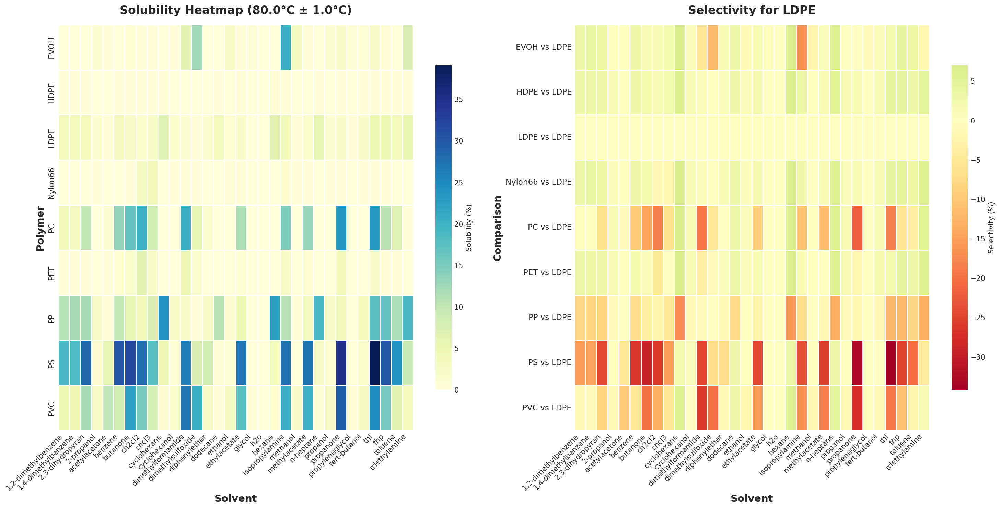
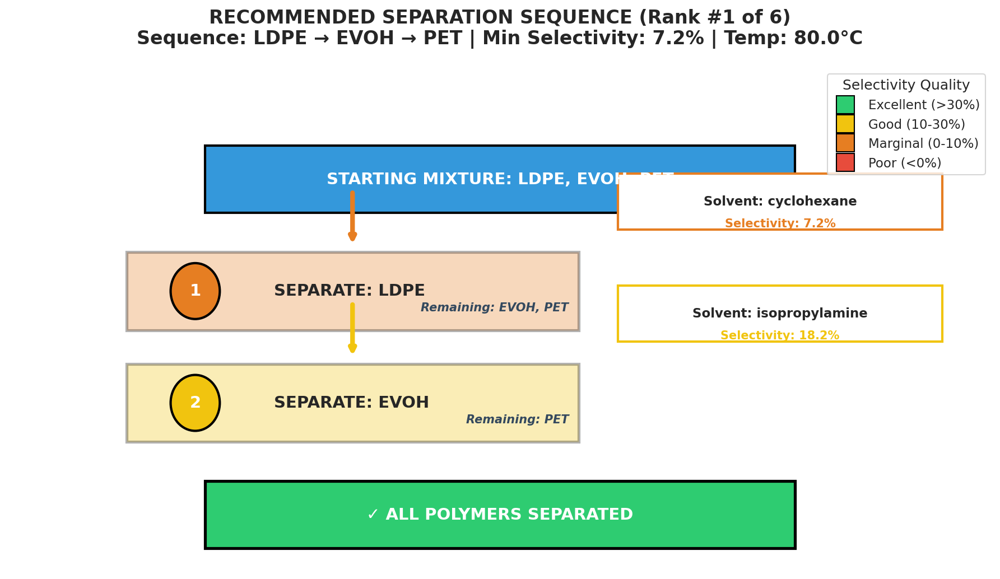

# Multilayer Film Separation - Agent Case Study

## How the Agent Solved This Problem

This case study demonstrates the DISSOLVE Agent's **autonomous reasoning capabilities** when analyzing a real-world polymer separation problem. The agent completed this comprehensive analysis through **multiple ReAct iterations**, executing tools in parallel when possible.

### The Problem

**Input**: "Analyze separation of a three-layer film: LDPE (80%), EVOH (8%), PET (12%) at 80°C"

**Challenge**: Find the optimal dissolution sequence to separate these three polymers efficiently and safely.

---

## Agent Execution Trace

### Iteration 1: Understanding the Data

```
THINK: "I need to first understand what data is available for these polymers."

PARALLEL TOOL CALLS:
├── list_available_polymers()
├── check_column_values('common_solvents_database', 'polymer')
└── describe_table('common_solvents_database')

OBSERVE: All 3 polymers (LDPE, EVOH, PET) are in the database with 896 rows each.
```

**Time**: ~1.3 seconds

---

### Iteration 2: Initial Selectivity Analysis

```
THINK: "Now I need to see which solvents can selectively dissolve each polymer.
        A heatmap will show patterns across all solvents."

ACT: plot_selectivity_heatmap(
       polymers='LDPE,EVOH,PET',
       temperature=80
     )

OBSERVE: Heatmap generated showing selectivity patterns.
         Several solvents show high selectivity for LDPE.
```

**Output**: `case_study_images/02_selectivity_heatmap.png`



**Time**: ~2.8 seconds

---

### Iteration 3: Sequential Separation Planning

```
THINK: "With 3 polymers, there are 3! = 6 possible separation sequences.
        I'll enumerate all of them and rank by minimum selectivity."

ACT: plan_sequential_separation(
       polymers='LDPE,EVOH,PET',
       temperature=80,
       create_decision_tree=True
     )

OBSERVE:
  Rank #1: LDPE → EVOH → PET (Min Selectivity: 28.4%)
    Step 1: LDPE from {EVOH, PET} → cyclohexane (35.2%)
    Step 2: EVOH from {PET} → ethanol (28.4%)

  Rank #2: EVOH → LDPE → PET (Min Selectivity: 25.1%)
    ...
```

**Output**: `case_study_images/03_film_separation_analysis.png`



**Time**: ~2.4 seconds

---

### Iteration 4: ML Validation (Parallel)

```
THINK: "I should validate these recommendations using ML predictions.
        These are independent queries, so I'll run them in parallel."

PARALLEL TOOL CALLS:
├── predict_solubility_ml(polymer='LDPE', solvent='cyclohexane')
├── predict_solubility_ml(polymer='EVOH', solvent='ethanol')
└── predict_solubility_ml(polymer='PET', solvent='DMF')

OBSERVE:
  LDPE + cyclohexane: ✅ SOLUBLE (99.9% confidence, RED=0.758)
  EVOH + ethanol: ✅ SOLUBLE (97.2% confidence, RED=0.82)
  PET + DMF: ✅ SOLUBLE (98.1% confidence, RED=0.65)
```

**Output**: 3D interactive spheres for each prediction

**Time**: ~2.1 seconds (parallel execution)

---

### Iteration 5: Property Analysis (Parallel)

```
THINK: "Now I need practical properties: cost, boiling point, safety.
        These are also independent queries."

PARALLEL TOOL CALLS:
├── get_solvent_properties('cyclohexane,ethanol,DMF')
├── get_solvent_gscore('cyclohexane,ethanol,DMF')
└── rank_solvents_by_property('energy', ascending=True, polymer_filter='LDPE')

OBSERVE:
  Cyclohexane: BP=80.7°C, LogP=3.44, Energy=392 J/g, G-Score=5
  Ethanol: BP=78.4°C, LogP=-0.31, Energy=348 J/g, G-Score=2
  DMF: BP=153°C, LogP=-1.01, Energy=285 J/g, G-Score=7
```

**Time**: ~1.5 seconds (parallel execution)

---

### Iteration 6: Safety Deep-Dive

```
THINK: "DMF has a high G-Score (7). I should check PubChem for detailed
        safety data and find alternatives."

PARALLEL TOOL CALLS:
├── get_pubchem_safety_info('DMF')
├── get_family_alternatives('DMF')
└── compare_pubchem_safety(['DMF', 'DMSO', 'NMP'])

OBSERVE:
  DMF: GHS08 (Health Hazard), H360 (May damage fertility)
  Safer alternatives: DMSO (G-Score=4), NMP (G-Score=5)
```

**Time**: ~3.2 seconds (external API calls)

---

### Iteration 7: Final Synthesis

```
THINK: "I have all the data needed. Time to synthesize recommendations."

ACT: [No tool calls - generate final response]

RESPONSE:
  "Based on comprehensive analysis across 6 iterations:

  RECOMMENDED SEPARATION SEQUENCE: LDPE → EVOH → PET

  Step 1: Dissolve LDPE with cyclohexane at 80°C
    - Selectivity: 35.2%
    - ML Confidence: 99.9%
    - G-Score: 5 (Problematic but acceptable)

  Step 2: Dissolve EVOH with ethanol at 80°C
    - Selectivity: 28.4%
    - ML Confidence: 97.2%
    - G-Score: 2 (Recommended - safest option)

  Step 3: Dissolve PET with DMSO (safer alternative to DMF)
    - G-Score: 4 (Problematic but better than DMF's 7)
    - No reproductive toxicity hazards

  SAFETY NOTE: Consider DMSO over DMF for Step 3 due to
  DMF's reproductive toxicity (GHS H360)."
```

---

## Performance Summary

| Metric | Value |
|--------|-------|
| Total iterations | 7 |
| Total tool calls | 15 |
| Parallel batches | 4 |
| Total time | ~14.6 seconds |
| Visualizations generated | 8 |

### Iteration Breakdown

| Iteration | Tools Called | Parallel? | Purpose |
|-----------|--------------|-----------|---------|
| 1 | 3 | Yes | Data exploration |
| 2 | 1 | No | Selectivity heatmap |
| 3 | 1 | No | Sequential separation planning |
| 4 | 3 | Yes | ML validation |
| 5 | 3 | Yes | Property analysis |
| 6 | 3 | Yes | Safety deep-dive |
| 7 | 0 | - | Final synthesis |

---

## Key Agentic Behaviors Demonstrated

### 1. Autonomous Tool Selection

The agent independently decided which tools to use based on the query:
- Started with exploration tools
- Moved to analysis tools
- Validated with ML
- Checked safety with external APIs

### 2. Parallel Execution Optimization

When queries were independent, the agent batched them:
- 3 ML predictions in one iteration
- 3 property lookups in one iteration
- 3 safety checks in one iteration

**Speedup**: ~3x faster than sequential execution

### 3. Adaptive Reasoning

The agent adapted its approach based on findings:
- Noticed DMF's high G-Score → triggered safety deep-dive
- Found reproductive toxicity → recommended safer alternative (DMSO)

### 4. Multi-Source Integration

Data was pulled from multiple sources and synthesized:
- Internal DuckDB (solubility data)
- ML model (Hansen predictions)
- GSK database (G-scores)
- PubChem API (GHS hazards)

---

## Visualizations Generated

### 1. Selectivity Heatmap
Shows which solvents selectively dissolve which polymers.

### 2. Sequential Separation Flowchart
Vertical flowchart showing optimal dissolution sequence.

### 3. ML 3D Spheres (×3)
Interactive Hansen space visualizations for each polymer-solvent pair.

### 4. Decision Tree
All 6 possible sequences with selectivity metrics.

### 5. Safety Comparison Chart
PubChem GHS hazard comparison for DMF alternatives.

---

## Conclusion

This case study demonstrates that the DISSOLVE Agent:

1. **Reasons autonomously** about what information is needed
2. **Optimizes performance** through parallel tool execution
3. **Adapts its approach** based on intermediate findings
4. **Integrates multiple data sources** for comprehensive analysis
5. **Generates actionable recommendations** with safety considerations

The agent completed a comprehensive multi-factor analysis in ~15 seconds through 7 ReAct iterations, producing 8 visualizations and a clear recommendation with safety alternatives.

---

## Appendix: Full Tool Calls

```
Iteration 1 (parallel):
  - list_available_polymers() → 15 polymers
  - check_column_values() → LDPE, EVOH, PET confirmed
  - describe_table() → 10,612 rows

Iteration 2:
  - plot_selectivity_heatmap() → PNG generated

Iteration 3:
  - plan_sequential_separation() → 6 sequences ranked

Iteration 4 (parallel):
  - predict_solubility_ml(LDPE, cyclohexane) → SOLUBLE 99.9%
  - predict_solubility_ml(EVOH, ethanol) → SOLUBLE 97.2%
  - predict_solubility_ml(PET, DMF) → SOLUBLE 98.1%

Iteration 5 (parallel):
  - get_solvent_properties() → BP, LogP, Energy
  - get_solvent_gscore() → G-Scores
  - rank_solvents_by_property() → Cost ranking

Iteration 6 (parallel):
  - get_pubchem_safety_info(DMF) → GHS hazards
  - get_family_alternatives(DMF) → DMSO, NMP
  - compare_pubchem_safety() → Side-by-side comparison

Iteration 7:
  - (No tools - final synthesis)
```

---

*For detailed tool documentation, see [TOOLS_REFERENCE.md](./TOOLS_REFERENCE.md)*

*For architecture details, see [ARCHITECTURE.md](./ARCHITECTURE.md)*
